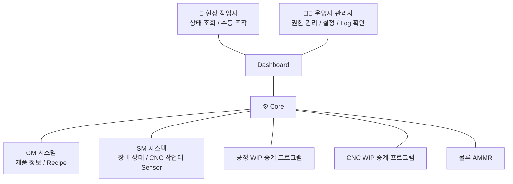
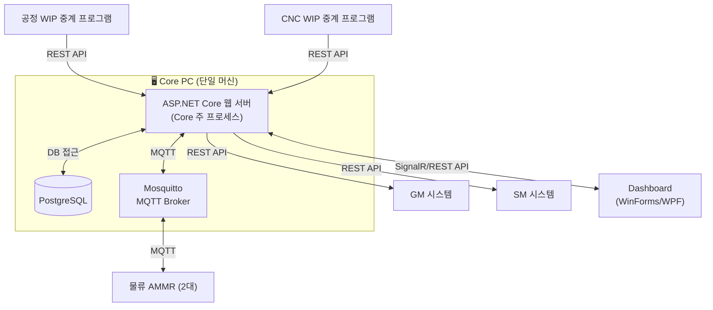
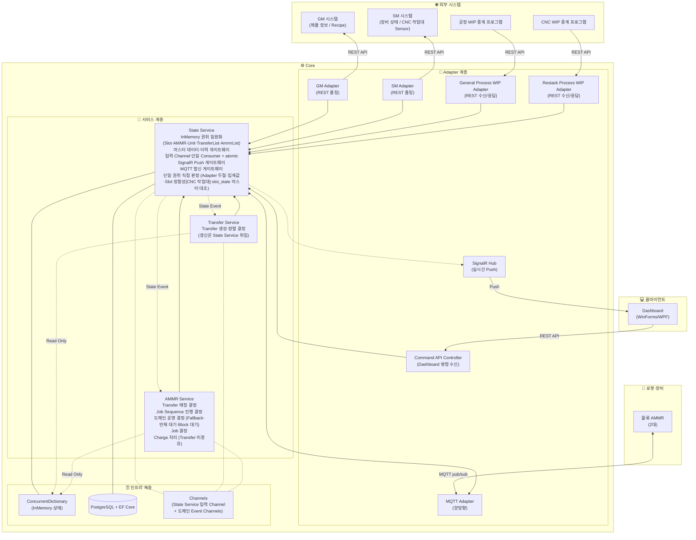

# Core 아키텍처

> 이 문서는 `Core_SAD_v1_0_d164.md` 기준으로 작성되었습니다.
> 최종 업데이트: 2026-07-20 11:13

---

## 1. 아키텍처 개요

Core는 외부 시스템·물류 AMMR·Dashboard와의 경계를 Adapter 계층으로 분리하고, 내부는 책임별 서비스로 구성한다.
이를 통해 통신 방식 변경이나 외부 시스템·물류 AMMR·Dashboard 추가가 내부 비즈니스 로직(서비스 계층)에 영향을 주지 않도록 한다.

이 구조는 Hexagonal 아키텍처(Ports & Adapters) 계열을 따른다. 선택 근거는 다음과 같다.

- 외부 시스템(GM/SM/공정 WIP/CNC WIP)·물류 AMMR·Dashboard가 다양한 프로토콜(REST/MQTT/SignalR)을 사용하며 향후 변경·추가 가능성이 있어, Adapter 계층으로 격리하면 비즈니스 로직을 보호할 수 있다.
- AMMR HW 미입고 단계에서 시뮬레이터로 단독 테스트가 필요하며, Adapter 교체로 자연스럽게 처리된다.
- Dashboard가 향후 웹 전환 예정이며, 프레젠테이션 Adapter(SignalR Hub, Command API Controller) 교체로 처리된다.

비즈니스 로직은 구체적 Adapter가 아니라 추상적 인터페이스(Port)에만 의존한다. 이를 통해 같은 비즈니스 로직 코드 변경 없이 Adapter를 교체할 수 있다.

### 1.1 두 구조의 구체 모습 — 다Port 격리 / 단일 Port 구현 교체

이 장의 Hexagonal 채택은 두 구조로 풀린다 — **다Port 격리**(외부 경계마다 Adapter를 따로 두어 변경 영향을 격리)와 **단일 Port 구현 교체**(한 Adapter 위치에 환경별로 다른 구현을 갈아끼움). 차례로 보인다.

**※ 다Port 격리 (근거 1) — Core 프로세스 내부 구성 (L3 Component 기준)**

각 외부 경계에 별도 Adapter를 두어 한 경계의 변경이 다른 Adapter나 비즈니스 로직으로 새지 않게 막는 구조다. 외부 시스템 4종 + 물류 AMMR + Dashboard 합 6개 경계 각각에 Adapter를 두는 가로 방향 분포다. 이 Tree는 Core 프로세스 실행 시점의 L3 Component 분할(논리 구성)이다.

```
Core 프로세스 (ASP.NET Core)
│
├─ Adapter 계층 (Core 외부와의 경계)
│   ├─ GM Adapter                   — 제품/Recipe 마스터 데이터 (REST 폴링)
│   ├─ SM Adapter                   — CNC 작업대 Slot Sensor (REST 폴링)
│   ├─ General Process WIP Adapter  — 공정 WIP Slot Sensor·QR (REST 수신/응답)
│   ├─ Restack Process WIP Adapter  — CNC WIP Slot Sensor·QR + 되담기 완료 (REST 수신/응답)
│   ├─ MQTT Adapter                 — AMMR 통신 (MQTT pub/sub)
│   ├─ SignalR Hub                  — Dashboard 실시간 Push
│   └─ Command API Controller       — Dashboard 명령 수신 (REST)
│
├─ 서비스 계층 (비즈니스 로직)
│   ├─ State Service     — 도메인 상태·이력 관리
│   ├─ Transfer Service  — 이송 요청 생성·정렬 결정
│   └─ AMMR Service      — Transfer 매칭·Job Sequence 전개·Job 결정
│
└─ 인프라 계층 (공통 기반)
    ├─ ConcurrentDictionary       — InMemory 상태 저장소
    ├─ PostgreSQL + EF Core       — 마스터·이력 DB
    ├─ State Service 입력 Channel — 단일 Consumer FIFO 구조 (Adapter→서비스 경계)
    └─ Channels (Event 버스)     — 서비스 간 도메인 Event 발행/구독
```

외부 경계마다 Adapter를 두어 격리한다. 한 경계의 프로토콜 변경이나 새 외부 인터페이스 추가 시 영향 범위가 해당 Adapter로 국한된다. 인프라 계층에는 미영속화 이력 백업 파일이 PostgreSQL과 동급의 영속 매체로 함께 존재하며, ASP.NET Core Logging은 Adapter·서비스·인프라 모든 계층이 두루 사용하는 보조 도구로 함께 존재한다. 두 항목 모두 이 Tree에는 가독성을 위해 표기 생략된다.

**※ 단일 Port 구현 교체 (근거 2·3) — AMMR Adapter 하나의 구현 4종**

한 Adapter 위치(같은 Port)에 대해 환경별로 다른 구현체를 갈아끼우는 구조다. AMMR 통신 위치에 운영 환경은 진짜 MQTT 구현, 개발 환경은 시뮬레이터 구현, 테스트 환경은 Mock 구현을 꽂는 세로 방향 다형성이다.

```
[비즈니스 로직 — AMMR Service]
        │
        ↓ IAmmrCommunication (Port = 인터페이스)
        │
   ┌────┴────────────┬──────────────┬──────────────┐
   ↓                 ↓              ↓              ↓
[진짜 MQTT       [시뮬레이터     [Mock(모의 응답) [녹화/재생
 Adapter]        Adapter]        Adapter]        Adapter]
```

**※ AMMR Adapter 구현 4종**

| Adapter | 목적 | 쓰는 시점 |
|---|---|---|
| 진짜 MQTT Adapter | 실제 AMMR HW와 MQTT 통신 | 운영 환경, HW 입고 후 통합 테스트 |
| 시뮬레이터 Adapter | 실제처럼 동작하는 가짜 AMMR (이동·Pickup·Battery 감소 등 흉내) | HW 미입고 단계 개발, 통합 테스트, 데모 |
| Mock(모의 응답) Adapter | 테스트 코드가 강제 주입한 응답을 즉시 반환 | 자동화된 단위 테스트 (CI Pipeline) |
| 녹화/재생 Adapter | 운영 중 실제 메시지를 파일로 저장, 개발 환경에서 그대로 재현 | 운영 장애 디버깅 |

Adapter 선택은 ASP.NET Core의 의존성 주입(DI)이 시작 시점에 설정 파일(`appsettings.json`)을 읽어 자동으로 결정한다. 비즈니스 로직 코드는 변경되지 않는다.

```json
// 개발 환경
"AmmrAdapter": "Simulator"

// 운영 환경
"AmmrAdapter": "RealMqtt"

// 단위 테스트 환경
"AmmrAdapter": "Mock"
```

이 예시는 AMMR 통신 Adapter를 기준으로 하지만, 동일한 패턴이 다른 Adapter(WIP/SM/SignalR 등)에도 적용된다. 각 Adapter 환경의 구체적 구성 방식(상태 초기화, Event 차단 범위, 테스트 데이터 관리 등)은 별도 검토가 필요하다.

**※ 실전 활용 예 — HW 미입고 단계 E2E 시뮬 환경**

AMMR HW 미입고 단계에서 Dashboard와 AMMR 시뮬레이터 조합으로 Core 전체 흐름을 단독 구동한다.

- **MQTT Adapter = 시뮬레이터** — 가짜 AMMR이 이동·Pickup·Dropoff·Battery 감소 등을 흉내
- **Command API Controller · SignalR Hub = 진짜** — Dashboard에 시뮬 환경 전용 탭이 추가되어, WIP·CNC 작업대 Sensor 신호 발생 명령을 Core에 전달(실제 Sensor가 없는 시뮬 환경에서 입고·공정 상태를 만들어 내기 위함). 정상 흐름과 동일하게 Command API로 진입하여 서비스 계층이 처리한다.

Dashboard 조작 → Command API로 Core 진입 → 서비스 계층이 상태 변경·Transfer 생성 → MQTT 시뮬레이터 AMMR이 반응·결과 보고 → SignalR Hub가 Dashboard에 실시간 반영. HW 없이 E2E 흐름을 현장처럼 검증한다.

### 1.2 이 시스템의 위험 요소 — 실패 시나리오 집약

이 시스템은 물리 장비와 실시간 Sensor로부터의 비동기 Event가 동시 도달하는 환경에서 동작한다. (도메인 용어·운영 정책은 설계요구사항 전제.) 이 3축 위반 시 사고 양상은 정합성 사고 또는 흐름 차단으로 실제 발생 가능하며, 이 아키의 3축(순서·인식·권위)은 이들을 체계적으로 방어하기 위한 것이다.

**순서·atomic 보존 축 위반 시**:

1. **순서·atomic 보존 축 위반**
   - (a) **입력 직렬화 없음** — Channel 없이 Adapter들이 State Service 상태 갱신을 직접 호출하면 다중 필드 복합 갱신(정합성 검사 → 갱신 연쇄)의 atomic성이 깨져 부분 갱신 손실 또는 필드 간 정합성 깨짐으로 재현 안 되는 간헐적 버그 양산.
   - (b) **5단계 순서 위반** — atomic 5단계 안 Event 발행이 InMemory 갱신 전에 일어나면, Event를 받은 AMMR Service가 Job 직전 검증 시점에서 InMemory 직접 조회 시 갱신 전 상태 관찰 → 옛 출발 Slot 상태 기반 Job → 잘못된 위치 Pickup·Dropoff.

**인식 경계 축 위반 시**:

2. **인식 경계 축 위반** — 이 시스템은 두 필드 독립 권위(Sensor 상태 / Unit 식별값)로 구성되어 있어 "Sensor On인데 식별값 미확정" 같은 어긋남 상태를 Block으로 표면화한다.
   - (a) **두 필드 분리 없음** — 두 필드를 하나로 합쳐 다루면 어긋남 상태 표현할 곳 없음 → Block 개념 성립 불가 → 추정으로 채워져 잘못된 운영.
   - (b) **권위 동기화 누락** — 한쪽 권위 축 무시(예: Sensor Off 전이 시 식별값 Null 동기화 안 함)하면 사람 회수 후 빈 Slot인데 식별값 유지 → 빈 Slot 대상 Transfer 생성 → AMMR 빈 Slot Pickup 시도 → 실패.

**권위 매체 축 위반 시**:

3. **권위 매체 축 위반**
   - (a) **매체 권위 위반** — Job 직전 검증을 DB 조회로 하면 마지막 Commit 시점과 InMemory 실제 상태 사이 불일치 순간에 옛 값 기반 지시 발행 → AMMR이 실제와 다른 전제로 동작 → 잘못된 위치 Pickup·Drop.
   - (b) **단일 진입점 위반** — Slot 점유·Unit 식별값·AMMR 상태 같은 운영 상태(State Service 권위)를 Transfer Service·AMMR Service가 자기 Cache·복사본으로 별도 보유하면, 권위 갱신 시점과 Cache 갱신 사이 시차로 두 서비스가 같은 상황에 다른 판단.
   - (c) **이 흐름 격리 위반** — DB 기록을 동기 처리하거나 InMemory 권위를 두지 않으면, 다중 AMMR 동시 작업 시 DB 왕복(트랜잭션 Commit·Table 락·인덱스 갱신 등) 또는 DB 장애(연결 풀 포화·Table 락 장기 점유·디스크 IO 지연 등)로 검증·기록 지연 누적 → Job 타이밍 놓침 → Transfer 적체 → 작업 흐름이 막힘. InMemory 권위 분리 + DB 기록 비동기 처리 시 DB 왕복·DB 장애와 무관하게 이 흐름이 정상 작동한다.

### 1.3 해결 원칙 — 시스템의 핵심 축 (순서·인식·권위)

이러한 위반 시 사고 양상을 방어하기 위해, 이 아키는 시스템 동작을 세 축의 원칙으로 정의한다. 데이터의 처리 흐름 순(입력 → 판정 → 저장·조회)으로 정리하면 다음과 같으며, 이후 이 문서의 서술은 모두 이 세 축을 구체화한다.

- **순서·atomic 보존** — 비동기 입력 직렬화 + atomic 단위 처리 + 완성 상태 관찰.
  - 직렬화: State Service 입력 Channel — 단일 Consumer로 소비
  - atomic 단위 — 두 종류:
    - [수신] atomic (외부·사용자 입력 처리): InMemory 갱신 → 정합성 검사 → DB 영속화 요청 → Event 발행 → SignalR Push
    - [발신] atomic (외부 시스템 능동 발신): InMemory 권위 갱신 → DB 영속화 요청 → SignalR Hub Push → 외부 Adapter 호출
  - 관찰: 구독자는 Event 수신 시 완성 상태

- **인식 경계** — 실제 감지된 사실만 반영, 미확정은 Block.
  - 두 필드 독립 권위: Sensor 상태 / Unit 식별값
  - Unit 식별값 등급: 확정(QR 인식·수동 입력) / 추정(AMMR Pickup·Dropoff 동작 보고로 옮김). 두 등급 동일 권위, 출처·신뢰도 표시
  - 미확정 처리: 한 필드라도 미확정 시 Block
  - 판정 위치: AMMR·WIP 중계 슬롯은 클라이언트가 인식 경계 판정(slot_state 보고)·Core는 결과 수신 + 스냅샷 마스터 대조(reconcile) / CNC 작업대(SM)는 Core 직접 판정

- **권위 매체** — 데이터 종류별 매체 권위 + 단일 진입점.
  - 매체 권위: 실시간 상태(InMemory) / 이력(DB) / 마스터(DB)
  - 단일 진입점: State Service가 권위 갱신의 유일 경로 (권위 분산 차단)

4종 원칙·Block 개념의 축 분류 근거 (축 순):

- **Adapter 책임 원칙** → 순서·atomic 보존: Adapter에 도메인 판단·Event 발행이 분산되면 입력 직렬화가 깨짐
- **도메인 Event 발행 원칙** → 순서·atomic 보존: 서비스 경계 넘는 사건 한정이 atomic 단위 경계 원칙
- **Block 개념** → 인식 경계: 미확정 시 Block 마킹은 인식 경계의 정합성 검사 결과
- **권위 매체 원칙** → 권위 매체: 직접 Mapping
- **조회 채널 원칙** → 권위 매체: 시점 검증은 State Service InMemory 직접 조회(Pull)가 권위. Push 받은 Event를 구독자가 Cache했다가 시점 검증에 쓰면, 권위 갱신과 Cache 시점 사이 시간 차로 옛 값 사용 → 권위 매체 원칙 위반.

### 1.4 이 문서의 서술 범위 (C4 Model)

이 문서는 C4 Model의 L1~L3 수준에서 Core를 설명한다.
- L1 (System Context): Core와 행위자·외부 인터페이스 간 관계
- L2 (Container): Core 내부 실행 단위
- L3 (Component): Core 프로세스 내부 모듈 구조

L4(Code)는 Class·함수 수준의 상세이며, 코드 한 줄의 Refactoring에도 문서가 어긋나기 때문에 유지 비용이 높다. 이 문서 범위에서 제외하며, 코드 자체가 L4의 진실 원이 역할을 한다.

핵심 데이터 흐름은 C4 표준의 **Dynamic Diagram**(보조 다이어그램)에 해당한다. C4 표준은 정적 4개 다이어그램(L1 Context, L2 Container, L3 Component, L4 Code) 외에 런타임 상호작용을 시나리오 단위로 표현하는 Dynamic Diagram을 보조 다이어그램으로 포함한다. 줌 레벨로는 L3 Component들이 시간 순으로 협력하는 시나리오이며, 표기는 UML communication 스타일 대신 텍스트 코드 블록을 사용한다.

구조 다이어그램(L1~L3)은 Mermaid로, 시나리오·개념 도식(핵심 데이터 흐름 등)은 텍스트 코드 블록으로 작성한다.

---

## 2. L1 — System Context

이 절은 Core를 한 박스로 보고, 행위자와 외부 인터페이스의 관계를 보여준다.



**※ 행위자**

- **현장 작업자** — Dashboard를 통해 상태 조회·수동 조작을 수행한다.
- **운영자·관리자** — 권한 관리·설정·Log 확인을 담당한다.

**※ 외부 시스템**

- **GM 시스템** — 제품 정보(수량·납기일·제품 속성 포함)와 Recipe를 제공한다.
- **SM 시스템** — 장비 상태와 CNC 작업대 Slot Sensor 신호를 제공한다.
- **공정 WIP 중계 프로그램** — 공정 WIP의 입/출고 Event를 Core에 전달한다.
- **CNC WIP 중계 프로그램** — CNC WIP의 입/출고 Event(되담기 완료 포함)를 Core에 전달한다.

**※ 로봇·장비**

- **물류 AMMR** — Unit의 외부 이동을 담당하는 자율주행 로봇이다.

**※ 클라이언트**

- **Dashboard** — 현장 작업자와 운영자·관리자가 사용하는 클라이언트 애플리케이션이다.

통신 방식과 데이터 종류는 L2와 L3에서 다룬다. 이 절에서는 "누가 누구와 어떤 관계를 맺는가"의 큰 그림만 보여준다.

---

## 3. L2 — Container

이 절은 Core 안에 실제로 어떤 실행 단위(Container)들이 떠 있는지, 그리고 외부 시스템·물류 AMMR·Dashboard와 어떤 통신 프로토콜로 연결되는지 보여준다. C4 Model에서 Container는 도커 Container가 아니라 "독립적으로 실행되는 프로세스 또는 데이터 저장소"를 의미한다.



**※ Core PC 안의 Container**

- **ASP.NET Core 웹 서버** — Core 본체 프로세스. 모든 비즈니스 로직과 외부 통신의 진입점이다. Adapter 계층, 서비스 계층, 인프라 계층이 모두 이 프로세스 안에 존재한다(상세는 L3 참고).
- **PostgreSQL** — 마스터 데이터·이력·보안 Log 저장소. ASP.NET Core 웹 서버가 ORM을 통해 접근한다. 외부 시스템은 DB에 직접 접근하지 않는다.
- **Mosquitto MQTT Broker** — Core와 AMMR 사이의 메시지 중계 미들웨어. Core와 AMMR이 둘 다 클라이언트로 Broker에 접속해 publish/subscribe 방식으로 통신한다.

세 Container는 모두 같은 PC에서 운영된다. 운영 부하 수준(AMMR 2대 + Dashboard 소수 + 초당 수십 건 이하 메시지)에서는 단일 PC로 충분히 감당 가능하다. AMMR이 수십 대 규모로 늘어나거나 고가용성 요구가 생기면 DB나 MQTT Broker를 별도 PC로 분리하는 방안을 검토할 수 있다.

**※ 외부 Container와의 통신 방식**

- **GM 시스템** — Core → GM, REST API. Core가 주기적으로 GM의 REST API를 호출해 제품 정보·Recipe를 가져온다.
- **SM 시스템** — Core → SM, REST API. Core가 주기적으로 SM의 REST API를 호출해 장비 상태·CNC 작업대 Slot Sensor 신호를 가져온다.
- **공정 WIP 중계 프로그램** — 공정 WIP 중계 프로그램 → Core, REST API. 공정 WIP 중계 프로그램이 Slot Sensor 신호와 QR Scan 정보를 Core에 전달하고, 응답으로 Unit 정보를 받는다.
- **CNC WIP 중계 프로그램** — CNC WIP 중계 프로그램 → Core, REST API. 공정 WIP 중계 프로그램과 동일한 통신 구조이며, 추가로 되담기 완료 Event를 Core에 전달하고 응답으로 갱신된 Unit 정보를 받는다.
- **물류 AMMR** — Core ↔ AMMR, MQTT (Mosquitto 경유). AMMR이 위치·Battery·상태와 Job 수행 Event를 Core에 지속 보고하고, Core는 AMMR에게 Job 지시를 전송한다.
- **Dashboard** — Core ↔ Dashboard, SignalR/REST API. Core는 운영 상태(AMMR 적재 Unit·Slot 점유·경고 등)를 SignalR로 Dashboard에 실시간 Push하고, Dashboard는 사용자 명령과 데이터 관리(Recipe·설정·Unit 구성·외주 처리 등) 요청을 REST API로 Core에 전달한다.

L3에서는 ASP.NET Core 웹 서버 박스 안을 들여다보고, Adapter 계층, 서비스 계층, 인프라 계층의 코드 모듈 분할을 보여준다.

---

## 4. L3 — Component

이 절은 L2의 ASP.NET Core 웹 서버 Container 내부를 보여준다. Adapter 계층, 서비스 계층, 인프라 계층의 코드 모듈 분할이 핵심이다.

이 다이어그램은 **다Port 격리** 구조의 L3 명세다. 외부 시스템 4종 + 물류 AMMR + Dashboard 합 6개 경계 각각에 Adapter가 배치된 가로 방향 분포가 Adapter 계층 7종 박스로 표현된다. 인프라 계층에는 미영속화 이력 백업 파일이 PostgreSQL과 동급의 영속 매체로 함께 존재하며, ASP.NET Core Logging은 Adapter·서비스·인프라 모든 계층이 두루 사용하는 보조 도구로 함께 존재한다. 두 항목 모두 이 다이어그램에는 가독성을 위해 박스 표기 생략된다.



**※ 범례**
- `-->` 실선 화살표 : 직접 호출·데이터 전달
- `<-->` 실선 양방향 : 양방향 통신
- `-.->` 점선 화살표 : Event 발행 / 구독 — `Read Only` 라벨이 붙으면 읽기 전용 참조(Memory 대상)
- `---` 실선 무방향 : 참조·소유 관계 (Memory/DB 연결, 쓰기 권위)
- `-.-` 점선 무방향 : Event 버스 연결 (Channels 연결)

### 4.1 외부 시스템

Core 바깥에 독립적으로 존재하는 시스템이다. L3 다이어그램에는 Adapter 계층의 카운터파트로 박스만 표시한다. 각 시스템의 역할과 통신 방식 상세는 L1/L2 참조.

- **GM 시스템** — 제품 정보·Recipe 제공.
- **SM 시스템** — 장비 상태·CNC 작업대 Slot Sensor 신호 제공.
- **공정 WIP 중계 프로그램** — 공정 WIP의 입/출고 Event 중계.
- **CNC WIP 중계 프로그램** — CNC WIP의 입/출고 Event(되담기 완료 포함) 중계.

### 4.2 로봇·장비

- **물류 AMMR** — Unit 외부 이동 담당. 현재 2대 운영. 상세는 L1/L2 참조.

### 4.3 클라이언트

- **Dashboard** — WinForms/WPF 기반 C# 클라이언트. 향후 웹 전환 예정. 상세는 L1/L2 참조.

### 4.4 Adapter 계층

외부 시스템 및 장비와의 통신을 담당하며, 서로 다른 인터페이스를 Core 내부의 일관된 Event/메시지 형식으로 변환한다.

각 Adapter는 비즈니스 로직이 의존하는 추상 인터페이스(Port)의 구현체로 구성된다. 같은 Port에 대해 환경별로 구현체를 갈아끼우는 **단일 Port 구현 교체** 구조가 모든 Adapter에 일관 적용되며, 운영·시뮬·테스트 환경에 따라 ASP.NET Core DI가 시작 시점에 결정한다.

- **GM Adapter** — GM REST API 폴링. 제품 정보·Recipe 수신 결과를 State Service 경유로 DB에 적재한다. GM 마스터 데이터는 DB 권위 위치이며, State Service가 영속화 진입점이다.
- **SM Adapter** — SM REST API 폴링. 폴링 결과를 도메인 객체로 변환해 State Service 입력 Channel에 전달한다. InMemory 상태와의 비교·변화 감지·Event 발행은 State Service 책임(공통 Adapter 책임 원칙). Pull 방식의 raw 입력을 Push 방식의 입력 Channel 전달로 정규화하는 Adapter 패턴 예.
- **General Process WIP Adapter** — 공정 WIP 중계 프로그램으로부터 REST API로 slot_state·입/출고 판정 Event 수신(중계가 자체 대시보드·QR 입력·판정 수행). State Service에 전달하고, REST 응답 본문에 Unit 정보(식별값 Mapping 등)를 실어 회신한다.
- **Restack Process WIP Adapter** — CNC WIP 중계 프로그램으로부터 REST API로 slot_state(pair_waiting 포함)·입/출고 판정·되담기 완료 플래그 Event 수신(중계가 자체 대시보드·QR 입력·Pair 판단 수행). State Service에 전달하고, REST 응답 본문에 Unit 정보(식별값 Mapping·갱신된 Tray 형태 포함)를 실어 회신한다. 두 WIP Adapter 모두 응답 본문이 단순 확인 응답이 아니라 의미 있는 도메인 데이터를 실어 보내는 채널이다.
- **MQTT Adapter** — 물류 AMMR과의 MQTT 양방향 통신. AMMR로부터 위치, Battery, 상태, Slot 상태(slot_state) 및 Job 수행 결과(Pickup/Dropoff/Charge 성공/실패 등)를 수신하여 State Service에 전달하고, State Service 발신 게이트웨이로부터 Job 지시(표시용 Unit·위치 선탑재)·정합 정정(reconcile) 응답·Core 연결 상태 발신·일괄 보고 재요청(예비)을 받아 AMMR에 전송한다. AMMR이 보고하는 모든 사실은 State Service를 단일 진입점으로 거치며, MQTT 발신도 State Service를 단일 게이트웨이로 거친다. AMMR Service는 State Service가 발행한 도메인 Event를 구독하여 자기 도메인에 필요한 사건을 인지한다. 단, Job 지시 수신 확인(MQTT job/received)은 AMMR Service 구독 대상이 아니라 State Service가 Job 발신 atomic에서 시작하는 3초 timeout 모니터링로 자체 소비하며, 3초 안 미도달 시 AMMR HW 단절로 처리한다(§5.5·§5.6).
- **SignalR Hub** — State Service가 단일 게이트웨이로 호출하여 모든 도메인 상태 변화를 Dashboard에 실시간 Push한다. TransferList·AmmrList 정렬 변화를 포함한 모든 InMemory 권위 변화가 State Service atomic 처리의 일부로 이 Hub에 전달된다(외부 인터페이스 게이트웨이 원칙의 push 측 적용 — Adapter·Command API와 동일). 사용자 명령으로 발생한 상태 변화도 같은 경로로 broadcast된다.
- **Command API Controller** — Dashboard로부터 사용자 명령 및 데이터 관리 요청을 REST API로 수신하여 도메인 객체로 변환해 State Service 입력 Channel에 전달한다. 두 WIP Adapter도 같은 REST 프로토콜이지만 "외부 사실 보고를 내부 Event로 정규화"하는 성격이라 별도 Adapter로 분리되며, 이 Controller는 "사용자(사람)의 의도적 명령" 처리에 한정된다. 이 Controller를 SignalR Hub와 별도 Adapter로 분리한 근거는 HTTP 상태 코드 규약에 따른 명령 성공/실패 처리가 디버깅에 명확하다는 점, "버튼 클릭 → HTTP POST → 응답" 패턴이 WinForms 출신 팀에 친숙하다는 점이다. Command API Controller가 IP Whitelist 검증·사용자 인증·역할별 권한 검증을 직접 처리한다. IP Whitelist는 단말기 차원의 외부 접근 제어로, 등록된 IP가 아닌 요청은 도메인 처리에 도달하지 않고 즉시 차단된다. 사용자 인증·권한 검증은 IP 통과 후 사용자 로그인 정보로 진행되며, 역할별 권한 정의에 따라 탭별 접근 제어가 작동한다. 보안 Log 진입점도 이 지점에서 결합되어 사용자 변경 행위의 변경자·변경 시각·접속 IP를 보존한다.

**※ Adapter 계층 분류 — 책임별 7종/6종/5종**

Adapter들은 책임에 따라 분류 단위가 다르다.

| 책임 | 대상 Adapter |
|---|---|
| 다Port 격리 (외부 경계 구분) | 7종 — GM·SM·General Process WIP·Restack Process WIP·MQTT·SignalR Hub·Command API |
| 수신 (State Service 입력 Channel Writer) | 6종 — GM·SM·General Process WIP·Restack Process WIP·MQTT·Command API (SignalR Hub 비대상 — push 측) |
| 가용성 감시 (외부 시스템 두절 감지) | 5종 — GM·SM·General Process WIP·Restack Process WIP·MQTT (SignalR Hub·Command API 비대상 — Dashboard 두절은 별도 사용자 인지 영역) |

각 Adapter는 자기 외부 시스템·AMMR 가용성을 독립 감시한다. 두절 감지 시 Adapter는 사실을 도메인 객체로 변환해 State Service에 전달하며, State Service가 atomic 안에서 권위 측 InMemory 초기화 + Slot Block 마킹 + 진행 중 Job/Transfer 종료를 일괄 수행한다(권위 일원화 원칙 — 단일 atomic 안에서 처리). Adapter 코드 구현 본순서(Class 분할·DI 수명·동시성 도구·호스팅 결합 측면)는 SDD 권위 영역.

### 4.5 서비스 계층

Core의 핵심 비즈니스 로직을 담당하는 3개의 서비스로 구성된다 (데이터 처리 흐름 순). Command API Controller로부터 들어오는 사용자 명령은 State Service가 단일 진입점으로 처리하며, atomic 단위로 수행한다. Transfer Service·AMMR Service는 State Service가 발행한 Event를 구독하여 후속 도메인 처리를 담당한다(Adapter 계층은 인프라에 직접 접근하지 않으며, 데이터 영속화는 State Service의 책임이다). 이 단일 진입점·atomic 처리 방식은 **순서·atomic 보존 축**의 서비스 계층 측 핵심 구현 위치다.

**Service 측 갱신 요청 처리 메커니즘.** Transfer Service·AMMR Service의 갱신 요청·발신 요청·만재 라벨 부착·해제 판정 등 State Service에 보내는 모든 요청은 Adapter 입력과 동일하게 State Service 입력 Channel에 갱신 요청 도메인 객체로 enqueue된다. State Service 단일 Consumer가 FIFO 순으로 한 건씩 꺼내 atomic으로 처리한다. 이로써 (a) 다중 필드 atomic 보장 메커니즘이 단일 장치(입력 Channel)로 일원화되고, (b) Adapter 입력과 Service 측 갱신 요청의 글로벌 순서가 Queue enqueue 시점으로 자연스럽게 정해지며, (c) Service 측 직접 메서드 호출이 없어 Deadlock이 회피되고(State Service atomic 안 Event 발행 → 구독자 Service의 갱신 요청 → State Service로의 재진입 없음), (d) 부하의 Backpressure가 Queue 길이 단일 지표로 자연스럽게 표면화된다. "State Service 단일 진입점·atomic 처리" 결과와 자연스럽게 일관된다.

- **State Service** — Core의 도메인 데이터 일체를 관리하는 InMemory 권위 일원화 주체. 외부 시스템에서 들어오는 마스터 데이터(GM 제품·Recipe, Unit별 개별 Recipe, 외주 이력, 시스템 설정, 사용자·권한 등 영속·DB 권위)와 런타임 상태(Unit·Slot·CNC 작업대의 위치 및 점유, SM 공정 Mapping, 각 Slot의 상태(CNC 작업대 = Sensor 식별값 / AMMR·WIP = 클라 판정 slot_state)·Unit 식별값(확정/추정 등급), AMMR 도메인 객체 일체(AMMR HW 상태·Core 논리 AMMR 상태·6 Slot·위치·Battery), TransferList·AmmrList 등 휘발·InMemory 권위)를 함께 다루며, 두 영역은 내부적으로 별도 저장소·모듈로 분리된다(상세 분할은 코드 레벨이라 이 문서 범위 밖). Core 기동 시점에 DB로부터 활성 GM 마스터 데이터·발행 Unit을 InMemory에 적재한다. Adapter 계층으로부터의 입력(GM 폴링, SM 폴링, 공정 WIP Event, CNC WIP Event, AMMR MQTT Event, Dashboard 사용자 명령) 6종은 State Service가 소비하는 입력 Channel(인프라 계층)에 전달되어 State Service의 단일 Consumer가 FIFO 순으로 처리한다. 각 입력 처리는 한 덩어리의 atomic 단위로 수행하며, 처리 완료 후 다음 입력을 꺼낸다. State Service는 외부 인터페이스 게이트웨이(DB 영속화·SignalR Push·MQTT 발신)의 단일 경로이며, 단일 권위 데이터로 판정 가능한 사건(Adapter 두절·임계값 통과·Slot 정합성 등)은 atomic 안에서 직접 판정한다. "Core가 본 것만 기록한다"는 설계 원칙은 런타임 상태 영역에 한정해 적용된다. 
- **Transfer Service** — State Service가 발행한 상태 변화 Event를 구독하여 **Transfer**(외부 이송 요청 단위) 생성·우선순위 정렬을 결정한다. TransferList는 State Service InMemory 권위이며, Transfer Service는 생성·정렬 결정을 State Service에 갱신 요청한다. (Charge는 AMMR Service 내부 결정이며 Transfer를 거치지 않는다.) 어느 AMMR이 작업을 수행할지에는 관여하지 않으며, AMMR Service의 매칭 결정에 따라 다음 Transfer가 Pull된다. Transfer 생성은 멱등성 처리된다 — 동일 Unit의 미수행 Transfer가 TransferList에 이미 존재하면 신규 생성 skip(skip 플래그 True 레코드 기록).
- **AMMR Service** — AMMR 도메인 운영 결정의 주체. 책임은 다음 4종이다 — (a) **Transfer 매칭 결정**(어느 AMMR Slot에 어느 Transfer 배정), (b) **Job Sequence 진행 결정**(Job 결과 → 다음 Job 결정), (c) **도메인 운영 결정**(Fallback 경로·만재 대기 진입·Block 대기 진입·Transfer 완료 판정), (d) **Job 결정**(MQTT 발신할 Job 도메인 객체 생성). **Job**은 AMMR 내부 수행 단위이며 4종(Move/Pickup/Dropoff/Charge)으로 구성되고, 하나의 Transfer가 AMMR Service에서 여러 Job(Move→Pickup→Move→Dropoff)으로 전개된다. AmmrList(배정 가능한 AMMR Slot이 정렬·대기하는 List)는 State Service InMemory 권위이며, AMMR Service는 매칭의 능동 주체로 State Service InMemory를 직접 조회(Pull)해 매칭을 결정한다. State Service의 상태 변화 Event와 TransferRegisteredEvent(Transfer 등록)를 구독한다. AMMR Service의 모든 InMemory 갱신 요청·MQTT 발신 요청은 State Service 단일 게이트웨이를 경유한다(권위 일원화 원칙). Charge 처리는 Transfer 미경유로 Job Sequence를 자체 생성한다.

**※ 세 서비스 입력·관리 장치 구조 비교**

| 장치 | 핵심 역할 | Writer · Reader 분포 | 외부 노출 | 배치 계층 |
|---|---|---|---|---|
| State Service 입력 Channel | Adapter→서비스 경계 + 서비스→State Service 경계에 놓인 입력·갱신 요청 직렬화 장치 | 다수 Writer(Adapter 6종 — GM/SM/General Process WIP/Restack Process WIP/MQTT/Command API + Transfer Service·AMMR Service 갱신 요청) + 단일 Reader(State Service) | Writer 측·Reader 측 각각 별개 추상으로 노출 | 인프라 계층 |
| 공유 TransferList | Transfer 정렬 대기 자료구조 (InMemory 권위) | State Service 단일 쓰기 권위, AMMR Service·Transfer Service가 읽기 전용 참조 | State Service 내부 자료, 읽기 전용 참조만 외부 노출 | 서비스 계층 (State Service InMemory) |
| AmmrList | AMMR Slot 배정 대기 자료구조 (InMemory 권위) | State Service 단일 쓰기 권위, AMMR Service가 읽기 전용 참조 | State Service 내부 자료, 읽기 전용 참조만 AMMR Service에 노출 | 서비스 계층 (State Service InMemory) |

세 장치 모두 직렬화 패턴을 공유하나, **소속 계층 결정은 역할 성격이 좌우**한다. State Service 입력 Channel은 복수 Adapter(다수 Writer)와 단일 서비스(단일 Reader) 사이에 놓인 경계 장치라 어느 한 서비스 내부에 두면 다른 Writer들이 해당 서비스에 직접 결합되는 계층 역전이 발생한다. 독립된 계층 경계 장치로 두고 양쪽이 쓰기 측·읽기 측 추상에 각각 의존하게 하는 것이 의존성 역전·인터페이스 분리·테스트 용이성 모두 유리하다. 공유 TransferList와 AmmrList는 InMemory 권위 일원화 원칙에 따라 State Service InMemory에 두며, 쓰기 권위는 State Service 단일이고 다른 서비스는 읽기 전용 참조로 접근한다(생성·정렬·매칭 결정은 Transfer Service·AMMR Service가 수행하고 State Service에 갱신을 요청). 모든 InMemory 권위가 State Service 한 곳에 모이면서 동시성·정합성 부담이 단일 atomic 경계에 집약된다.

### 4.6 인프라 계층

서비스 계층이 공통으로 사용하거나 서비스 계층 경계에 놓인 기반 Component이다.

- **ConcurrentDictionary** — Unit·Slot·AMMR 상태를 InMemory로 보관한다. 동시 접근 안전성을 보장하여, 다른 서비스(Transfer/AMMR Service)의 읽기 전용 참조에 대한 안전한 동시 접근을 제공한다. 다중 필드를 아우르는 복합 갱신의 atomic성은 State Service 입력 Channel의 단일 Consumer 직렬 처리로 보장된다.

  이 InMemory 저장소는 프로세스 수명에 한정된 휘발성 저장소이며, 재시작 시 InMemory 상태는 소실된다. 재시작 직후 Block 초기 상태 처리 및 채널별 재수신을 통한 재구축 경로는 장애 감지·복구 방식으로 정해진다. 별도의 InMemory→DB 백업 경로는 두지 않는다.

  또한 이 저장소 쓰기 경로는 State Service 내부로 한정되며, 읽기 전용 참조만 다른 서비스에 노출된다. 외부 서비스가 보유 객체의 내부 상태를 직접 변경하지 못하도록 노출 객체는 변경 불가로 정해진다. 이로써 읽기 직접 접근(성능)와 쓰기 권위 일원화가 양립한다.
- **PostgreSQL + EF Core** — 마스터 데이터(GM 제품·Recipe, Unit별 개별 Recipe, 외주 이력, 시스템 설정, 사용자·권한 등)와 이력 데이터(Transfer 이력·Job 이력)를 저장한다. 단, AMMR 운영 설정값(AMMR HW 자체 임계 20%/80%·충전 스테이션 번호·시스템 접속 정보)은 AMMR 내부에 보유되며 Core 마스터 데이터(시스템 설정)에 포함되지 않는다. **DB는 마스터·이력의 기록 권위 매체이며, 실시간 상태의 권위는 InMemory에 있다.** State Service가 Core 내부 DB 접근의 유일한 게이트웨이이다. Transfer Service·AMMR Service는 DB 권위 데이터가 필요하면 State Service의 내부 API를 경유해 조회한다.

  또한 DB는 보안 Log(사용자 변경 행위·자동 처리 행위 모두 포함)의 영속 매체이기도 하다. 보안 Log는 변경자·변경 시각·접속 IP를 공통 필드로 보존하며, 시스템 관리·운영 데이터 관리·운영 시점 사용자 명령·외주·QR 발행·인증 등 사용자 행위와 정합성 회복·Block 마킹·되담기 Pair 판정 등 자동 행위를 모두 한 보안 Log 영역으로 수렴한다. State Service가 atomic 안에서 보안 Log 항목 영속화를 동반 수행한다.

  이력 데이터는 두 Table로 분리된다. **Transfer 이력**에는 Transfer Lifecycle Event(생성/무효화/완료/실패 종료)와 이상 신호 Event(멱등 skip 등)가 적재된다. **Job 이력**에는 단위 Job(Move/Pickup/Dropoff/Charge)의 발행 시점과 결과 시점에 각각 1행이 추가된다(EventType으로 행 구분, 같은 JobID로 두 행이 연결됨). 두 행 공통 적재는 시점·AMMR·Slot·Transfer ID이며, 결과 행에는 성공/실패·실패 Reason이 추가 적재된다. Transfer에서 파생된 Job은 Transfer ID로 Transfer 이력과 매칭된다(매칭 대상은 skip 플래그 False 레코드 한정). Charge로 자체 생성된 Job 및 skip 플래그 True 레코드는 매칭 대상이 아니다.

  모든 이력 데이터의 **InMemory 갱신·DB 영속화는 Core 내부 DB 접근의 단일 게이트웨이인 State Service가 처리한다**. Transfer Service·AMMR Service는 Transfer Lifecycle 사건·Job 수행 결과를 State Service에 전달하여 영속화를 요청한다. 본체에는 두 Table 외 다수 이력이 등장하나, 처리 주체는 모두 State Service로 동일하다.

  **DB 영속화 경로는 비동기 처리되어 이 흐름과 격리된다.** 마스터·이력 영속화는 State Service 관할의 비동기 Worker로 위임되며, 이 흐름(InMemory 갱신·정합성 검사·Event 발행·Job 발행)은 DB 쓰기 완료를 대기하지 않는다. DB 접근은 한 영속화 단위마다 짧은 수명의 Context로 사용하여 트랜잭션 장기 점유를 회피한다. 이로써 DB 왕복(트랜잭션 Commit·Table 락 등)이나 DB 장애가 이 흐름의 처리 지연으로 전이되지 않는다. DB 기록 실패 시는 별도 영속 매체(미영속화 이력 백업 파일)에 보관 후 다음 성공 시점에 합류 영속화된다.
- **State Service 입력 Channel** — System.Threading.Channels 기반, State Service가 단일 Consumer. **Adapter 6종(GM/SM/General Process WIP/Restack Process WIP/MQTT/Command API) 외부 입력 + Transfer Service·AMMR Service 측 갱신 요청·발신 요청**을 모두 이 Channel에 전달하면 State Service가 FIFO 순 atomic 처리한다. 이로써 입력 처리·서비스 간 갱신의 직렬화·순서·atomic성이 보장되며, 구독자(Transfer/AMMR Service)는 Event 수신 후 Pull 조회로 갱신 반영 상태를 관찰한다. 결정 시점 최신 상태 관찰은 조회 채널 원칙(Pull 조회) 담당이며, 이 입력 Channel은 입력 처리·서비스 간 갱신 측 직렬화에 한정한다. 이 입력 Channel은 **순서·atomic 보존 축**의 인프라 계층 측 핵심 장치다.
- **Channels** — 서비스 간 Event 발행/구독 채널. 경량 Event 버스 역할을 수행한다.
- **미영속화 이력 백업 파일** — DB 영속화 실패 시 해당 영속화 단위를 항목 단위로 append 기록하는 영속 매체. PostgreSQL과 동급의 영속화 매체로 취급되며, 다음 DB 영속화 성공 시점에 누적 항목을 합류 영속화한 뒤 반영 완료 표시를 남긴다(항목 삭제 없음). ASP.NET Core Logging의 애플리케이션 Log와는 성격이 다르다(전자: DB 백업 + 실패·복구 운영 이력 / 후자: 운영 추적).
- **ASP.NET Core Logging** — ASP.NET Core 표준 Logging을 통해 각 계층이 기록하는 애플리케이션 Log를 파일로 적재한다. Adapter·서비스·인프라 모든 계층이 동작을 남기기 위해 두루 사용하는 보조 도구 성격이라 L3 다이어그램에는 박스로 표현하지 않는다. 데이터 영속화 매체가 아닌 운영 추적 보조 도구로, 이 시스템 결정 권위 결과 무관하다. 회전·보관·정리 등 운영 정책은 이 아키 범위 밖이다.

---

## 5. 핵심 데이터 흐름

이 절은 Core를 관통하는 주요 데이터 경로를 데이터 처리 흐름 순서로 기술한다. 순서는 마스터 데이터 준비 → 런타임 데이터 입력 → 실행 → 횡단 관심사(정합성 검사·Fallback) → 출력 및 재입력 → 장애 대응 순이다.

이 영역은 4종 원칙을 일관 적용한다. 모두 **권위 분산, 책임 경계 흐려짐, 시점 차로 인한 예전 데이터 검증** 3가지 위험을 막기 위한 것이며, 이 시스템처럼 외부 시스템 4종 + AMMR + 사람 개입으로 Slot 상태가 빈번히 변동하는 환경에서 더 두드러진다.

**권위 매체 원칙.** 데이터 종류에 따라 권위 매체가 정해진다. 실시간 상태(지금 이 순간의 점유·위치·상태·Battery 등)는 InMemory 권위, 추적 데이터(이력, 시간 기록, Unit 속성 변화)는 DB 권위, 마스터 데이터(제품·Recipe)는 DB 권위. 이 영역 전체에 일관 적용된다. 같은 데이터를 두 곳에 두면 동기화 비용·불일치 위험이 있으며, Slot 상태가 빈번히 변동하는 이 시스템에서 권위 분산 시 서비스마다 판정 결과가 달라진다.

Slot 권위 필드(Sensor 상태·Unit 식별값)의 상태 전이 Event 및 도메인 판정 결과(Block 마킹/해제 등)는 DB 기록 대상이다. InMemory 권위 상태는 프로세스 수명에 한정되며 재시작 후에는 외부 시스템·AMMR으로부터의 재수신으로 재구축되고, DB 권위 상태(마스터 데이터·이력·보안 Log)는 재시작과 무관하게 유지된다.

DB 권위는 **기록 권위**를 의미하며, 이 흐름(InMemory 갱신·정합성 검사·Event 발행·Job 발행)의 결정은 InMemory 권위만으로 수행된다. DB 영속화는 비동기 Worker로 위임되어 이 흐름과 격리되며, DB 왕복(트랜잭션 Commit·Table 락 등)이나 DB 장애가 이 흐름의 처리 지연으로 전이되지 않는다.

**Adapter 책임 원칙.** 모든 Adapter(GM/SM/General Process WIP/Restack Process WIP/MQTT/Command API)는 외부 프로토콜 수신 + 도메인 객체 변환만 담당한다. 비교·변화 감지·도메인 판단·Event 발행은 서비스 계층의 책임이며, Adapter에 섞이지 않는다. 예: AMMR Job 수행 결과 통합 보고의 Reason 분류(AMMR HW 측 / Slot 측)는 서비스 계층 책임이며, MQTT Adapter는 payload 도메인 객체 변환만 담당한다. 서비스 계층 내부에서는 판단 주체와 저장 주체가 분리되어 담당 서비스에 배분되며, 구체 분리 양상은 각 절에서 명시된다. Adapter에 도메인 판단이 섞이면 같은 판단이 Adapter마다 중복·불일치하며, 외부 시스템 4종 + AMMR + Dashboard 환경에서 정책 변경이 6곳에 산재하는 비용이 크다.

**도메인 Event 발행 원칙.** State Service가 발행하는 도메인 Event는 **서비스 경계를 넘는 사건**에 한정된다. 같은 서비스 안의 후속 처리는 함수 호출로 직접 처리한다. 연속값(Battery 등)은 raw 입력은 수신할 때마다 갱신하지만 도메인 Event는 의미 있는 사건(임계값 통과 등) 시점에만 발행한다. 같은 서비스 내부 사건까지 Event로 발행하면 비동기 경계가 늘어 추적·디버깅 비용이 증가하며, Battery 같은 연속값을 변화마다 Event로 발행하면 채널 포화가 발생한다.

**조회 채널 원칙.** Job 직전 검증 등 시점 검증은 Push 채널이 아니라 State Service InMemory 직접 조회(Pull)로 처리한다. Event Cache는 권위 원칙과 어긋난다. Event Push는 권위 갱신과 구독자 수신 사이 시간 차가 존재해 시점 검증에 부적합하며, 사람 개입으로 Slot 상태가 짧은 순간에도 변할 수 있는 이 시스템에서 Job 직전 검증은 InMemory 직접 조회가 권위다.

**Block 개념.** Slot이 일시적으로 사용 불가한 상태를 가리킨다. 다섯 가지 경로로 발생한다(영향 범위 내림차순) — (a) Adapter 두절 시 권위 측 InMemory 초기화 + Slot 전체 마킹 + 진행 중 Job/Transfer 종료(권위 일원화 원칙으로 단일 atomic 일괄 처리), (b) AMMR HW 단절 시 AMMR 6 Slot 마킹 + 진행 중 Job/Transfer 종료(MQTT 경로 살아있고 AMMR HW 측 단절 신호 발화), (c) AMMR HW 장애 시 AMMR 6 Slot 마킹 + 진행 중 Job/Transfer 종료(MQTT 경로 살아있고 AMMR HW 자체 실패), (d) Slot 두 필드 정합성 검사 불일치, (e) 도착 시점 검증 실패(Dropoff 직전). 다섯 경로 모두 "사용 금지 + 복구 시 해제"의 통일된 의미를 가지며, 공통 효과는 Job 직전 검증에서 차단 + Fallback 판단에서 가용 Slot 제외 + Dashboard 경고 표시다. 해제는 원인 소멸 시 자동 해제 또는 Dashboard 수동 해제 두 경로가 있다. DB 기록은 Block 요약 이력 형식으로 다섯 경로 공통 적용되며, 처리 주체는 State Service이다. (a)/(b)/(c) 경로는 atomic 안에서 광역 Block 부착이 명시적이며 정합성 검사 자동 처리 경로가 아니다((d)는 정합성 검사로 자동 적용, (e)는 AMMR Service 도메인 판정 → State Service 갱신 요청 → State Service atomic). 5경로 모두 마킹 주체는 State Service이며, 판정 주체만 (e) 한정으로 AMMR Service로 분리된다(상세 ※ Block 사유 enum 표 참조). 새로운 차단 상태가 도입될 때는 기존 Block 개념의 확장으로 먼저 검토한다.

**※ Block 사유 enum + 마킹/해제 분류**

| 경로 | 마킹 사유 (enum) | 판정 주체 | 해제 사유 (enum) | 비고 |
|---|---|---|---|---|
| (a) Adapter 두절 시 권위 측 전체 Slot 마킹 | AdapterDisconnect | State Service | AdapterRestored (자동) | Adapter 재연결 시 InMemory 권위 측 재수신으로 자동 해제 |
| (b) AMMR HW 단절 시 AMMR 전체 Slot 마킹 | AmmrHwDisconnect | State Service | AmmrHwReconnected (자동) | AMMR HW 정상 보고 재개로 자연 덮어쓰기 자동 해제 |
| (c) AMMR HW 장애 시 AMMR 전체 Slot 마킹 | AmmrHwError | State Service | AmmrHwRecovered (자동) | MQTT 경로 살아있고 AMMR HW 자체 실패. AMMR HW 정상 보고 재개 시 권위 자연 덮어쓰기로 자동 해제 |
| (d) 정합성 불일치 시 Slot 마킹 | IntegrityMismatch / JobFailed | State Service | IntegrityRestored·JobFailedResolved (자동) | CNC 작업대=Core 두 필드 검사 / AMMR·WIP=클라 판정 blocked→IntegrityMismatch·job_failed→JobFailed 수신 시 마킹 |
| (e) 도착 시점 검증 실패 시 Slot 마킹 | ArrivalValidationFail | AMMR Service | ArrivalRetryResolved (자동) | Fallback 재탐색으로 다른 가용 Slot에서 정상 도착 시 자동 해제. 실패 사유는 (1) 목적지 Slot 점유 (2) Slot Block (3) AMMR HW Vision Sensor 충돌 보고 — 인식 경계 축 어긋남 표면화 |

**마킹 주체는 모두 State Service.** (a)~(d)는 State Service가 직접 판정·atomic 안에서 마킹한다. (e)는 AMMR Service가 도메인 판정(도착 가능성 평가)을 수행하고 State Service에 마킹 갱신 요청하면 State Service가 atomic 안에서 마킹한다 — 권위 일원화 원칙의 일관 적용(만재 라벨·Block 대기 부착과 동일 방식).

**해제는 모두 자동.** 마킹 사유와 해제 사유는 1:1 대응이다(자연 회복 한정 — 경로별 원인 소멸이 그 경로의 해제 Trigger. 다수 사유 덮어쓰기 케이스는 Pairing 영역 밖).

**표기 규칙 (광역).** 서술에서 Component 명을 가리킬 때는 띄움 표기(State Service·AMMR Service·Transfer Service·GM Adapter·SM Adapter·AMMR Adapter·MQTT Adapter·SignalR Hub·Command API Controller)를 사용한다. 동작·상태 어휘는 한글 도메인 용어(Adapter 두절·AMMR HW 단절·AMMR HW 장애·정합성 검사 불일치·도착 시점 검증 실패·충전 중·픽업 동작 등)로 서술에 사용한다. 도메인 객체 영문 표기(Charge·Move·Pickup·Dropoff·Block·Slot·Sensor·Unit·Job·Transfer 등)와 한글 동작·상태 서술은 병행 사용한다(예: Charge Job 자체 생성·충전 중 전이). enum의 마킹 사유 어휘는 의미 영역(동작/상태)에 따라 분류한다. 도메인 Event 식별자는 PascalCase 영문 canonical 표기를 권위로 하며, 첫 등장 시 한글 병기(예: AmmrStateChangedEvent(AMMR 상태 변화))로 도입한 뒤 이후 PascalCase로 지칭한다. 이는 코드 Enum과 1:1 Mapping되는 도메인·이벤트 식별자를 SAD가 PascalCase로 확정하는 3계층 명명 규칙의 적용이다 — 와이어(ICD·MQTT) 필드는 snake_case(slot_state·unit_id), 코드(L4)는 C# PascalCase, SAD(L3)는 PascalCase 영문 + 한글 상태 서술을 병행한다. Event 식별자와 병행하는 한글 상태·동작 서술(AMMR 상태 변화·Slot 비움 등)은 개명 대상이 아니라 상태 어휘로 유지한다.

| enum | 의미 영역 | 어휘 |
|---|---|---|
| AdapterDisconnect | 동작 | 동사 |
| AmmrHwDisconnect | 동작 | 동사 |
| AmmrHwError | 상태 | 명사 |
| IntegrityMismatch | 상태 | 명사 |
| JobFailed | 상태 | 명사 |
| ArrivalValidationFail | 동작 | 동사 |
| RestackRecipeMismatch | 상태 | 명사 |

해제 사유는 모두 과거분사로 통일(Restored·Reconnected·Recovered·Resolved).

**※ Block 사유 보유 방식.** 한 Slot에 둘 이상의 사유가 동시 발생하는 경우 InMemory·DB가 다르게 보유한다.

| 매체 | 기록 방식 |
|---|---|
| Core InMemory | Slot.BlockReason 단일 필드. 신규 사유 도달 시 직전 사유 덮어쓰기 |
| DB Block 요약 이력 | 본 것 그대로 시계열 추가 기록 (직전 row 건드리지 않음, append-only 방식) |

**상위 사유 해제 시 처리.** InMemory 단일 필드 덮어쓰기로 직전 사유는 표면에서 사라진 상태가 되나, 상위 사유 해제 시점에 정합성 검사가 자연스럽게 재작동한다 — Adapter·AMMR HW 재연결로 InMemory 재구축되면 정합성 검사가 자연스럽게 재작동되어, 직전 사유 조건이 여전하면 IntegrityMismatch가 자동 재마킹되고, 조건 해소되었으면 자연스럽게 정합 상태가 된다. 직전 사유 자체는 DB Block 요약 이력으로 보존되어 사후 분석 가능하다.

### 5.1 GM 폴링 → 마스터 데이터 갱신

```
GM (제품 정보 / Recipe / Unit별 개별 Recipe)
    ↓ REST 폴링 (1시간)
GM Adapter (수신 + 도메인 객체 변환)
    ↓
State Service 입력 Channel (단일 Consumer FIFO 구조)
    ↓
State Service (DB 기존 데이터와 비교 → 변경분 감지 → DB 영속화)

 ※ Event 발행 없음. 다소비처 분기 없음. Transfer Trigger 없음.
```

GM 데이터는 마스터 데이터(DB 권위). 런타임 상태가 아니다.

GM 데이터의 확정 시점은 Unit 구성·QR 발행 시점이다. 확정 전 GM 데이터(아직 Unit이 발행되지 않은 제품의 마스터 데이터)는 GM 폴링으로 받아 InMemory·DB 양쪽에 갱신 반영한다. 확정 후 GM 데이터(이미 Unit이 발행된 제품의 마스터 데이터)는 GM 폴링으로 변경분이 감지되어도 발행된 Unit에 영향을 주지 않으며, 발행 시점의 Snapshot이 해당 Unit에 종속 보존된다. 영향 항목은 제품 속성·수량·납기일·Recipe 4항목으로, 각 항목 모두 발행 시점 값으로 끝까지 진행한다. State Service는 GM 폴링 atomic 안에서 이 분기를 일괄 처리한다.

GM 마스터 데이터(제품·Recipe)와 짝을 이루는 SM 마스터 데이터(공정-작업대 Mapping)는 SM 폴링 흐름에서 다룬다.

**※ 다른 경로와의 차이**

| 항목 | GM | SM/WIP | AMMR |
|---|---|---|---|
| 권위 매체 — 마스터/이력 | DB | DB | DB |
| 권위 매체 — 실시간 상태 | — | InMemory | InMemory |
| 도메인 Event 발행 | 없음 | 있음 | 있음 |
| Transfer Trigger | 없음 | 있음 | 없음 |
| 정합성 검사 입력 | 아님 | 입력 | 입력 |

GM 장애 시 신규 Unit Job 생성이 자연 보류되는 등 간접 영향이 있다.

**※ Core 기동 시 적재**

Core 기동 시점에 State Service가 DB로부터 GM 활성 제품 일체와 발행된 Unit 일체를 InMemory에 적재한다. Unit 단위로 분할된 건은 Unit 단위 그대로 적재한다. 비활성으로 이관된 것은 적재 대상이 아니다. 이 적재는 State Service 단일 게이트웨이 원칙을 따른다.

**※ 활성→비활성 전이 감지**

GM 폴링 결과 직전 활성 목록에서 사라진 제품은 GM 측에서 사람이 완료 처리한 것으로 본다. 이 전이는 GM 폴링 시점에 직전 InMemory 활성 목록과 비교하여 감지한다(외부 측은 GM 시스템 통신 부분 참조).

비활성 전이된 제품 + 그 제품의 모든 발행 Unit + 관련 운영 기록은 State Service가 이력 영역으로 이관 + InMemory 제거. 이것은 Slot 점유 결과 무관 — Core는 GM 권위를 그대로 따른다.

**※ Slot 점유 Unit 비활성 시점 처리**

비활성 전이된 Unit이 InMemory 제거 시점에 Slot에 점유로 남아 있었다면, 해당 Slot은 Unit 식별값 없음 + Slot Sensor On 상태가 되어 정합성 검사 위반이 자연스럽게 발생하고 Slot Block이 마킹된다. 이 Block 해제는 사람이 물리적으로 Slot에서 Unit을 제거하거나(Sensor Off로 자연 전이) 다른 Unit 식별값으로 강제 등록(Dashboard 사용자 명령)하여 일관성을 회복함으로써 처리한다.

비활성 전이된 Unit 식별값을 사람이 강제 등록 시도하는 경우 Core InMemory에 해당 Unit이 없어 정합성 검사가 자연스럽게 실패하며 → Dashboard 알람 표면화로 대체한다. 별도 차단 메커니즘은 두지 않는다.

이는 Core 활성 Unit InMemory에 없는 Unit ID 처리의 한 사례다 (QR 입력이 처음부터 없는 경우도 동일하게 정합성 검사 위반이 자연스럽게 발생하여 → Block).

### 5.2 SM 폴링 → CNC 작업대 상태 변화 → 입/출고 처리

```
SM (CNC 작업대 입/출고 Slot Sensor On/Off)
    ↓ REST 폴링 (5초)
SM Adapter (수신 + 도메인 객체 변환)
    ↓
State Service 입력 Channel (단일 Consumer FIFO 구조)
    ↓
State Service (InMemory 갱신 → 정합성 검사 → Event 발행)
    ↓ ┌─ 입고 Slot Sensor On Event ──→ State Service 자체 (Unit 입고 시간 기록)
    ↓ ├─ CncSlotSensorOnEvent(CNC 작업대 출고 Slot Sensor On) ──→ State Service 자체 (Unit 출고 시간 기록)
    ↓ │                              └─→ Transfer Service (Transfer 생성)
    ↓ ├─ SlotEmptiedEvent(Slot 비움) ──→ Transfer Service (자기 대기 Transfer의 출발 Slot이면 무효화)
    ↓ └─ SlotEmptiedEvent ──→ AMMR Service (만재 대기 AMMR 깨우기)

 ※ Job 직전 검증은 AMMR Service가 State Service InMemory를
   직접 조회 (Push 채널 아님).
```

SM은 두 종류의 데이터를 제공한다 — 공정-작업대 Mapping(어느 작업대가 어느 제품의 어느 CNC 공정을 담당하는지)과 작업대 Slot Sensor 신호. Mapping은 DB 권위의 마스터 데이터로 SM 폴링으로 수신해 State Service가 InMemory·DB 양쪽에 적재하며, Slot Sensor 신호는 InMemory 권위의 런타임 상태로 처리된다. Mapping 정보가 없는 작업대 Sensor 신호는 처리 대상이 아니다.

**※ SM 수신 데이터 3종**

| 데이터              | 매체 권위   | 갱신 Trigger                       | 처리                                                  |
|---------------------|-------------|-----------------------------------|-------------------------------------------------------|
| 공정-작업대 Mapping    | DB (마스터) | SM 폴링 Mapping 변경 감지 시      | InMemory·DB 갱신, Event 발행 없음                    |
| 작업대 Slot Sensor  | InMemory    | SM 폴링 Slot Sensor 변화 감지  | 정합성 검사 + Event 발행                |
| 장비 Jig Setup      | DB (마스터) | SM 폴링 Jig Setup 변경 감지 시 | InMemory·DB 갱신 + Jig Setup 미완료→완료 전이 시 Transfer Service에 Event 발행 (대기 중 Transfer 생성 재평가 Trigger) |

장비 Jig Setup은 작업대별 가용 여부의 마스터 데이터다. Jig Setup 미완료 상태의 작업대는 매칭 대상에서 제외되며, 해당 작업대를 목적지로 하는 Unit은 이전 공정 Slot에서 대기한다. SM 폴링으로 Jig Setup 완료 전이가 감지되는 시점에 State Service가 Transfer Service에 Event를 발행하여 대기 중인 Transfer 생성 재평가를 Trigger한다.

CNC 작업대 Slot 점유 상태는 InMemory 권위(런타임 상태). Unit 속성(입/출고 시간 등)은 DB 권위. SM 폴링으로 수신하는 입고/출고 Slot Sensor 신호는 물류 AMMR 입출고 시점 판단에 사용되며, 입고 ON·출고 ON 두 신호를 독립 Event로 발행한다. 작업 시작·종료 자체는 이 흐름의 대상이 아니다 — CNC 공정 AMMR이 QR Scan으로 외부 자율 보고하는 별도 흐름에서 처리된다. 보고 없으면 미기록으로 자연스럽게 처리한다.

**작업대 슬롯 ID와 입고/출고.** CNC 작업대의 슬롯은 식별자 명명 규칙의 `CNC-{장비명}-{BEFORE|AFTER}` 형식으로 식별된다 (BEFORE=입고·AFTER=출고, SM MACHINE_NAME·입출고 신호 기반). 입고/출고 판정은 State Service가 SM Slot Sensor 신호를 해석해 이벤트에 쓰며, Core는 작업대별 슬롯 ID를 InMemory에 보유한다. 물류 AMMR Job 지시는 두 층위로 나눠 지정한다 — 이동 목적지는 작업대 지점(`CNC-{장비명}`)으로, Unit을 싣거나 내리는 대상은 이 슬롯 ID로 지정한다. AMMR은 역할이 아니라 물리 위치로 이동하기 때문이다.

**※ Slot Sensor 전이별 State Service 처리**

| Sensor (위치)     | 전이     | InMemory 처리                       | 발행 Event                       |
|-------------------|----------|-------------------------------------|-----------------------------------|
| 입고 Slot Sensor  | Off → On | Unit 입고 기록                      | 입고 Slot Sensor On Event         |
| 입고 Slot Sensor  | On → Off | 입고 Slot 비움                      | (별도 발행 없음 — 작업 시작 직후) |
| 출고 Slot Sensor  | Off → On | Unit 출고 Slot 도달, 출고 시간 기록 | CncSlotSensorOnEvent         |
| 출고 Slot Sensor  | On → Off | 출고 Slot 비움                      | SlotEmptiedEvent  |

※ 표는 Slot Sensor 전이별 도메인 처리를 기준으로 서술한다. raw 입력인 각 Slot Sensor의 상태 전이(On↔Off)는 별도로 State Service가 DB에 기록하며(SM 폴링의 raw 데이터는 매 폴링마다 State Service에 전달되며, State Service의 단일 Consumer가 직전값과 비교하여 변화 감지 시점에만 이력 기록·Event 발행하므로 DB에는 전이만 적재됨), 원천 이력으로 보존된다.

비정상 전이의 처리는 정합성 검사 결과 표를 따른다. Sensor Off 전이는 Unit 식별값 Null로 자동 동기화되고, Sensor On이 Unit ID 없이 발생하는 경우에만 Block 마킹된다. 비정상 전이 자체는 Slot Sensor 상태 전이 이력(DB)으로 보존된다.

**※ 다소비처 분기**

| Event | 소비자 | 처리 |
|---|---|---|
| CncSlotSensorOnEvent | State Service 자체 | Unit 출고 시간 기록 |
| CncSlotSensorOnEvent | Transfer Service (Push) | Transfer 생성(멱등), 우선순위 정렬 + State Service 경유 Transfer 이력 DB 기록 (멱등 skip 시에도 skip 플래그 True 레코드로 기록) |
| SlotEmptiedEvent | Transfer Service (Push) | 자기 대기 Transfer의 출발 Slot이 해제됐으면 자동 무효화 |
| SlotEmptiedEvent | AMMR Service (Push) | 만재 대기 AMMR 깨우기 — 관리 AMMR 중 6 Slot 만재 대기 상태가 있을 때만 만재 Unit Dropoff 재개 판정 |

이미 AMMR에 배정되어 Pickup Job을 진행 중인 Transfer는 이 절 무효화 대상이 아니다(Pickup 직전 검증 시점에서 검증 실패로 처리됨).

**※ CNC 작업대 작업 시작·종료 — QR 보고 흐름**

```
CNC 공정 AMMR (또는 사람) QR Scan (작업 시작/종료 + Unit 식별값)
    ↓ REST Push (별도 Adapter 또는 기존 General Process WIP Adapter
                 처리 — 코드 레벨 결정)
    ↓
State Service (Unit status 갱신·작업 시작·종료 시각 기록·Event
               발행 없음)
```

이 흐름의 핵심은 외부 자율 보고다. CNC 공정 AMMR 보고가 강제 사항이 아니므로 보고 없으면 unit.status는 갱신되지 않으며 작업 시작·종료 시각도 기록되지 않는다 — Core는 외부에서 본 것만 기록하는 원칙과 자연 정렬한다. Transfer Trigger는 이 흐름과 무관(CncSlotSensorOnEvent가 Trigger).

### 5.3 공정 WIP 입/출고 → 상태 갱신 → Transfer 생성

```
공정 WIP 중계 프로그램 (slot_state 판정 + QR Scan[입/출고 판정] · 자체 대시보드·QR 입력)
    ↓ REST Push        ↑ REST 응답: Unit 정보 회신 (General Process WIP Adapter 회신, 단순 확인 응답 아님)
General Process WIP Adapter (수신 + 도메인 객체 변환 / State Service 처리 결과를 응답 본문에 실어 회신)
    ↓
State Service 입력 Channel (단일 Consumer FIFO 구조)
    ↓
State Service (InMemory 갱신 → 정합성 검사 → Event 발행)
    │
    ↓ ┌─ 입고 QR 인식 Event ─→ State Service 자체 (Unit 입고 시간 기록)
    ↓ ├─ WipOutboundQrScanned(공정 WIP 출고 QR 인식) ─→ State Service 자체 (Unit 출고 시간 기록)
    ↓ │                          └─→ Transfer Service (Transfer 생성)
    ↓ ├─ AmmrSlotStateEvent ──→ (Transfer Service 소비 없음)
    ↓ ├─ SlotEmptiedEvent ─────────────→ Transfer Service (자기 대기 Transfer의 출발 Slot이면 무효화)
    ↓ └─ SlotEmptiedEvent ─────────────→ AMMR Service (만재 대기 AMMR 깨우기)

 ※ Job 직전 검증은 AMMR Service가 State Service InMemory를
   직접 조회 (Push 채널 아님).
```

Slot 점유 상태는 InMemory 권위(런타임 상태). Unit 속성(입/출고 시간 등)은 DB 권위. General Process WIP Adapter는 REST 수신과 도메인 객체 변환을 담당하며, REST 응답 본문에 Unit 정보를 실어 회신한다(공정 WIP 중계 프로그램이 PLC 운영에 사용).

**※ raw 입력별 State Service 처리 분기**

| raw 입력 | InMemory 처리 | 발행 Event |
|---|---|---|
| slot_state → empty 전이 | Unit의 해당 Slot 입/출고 기록 Null 처리 | SlotEmptiedEvent |
| slot_state → occupied/blocked 전이 | 중계 판정 blocked면 Block 마킹(IntegrityMismatch) 반영 | AmmrSlotStateEvent |
| 입고 QR 인식 | Slot Unit 식별값 갱신(확정 등급) + Unit 입고 시간 기록 | 입고 QR 인식 Event |
| 출고 QR 인식 | Slot Unit 식별값 갱신(확정 등급) + Unit 출고 시간 기록 | WipOutboundQrScanned |

※ 표의 Slot Sensor On↔Off 전이는 State Service가 DB에 기록한다.

QR 인식이 정상 흐름에서는 점유 직후 따라 들어오므로, 중계가 판정하는 "점유 → blocked"는 일시적이며 QR 인식 시점에 정합 회복된다. 점유 후 일정 시간 내 QR 미수신 시 중계가 blocked 유지 보고.

※ 입고/출고 QR 인식 시점에 Slot Unit 식별값은 확정 등급으로
  갱신되며, 직전 추정 등급 상태였던 경우 확정 등급으로 승격된다
  (QR Scan 확정 정보 기준).

**※ 다소비처 분기**

| Event | 소비자 | 처리 |
|---|---|---|
| 입고 QR 인식 Event | State Service 자체 | Unit 입고 시간 기록. Transfer Trigger 아님 |
| WipOutboundQrScanned | State Service 자체 | Unit 출고 시간 기록 |
| WipOutboundQrScanned | Transfer Service (Push) | Transfer 생성(멱등), 우선순위 정렬 + State Service 경유 Transfer 이력 DB 기록 (멱등 skip 시에도 skip 플래그 True 레코드로 기록) |
| SlotEmptiedEvent | Transfer Service (Push) | 자기 대기 Transfer의 출발 Slot이 해제됐으면 자동 무효화 |
| SlotEmptiedEvent | AMMR Service (Push) | 만재 대기 AMMR 깨우기 — 관리 AMMR 중 6 Slot 만재 대기 상태가 있을 때만 만재 Unit Dropoff 재개 판정 |

이미 AMMR에 배정되어 Pickup Job을 진행 중인 Transfer는 이 절 무효화 대상이 아니다(Pickup 직전 검증 시점에서 검증 실패로 처리됨).

**※ 멱등 skip 시 기록**

WipOutboundQrScanned가 Transfer Service에 도달했으나 동일 Unit의 미수행 Transfer가 TransferList에 이미 존재하여 신규 생성이 skip된 경우, Transfer 이력 DB에 skip 플래그(True) 레코드를 정상 Transfer와 동일 경로(State Service 경유)로 기록한다. 레코드는 정상 Transfer와 동일한 유니크 ID 체계를 가지되 Job 이력 매칭 대상이 아니다(매칭 규칙은 skip 플래그 False 레코드에 한정). 멱등 skip은 정상 흐름에서 발생하지 않는 이상 신호(중계 프로그램 재전송·네트워크 재시도·운영자 중복 Scan 등)이므로 사후 원인 추적을 위해 기록 공백을 두지 않는다. Dashboard 경고 연동(임계치·경고 방식)은 코드 레벨 결정 영역(운영 후 skip 플래그 True 레코드 빈도 지표 기반).

### 5.4 CNC WIP 입/출고 → 되담기 처리 → 상태 갱신 → Transfer 생성

```
CNC WIP 중계 프로그램 (slot_state 판정[pair_waiting 포함] + QR Scan[입/출고 판정] + 되담기 완료 플래그·적층 구성 리스트 · 자체 대시보드·QR 입력·Pair 판단)
    ↓ REST Push        ↑ REST 응답: Unit 정보 회신 (Restack Process WIP Adapter 회신, 되담기 Pair 판단용)
Restack Process WIP Adapter (수신 + 도메인 객체 변환 / State Service 처리 결과를 응답 본문에 실어 회신)
    ↓
State Service 입력 Channel (단일 Consumer FIFO 구조)
    ↓
State Service (InMemory 갱신 → 정합성 검사 → Event 발행)
    │
    ↓ ┌─ 입고 QR 인식 Event ─→ State Service 자체 (Unit 입고 시간 기록)
    ↓ ├─ RestackOutboundQrRecognized(CNC WIP 되담기 출고 QR 인식) ─→ State Service 자체 (Unit 출고 시간 기록 + Tray 형태 갱신: 적층 Tray + 적층 Unit 구성 매핑)
    ↓ │                          └─→ Transfer Service (Transfer 생성)
    ↓ ├─ AmmrSlotStateEvent ──→ (Transfer Service 소비 없음)
    ↓ ├─ SlotEmptiedEvent ─────────────→ Transfer Service (자기 대기 Transfer의 출발 Slot이면 무효화)
    ↓ └─ SlotEmptiedEvent ─────────────→ AMMR Service (만재 대기 AMMR 깨우기)

 ※ Job 직전 검증은 AMMR Service가 State Service InMemory를
   직접 조회 (Push 채널 아님).
```

Slot 점유 상태는 InMemory 권위(런타임 상태). Unit 속성(입/출고 시간, Tray 형태 등)은 DB 권위. 이 절은 공정 WIP의 raw 신호 구조와 다소비처 분기를 그대로 따르며, Pair 판단·되담기 작업 수행이 CNC WIP 중계 프로그램 측 책임이라는 점만 다르다.

**※ CNC WIP 중계 프로그램의 추가 책임 (Core 외부)**

| 단계 | 주체 | 처리 |
|---|---|---|
| 입고 QR Scan → Core Push | CNC WIP 중계 프로그램 | REST 호출 |
| Unit 정보 수신 (REST 응답) | CNC WIP 중계 프로그램 | Core가 회신한 Unit 정보로 Pair 판단 (공정 Tray + 적층 Tray Pair 완성 여부) |
| 되담기 작업 수행 | CNC WIP 중계 프로그램 | Pair 완성 시 자체 수행 (Core 미관여) |
| 출고 QR 재Scan + 되담기 완료 플래그 → Core Push | CNC WIP 중계 프로그램 | REST 호출, 되담기 완료 여부 + 적층 구성 리스트(어느 Tray에 무엇을 담았는지) 함께 전달 |

**※ raw 입력별 State Service 처리 분기** (공정 WIP와 동일 구조 + 출고 시 Tray 형태 갱신)

| raw 입력 | InMemory 처리 | 발행 Event |
|---|---|---|
| slot_state → empty 전이 | Unit의 해당 Slot 입/출고 기록 Null 처리 | SlotEmptiedEvent |
| slot_state → occupied/blocked 전이 | 중계 판정 blocked면 Block 마킹 반영 | AmmrSlotStateEvent |
| slot_state → pair_waiting 전이 (되담기 진행 중·출고 미완 홀드) | 클라 판정 pair_waiting를 Slot 모델에 반영 (되담기 진행 중 상태) · Transfer·Job 발행 없음 | (도메인 버스 발행 없음 — 수신·기록·SignalR Push만) |
| 입고 QR 인식 | Slot Unit 식별값 갱신(확정 등급) + Unit 입고 시간 기록 | 입고 QR 인식 Event |
| 출고 QR 인식 (+ 되담기 완료 플래그·구성 리스트) | Slot Unit 식별값 갱신(확정 등급) + Unit 출고 시간 기록 + Tray 형태 갱신 (공정 Tray → 적층 Tray) + 적층 Tray Unit 구성 매핑(구성 리스트 기준) | RestackOutboundQrRecognized |

※ 표의 Slot Sensor On↔Off 전이는 State Service가 DB에 기록한다.

※ 입고/출고 QR 인식 시점에 Slot Unit 식별값은 확정 등급으로
  갱신되며, 직전 추정 등급 상태였던 경우 확정 등급으로 승격된다
  (QR Scan 확정 정보 기준). 이 원칙은 공정 WIP와 동일.

**되담기 공정 Recipe 검증.** CNC WIP 통합 Slot에서 입고 QR 인식이 들어오면 State Service는 Unit Recipe에 'Tray 되담기' 공정이 명시되어 있는지 동반 검증한다. 명시되지 않은 Unit이 입고된 경우 정합성 이상으로 해당 Slot에 Block을 마킹한다(RestackRecipeMismatch). Core는 외부에서 본 것만 기록하므로, Block 해제 경로는 두 가지다 — 사람이 Slot에서 Unit을 회수해 Sensor Off로 자연스럽게 정합되거나, QR 재Scan으로 Slot Unit 식별값이 다시 들어와 동일 검증이 재작동하여 정합성 회복되는 경우. 이 검증은 Slot Sensor 식별값과 Slot Unit 식별값의 정합성을 보는 일반 검사와 별도로, Unit Recipe 차원에서 작동한다.

**적층 Tray Unit 구성 매핑.** 적층 Tray는 여러 단을 쌓은 스택이며, 되담기 과정에서 CNC 작업 등으로 쌓이는 순서가 뒤집힐 수 있다(예: 5·4·3·2·1 → 1·2·3·4·5). 각인 QR은 스택 최상단 Tray만 인식되므로 최상단 QR 하나로는 스택 전체 구성을 알 수 없다. CNC WIP 중계 프로그램이 되담기를 완료하면 출고 QR 재Scan·되담기 완료 플래그와 함께 어느 Tray에 무엇을 담았는지 구성 리스트를 REST로 전달하고, State Service는 출고 QR 인식 atomic 안에서 이 리스트로 적층 Tray Unit 구성을 완성해 매핑한다(Tray 형태를 적층 Tray로 갱신하며 함께 수행). Unit 정의 자체는 불변이며, 구성 완성만 되담기 완료 시점에 확정된다. 짝 공정 Tray와의 매칭·되담기 수행은 CNC WIP 중계 프로그램 측 책임이다(Core 미관여).

**되담기 진행 중 상태(pair_waiting) 처리.** pair_waiting은 CNC WIP 통합 Slot 전용 slot_state 값으로, 되담기 진행 중·출고 미완 홀드를 넓게 가리킨다 — 짝 공정 Tray 미도착 대기뿐 아니라 부분 진행 되담기의 임시 배치도 포함한다. 적층 Tray는 임의 단수로 CNC WIP에 투입되고 각인 QR은 스택 최상단만 인식되므로, Core는 되담기 진행 중 tier 수·구성을 가정하지 않는다. 되담기 진행 중(pair_waiting·occupied) 동안 State Service는 클라 판정 slot_state를 수신·InMemory 반영·이력 DB 기록하고 SignalR로 Dashboard에 Push할 뿐, Transfer·Job은 발행하지 않는다. Core가 적층 Tray Unit 구성을 확정하고 RestackOutboundQrRecognized(CNC WIP 되담기 출고 QR 인식)로 Transfer(Job Sequence)를 발행하는 시점은 출고 QR 재Scan + 되담기 완료 플래그 + 적층 구성 리스트가 함께 도달하는 완료 시점 한 번뿐이다.

**※ 다소비처 분기**

| Event | 소비자 | 처리 |
|---|---|---|
| 입고 QR 인식 Event | State Service 자체 | Unit 입고 시간 기록. Transfer Trigger 아님 |
| RestackOutboundQrRecognized | State Service 자체 | Unit 출고 시간 기록 + Tray 형태 갱신 + 적층 Tray Unit 구성 매핑 |
| RestackOutboundQrRecognized | Transfer Service (Push) | Transfer 생성(멱등, 적층 Tray 전환 완료 시 다음 공정으로), 우선순위 정렬 + State Service 경유 Transfer 이력 DB 기록 (멱등 skip 시에도 skip 플래그 True 레코드로 기록) |
| SlotEmptiedEvent | Transfer Service (Push) | 자기 대기 Transfer의 출발 Slot이 해제됐으면 자동 무효화 |
| SlotEmptiedEvent | AMMR Service (Push) | 만재 대기 AMMR 깨우기 — 관리 AMMR 중 6 Slot 만재 대기 상태가 있을 때만 만재 Unit Dropoff 재개 판정 |

이미 AMMR에 배정되어 Pickup Job을 진행 중인 Transfer는 이 절 무효화 대상이 아니다(Pickup 직전 검증 시점에서 검증 실패로 처리됨).

### 5.5 AMMR 상태 보고 → Core 상태 갱신

```
물류 AMMR
    ↓ MQTT Stream
       - 위치 (node_id, x, y, a) — 1초 스트리밍
       - BMS — 10초 스트리밍 (AMMR ID·Battery ID·Battery·전류·온도·전압·BMU 오류)
       - AMMR HW 상태 (Move/Pickup/Dropoff/Charge/대기/충전 중/저전력/장애) — 초기 연결 시 일괄 보고에 포함 + AMMR HW 자체 전이 Event (충전 중→대기·→장애 등 Job 종료 통합 보고에 포함되지 않는 상태 전이 — 자체 임계 충전 종료·자기 진단 등)
       - Slot 상태 (slot_state) — 초기 연결 시 6 Slot 일괄 또는 사람 개입 등 외부 원인으로 상태 전이 시 1 Slot (태블릿+HW 판정)
       - 6 Slot Unit 식별값 — 일괄 보고에 포함 (태블릿 보관·추정 등급)
       - Job 수행 결과 통합 보고 (Job 결과 보고, Move/Pickup/Dropoff/Charge) — Job 종료 시. payload: AMMR HW 상태(현재) + Job 결과(성공/실패) + Reason(실패) + slot_state·Unit 식별값(Pickup/Dropoff 시)
MQTT Adapter (수신 + 도메인 객체 변환)
    ↓
State Service 입력 Channel (단일 Consumer FIFO 구조)
    ↓
State Service ([수신] atomic 처리 — InMemory 갱신 → 정합성 검사 → DB 영속화 요청 → Event 발행 → SignalR Push)
    ↓ ┌─ AmmrStateChangedEvent(AMMR 상태 변화) (3축 — HW 상태 전이 / Core 논리 4종 부착·해제 / Battery 분류 2종 진입) ─┬──→ State Service 자체 (AMMR 상태 InMemory 갱신·상태 전이 이력 DB 기록)
    ↓ │                                                  └──→ AMMR Service (운영 결정 — 다음 Job·Fallback·Battery 저전력 분류 인지 시 Charge Job 자체 생성·신규 Transfer 배정 차단 등)
    ↓ ├─ AmmrSlotStateEvent(Slot 상태) ─┬──→ State Service 자체 (클라 판정 slot_state를 Slot 모델에 반영 → blocked/job_failed면 Block 마킹)
    ↓ │                      └──→ State Service 자체 (Slot 상태 전이 이력 DB 기록)
    ↓ ├─ JobResultEvent(Job 수행 결과) ─┬──→ State Service 자체 (AMMR HW 상태 갱신·Slot 식별값 갱신·Job 이력·Unit 위치 변경 이력 DB 기록)
    ↓ │                      └──→ AMMR Service (다음 Job 진행 / Transfer 완료·실패 종료 / Fallback)
    ↓ └─ 위치 갱신 (1초 스트리밍) ─→ State Service 자체 (InMemory 덮어쓰기, Event 발행 없음)

[AMMR HW 단절 — AMMR 1대 단위]
MQTT Adapter (Broker Last Will 수신) 또는 State Service (Job 지시 수신 확인 3초 timeout)
    ↓ AMMR HW 단절 신호 (도메인 객체)
State Service 입력 Channel
    ↓
State Service [수신] atomic 처리 (권위 일원화 원칙 — 단일 atomic 안에서 일괄 처리):
  ① 해당 AMMR InMemory 통째 Null 초기화 (AMMR HW 상태·위치·Battery·6 Slot 점유 Sensor·6 Slot 식별값·Core 논리 AMMR 상태)
  ② 해당 AMMR Slot 6개 광역 Block 마킹 (AmmrHwDisconnect)
  ③ 진행 중 Job = 결과 미확정 종료
  ④ 진행 중 Transfer = 실패 종료
  ⑤ Event 발행 (AmmrStateChangedEvent[Core 논리 Null 전이]) + Block 요약 이력 기록[Slot 6개 AmmrHwDisconnect]
  ⑥ 모든 변경분 DB 영속화 요청 + SignalR Push
※ 이 코드블록은 AMMR 1대 단위 적용 (Last Will은 AMMR HW별 등록). MQTT Adapter 두절(Broker 연결 끊김) 시는 모든 AMMR 일괄 적용. 재연결 시 일괄 보고가 Slot slot_state와 Unit 식별값을 함께 실어 마스터 대조·재구축 자동 작동.

[AMMR HW 장애 — payload 본 것 '장애' 또는 자체 전이 Event]
AMMR HW '장애' 보고 (Job 수행 결과 통합 보고 payload 또는 자체 전이 Event)
    ↓ MQTT
MQTT Adapter → State Service 입력 Channel
    ↓
State Service [수신] atomic 단독 일괄 (payload 전체를 신뢰할 수 없을 때 Slot Sensor 식별값 부분 무시):
  ① InMemory Null 초기화 (위치·Battery·6 Slot 점유 Sensor·6 Slot 식별값·Core 논리 AMMR 상태) — AMMR HW 상태는 payload 본 것 '장애' 부착
  ② AMMR Slot 6개 광역 Block 마킹 (AmmrHwError)
  ③ 진행 중 Job = 결과 미확정 종료
  ④ 진행 중 Transfer = 실패 종료
  ⑤ Event 발행 (AmmrStateChangedEvent[HW 상태 '장애' 전이 + Core 논리 Null 전이]) + Block 요약 이력 기록[Slot 6개 AmmrHwError]
  ⑥ 모든 변경분 DB 영속화 요청 + SignalR Push
※ MQTT 경로 살아있어 Adapter 두절·AMMR HW 단절 처리 적용 안 됨. payload 분기 Trigger(AMMR HW 상태 + Job 결과 + Reason 조합)는 결과 수신 처리 단계. 복구는 장애 감지 및 복구 부분 참조.
```

AMMR 실시간 상태(위치 (node_id, x, y, a)·BMS(Battery ID·Battery·전류·온도·전압·BMU 오류)·AMMR HW 상태·Core 논리 AMMR 상태·6 Slot 점유 Sensor·6 Slot Unit 식별값(추정 등급))는 State Service InMemory 권위. AMMR 상태 전이 이력(HW 상태 전이·Core 논리 변화·Battery 분류 진입 포함), AMMR Slot Sensor 상태 전이 이력, Job 수행 결과 이력, Unit 위치 변화는 DB 권위. AMMR Slot Sensor 상태 전이 이력은 정합성 사후 분석 및 사람 개입 감사 목적으로 적재한다. AMMR HW Pickup·Dropoff 동작 보고에 의한 Unit 식별값 추정 등급 갱신(Pickup 성공 시 출발 Slot Unit 식별값을 AMMR Slot으로 옮김, Dropoff 성공 시 AMMR Slot Unit 식별값 Null 갱신)도 Unit 위치 변화 이력의 일부로 DB 기록 대상이다.

AMMR Slot의 Unit 식별값은 AMMR HW Pickup 성공 보고 시점에 출발 Slot의 직전 Unit 식별값을 옮겨 추정 등급으로 갱신되어 InMemory에 유지되며, Dropoff 성공 보고 시점에 Null로 갱신된다. 일괄 보고 수신 시점에는 태블릿이 보관한 Slot별 Unit 식별값을 InMemory와 대조해 추정 등급으로 갱신한다. 이 구간 동안 AMMR Service의 Job 직전 검증·내부 판정에서 State Service InMemory 직접 조회로 참조된다. 구간 시작·종료 시점에 Unit 위치 변경 이력 DB 기록이 발생하고, 구간 중간에는 별도 DB 기록이 없다. AMMR HW Vision Sensor는 Slot Unit 존재 감지만 수행하고 Unit ID 인식은 수행하지 않으므로 이 식별값 갱신은 추정 등급이다(QR Scan 확정 정보 기준).

AMMR 위치 (node_id, x, y, a)는 1초 주기 스트리밍으로 State Service InMemory에 raw 갱신된다(InMemory 권위, 이 절 권위 분담 표). 도메인 Event는 발행하지 않는다(연속값). 추후 3D 맵 시각화에 활용할 수 있는 데이터이며, 운영 결정의 직접 입력은 아니다. AmmrStateChangedEvent payload에는 변화한 축(HW 상태·Core 논리·Battery 분류)의 새 값만 포함된다(위치 (node_id, x, y, a)·Battery raw %는 Event 비포함 — InMemory 직접 조회로 참조). 한 atomic 안 두 축 이상 동시 갱신 시(예: Job 수행 결과 통합 보고 atomic 안 HW 상태 + Core 논리 동시 변화) 한 Event 안 다축 새 값 일괄 포함된다(1 atomic = 1 Event, 축별 별도 Event 발화는 아님). JobResultEvent payload는 Job 수행 결과 통합 보고 payload의 4필드(AMMR HW 상태·Job 결과·Reason·slot_state·Unit 식별값(Pickup/Dropoff 시))를 그대로 담아 AMMR Service에 전달한다 — AMMR Service가 결과 수신 처리에서 분기 Trigger(AMMR HW 상태·Job 결과·Reason) 판정 + slot_state·Unit 식별값(Pickup/Dropoff 시) 후속 분기에 활용하므로 부분 발췌 없이 4필드 전체 전달이 원칙이다.

**AMMR 운영 상태 — 3축 분리**

운영 상태는 권위와 의미가 다른 3축을 독립으로 본다. Dashboard는 3축(AMMR HW 상태·Core 논리 AMMR 상태·Battery)을 모두 그대로 독립 표기 — 운영자가 사실상 동시 인지. Core 논리 AMMR 상태는 정상 운영 중 4가지 운영 모드만을 표현 영역으로 하며, AMMR HW 상태가 Null 또는 '장애'인 동안에는 Null(권위 없음 — 인식 경계 축의 자료형 정상 상태값)로 처리한다. Core 논리 미부착 시 Dashboard "—" 표기. Battery 축은 raw % 위에 임계 분류 enum 2종(Normal(정상)·BatteryLow(저전력, 25% 미만))만 얹으며 그 외 값은 두지 않는다. 75% 임계 통과로 부착되는 '충전 중 대기'는 Core 논리 AMMR 상태 축의 값이다(3축 독립 — Battery 축은 Normal·BatteryLow 2종, 충전 중 대기는 Core 논리 상태 축).

| 축 | 권위 | 값 |
|---|---|---|
| Battery | AMMR HW 보고 | 현재 % (raw) + 임계 분류 enum(2종 한정): Normal(정상) / BatteryLow(저전력, 25% 미만) |
| AMMR HW 상태 | AMMR HW 보고 (전이 Event / 통합 보고 payload) | Move / Pickup / Dropoff / Charge / 대기 / 충전 중 / 저전력 / 장애 / Null(MQTT Adapter 두절 또는 AMMR HW 단절) |
| Core 논리 AMMR 상태 | Core 판정 | Job 수행 중(Job 종류) / 충전 중 대기 / 만재 대기 / Block 대기 |

**※ Core 논리 AMMR 상태 — 부착 방식**

| 상태 | 부착 Trigger | 자연 변경 경로 |
|---|---|---|
| Job 수행 중(Job 종류) | AMMR Service Job 지시 시 State Service 갱신 요청 ('Job 수행 중(Move/Pickup/Dropoff/Charge)' 부착) | 통합 보고(Job 결과 보고) 수신 atomic 안에서 다음 상태 갱신 |
| 충전 중 대기 | State Service 직접 판정 (Battery 75% 통과, AMMR 배정 가능 시) | AMMR Service Transfer 배정 → Job 발행 / 또는 AMMR HW '충전 중→대기' 전이 시 자연 해제 |
| 만재 대기 | AMMR Service 판정 → State Service 갱신 요청 (자기 AMMR 6 Slot 모두 만재 라벨, AMMR 단위 운영 결정) | Fallback 흐름 |
| Block 대기 | AMMR Service 판정 → State Service 갱신 요청 (정상 운영 중 6 Slot 모두 Block 마킹 케이스 한정 — AMMR HW 상태가 Null 또는 '장애'인 광역 Block은 Core 논리 Null 처리이므로 이 상태 부착 영역 밖. AMMR 단위 운영 결정. 사용자 개입 Trigger 대기 — Fallback 흐름의 Block 대기 진입·해소 경로) | 사용자 개입(Slot에서 Unit 회수 또는 Dashboard Unit 식별값 수동 입력) 또는 Fallback 재탐색 자연 회복으로 6 Slot 중 1개라도 Block 마킹 해소로 가용 Slot 발생 |

**※ AMMR HW ↔ Core 권위 분담**

| 항목 | 권위 매체 | 비고 |
|---|---|---|
| (node_id, x, y, a) 위치 스트리밍 | AMMR HW | 1초 주기 (태블릿 설정 가변), InMemory 덮어쓰기. 위치 권위 단일 (Event 비발행 — InMemory 직접 조회) |
| AMMR HW 상태 전이 (Move·Pickup·Dropoff·Charge·대기·충전 중·저전력·장애 8종) | AMMR HW (상태 전이 Event) | 저전력→도킹→충전 중 전이 + 충전 중→대기 전이 포함 (자체 임계 + 충전 중단 시점) |
| 충전 중 대기 진입 (Core 논리 '충전 중 대기' 부착) | Core (State Service 직접 판정) | Battery 75% 임계 통과 → AmmrStateChangedEvent |
| Battery 저전력 분류 진입 (Normal→BatteryLow) | Core (State Service 직접 판정) | Battery 25% 임계 통과 → AmmrStateChangedEvent |
| Charge Job 자체 생성·신규 Transfer 배정 차단 | AMMR Service | Battery 저전력 분류를 AmmrStateChangedEvent로 인지 후 결정 |
| Slot 상태 (slot_state·6 Slot) | AMMR 태블릿 판정 | 초기 연결 일괄 또는 사람 개입 등 외부 원인으로 상태 전이 시 1 Slot. Pickup/Dropoff 시 상태 변화는 Job 수행 결과 통합 보고 payload로 처리 |
| Job 수행 결과 통합 보고 (Job 결과 보고, Move/Pickup/Dropoff/Charge) | AMMR HW | Job 종료 시 발행. payload: AMMR HW 상태(현재) + Job 결과(성공/실패) + Reason(실패) + slot_state·Unit 식별값(Pickup/Dropoff 시) |
| Battery (연속 스트리밍) | AMMR HW | 10초 주기 (태블릿 설정 가변). 임계 통과 시점에 75% = 충전 중 대기 부착, 25% = Battery 저전력 분류 진입 Trigger |

**※ Charge Lifecycle**

Charge는 AMMR Service가 자체 생성하는 단일 Job이며 Transfer 미경유다. Core는 충전 스테이션을 지정하지 않고 단일 Charge Job(위치 미포함)으로 지시하며, AMMR은 태블릿 설정값으로 보유한 충전 스테이션으로 자체 이동·도킹한다. 이 설정 스테이션은 Core 지시 충전과 AMMR 자율 충전(저전력) 모두에 쓰인다. 충전존 이동·도킹·충전·이탈 등 물리적 수행 세부와 충전 중단 결정(자체 임계)은 AMMR HW가 자체 처리한다 — Core는 도킹 시점에 발행되는 Job 수행 결과 통합 보고를 수신하여 '충전 중' 전이를 인지하고, '충전 중→대기' 전이(자체 임계 + 충전 중단 시점)는 AmmrStateChangedEvent로 별도 보고된다(권위 위치는 이 절 권위 분담 표).

Battery 저전력 분류 진입(25% 임계 통과)·충전 중 대기 부착(75% 임계 통과)은 모두 State Service 직접 판정 후 AmmrStateChangedEvent 발행으로 표면화된다. AMMR Service는 이 Event를 구독해 Battery 저전력 분류 인지 시 Charge Job 자체 생성·신규 Transfer 배정 차단을 결정 (진행 중 Transfer는 정상 완료 후 Charge Job 진입). Core 분류 임계값(25%/75%)은 마스터 데이터로 Core가 보유하며 Dashboard에서 변경 가능하다. AMMR HW 자체 임계값(20%/80%)은 Core가 아니라 AMMR이 보유하며 AMMR 태블릿에서 변경된다.

**용어 표기**: 도메인 객체·Job 명·Event 명은 영문 **Charge**로 표기, 동작·상태 서술은 한글 **충전**으로 표기 (예: Charge Job·JobResultEvent(Charge) / 충전 중·충전 스테이션).

Battery는 raw 스트리밍으로 10초 주기 InMemory 갱신하며, 직전값과 비교해 임계값(25%·75%) 통과 시점에만 분류 갱신(25% = Battery 저전력 분류 진입)·Core 논리 부착(75% = 충전 중 대기 부착) + AmmrStateChangedEvent 발행한다(연속값을 도메인 Event로 1:1 발행하면 구독자 폭주, 임계 통과 시점에만 표면화).

**AMMR HW '저전력' fallback 처리.** AMMR HW 상태 '저전력'은 AMMR HW가 자체 임계(20%) 통과 시 보고하는 외부 상태로, Core 측 정상 경로(25% 임계 → State Service 직접 판정 → AMMR Service Charge Job 자체 생성·신규 Transfer 배정 차단)가 작동하지 못한 특수 상황(Core 다운 등)에서 진입한다. 이 상태 보고 시 AMMR HW가 자율적으로 충전 스테이션으로 이동·도킹을 수행하며, 도킹 시점에 '충전 중'으로 전이하고 80% 완충 시점에 '대기'로 전이를 보고한다. AMMR Service는 이 상태를 AmmrStateChangedEvent로 인지해 신규 Transfer 배정 차단을 유지한다(Battery 저전력 분류 인지 결과 동일하게 작동).

**※ raw 입력별 처리 분기**

| raw 입력 | 주기/Trigger | InMemory 처리 | DB 처리 | 발행 Event |
|---|---|---|---|---|
| 위치 (node_id, x, y, a) | 1초 스트리밍 | AMMR 위치 (덮어쓰기) | (없음 — 연속값) | (없음) |
| AMMR HW 상태 갱신 (Move/Pickup/Dropoff/Charge/대기/충전 중/저전력/장애) | 초기 연결 시 일괄 보고 또는 AMMR HW 자체 전이 Event | AMMR HW 상태 | 상태 전이 이력 기록 | AmmrStateChangedEvent |
| Slot slot_state 전이 (외부 원인) | 초기 연결 시 일괄 또는 사람 개입 등 외부 원인으로 전이 시 1 Slot | AMMR Slot slot_state (클라 판정 반영) | Slot 상태 전이 이력 기록 | AmmrSlotStateEvent |
| Job 수행 결과 통합 보고 (Move) | Job 종료 시 통합 보고 | AMMR HW 상태 갱신 | 상태 전이 이력·Job 이력 기록 (실패 시 원인 포함) | AmmrStateChangedEvent·JobResultEvent |
| Job 수행 결과 통합 보고 (Pickup) | Job 종료 시 통합 보고 | AMMR HW 상태 갱신·AMMR Slot Sensor 식별값 On (성공)·AMMR Slot Unit 식별값 추정 등급 갱신 (성공 시 출발 Slot 직전 Unit 식별값을 AMMR Slot에 이전, 출발 Slot Unit 식별값 Null 갱신 동반) | 상태 전이 이력·Sensor 상태 전이 이력 (성공)·Unit 위치 = AMMR Slot N (성공)·Job 이력 기록 (실패 시 원인 포함) | AmmrStateChangedEvent·AmmrSlotStateEvent (성공)·JobResultEvent |
| Job 수행 결과 통합 보고 (Dropoff) | Job 종료 시 통합 보고 | AMMR HW 상태 갱신·AMMR Slot Sensor 식별값 Off (성공)·AMMR Slot Unit 식별값 Null 갱신 (성공) | 상태 전이 이력·Sensor 상태 전이 이력 (성공)·Unit 위치 = WIP/CNC 작업대 Slot (성공)·Job 이력 기록 (실패 시 원인 포함) | AmmrStateChangedEvent·AmmrSlotStateEvent (성공)·JobResultEvent |
| Job 수행 결과 통합 보고 (Charge) | Job 종료 시 통합 보고 | AMMR HW 상태 갱신 | 상태 전이 이력·Job 이력 기록 (실패 시 원인 포함) | AmmrStateChangedEvent·JobResultEvent |
| BMS 갱신 (연속, 스트리밍) | 10초 스트리밍 | AMMR BMS(Battery ID·Battery·전류·온도·전압·BMU 오류) 덮어쓰기 | (임계값 통과 시점에만) AMMR 상태 전이 이력 기록 | (임계값 통과 시점에만) AmmrStateChangedEvent (Battery 저전력 분류·충전 중 대기 부착) |

**Pickup atomic 안 출발 Slot 처리.** Pickup 성공 통합 보고 수신 atomic 안에서 출발 Slot Unit 식별값은 Null로 갱신된다. Pickup 성공은 Unit이 AMMR으로 이동했음을 의미하므로, 출발 Slot에 Unit이 없는 외부 측 상황을 그대로 따른다. 출발 Slot Sensor 식별값은 이 atomic에서 갱신되지 않는다 — 출발 Slot이 WIP·CNC WIP·CNC 작업대 Slot인 경우 별도 중계 프로그램(WIP·SM)에서 보내는 Sensor 신호 보고가 별도 atomic으로 도달해 Sensor Off 전이로 갱신된다. 사이 시점에는 출발 Slot InMemory가 Sensor On + Unit 식별값 Null 상태가 되어, 정합성 검사가 자연스럽게 작동하면서 Block이 마킹된다(IntegrityMismatch, 정체불명 점유). 이 IntegrityMismatch 마킹의 Block 요약 이력 DB 기록은 일반 Block 요약 이력 흐름에 자연스럽게 처리된다(마킹·해제 각각 별도 행으로 누적 기록). Sensor Off 보고 도달 시점에 Sensor Off·Null 동기화로 Slot Unit 식별값은 그대로 Null이고, Sensor 식별값만 Off로 갱신되어 정합 회복 → Block 자동 해제. 이 단락의 핵심은 세 가지다 — 외부 측 실제 즉시 반영, 정합성 검사 자연스러운 작동, Sensor 보고 시점 차이의 자연스러운 처리.

※ AMMR HW raw 입력 경유가 아닌 AMMR 상태 변화(Core 논리 변화·Battery 분류 진입)는 AMMR Service 또는 State Service 판정으로 발생하며, DB 이력 기록과 AmmrStateChangedEvent 발행은 raw 입력 상태와 동일 경로를 따른다(상세는 ※ AMMR 운영 상태 — 3축 분리 표).

※ Job 수행 결과 통합 보고 행은 payload(AMMR HW 상태 + Job 결과 + Reason)의 조합 판정으로 처리 방식이 4가지로 분기된다. 분기 2~4의 상태 기준은 '장애 아님'이다 — '저전력' 동반 시에도 결과 처리는 동일하되, 신규 배정은 이 절 '저전력' fallback 처리의 배정 차단을 따른다.

| # | payload 조합 | 처리 방식 |
|---|---|---|
| 1 | AMMR HW 상태 = '장애' (Job 결과·Reason 무관) | AMMR HW 장애 atomic 단독 일괄 |
| 2 | AMMR HW 상태 장애 아님('대기'/'충전 중'/'저전력') + Job 결과 = 실패 + Reason = AMMR HW 측 카테고리 | (1)과 동일 처리 (payload 전체를 신뢰할 수 없음) |
| 3 | AMMR HW 상태 장애 아님('대기'/'충전 중'/'저전력') + Job 결과 = 실패 + Reason = Slot 측 카테고리 | payload Slot Sensor 식별값 InMemory 갱신 → 정합성 검사 자동 작동 → AMMR Service 운영 결정 (Fallback 진입) |
| 4 | AMMR HW 상태 장애 아님('대기'/'충전 중'/'저전력') + Job 결과 = 성공 | 정상 갱신 → AMMR Service 다음 Job·Transfer 완료 |

Reason(AMMR HW 측 / Slot 측)는 서비스 계층 책임으로 분류하며(Adapter 책임 원칙), Reason 코드 Mapping은 코드 레벨·AMMR HW 사양 합의 영역.

**※ 다소비처 분기**

| Event | 소비자 | 처리 |
|---|---|---|
| AmmrStateChangedEvent | AMMR Service | 운영 결정 — Fallback·Battery 저전력 분류 인지 시 Charge Job 자체 생성·신규 Transfer 배정 차단·기타 Core 논리 부착·해제에 따른 처리 등 |
| AmmrStateChangedEvent | State Service 자체 | 상태 전이 이력 DB 기록 (HW 상태 전이·Core 논리 변화·Battery 분류 진입 포함) |
| AmmrSlotStateEvent | State Service 자체 | 클라 판정 slot_state를 Slot 모델에 반영 → blocked/job_failed면 Block 마킹 + Sensor 상태 전이 이력 DB 기록 |
| AmmrSlotUnitIdConfirmedEvent(AMMR Slot Unit 식별값 확정) | State Service 자체 | 정합성 검사 + Slot Unit 식별값 전이 이력 DB 기록 |
| AmmrSlotUnitIdConfirmedEvent | Transfer Service (Push) | 잔존 Unit Transfer 생성, 우선순위 정렬 + State Service 경유 Transfer 이력 DB 기록 (멱등 skip 시 skip 플래그 True 레코드 기록) |
| JobResultEvent (Move/Pickup/Dropoff/Charge) | State Service 자체 | AMMR HW 상태 갱신 + Slot 식별값 갱신 (Pickup·Dropoff 시) + Job 이력 DB 기록 + Unit 위치 변경 이력 DB 기록 (Pickup·Dropoff 시) |
| JobResultEvent (Move/Pickup/Dropoff/Charge) | AMMR Service | 다음 Job 진행 / Transfer 완료·실패 종료 / Fallback (payload 4필드 조합으로 분기 판정 — 결과 수신 처리) |

**AmmrSlotStateEvent 발화 갈래.** 이 Event는 두 갈래로 발화된다 — (a) AMMR HW raw 보고로 외부 Trigger (초기 연결 시 6 Slot 일괄 또는 사람 개입 등 외부 원인으로 On↔Off 전이 시 1 Slot, raw 입력별 처리 분기 표 행 3), (b) Job 수행 결과 통합 보고(Pickup·Dropoff) atomic 안 내부 갱신 결과 (raw 입력별 처리 분기 표 행 5·6의 "AmmrSlotStateEvent (성공)"). 두 갈래 모두 State Service 자체가 Slot 식별값 대조로 정합성 검사를 작동하나 근본 차이는 — (a) 외부 Trigger → 권위 갱신 후 정합성 검사 작동 / (b) Pickup·Dropoff atomic 안 Sensor 식별값 + Unit 식별값 동시 갱신 → 자기 atomic 결과의 정합성 검사가 자연스럽게 작동 (Pickup 성공 = Sensor On + Unit 식별값 추정 등급 갱신으로 자연스럽게 정합, Dropoff 성공 = Sensor Off + Unit 식별값 Null 갱신으로 자연스럽게 정합). 두 갈래의 DB 기록(Sensor 상태 전이 이력)은 동일하게 처리한다.

※ 이 두 이력(Job 이력·Unit 위치 변경 이력)은 Job 관점과 Unit 관점에서 독립 조회 가능해야 하며, 구체 저장 형태(분리 Table vs 단일 Table View 분리)는 코드 레벨 결정 영역이다.

물리적 수행 세부(로봇팔 Vision Sensor 감지 등)는 AMMR HW 자체 제어. Core는 Job 수행 결과 통합 보고만 수신.

**※ AMMR 태블릿 표시 (선탑재 + 조건부 정정).** 표시 회신 계열(Slot 변동·Job 결과·상태 전이 회신)은 제거되었다 — 태블릿은 Job 지시(MQTT job/cmd)에 선탑재된 Unit·위치 정보와 자기 slot_state 판정으로 적재 상태·배정 상태를 자체 구성하고, 상단 정보(HW 상태·최근 명령·최근 작업 Slot)도 자체 산출한다. State Service는 AMMR 일괄 보고·재로드 처리 [수신] atomic 안에서 보고 slot_state·Unit 식별값이 마스터 배정과 어긋난 경우에만 정정(reconcile) 응답을 MQTT 발신 게이트웨이로 해당 AMMR에 회신한다(일치 시 무응답). 단 담당자 재로드(수동 발행 일괄 보고)는 일치해도 회신한다 — 태블릿이 응답 도착으로 재로드 성공을 판정한다. SignalR Dashboard Push는 별개로 같은 atomic 안에서 수행된다.

### 5.6 Transfer 전개 및 Job 실행

```
[State Service InMemory: TransferList 정렬 대기, AmmrList AMMR Slot 정렬 대기]
    │
    │ ←─ TransferRegisteredEvent ─ Transfer Service (생성·정렬 결정 → State Service 갱신)
    ↓
AMMR Service (State Event 구독 → AmmrList·TransferList InMemory 직접 조회로 매칭 결정)
    ↓
AMMR Service (Transfer → Job Sequence 전개)
    ↓
[각 Job 직전 — AMMR Service]
State Service InMemory 직접 조회 (Slot Sensor 식별값 / Slot Unit 식별값)
    ↓ 검증 통과

[발신]
AMMR Service: Job 결정 (도메인 객체)
    ↓ Job 발신 요청 도메인 객체를 State Service 입력 Channel에 전달
State Service 단일 Consumer FIFO atomic 처리:
  ① Core 논리 AMMR 상태 갱신 ('Job 수행 중(Job 종류)' 부착)
  ② Core 논리 상태 전이 이력 + Job 발행 이력 DB 영속화 요청
  ③ SignalR Hub Push (Dashboard 실시간 반영)
  ④ MQTT Adapter 호출
  ⑤ Job 지시 수신 확인 timeout 모니터링 시작 (3초)
    ↓
MQTT Adapter (도메인 객체 → MQTT payload 변환·발신)
    ↓ MQTT publish (job/cmd)
물류 AMMR (Job 지시 수신 → 수신 확인 보고 → 수행 → 결과 보고)
    ↓ MQTT publish (job/received) — 수신 확인 도달 시 timeout 종료
[3초 안 미도달 시 → AMMR HW 단절로 처리]

[수신]
물류 AMMR (Job 결과 payload)
    ↓ MQTT
MQTT Adapter (payload 파싱·도메인 객체 변환)
    ↓
State Service 입력 Channel
    ↓
State Service atomic 처리 (정상 흐름; AMMR HW 장애 케이스는 별도 atomic 단독 일괄 처리):
  ① InMemory 갱신 (AMMR HW 상태·AMMR Slot Sensor 식별값·Slot Unit 식별값 추정 등급 등)
  ② 정합성 검사
  ③ Job 이력·Unit 위치 변경 이력 DB 영속화 요청
  ④ JobResultEvent 발행 (payload 4필드 — AMMR HW 상태·Job 결과·Reason·slot_state·Unit 식별값(Pickup/Dropoff 시))
  ⑤ SignalR Hub Push
    ↓ Event
AMMR Service (도메인 객체 기반 결정 → 다음 Job / Transfer 완료 / Transfer 실패 종료 / Fallback)
```

Transfer는 AMMR Service에서 Job Sequence(Move→Pickup→Move→Dropoff)로 전개되어 한 Job씩 순차 지시된다. 분할 이유는 이동 중에도 사람 개입으로 모든 Slot 상태가 변할 수 있다는 전제다. 공유 TransferList는 능동성이 없다 — 정렬 상태로 대기만 한다. AMMR Service가 매칭의 능동 주체다. Trigger는 두 갈래: ① State Service의 TransferRegisteredEvent(TransferList 갱신 시점)에 AMMR Service가 자기 AmmrList 확인, ② AMMR Slot이 AmmrList에 신규 진입 시 AMMR Service 자체 감지. 어느 Trigger든 매칭 결정은 AMMR Service가 수행하며, 권위 일원화 원칙으로 TransferList·AmmrList 모두 State Service InMemory 권위이므로 AMMR Service는 State Service InMemory 직접 조회로 매칭 후보를 확인하고 갱신 요청을 State Service에 전달한다. 각 Job 직전 검증은 AMMR Service가 State Service InMemory를 직접 조회(Pull)해 수행한다. 여기서 '직접 조회'는 두 가지를 의미한다 — (a) **시점 측면**: Event Cache가 아닌 권위 저장소에서 현 시점 값을 즉각 Pull, (b) **접근 측면**: State Service가 노출하는 읽기 전용 참조를 통한 직접 접근. 쓰기 경로는 이와 분리되며 State Service 입력 Channel로 갱신 요청을 전달하는 방식으로만 가능하다(이 문서에서 'State Service에 전이·부착·해제 요청'으로 지칭되는 경로). 이 분리로 읽기 성능과 쓰기 권위 일원화가 양립한다. Push Event는 권위 갱신 시점과 구독자 수신 시점 사이에 시차가 존재해 시점 검증에 부적합하다. 물리적 수행 세부(로봇팔 Vision Sensor 감지 등)는 AMMR HW가 자체 제어하며, Core는 Job 수행 결과 통합 보고만 수신한다.

**※ 상위 요청별 Job Sequence**

| 상위 요청            | 생성 주체                      | Job Sequence                     |
|----------------------|--------------------------------|--------------------------------|
| Transfer (일반)      | Transfer Service               | Move → Pickup → Move → Dropoff |
| Transfer (잔존 Unit) | Transfer Service               | Move → Dropoff                 |
| Charge               | AMMR Service (Transfer 미경유) | Charge                         |

**※ Job 직전 InMemory 조회 검증**

| Job | InMemory 조회 항목 | 검증 실패 처리 |
|---|---|---|
| Move (출발 Slot로) | 검증 없음 (이동 자체는 Slot 변화 무관) | — |
| Pickup | 출발 Slot 점유 + Block 아님, 적재할 AMMR Slot 비어 있음 + Block 아님 | 출발 Slot 해제 또는 Block → Transfer 실패 종료 (Block 기록) |
| Move (목적지로) | 검증 없음 | — |
| Dropoff | 목적지 Slot 비어 있음 + Block 아님 | 실패 시 동적 Fallback |
| Charge | 검증 없음 | — |

※ Null 케이스 자연스러운 차단. InMemory 조회 항목이 Null(권위 없음)이면 검증 조건("점유"·"비어 있음" 등)의 판정 자체가 성립하지 않아 검증 실패로 처리된다 — Pickup은 Transfer 실패 종료, Dropoff는 동적 Fallback. 별도 Null 분기를 두지 않고 검증 게이트의 자연스러운 처리이다. 식별값 Null 케이스는 정합성 검사에서 "Sensor On + Unit 식별값 Null = Block" 자동 마킹으로 표면화되어 "Block 아님" 검사로 자연스럽게 처리된다.

※ Dropoff 검증 실패는 해당 Slot을 Block 마킹 후 같은 WIP 내 가용 Slot 재탐색 → 소진 시 대체 경로 탐색 → 대체 실패 시 만재 라벨의 순차 처리이다.

이미 AMMR이 Pickup 진행 중인 Job은 출발 Slot Sensor Off Event(공정 WIP·CNC WIP·CNC 작업대)로 자동 무효화되지 않는다. 이 절 Pickup 직전 검증이 그 역할을 대신한다. 검증 실패에 따른 상태 변경(만재 라벨 등)은 AMMR Service 판정, State Service 저장으로 이뤄진다.

**※ 결과 수신 처리** (Job 수행 결과·AmmrStateChangedEvent 수신 시 처리)

이 표의 처리는 payload 분기 Trigger(AMMR HW 상태 + Job 결과 + Reason)의 분기 3·4(AMMR HW 상태 정상 + Job 결과 = 실패/성공)에 해당. 분기 1·2(AMMR HW 상태 = '장애' 또는 AMMR HW 측 Reason)는 AMMR HW 장애 atomic 단독 일괄 처리이며, 이 표 영역 밖.

| Event 종류 | Job 결과·payload 조합 | 처리 |
|---|---|---|
| JobResultEvent | Move 성공 | 다음 Job 진행 (Pickup / Dropoff) |
| JobResultEvent | Pickup 성공 | 다음 Job 진행 (Move) |
| JobResultEvent | Pickup 실패 + Reason = Slot 측 + 출발 Slot Sensor On | 출발 Slot Block 마킹(IntegrityMismatch — 정합성 검사 자연 마킹) + Transfer 실패 종료 |
| JobResultEvent | Pickup 실패 + Reason = Slot 측 + 출발 Slot Sensor Off | Transfer 실패 종료 (사람 회수 등으로 Unit 소실) |
| JobResultEvent | Dropoff 성공 | Transfer 완료, AmmrList 복귀 |
| JobResultEvent | Dropoff 실패 + Reason = Slot 측 | 동적 Fallback |
| JobResultEvent | Charge 성공 (도킹 완료 보고) | Job 완료 |

Transfer 완료·실패 종료는 AMMR Service가 판정하여 State Service에 사실을 전달하면, State Service가 Transfer 이력 DB 기록 + Dashboard 이력 push를 수행한다. TransferList에서는 매칭 결정 시점에 이미 제거되어 재등록은 없으며, 외부 도메인 Event도 발행되지 않는다(완료·실패 종료 정보의 후속 도메인 처리 없음). 개별 Job 수행 결과(Move/Pickup/Dropoff/Charge 성공·실패)는 State Service의 Job 이력 DB 기록으로 별도 보존되며, Charge는 Transfer 경로 밖이라 Transfer 이력 기록 없이 Job 이력만 기록된다.

**처리 주체 분기**: 이 표의 처리 주체는 payload 분기 Trigger(AMMR HW 상태 + Job 결과 + Reason)의 조합 판정에 따라 자연스럽게 분기한다. 분기 1·2(AMMR HW 상태 = '장애' 또는 AMMR HW 측 Reason)는 도메인 정보 없음·payload 전체를 신뢰할 수 없는 상태로 State Service가 단일 권위 사건으로 직접 판정·atomic 일괄 처리한다. 분기 3(Slot 측 Reason)·분기 4(성공)는 도메인 분기 판정이 필요한 케이스로 AMMR Service가 도메인 판정 후 State Service에 갱신 요청 → State Service atomic 처리. Adapter 두절·AMMR HW 단절 케이스도 도메인 정보 없음 상태로 State Service가 단일 권위로 직접 판정한다. 분기 기준은 "payload 조합으로 자연스럽게 분기되는 사건 성격"이며, 결정 주체가 사건 성격에 따라 자연스럽게 분기되어 일관성을 갖는다.

**AMMR HW 단절 시 진행 중 Job 처리.** AMMR HW 단절 신호(MQTT Adapter가 Broker Last Will 수신 또는 State Service가 Job 지시 수신 확인 3초 timeout 발화) 도달 시 State Service는 [수신] atomic 안에서 해당 AMMR Slot 6개 광역 Block 마킹(AmmrHwDisconnect)·InMemory 통째 Null 초기화(AMMR HW 상태·위치·Battery·6 Slot 점유 Sensor·6 Slot 식별값·Core 논리 AMMR 상태)·진행 중 Job 결과 미확정 종료·진행 중 Transfer 실패 종료를 일괄 수행한다. 해당 AMMR HW의 정상 보고 재개 시 정합성 검사가 자동 작동한다 — Sensor On + Unit 식별값 Null 케이스는 Block 마킹되어 Dashboard Unit 식별값 수동 입력으로 정합성 회복 시 자동 해제. Sensor Off 케이스는 자연스럽게 정합. Core 논리 AMMR 상태 Null은 정상 운영 모드 복귀 시 다음 상태 갱신.

**AMMR HW 장애 시 진행 중 Job 처리.** AMMR HW '장애' 보고(payload 분기 Trigger 분기 1·2 — AMMR HW 상태 = '장애' 또는 AMMR HW 측 Reason) 도달 시 State Service [수신] atomic 단독 일괄로 해당 AMMR Slot 전체 Block 마킹(AmmrHwError)·InMemory Null 초기화(위치·Battery·6 Slot 점유 Sensor·6 Slot 식별값·Core 논리 AMMR 상태 — AMMR HW 상태는 payload에서 본 '장애' 부착, payload 전체를 신뢰할 수 없을 때 Slot Sensor 식별값 부분 무시)·진행 중 Job 결과 미확정 종료·진행 중 Transfer 실패 종료를 일괄 수행한다. 이 강제 종료는 State Service가 단일 권위로 직접 판정한다. MQTT 경로는 살아있어 Adapter 두절 처리는 적용되지 않는다.

**AmmrList는 여유 Slot이 있는 AMMR이 들어가는 List**이다. 들어온 AMMR은 자기 여유 Slot 확인 후 AMMR Service가 판단한 최적 Transfer를 매칭하며, **한 Slot에 한 Transfer만 매칭**된다 (1 Slot : 1 Transfer). 출발지 = 자기 자신 AMMR Slot인 Transfer가 존재하는 경우 이 Transfer를 우선 매칭한다(자기 Slot 적재 Unit의 후속 운반 건 — AMMR HW 단절·장애 복구 후 정합 회복 시점에 신규 생성되는 Transfer). 자격 판단·진입·이탈 조건, 점수 계산, Slot Block 시 Transfer 반환, 다중 배정 메커니즘은 코드 구현 영역이다.

CNC 작업대처럼 같은 공정 내 여러 장비가 매칭 후보가 되는 경우, DB 마스터 데이터에 정의된 작업대 우선순위가 매칭 입력에 합류한다. AMMR Service가 매칭 결정 시 State Service InMemory에서 가용 작업대 목록(Jig Setup 완료 + 입고 Slot 비어 있음 + Block 아님)을 조회하고, 우선순위가 높은 작업대를 우선 배정한다. AMMR 측 점수 계산과 작업대 측 우선순위는 독립 입력으로 결합된다.

### 5.7 Slot 정합성 검사 → Block 마킹

**판정 위치 분리 (slot_state).** AMMR·WIP 중계 슬롯은 클라이언트(AMMR 태블릿·WIP 중계)가 자기 센서와 보유 Unit으로 인식 경계 판정을 수행해 slot_state(occupied/empty/blocked/job_failed[AMMR]/pair_waiting[CNC WIP])로 보고하며, State Service는 이 결과를 수신·저장하고 일괄 보고 시점에 마스터 배정과 대조(reconcile)한다 — 이 슬롯들의 실시간 두 필드 정합성 검사는 클라이언트가 수행하므로 Core는 반복하지 않는다. CNC 작업대 슬롯은 SM 폴링 raw Sensor라 State Service가 아래 두 필드 정합성 검사를 그대로 수행한다. 아래 두 필드 검사·Block 마킹 서술은 CNC 작업대 슬롯과 Core 내부 Slot 모델 기준이며, AMMR·WIP 슬롯은 클라 보고 slot_state가 이 모델을 구동한다 (occupied+unit→정상 · empty→빈 Slot · blocked→IntegrityMismatch · job_failed→JobFailed).

```
[정합성 검사 — CNC 작업대(SM) 직접 검사 / AMMR·WIP 슬롯은 클라 판정 slot_state 수신]
State Service: InMemory Slot 필드 갱신 시마다 정합성 검사
    ↓
Slot Sensor 식별값 ↔ Slot Unit 식별값 정합?
    ├─ 정합   → 정상 (또는 Block 자동 해제)
    └─ 불일치 → Block 마킹 + Dashboard 경고
    ↓
[Block 상태 동안]
- Job 직전 검증에서 Block Slot은 통과 불가 → Job 차단
- Fallback 판단에서 Block Slot은 가용 Slot에서 제외
    ↓
[Block 해제 — 자동]
정합성 회복 시 자동 해제 (별도 사용자 명령 불필요)
```

각 Slot은 InMemory에 두 필드를 보유한다: Slot Sensor 식별값(Sensor 권위)와 Slot Unit 식별값(확정 등급은 QR 인식·수동 입력에서 갱신, 추정 등급은 AMMR Pickup·Dropoff 동작 보고로 갱신, 두 등급 동일 권위 — QR Scan 확정 정보 원칙). State Service는 두 필드 중 하나라도 갱신될 때마다 정합성을 검사하여 불일치 시 Block을 마킹하고, 정합 회복 시 자동 해제한다. 모든 Slot 데이터의 권위는 State Service InMemory에 일원화되며, 정합성 검사·Block 마킹·해제 모두 State Service의 책임이다. 정합성 검사는 등급 무관 — 확정·추정 등급 모두 동일 권위로 사용된다. Slot Sensor 식별값이 Null(권위 없음 — Adapter 두절·AMMR HW 단절·AMMR HW 장애)인 경우에는 검사 입력 자격이 없어 정합성 검사 자체가 작동하지 않으며, 권위 없음 전파(Sensor Null → Unit 식별값 Null 자동 동기화, 외부 권위 데이터 한정)로 두 필드가 동시에 Null 처리된다.

Slot 두 필드(Slot Sensor 식별값·Slot Unit 식별값)는 각각 독립 권위에서 갱신되며 정합성 검사는 두 필드가 의미적으로 일치하는가(Sensor On 시 Unit ID 있음, Sensor Off 시 Null)를 판단한다. 이 검사는 Slot Sensor 식별값이 On·Off인 경우 한정이며, Sensor Null 케이스는 이 권위 없음 전파로 Null 행 처리되어 검사 영역 밖이다. AMMR 이동 중 AMMR Slot에서는 Sensor On + Unit ID 있음 상태가 정상이며, 둘 중 하나만 충족이면 Block. 이 정합성 검사가 QR Scan 확정 정보 원칙('추정으로 임의 채우지 않음')의 런타임 구현이다.

**Slot Unit 식별값의 확정 근거 — Tray UUID.** 확정 등급 Slot Unit 식별값은 QR Scan으로 받는 값을 근거로 한다. QR에 담긴 값은 Tray마다 유니크한 시스템 권위 식별값(UUID)이며, State Service는 이 UUID로 해당 Tray가 속한 Unit을 식별해 Slot Unit 식별값을 확정한다. 사람 읽기용 라벨(`투입코드_유닛번호`)은 제품정보 표시용이며 권위 식별에는 쓰지 않는다.

**※ 필드별 갱신 권위**

| Slot 종류 | Slot Sensor 식별값 갱신 | Unit 식별값 갱신 (확정 등급) | Unit 식별값 갱신 (추정 등급) |
|---|---|---|---|
| WIP Slot | WIP 중계 slot_state 판정 | WIP 중계 프로그램 QR 인식 (입/출고) + Dashboard 수동 입력 | AMMR Pickup·Dropoff 동작 보고 |
| CNC 작업대 Slot | SM Sensor 신호 | Dashboard 수동 입력 | AMMR Pickup·Dropoff 동작 보고 |
| AMMR Slot | AMMR 태블릿 slot_state 판정 | Dashboard 수동 입력 | AMMR Pickup·Dropoff 동작 보고 · 태블릿 일괄 보고·재로드 담당자 입력값 |

**AMMR Slot Vision Sensor 이중 감지 방식.** AMMR Slot 점유 판정의 권위는 Slot Sensor 단일. Manipulator Vision Sensor는 Pickup·Dropoff 시점에 이중 감지로 동작하며 어긋남 감지 시 AMMR HW가 Job 실패로 처리하고 사유를 Job 수행 결과 통합 보고의 Reason(Slot 측 카테고리)에 실어 전달한다. Vision Sensor는 정합성 검사 상시 입력 아님 — Slot Sensor 권위 유지.

**Sensor 권위 우선 (Off·Null):** Sensor가 Off·Null로 갱신되면 Slot Unit 식별값도 동일 값으로 동기화한다. Off 전이는 사람의 Slot 회수 등 자연스럽게 정합되는 경우, Null 전이는 Adapter 두절·AMMR HW 단절·AMMR HW 장애에 따른 권위 없음 전파다.

**Core 활성 Unit 비교.** Slot Unit 식별값 갱신 시점에 Core 활성 Unit InMemory와 비교한다. 없을 때(GM 비활성 전이 + 처음부터 없는 경우 둘 다) Block 마킹 유지. 이 Block 해제는 Unit ID 정합성 회복 시점(다른 Unit ID 강제 등록 또는 Slot 비움).

**※ 정합성 검사 결과**

| Slot Sensor 식별값 | Slot Unit 식별값 | 판정 |
|---|---|---|
| Off | Null | 정상 |
| On | Unit ID (Core 활성 목록 일치) | 정상 |
| On | Unit ID (Core 활성 목록 없음) | 불일치 → Block 마킹(IntegrityMismatch) (GM 비활성 전이된 것 + 처음부터 없는 것 둘 다) |
| On | Null | 불일치 → Block 마킹(IntegrityMismatch) (정체불명 점유 — 사람이 임의로 Unit을 놓았거나 Sensor 오류) |
| Off | Unit ID | 일시적 — Sensor Off·Null 동기화로 Unit 식별값 Null로 동기화 → 정합 |

**이 절 Block의 효과·해제·DB 기록.** 이 절 정합성 검사 기반 Block의 효과(Job 차단·Fallback 제외·Dashboard 경고) 및 DB 기록은 공통 원칙 Block 개념 결과 동일. 이 절 Block은 Slot Sensor 식별값과 Slot Unit 식별값의 정합성 회복 시 자동 해제된다.

**Block 요약 이력 DB 기록.** Block 마킹과 해제는 Slot 두 필드의 상태 전이 이력(Sensor 상태 전이 및 Unit 식별값 전이 DB 기록)과는 별도로 Block 요약 이력으로 DB에 기록된다. 처리 주체는 State Service(자체 판정 결과 기록). Block 요약 이력은 State Service 자기소비 DB append-only 레코드다. Slot 필드 전이 이력은 Block 발생 원인의 시점 재구성을 위한 원인 분석용, Block 요약 이력은 Block 발생 빈도·지속 시간·해제 분포 등의 운영 지표 추출용으로 용도가 분리된다(하이브리드 기록 방식). 이 절 정합성 검사 기반 Block(d 경로) 외의 (a)·(b)·(c)·(e) 경로도 동일 스키마로 기록된다(공통 원칙 ※ Block 사유 enum + 마킹/해제 분류 방식). Block 사유 보유 방식은 InMemory(Slot.BlockReason 단일 필드, 신규 사유 도달 시 덮어쓰기)와 DB(시계열 append, 직전 row 건드리지 않음)가 다르다.

**※ Block 요약 이력 스키마**

| 필드 | 값 | 비고 |
|---|---|---|
| 기록 시각 | 마킹·해제 시점 | |
| Slot 식별자 | 대상 Slot | (a) 광역 마킹 시 Slot마다 row 별도 |
| 기록 종류 | 마킹 / 해제 | |
| Block 사유 enum | AdapterDisconnect·AdapterRestored / AmmrHwDisconnect·AmmrHwReconnected / AmmrHwError·AmmrHwRecovered / IntegrityMismatch·IntegrityRestored / JobFailed·JobFailedResolved / ArrivalValidationFail·ArrivalRetryResolved / RestackRecipeMismatch·RestackRecipeRestored | 공통 원칙 Block 개념 일관 적용. |

**해제는 State Service 자동 판정.** Block 해제는 원인 소멸 시점에 State Service의 자동 판정으로 일원화된다 — (d) 경로는 Slot 두 필드 정합성 회복 시점, (a) 경로는 Adapter 재연결로 재구축된 InMemory에 정합성 검사가 적용되어 정합인 Slot이 해제되는 시점, (b) 경로는 AMMR HW 정상 보고 재개로 InMemory 권위 자연 덮어쓰기되는 시점, (c) 경로는 AMMR HW 정상 보고 재개로 AMMR HW 상태 '장애'가 권위 자연 덮어쓰기되는 시점, (e) 경로는 Fallback 재탐색에서 정상 도착 시점, (f) 경로(RestackRecipeMismatch)는 Slot Unit 회수(Sensor Off) 또는 QR 재Scan으로 재갱신 시점 검증 재작동으로 정합 회복. (d)·(a) 경로 모두 Dashboard Unit 식별값 입력은 권위 데이터 갱신이며, 그 결과 정합성 회복이 발생하면 자동 해제 Trigger가 된다.

**append-only.** 마킹과 해제는 각각 별도 row로 발생 시점에 append 기록된다. 마킹 row를 갱신해 해제 정보를 채우는 방식이 아니다. 다수 Slot의 Block 사이클이 시간상 인터리브되므로 같은 Slot의 마킹·해제 row는 DB 상에서 인접하지 않으며, 같은 Block 사이클의 마킹·해제 Pairing은 (Slot ID + 시각 순서)로 BI 조회 시점에 매칭한다. (a) 경로 광역 마킹은 영향 Slot 수만큼 마킹 row가 동시 시각으로 다수 생성되지만, 해제는 Slot마다 정합성 회복 시점이 다르므로(Sensor Off Slot은 재연결 즉시, Sensor On + Unit 식별값 Null Slot은 Dashboard 입력 시점) 해제 row는 시간상 흩어져 append된다. (b)·(c) 경로 광역 마킹도 영향 Slot 수만큼 동시 시각 다수 row가 생성되며, 해제는 AMMR HW 정상 보고 재개 시점에 6 Slot 동시 row가 생성된다. 이력 Table 일반 방식(append-only, 갱신 없음)과 일관 — InMemory Slot.BlockReason 단일 필드 덮어쓰기와는 매체별 성격이 다르다.

**AMMR Slot 적재 정보 일괄 재로드.** AMMR 태블릿의 일괄 재로드는 6개 Slot 전체의 slot_state와 담당자 입력 식별값을 MQTT 경유 일괄 입력으로 State Service에 전달한다. State Service는 Slot별로 Slot Sensor 식별값·Slot Unit 식별값(추정 등급)을 갱신하고 정합성 검사를 적용하며(단일 Slot 수동 입력 처리와 동일 경로), 정합이 회복된 Slot은 Block이 자동 해제되고 잔존 Unit이 드러난 AMMR Slot은 잔존 Unit Transfer 처리로 이어진다. 재로드 입력은 태블릿을 거쳐 오는 값이라 추정 등급이다 — AMMR 태블릿에는 QR 기계 입력이 없어 담당자가 식별값을 손으로 넣으므로 확정 근거가 서지 않으며, 일괄 보고 수신 처리와 같은 등급으로 다룬다. 두 등급은 동일 권위이므로 후속 처리는 등급을 가리지 않고 진행된다. MQTT 응답에는 마스터 배정과 어긋난 Slot의 확정 Unit 정보·Job 배정을 정정(reconcile) 응답으로 실어 회신한다(재로드는 일치해도 회신 — 태블릿이 응답 도착으로 성공을 판정). 재로드 정합성 검사는 Sensor 식별값과 Unit 식별값 정합 외에 입력 Unit의 Recipe·경로 유효성도 포함한다 — Unit이 갈 수 없는 공정이나 수행할 수 없는 작업으로 판정되면 정합성 이상(Block)으로 응답한다. 이 Recipe·경로 유효성 위반은 정합성 이상 Block의 일반 사유이며, 되담기 공정 미명시 검증(RestackRecipeMismatch)이 그 한 사례다.

**AMMR Slot 잔존 Unit Transfer 처리.** AMMR Slot에 Unit이 잔존하는 경우(Sensor On + Unit 식별값이 채워져 정합이 회복된 시점 — 등급 무관)는 외부 측에서 "Pickup 완료된 Unit이 운반 대기"와 동형이며 — WIP 출고 QR 인식 결과와 사실상 같은 "Slot에 식별 가능한 Unit이 적재되어 운반 대기" 상황이다. 이 처리의 Trigger는 AmmrSlotUnitIdConfirmedEvent — AMMR Slot의 Unit 식별값이 정해져 정합이 회복되는 시점에 State Service가 발화하며 등급은 가리지 않는다(Dashboard 수동 입력의 확정 등급·태블릿 일괄 재로드의 추정 등급 모두 발화 대상). 두 등급을 동일 권위로 쓰는 원칙의 적용이다. 이 Event를 Transfer Service가 구독해 잔존 Unit의 Recipe 다음 공정으로 Transfer를 생성하고 State Service에 갱신 요청한다. State Service의 TransferRegisteredEvent 발행으로 AMMR Service가 매칭에 진입하며, 자기 Slot 점유이므로 즉시 매칭 성립. Job Sequence는 Move (목적지로) → Dropoff 2단계 — 첫 Move (출발 Slot로)와 Pickup은 AMMR이 이미 Unit을 보유한 상태이므로 skip. Move·Dropoff 진행은 정상 Transfer Sequence 결과와 동일하게 State Service 발신 게이트웨이 경유 MQTT 발신. 이 처리의 발생 상황은 (a) AMMR HW 단절·장애 복구 후 잔존 + (b) 평상 운영 중 사람 개입으로 AMMR Slot에 임의 적재된 Unit이 Dashboard 수동 입력 또는 태블릿 일괄 재로드로 회복되는 경우를 모두 포함한다. 멱등성 처리는 동일 Unit의 미수행 Transfer가 TransferList에 이미 존재하면 skip (skip 플래그 True 레코드 기록).

### 5.8 Fallback 흐름

```
[Pull 시점 검증]
AMMR Service: TransferList 매칭 시도 (State Service InMemory 직접 조회)
    ↓ State Service InMemory 직접 조회
목적지 WIP/CNC 작업대 Slot 여유 확인
    ├─ 여유 있음 → 매칭 확정 → Job Sequence 진행
    └─ 만재 → skip → TransferList의 다른 Transfer 재탐색

[도착 시점 검증 → 동적 Fallback] — Dropoff Job 직전 검증
목적지 Slot 검증 (여유 + Block 아님)
    ├─ 통과 → Dropoff 진행
    └─ 실패 → 해당 Slot Block 마킹
              ↓
              같은 WIP 내 다른 가용 Slot 재탐색
                  ├─ 가용 Slot 있음 → 루프 (새 Slot 대상 검증)
                  └─ 가용 Slot 없음 → 대체 경로 탐색
                      일반 이동:      출발 Slot 복귀
                      CNC 관련 이동:  1순위 CNC WIP Slot
                                      2순위 출발 Slot 복귀
                      ├─ 대체 성공 → 대체 경로로 Dropoff 재시도
                      └─ 대체 실패 → AMMR Service → State Service:
                                      만재 라벨 부착 요청
                                      ↓
                                    State Service: AMMR Slot
                                      만재 라벨 InMemory 반영

[AMMR Slot 만재 라벨 — 단위 Slot 잠정 상태]
- State Service InMemory 권위 (AMMR Slot 필드)
- Unit + Transfer 해당 AMMR Slot에 보관
- AMMR은 라벨 유지한 채 다른 Slot Transfer 계속 수행
- 해소 메커니즘은 AMMR 상태에 따라 분기

[일반 만재 라벨 해소 — AMMR 수행 중]
AMMR Service: 다음 Transfer 선택 시점 (현 Transfer 완료 등)
    ↓ State Service InMemory 직접 조회
자기 관리 AMMR에 만재 라벨 Slot 존재 여부 확인
    ├─ 있음 → 만재 Unit의 원래 목적지 / Fallback 경로 여유 조회
    │           ├─ 원래 목적지 여유 → 해당 Transfer 최우선 처리
    │           ├─ 원래 목적지 만재 + Fallback 여유 → Fallback 경로로 처리
    │           └─ 둘 다 만재 → 라벨 유지 + 다른 수행 가능 Transfer 탐색
    └─ 없음 → 점수 계산에 따른 통상 Transfer 선택
    ↓ Dropoff 완료
AMMR Service → State Service: 만재 라벨 해제 요청
    ↓
State Service: 만재 라벨 해제 InMemory 반영

[6 Slot 모두 만재 — 만재 대기 + Event 기반 해소]
AMMR Service: 모든 적재 Slot 만재 라벨 확인
    ↓
Charge Job 자체 생성 → 만재 대기 상태 전이
    ↓ State Service: 목적지 / Fallback 경로 SlotEmptiedEvent 발행
AMMR Service (SlotEmptiedEvent 수신)
    ↓ 내부 필터링: 관리 AMMR 중 만재 대기 상태 존재 여부
    ├─ 있음 → 만재 Unit 매칭 → 해소 가능 Transfer 재개 → 충전존 출발
    └─ 없음 → Event drop
    ↓ Dropoff 완료
AMMR Service → State Service: 만재 라벨 해제 요청
    ↓
State Service: 만재 라벨 해제 반영
(남은 만재 Slot 없으면 AMMR 대기 상태로 전이 → 일반 Transfer 대기)
```

Fallback은 Dropoff 수행 불가 상황에 단계적으로 대응하는 메커니즘이다. **권위 분리 원칙**: 모든 AMMR Slot 상태(AMMR Slot Sensor 식별값·만재 라벨·Block 등) InMemory 권위는 State Service에 일원화되며, AMMR Service는 도메인 운영 결정 주체로서 만재 라벨 부착·해제 판정을 State Service에 갱신 요청한다(권위 일원화 원칙의 일관 적용). Pull 시점과 도착 시점 검증은 AMMR Service가 State Service InMemory를 직접 조회(Event Cache가 아닌 즉각 Pull)하여 수행한다 — Push Event는 권위 갱신 시점과 구독자 수신 시점 사이 시차가 존재해 시점 검증에 부적합하다.

만재 라벨은 AMMR Slot 단위의 잠정 상태이며, 해소 경로는 AMMR 상태에 따라 분기한다. **수행 중인 AMMR은 다음 Transfer 선택 시점마다 자기 만재 Slot 해소를 최우선으로 평가**한다(점수 계산 외 별도 규칙, 내부 Pull 판정). **만재 대기 중인 AMMR은 자체 Transfer 선택 활동이 없으므로** State Service의 WIP Slot 또는 SlotEmptiedEvent(만재 Unit의 목적지·Fallback 경로)를 Push 받아 깨어나 Dropoff를 재개한다. Event 수신 시 AMMR Service 내부에서 관리 AMMR의 만재 대기 여부로 필터링하여 관심 Event만 처리한다.

**※ 검증 시점별 처리**

| 시점 | 검증 대상 | 검증 실패 시 처리 |
|---|---|---|
| Pull 시점 | 목적지 WIP/CNC 작업대 Slot 여유 | skip, TransferList의 다른 Transfer 재탐색 |
| 도착 시점 (Dropoff 직전) | 목적지 Slot 검증 (여유 + Block 아님) | 검증 실패 시 해당 Slot Block + 같은 WIP 내 재탐색, 같은 WIP 내 가용 Slot 소진 시 동적 Fallback 발동 |
| 동적 Fallback 실패 | 대체 경로 여유 | 만재 라벨 부착 |
| 6 Slot 모두 만재 | AMMR 전체 적재 상태 | Charge Job 생성 + 만재 대기 |

Block 상태 Slot은 가용 Slot에서 제외되며, 해당 Slot을 목적지로 하는 Dropoff Job은 만재와 동일한 결과(동적 Fallback 또는 만재 라벨 부착)로 처리된다. 도착 시점 검증은 Slot 단위로 수행되며, 실패 사유는 (1) 목적지 Slot 점유 (2) Slot Block (3) AMMR HW Vision Sensor 충돌 보고이다(인식 경계 축 어긋남 표면화 = Block 5경로 (e)). 실패 시 해당 Slot을 Block 마킹하고 같은 WIP 내 다른 가용 Slot으로 재탐색을 반복한다. 같은 WIP 내 가용 Slot이 소진된 시점에 비로소 대체 경로 탐색(되담기·출발 Slot 복귀)으로 전환된다.

동적 Fallback 대체 경로는 Job 성격(이동 출발지 종류)에 따라 분기한다. **일반 이동** = WIP → WIP 이동, Pair 절차 무관 → 출발 Slot 복귀로 단순 처리. **CNC 관련 이동** = CNC 작업대에서 다음 목적지(WIP)로 가는 이동, 가공 결과 Unit이라 Dropoff 실패 시 1순위로 CNC WIP **통합 Slot**(되담기 완료 Unit이 놓이는 빈 자리)에 임시 보관(되담기 작업 메커니즘 자체와 무관, 통합 Slot이 임시 보관 위치로 활용됨). 2순위는 출발 Slot 복귀.

**※ 동적 Fallback 대체 경로**

| Job 성격 | 1순위 | 2순위 |
|---|---|---|
| 일반 이동 | 출발 Slot 복귀 | — |
| CNC 관련 이동 | CNC WIP Slot | 출발 Slot 복귀 |

**※ 만재 라벨 해소 — AMMR 상태별 분기**

| AMMR 상태 | 해소 Trigger |
|---|---|
| 수행 중 (일부 Slot 만재) | 다음 Transfer 선택 시점마다 자기 만재 Slot 해소 최우선 평가 |
| 만재 대기 중 (6 Slot 모두 만재) | State Service SlotEmptiedEvent Push 수신 후 내부 필터링 |

수행 중 AMMR은 내부 판정으로 해소하므로 외부 Event 대기가 불필요하다. 만재 대기 AMMR은 자체 Transfer 선택 활동이 없어 외부 Event Trigger가 필수다. 두 경로 모두 State Service InMemory의 Slot 여유 정보를 근거로 매칭하며, 원래 목적지 우선 → Fallback 경로 차순의 우선순위를 공유한다. 신규 Pickup 점수 계산에서는 적재 여유가 가중치로 반영되어 만재 Slot 많은 AMMR이 신규 Pickup 후순위가 되는 효과가 별도로 작동한다.

**※ 6 Slot 모두 만재 — 만재 대기**

AMMR의 모든 적재 Slot이 만재 라벨 상태가 되면 해당 AMMR은 수행 가능한 Transfer가 없다. AMMR Service는 이 AMMR에 대해 Charge Job을 자체 생성하여(공유 TransferList 경유 없이) 충전존으로 이동시키고 만재 대기 상태로 전환한다. 만재 대기 중 State Service의 SlotEmptiedEvent 수신 시 AMMR Service가 내부 필터링을 거쳐 해소 가능 Transfer 재개를 배정해 충전존을 출발시킨다. 만재 대기 경고는 State Service가 Dashboard에 push한다. 만재 라벨 해소 시점에 이 경고는 자연 해제된다 (만재 대기 상태 종료 자연 동반).

**※ Block 대기 — 진입·해소**

AMMR의 6 Slot 모두 Block 마킹된 경우(정상 운영 중 한정 — 광역 Block 케이스인 (a) AdapterDisconnect·(b) AmmrHwDisconnect·(c) AmmrHwError는 권위 측 InMemory 초기화 사유 또는 AMMR HW 상태 Null/장애 사유로 이 상태 부착 영역 밖. 진입 가능 사유는 (d) IntegrityMismatch·(e) ArrivalValidationFail 2종) AMMR Service는 해당 AMMR을 Block 대기 상태로 전환한다. 해소 경로는 사용자 개입 또는 자연 회복 — (d) IntegrityMismatch 해제 경로로 (1) Slot에서 Unit을 사람이 회수하면 Sensor Off 전이로 정합성 검사 Off·Null 케이스 자동 동기화로 Block 자동 해제, (2) Dashboard Unit 식별값 수동 입력으로 정합성 회복 시 Block 자동 해제. (e) ArrivalValidationFail 해제 경로로 Fallback 재탐색으로 다른 가용 Slot에서 정상 도착 시 자동 해제 (ArrivalRetryResolved). 모든 경로의 해제 Event는 State Service의 BlockReleasedEvent(Block 해제)로 표면화되며, AMMR Service가 이 Event를 구독해 자기 관리 AMMR의 Block 대기 여부 필터링 후 해소 가능 시 Block 대기 해제·다음 Transfer 선택을 결정한다. BlockReleasedEvent는 실 구독자(AMMR Service)를 갖는 도메인 버스 발행 이벤트다.

**※ 운영 가능 AMMR 수 변화 시스템 차원 경고**

AMMR Service는 자기 관리 AMMR의 AmmrStateChangedEvent(HW 상태 전이·Core 논리 변화·Battery 분류 진입) 구독 시점에 운영 가능 AMMR 수를 산출한다. 운영 가능 AMMR = AMMR HW 상태가 정상('Move'/'Pickup'/'Dropoff'/'Charge'/'대기'/'충전 중')이며 Adapter 두절·HW 단절·HW 장애로 Null 초기화되지 않은 AMMR. 임계 전이(N→1대·1→0대)가 감지되면 State Service에 시스템 차원 경고 갱신을 요청하고, State Service가 Dashboard 측 SignalR Push로 표면화한다. 1대 운영 시 처리 속도 저하 경고, 0대 운영 시 전체 정지 경고를 부착한다. 반대 방향 전이(0→1대 이상·1→N대 이상)에서는 같은 경로로 경고 해제 갱신을 요청한다.

### 5.9 Dashboard 실시간 반영

```
[State Service atomic 처리의 일부 — 모든 InMemory 권위 변화]
  · Slot Sensor 식별값·Slot Unit 식별값·Block 상태
  · AMMR 도메인 객체 (AMMR HW 상태·Core 논리 AMMR 상태·6 Slot·위치·Battery)
  · TransferList·AmmrList 정렬 상태
              │
              ↓
     State Service (SignalR Hub 단일 호출)
              ↓
         SignalR Hub
              ↓ Push
   Dashboard (C# 클라이언트)
```

세 서비스의 모든 상태 변화는 SignalR Hub를 통해 Dashboard에 실시간으로 전달된다. Dashboard는 폴링 없이 Push로 최신 상태를 받는다.

**※ Push 주체 원칙.** 모든 Dashboard push의 SignalR Hub 호출은 **State Service가 단일 게이트웨이**로 수행한다(외부 인터페이스 게이트웨이 원칙의 push 측 적용 — Adapter·Command API와 동일). 권위 일원화 원칙으로 모든 InMemory 권위(Slot·AMMR·Unit·TransferList·AmmrList)가 State Service에 일원화되어, Transfer Service·AMMR Service의 생성·정렬·매칭 결정도 State Service에 갱신 요청 → State Service atomic 처리 안에서 InMemory 갱신 + SignalR Hub 호출이 일괄 진행된다(별도 위임 호출 경로 없음). 도메인 Event 버스(Channel)는 경유하지 않는다 — 도메인 Event 버스는 서비스 경계를 넘는 사건 전달에 한정되며(도메인 Event 발행 원칙), Dashboard 통지는 atomic 처리의 부가 step이다. 이 원칙으로 같은 상태 변화에 대한 중복 push가 발생하지 않으며, Dashboard 입장에서는 SignalR 진입점이 단일이다.

**※ 실시간 InMemory 권위자 및 Push 주체**

| 실시간 상태 | InMemory 권위자 | Push 주체 |
|---|---|---|
| WIP/CNC 작업대 Slot Sensor 식별값·WIP/CNC 작업대 Slot Unit 식별값(확정/추정 등급)·Block 상태 | State Service | State Service |
| AMMR Slot Sensor 식별값·AMMR Slot Unit 식별값(추정 등급)·만재 라벨·Block 상태 | State Service | State Service |
| AMMR HW 상태·Core 논리 AMMR 상태·위치 (node_id, x, y, a)·Battery | State Service | State Service |
| 공유 TransferList 정렬 상태 | State Service (Transfer Service 결정 → State Service 갱신) | State Service |
| AmmrList 정렬 상태 | State Service (AMMR Service 결정 → State Service 갱신) | State Service |

**※ 사건별 DB 이력 기록** (모두 State Service 단일 주체, atomic 처리의 일부로 변경점 push)

| 사건 | DB 이력 기록 |
|---|---|
| Slot Sensor 상태 전이·Slot Unit 식별값 전이 | 상태 전이 이력 1건 |
| Block 마킹·해제 | Block 요약 이력 1건 (마킹·해제 각 별도 row, append-only) |
| AMMR 상태 전이 (HW 상태 전이·Core 논리 변화·Battery 분류 진입 포함) | 상태 전이 이력 1건 |
| Job 수행 결과 (Move/Pickup/Dropoff/Charge 완료/실패) | Job 이력 1건 + Unit 위치 변경 이력 1건 (Pickup·Dropoff 시) |
| Transfer Lifecycle Event (생성/무효화/완료/실패 종료) + 이상 신호 Event (멱등 skip 등) | Transfer 이력 사건마다 1건 |
| Charge Job 생성 | Job 이력 1건 (Transfer 미경유) |

### 5.10 Dashboard → Core 명령 처리

```
Dashboard (사용자 명령)
    ↓ REST API
Command API Controller
    ↓ 입력 Channel
State Service [수신] atomic 처리
    │
    ├─→ InMemory 갱신 (해당 명령 영향 자료구조 일체 — Slot·AMMR·TransferList·AmmrList 등 모두 State Service 권위)
    ├─→ SignalR Hub → 전체 Dashboard broadcast (변경분 + 이력)
    │
    └─→ 도메인 Event (필요 시)
            ↓
        Transfer Service / AMMR Service (구독자 후속 도메인 결정)
            │
            ├─→ 후속 결정 결과 → State Service 갱신 요청 (또 한 번 [수신] atomic)
            │
            └─→ AMMR HW 단위 명령 송신 시 (AMMR Service 결정)
                    ↓ State Service 발신 게이트웨이 경유
                MQTT Adapter
                    ↓ MQTT publish
                물류 AMMR
```

※ atomic 처리에서 InMemory 갱신은 즉시 동기 수행되며, DB 영속화는 atomic 안에서 요청까지 처리되고 실제 DB 쓰기는 비동기 Worker에 위임된다. 따라서 사용자 명령 응답은 InMemory 갱신·SignalR Push 완료 시점에 회신되며, DB 쓰기 완료를 대기하지 않는다.

사용자 명령(**설정 변경, Unit 식별값 수동 입력, QR 발행, 외주 관리**)은 REST API를 통해 들어오며, Command API Controller가 State Service에 전달한다. State Service가 명령을 [수신] atomic 처리하며, 명령 종류별 후속 도메인 처리는 Transfer Service·AMMR Service가 Event 구독자로 수행한다 — 예: **Unit 식별값 수동 입력 시 State Service가 [수신] atomic 안에서 해당 Slot 식별값을 확정 등급으로 갱신 + 정합성 검사 자동 작동 + Block 자동 해제 (모든 Slot 종류 — WIP·CNC·AMMR — 동일 처리)**. AMMR Slot의 이 처리는 동반하여 AmmrSlotUnitIdConfirmedEvent를 발화하며, Transfer Service에 잔존 Unit Transfer 생성 Trigger를 전달한다. **AMMR HW Job 결정 주체는 AMMR Service**이며 발신 실행은 State Service 발신 게이트웨이를 단일 경유한다 — **MQTT 양방향(수신·발신)은 모두 State Service를 단일 진입점·단일 게이트웨이로 거치며**, MQTT Adapter는 양방향 변환만 담당한다(수신 = payload → 도메인 객체, 발신 = 도메인 객체 → payload). Dashboard push는 SignalR Hub의 단일 게이트웨이인 State Service를 거쳐 broadcast된다 — 권위 일원화 원칙으로 모든 InMemory 권위가 State Service 일원화되어, TransferList·AmmrList 정렬 변화 포함 모든 변경분이 State Service atomic 처리의 일부로 push된다(Push 주체 원칙). REST 응답은 요청한 Dashboard에만 가지만, 상태 변화는 전체가 받아야 하므로 두 채널이 협력한다. AMMR Slot 적재 정보 일괄 재로드는 AMMR 태블릿↔Core MQTT 경로로 처리된다(§5.5 AMMR 태블릿 표시·§5.7).

※ SignalR broadcast는 Hub에 연결된 구독 Dashboard 클라이언트 N개에 각각 개별 TCP 유니캐스트로 Push하는 pub/sub 용어이며, 네트워크 계층의 Broadcast(서브넷 내 모든 장치로 flooding)와 다르다. 네트워크 부하는 연결 수 × 메시지 크기에 비례하므로 예측·제어 가능하며, Broadcast 스톰 위험과 무관하다.

### 5.11 장애 감지 및 복구

외부 시스템·AMMR과의 통신 두절 및 Core 재시작 같은 장애 상황에서 Core가 수행하는 감지·표면화·복구 경로를 정리한다. 이 절은 각 영역(Adapter 계층·정합성 검사·Dashboard 명령 처리)에 분산 구현된 부분을 장애 대응 관점에서 횡단 서술한다.

**※ 감지 — 채널별 경로**

각 Adapter가 자기 외부 시스템·AMMR 가용성을 독립 감시한다. 감지 수단은 통신 방향에 따라 채널별로 상이하다.

| 채널 | 감지 수단 |
|---|---|
| GM / SM Adapter | REST 폴링 응답 Timeout |
| General Process WIP Adapter · Restack Process WIP Adapter | Adapter 측 주기 감시 방식으로 WIP 중계 프로그램으로부터 주기 수신하는 HealthCheck의 마지막 수신 시각 점검 — 주기 초과 시 두절 사실을 State Service에 전달 |
| MQTT Adapter | MQTT 라이브러리 disconnect Event 수신 (TCP FIN/RST·PINGRESP 미수신·Socket 예외를 라이브러리 내부에서 통합해 발화 — Adapter는 이 Event만 구독) |

감지 시 Adapter는 두절 사실을 도메인 객체로 변환해 State Service에 전달한다.

**※ 감지 후 표면화**

표면화 경로는 Adapter 두절 기반·AMMR HW 단절 기반·AMMR HW 장애(통합 보고 payload 기반) 세 갈래이며, 결과 형태는 권위 측 InMemory 초기화 + 영향 범위에 맞춘 광역 Block 마킹 + 진행 중 Job/Transfer 종료 + Dashboard 경고로 공통이되 영향 범위와 Block enum이 분리된다 — Adapter 두절(권위 측 전체 Slot, AdapterDisconnect) / AMMR HW 단절(AMMR 6 Slot, AmmrHwDisconnect) / AMMR HW 장애(AMMR 6 Slot, AmmrHwError). 복구 경로는 세 갈래 분리 — Adapter 두절은 Adapter 재연결로 평상시 입력 경로 자연 재개, AMMR HW 단절은 AMMR HW 정상 보고 재개로 자연 덮어쓰기, AMMR HW 장애는 AMMR HW 측 점검·복구로 정상 보고 재개.

**Adapter 두절 표면화**: Adapter가 두절 사실을 State Service에 전달하면, State Service는 [수신] atomic 처리로 해당 Adapter 권위 측 InMemory를 통째 Null 초기화하고 Block 마킹(AdapterDisconnect)·진행 중 Job/Transfer 종료를 일괄 수행한다(권위 일원화 원칙 — 단일 atomic 안에서 처리). Block된 Slot은 Job 직전 검증을 통과하지 못하고 Fallback 판단에서 가용 Slot에서 제외된다. WIP Adapter 두절은 Adapter 측 주기 감시 방식으로 HealthCheck 주기 초과 감지 시점에 이 표면화 경로 진입 — 주기 값은 외부 측 가용성 요구 사항.

**AMMR HW 단절 표면화**: MQTT 경로는 살아있으나 AMMR HW가 Broker와의 연결을 잃은 경우, 또는 Job 지시 송신 후 3초 안에 수신 확인 보고(`job/received`)가 도달하지 않는 경우다. 첫 번째 경우는 AMMR HW가 CONNECT 시 등록한 Last Will이 Broker 측 Keep Alive 무수신 임계 초과 시점에 자동 발행되어 MQTT Adapter가 이 Last Will을 수신해 AMMR HW 단절 신호를 State Service에 전달한다. 두 번째 경우는 State Service가 [발신] atomic에서 시작한 수신 확인 timeout이 3초 안에 종료되지 않은 시점에 단절 신호를 자체 발화하여 동일 atomic 흐름으로 처리한다. State Service [수신] atomic이 해당 AMMR InMemory 통째 Null 초기화(AMMR HW 상태·위치·Battery·6 Slot 점유 Sensor·6 Slot 식별값·Core 논리 AMMR 상태)·해당 AMMR Slot 6개 광역 Block 마킹(AmmrHwDisconnect)·진행 중 Job/Transfer 종료를 일괄 수행한다. MQTT Adapter 자체는 살아있으므로 다른 AMMR에는 영향 없다. 복구는 AMMR HW 정상 보고 재개로 권위가 자연스럽게 덮어쓰기된다 — Sensor On + Unit 식별값 Null 케이스는 정합성 검사로 Block 마킹된 후 Dashboard Unit 식별값 수동 입력으로 정합성 회복 시 자동 해제, Sensor Off는 자연스럽게 정합.

**AMMR HW 장애 표면화**: MQTT 경로는 살아있으나 AMMR HW가 물리적으로 실패한 경우(payload 분기 Trigger 분기 1·2 — AMMR HW 상태 = '장애' 또는 AMMR HW 측 Reason)다. State Service [수신] atomic이 AMMR HW 상태 '장애' 갱신·해당 AMMR InMemory Null 초기화(위치·Battery·6 Slot 점유 Sensor·6 Slot 식별값·Core 논리 AMMR 상태 — payload 전체를 신뢰할 수 없을 때 Slot Sensor 식별값 부분 무시)·해당 AMMR Slot 전체 Block 마킹(AmmrHwError)을 일괄 수행한다. 진행 중 Job/Transfer 종료도 동일 atomic 안에서 처리된다. MQTT 경로는 여전히 살아있으므로 이 절 "복구 — 채널별 재동기화 경로"를 거치지 않는다. 복구는 AMMR HW 측에서 진행된다 — 사람이 AMMR HW를 점검·물리 복구하고, 필요 시 AMMR 업체 자율주행부 측에서 AMMR HW를 재시작한다(정지·리셋 등 HW 생명주기 제어는 업체 영역). AMMR HW가 다음 보고로 정상 상태를 보고하면 AMMR HW 상태 '장애'는 권위가 자연스럽게 덮어쓰기된다. 단, AMMR Slot 점유 Sensor·Unit 식별값은 자연스러운 정합성 회복 대상이 아니다 — Sensor On + Unit 식별값 정상 케이스는 자연스럽게 정합으로 Block 자동 해제되지만, Sensor On + Unit 식별값 Null 또는 점유 Sensor 자체 불일치 케이스는 사람이 Slot에서 Unit을 회수하거나 Dashboard Unit 식별값 수동 입력으로 권위 데이터를 갱신하여 정합성 검사 자동 작동으로 Block 해제된다.

**※ Adapter별 두절 영향 범위**

| Adapter        | 권위 측 InMemory 초기화 대상                                                      | 진행 중 Job/Transfer       | 비고                                                                 |
|---------------|-----------------------------------------------------------------------------------|----------------------------|----------------------------------------------------------------------|
| GM            | (해당 없음 — 마스터 데이터)                                                    | 영향 없음                  | 신규 Unit 생성 Trigger(GM 폴링) 멈춤 → 신규 Transfer 생성 자연 보류 |
| SM            | 공정-작업대 Mapping·CNC 작업대 Slot Sensor 식별값·Unit 식별값                         | CNC 작업대 Slot 관련 종료  | CNC 작업대 Slot 광역 Block 마킹(AdapterDisconnect)                   |
| 일반 공정 WIP | 일반 공정 WIP Slot Sensor 식별값·Unit 식별값                                      | 해당 Slot 관련 종료        | 해당 WIP Slot 광역 Block 마킹(AdapterDisconnect)                     |
| CNC WIP    | CNC WIP Slot Sensor 식별값·Unit 식별값                                         | 해당 Slot 관련 종료        | 해당 WIP Slot 광역 Block 마킹(AdapterDisconnect)                     |
| MQTT          | 모든 AMMR HW 상태·Core 논리 AMMR 상태·위치·Battery·6 Slot 점유 Sensor·6 Slot 식별값  | 모든 AMMR 관련 종료        | 모든 AMMR Slot 광역 Block 마킹(AdapterDisconnect)                    |

**※ 복구 — 채널별 재동기화 경로** (가용성 감시 5종 Adapter 한정)

두절 복구 시 각 채널은 고유한 경로로 재동기화된다. 재동기화는 별도 동기화 프로토콜이 아닌 평상시 입력 경로 재개로 자연스럽게 진행된다.

| 채널 | 복구 시 재동기화 경로 |
|---|---|
| GM / SM Adapter | 폴링 재개로 Sensor 상태 회복. SM의 Unit 식별값 회복은 Dashboard Unit 식별값 수동 입력 — CNC 작업대 Slot. |
| General Process WIP Adapter · Restack Process WIP Adapter | WIP 중계 프로그램이 주기적으로(예: 60초) 및 REST 응답 수신 재개 시점에 Slot Sensor 식별값 + Slot Unit 식별값(QR 인식)을 일괄 전송. HealthCheck 수신 재개만으로는 Block 해제되지 않음. |
| MQTT Adapter | AMMR 측 재연결(AMMR HW 단절 복구·Broker 재시작) 시는 연결 시 일괄 보고(AMMR HW 상태·6 Slot 점유 Sensor·6 Slot Unit 식별값(태블릿 보관·추정 등급)·위치·Battery)로, Core 측만 재연결(MQTT Adapter 단독 재연결·Core 재시작) 시는 State Service 발신 게이트웨이 경유로 Core 연결 상태를 발신(retained)하면 AMMR이 이를 감지해 일괄 보고를 재발행하고 이를 수신해 재동기화(주기 일괄 보고 자연 도달로도 재동기화되며, 특정 AMMR 상태를 즉시 당겨야 할 때 쓰는 일괄 보고 재요청은 예비 경로). 재수신 일괄 보고가 slot_state와 Unit 식별값을 함께 실어 재구축하며, State Service가 마스터 배정과 대조해 어긋난 Slot만 정정(reconcile)·태블릿 식별값도 없는 Slot은 Block 유지 → Dashboard Unit 식별값 수동 입력으로 해소. Core 논리 AMMR 상태 Null은 재연결 후 정상 운영 모드 복귀 시 다음 상태 갱신. |

재수신된 입력은 State Service의 정합성 검사를 자동으로 통과하면 Block이 자동 해제된다. 두절 중 진행 중이던 Job에 대한 결과 재보고는 요청/수신하지 않는다. 자동 재동기화가 성립하지 않는 경우는 아래 "수동 조작 경로" 참조.

**※ Core 재시작 시나리오**

InMemory 저장소는 프로세스 수명에 한정된 휘발성 저장소이므로 Core 재시작 시 InMemory 상태가 소실된다. 재시작 직후 모든 Slot은 Block 마킹(AdapterDisconnect) 초기 상태로 두고, 위 "복구" 재동기화 경로와 동일한 채널별 재수신으로 정합성이 회복되면 Block이 자동 해제된다. MQTT 채널은 Core 재시작 시 AMMR 측 재연결이 없어 일괄 보고가 자연 도달하지 않으므로, Broker 재연결 직후 State Service 발신 게이트웨이 경유로 Core 연결 상태를 발신(retained)해 AMMR의 일괄 보고 재발행을 유도하여 재수신을 개시한다(주기 일괄 보고 자연 도달로도 재동기화되며, 특정 AMMR 즉시 재동기가 필요할 때는 일괄 보고 재요청을 예비로 쓴다). 재수신된 일괄 보고가 Slot 점유와 Unit 식별값을 함께 실어 AMMR Slot을 추정 등급으로 재구축한다. WIP 중계 프로그램 측에서는 Core 재시작 복구, WIP 중계 프로그램 자체 복구, 네트워크 복구를 동일 신호로 취급한다(REST 응답 수신 미수신 지속 후 재개). 별도 InMemory→DB 백업 경로는 두지 않는다. 마스터 데이터(GM 제품·발행 Unit)는 Core 기동 시 DB에서 InMemory에 재적재된다. 이 적재는 런타임 상태 재수신과 다른 방식으로 별도 경로.

**※ Dashboard 측 SignalR 끊김 감지 및 재연결**

Dashboard는 SignalR 클라이언트의 끊김 감지(onclose / onreconnecting Event)로 Core 다운을 자동 인지한다. 끊김 감지 시 Dashboard는 사용자 명령 입력을 차단하여 사용자 오해·실패를 방지한다(Core 다운 시 Dashboard 사용자 명령 차단 — 권위 측). 끊김 동안 SignalR 클라이언트는 자동 재연결을 시도하며(Backoff 방식), Core 부활 시 재연결이 성공하면 State Service의 SignalR Hub 게이트웨이로부터 상태 재전송을 받아 자연 갱신된다. 이것은 Adapter 두절 표면화 결과 영역이 다름 — Adapter 두절은 Core 측 외부 시스템·AMMR 통신 두절(Core가 권위 측 InMemory Null 초기화 + Slot Block 마킹)이고, 이것은 Dashboard 측 Core 통신 두절(Dashboard 측 사용자 명령 차단 + 상태 갱신 정지) 부분.

**※ DB 장애 시나리오**

DB 영속화는 비동기 Worker로 위임되어 이 흐름과 격리된다(권위 매체 원칙). DB 장애(연결 풀 포화·Table 락 장기 점유·디스크 IO 지연·DB 다운 등)가 발생해도 이 흐름(InMemory 갱신·정합성 검사·Event 발행·Job 발행)은 정상 작동한다. 이 절은 DB 장애 자체의 감지·백업·재시도 경로를 정리한다.

- **감지** — DB 장애는 비동기 Worker의 DB 영속화 실패로 감지된다. 별도 HealthCheck 채널은 두지 않는다.
- **미영속화 이력 백업 파일** — DB 영속화 실패 시 해당 영속화 단위(Transfer 이력·Job 이력·Block 요약 이력·마스터 데이터 변경 등 모든 영속화 레코드)를 미영속화 이력 백업 파일에 항목 단위로 append 기록한다. 각 항목은 실패 시각과 영속화 payload를 담으며, 재반영 시 반영 시각이 같은 항목에 추가된다. 이 파일은 ASP.NET Core Logging의 애플리케이션 Log와는 성격이 다른 영속화 백업 매체이며, DB와 동급의 영속 매체로 취급한다.
- **재시도 — 다음 DB 영속화 성공 시점 합류** — 다음 영속화 시도가 DB에 성공하면, 해당 시점에 백업 파일의 미반영 항목 누적분을 함께 DB에 영속화한 뒤, 같은 항목에 반영 완료 표시(반영 시각 포함)를 남긴다. 항목은 삭제하지 않는다. 이로써 별도 재시도 루프 없이 평상시 영속화 흐름에 자연 합류하며, "언제 실패했고 언제 복구되었는가"가 운영 이력으로 보존된다.
- **순서 보존** — 백업 파일은 append 기록이므로 영속화 단위의 도착 순서가 그대로 보존된다. DB 합류 시에도 같은 순서로 일괄 영속화된다.
- **Backlog 표면화** — DB 장애 지속으로 백업 파일의 미반영 항목 수가 임계치를 넘으면 Dashboard에 경고를 표면화한다. 이 흐름은 계속 진행되므로 Backlog는 DB 복구 후 이 합류 경로로 일괄 비워진다.
- **이 흐름 영향** — 이 흐름의 결정은 InMemory 권위에만 의존하므로 DB 장애 중에도 Job 발행·정합성 검사·Block 마킹·Fallback 판단 모두 정상 수행된다. DB 장애 중 InMemory는 권위 그대로 유지된다.
- **재시작과의 관계** — 백업 파일은 영속 매체이므로 DB 장애 중 Core가 재시작되어도 누적분은 보존된다. 재시작 후 InMemory 재구축은 외부 시스템·AMMR 재수신으로 진행되며, 백업 파일의 미반영 항목은 다음 DB 영속화 성공 시점에 합류 영속화 경로로 비워진다.

이 매체의 회전·보관·정리 정책 및 이 매체 자체의 IO 실패 등 이중 장애 처리는 이 아키 결정 권위의 핵심이 아닌 운영 영역으로 이 아키 범위 밖이다.

**※ 수동 조작 경로**

자동 재동기화가 성립하지 않는 경우(정합성이 계속 불일치하거나 사람 개입이 필요한 상황)는 Dashboard 사용자 명령으로 권위 데이터를 갱신한다. Block 해제는 모든 경우 정합성 회복 또는 상태 덮어쓰기에 의한 자동 해제이며, 사용자 명령은 권위 데이터 갱신 도구로 작동한다.

- **Unit 식별값 수동 입력** — 모든 Slot 종류(WIP·CNC·AMMR)의 식별값을 확정 등급으로 갱신. (d) 경로 정합성 검사 불일치 또는 (a) 경로 Adapter 재연결 후 Sensor On + Unit 식별값 Null 상태 회복에 사용된다. 정합성 검사 자동 작동으로 Block 자연 해제.

**※ AMMR Slot 적재 Unit 정합성 회복 후 후속 처리**

AMMR HW 단절·장애로 진행 중 Transfer가 실패 종료된 후 AMMR Slot에 Unit이 적재된 채 남는 케이스의 후속 처리. 복구 후 정합성 검사·Dashboard Unit 식별값 수동 입력·태블릿 일괄 재로드 가운데 어느 경로로든 AMMR Slot Unit 식별값이 갱신되어 정합이 회복되면, 이 갱신은 등급과 무관하게 Transfer Service에 신규 Transfer 생성 Trigger로 작동한다 — Transfer Service가 이 Unit의 다음 공정 또는 원목적지로 향하는 신규 Transfer를 생성한다(출발지 = AMMR Slot). 이 Transfer는 AmmrList 매칭에 따라 자기 AMMR이 우선 매칭한다. DB Transfer 이력은 실패 종료 1건 + 신규 1건 = 2건으로 보존되며, Transfer 정체성은 매칭 시점 제거와 일관한다.

---

## 6. 이 docx와의 동기화 원칙

이 아키텍처 문서는 `Core_설계요구사항` docx와 권위 위치가 분리되어 있다(이 docx = 무엇을, 이 문서 = 어떻게). 두 문서는 같은 주제를 중복으로 다루지 않지만, 한쪽의 변경이 다른 쪽에 영향을 주는 경우가 있어 동기화 원칙을 명시한다.

**※ 이 docx 변경이 이 문서에 영향을 주는 케이스**

- **외부 인터페이스 추가/제거** (예: 새 WIP 종류 추가, 외부 시스템 폐기) → L1, L2, L3 모두 박스 추가/제거
- **통신 방식 변경** (예: GM이 폴링에서 Push 방식으로 변경) → L2, L3 화살표 방향과 라벨 갱신
- **도메인 개념 변경** (예: Slot 구조 변경, Unit ID 정책 변경) → L3 Adapter·서비스 책임 재정의 가능성, 핵심 데이터 흐름 갱신
- **새 외부 인터페이스 등장** (예: 새 장비 연동) → L1, L2 외부 인터페이스 박스 추가, L3 Adapter 추가
- **설계 원칙 변경** → 인식 경계 축·State Service·AMMR Slot·정합성 검사 영역 점검

**※ 이 문서 변경이 이 docx에 영향을 주는 케이스**

이 문서의 변경(아키텍처 결정 변경)은 일반적으로 이 docx에 영향을 주지 않는다. 이 docx는 "무엇을"이고 이 문서는 "어떻게"이므로 후자가 전자를 제약하지 않기 때문이다. 다만 다음 예외가 있다.

- 이 문서 작성/검토 중 이 docx의 요구사항 모순이나 누락이 발견되는 경우 → 이 docx 갱신 필요
- 이 문서가 채택한 통신 방식이 이 docx에 기재된 통신 방식과 어긋나는 경우 → 어느 쪽이 맞는지 결정 후 양쪽 정합

**※ 동기화 절차**

이 docx가 변경될 때 다음 체크리스트를 통과한 후에만 변경을 확정한다.

1. 외부 인터페이스 목록이 바뀌었는가? → L1/L2/L3 갱신 여부 확인
2. 통신 방식 매트릭스가 바뀌었는가? → L2/L3 갱신 여부 확인
3. 도메인 개념 정의가 바뀌었는가? → L3 + 핵심 데이터 흐름 갱신 여부 확인
4. 설계 원칙이 바뀌었는가? → 인식 경계 축·State Service·AMMR Slot·정합성 검사 영역 갱신 여부 확인

**※ 동시 d 번호 갱신 원칙**

이 docx와 이 문서가 동시에 수정될 일이 생기면 둘 다 d 번호를 올리고 변경기록에 묶어서 기록한다.

예: `d39: 이 docx §5.1 SM 통신 변경 + 아키텍처 L2/L3 SM Adapter 라벨 갱신`

이 docx와 이 문서의 d 번호는 서로 독립적으로 관리되지만(이 docx는 v2.0_dN, 이 문서는 v1.0_dN), 같은 변경 사이클에서 함께 올라간 d 번호는 변경기록를 통해 추적된다.

---

## 부록 A — 다이어그램 도구 선택 근거

이 문서의 구조 다이어그램(L1~L3)은 **Mermaid**로, 시나리오·개념 도식(핵심 데이터 흐름 등)은 텍스트 코드 블록으로 작성한다. Mermaid 선택 근거를 짧게 남긴다.

**※ Mermaid와 draw.io의 차이 (핵심만)**

| 항목 | Mermaid | draw.io |
|---|---|---|
| 작성 방식 | 텍스트 코드 | 마우스로 도형 배치 |
| 결과물 위치 | md 파일 안에 직접 포함 | 별도 파일(.drawio/.png/.svg) |
| 레이아웃 | 자동 계산 | 픽셀 단위 수동 제어 |
| 표현력 | 표준 다이어그램에 최적화, 단순한 구조에 강함 | 거의 무제한, 복잡한 구조·시각 효과에 강함 |
| 버전 관리(Git) | 텍스트라 diff가 깔끔 | 바이너리/XML이라 diff 무의미 |
| 수정 비용 | 한 줄 수정으로 끝 | 도구 열어 마우스 작업 |
| 학습 곡선 | 문법 필요(30분 수준) | 즉시 사용 가능 |

**※ 실무에서 자주 쓰는 흐름**

대부분의 팀은 Mermaid 또는 draw.io 중 **하나를 선택해서 일관되게 사용**한다. 두 도구 간 변환은 자주 하는 작업이 아니며, 다음과 같은 일회성 상황에만 쓴다.

- Mermaid로 빠르게 그려둔 것을 PPT 보고용으로 한 번 다듬어야 할 때 → draw.io로 import 후 손보기
- 기존 draw.io 자산을 Git 관리에 넣고 싶을 때 → Mermaid로 역변환

draw.io는 Mermaid 코드를 import 하는 기능을 내장하고 있다(메뉴: Extras → Edit Diagram → Mermaid). 다만 import 후에는 두 파일이 분리되어 자동 동기화가 되지 않으므로, 한쪽을 본체로 정하고 다른 쪽은 필요 시 수동 갱신하는 방식이 된다.

**※ 이 프로젝트가 Mermaid를 선택한 이유**

1. **md 파일 한 권에 L1/L2/L3 통합** — 별도 파일 관리 없이 한 문서에서 줌 레벨이 깊어지는 흐름 유지
2. **다이어그램 규모가 단순함** — L1/L2는 박스 5~10개, L3가 15개 수준. Mermaid 자동 배치가 깨지지 않는 규모
3. **변경 빈도 높음** — 설계 초기 단계라 박스 추가/제거가 잦음. 텍스트 한 줄 수정이 빠름
4. **Git diff 친화** — 다이어그램 변경 이력이 텍스트 diff로 추적됨. Review 시 어느 부분이 바뀌었는지 명확
5. **팀원 학습 부담 낮음** — 별도 도구 설치·학습 없이 md 파일 코드 블록만 수정하면 됨

**※ 재검토 신호 (개정)**

다음 상황이 오면 draw.io 부분 병용을 검토할 가치가 있다. 단, 병용 시에도 **md 내 mermaid가 본체(SSoT)** 임은 유지된다.

- **A. 레이아웃 트릭 2회 이상** — 같은 다이어그램에서 레이아웃을 복구하기 위해 "invisible link, `linkStyle stroke:transparent`, 링크 선언 순서 조작" 같은 우회 기법을 2회 이상 써야 했을 때. mermaid 자동 배치가 내용과 어긋나기 시작했다는 구조적 신호.
- **B. subgraph 경계 교차 링크 10개 초과** — subgraph 안팎을 넘나드는 화살표가 10개를 초과하면 자동 배치가 무너지는 경험적 지점.
- **C. 시각 전달 요구** — 보고·프레젠테이션 용도로 레이어 색상, 아이콘, 그룹 경계 음영 등이 필수가 됐을 때.

**판정**: A 또는 B 중 하나 발동 = 해당 계층(보통 L3) 부분 전환 검토 개시. A·B·C 셋 다 발동 = 전면 전환 검토.

**※ 부분 전환 원칙 (SSoT)**

mermaid 한계를 느껴 특정 다이어그램을 draw.io로 그려보는 것은 자연스러운 충동이나, 이때 md 본체와의 동기화 실패가 가장 큰 위험이다. 다음 4원칙으로 관리한다.

**※ 원칙 1 — 단일 진실 원천(SSoT)**

L1/L2/L3의 본체는 항상 Core_아키텍처 md 내 mermaid 코드 블록이다. draw.io 산출물은 어떤 경우에도 본체가 아니다. 재검토 신호가 공식 발동되고 PL이 승인한 경우에만 예외적으로 특정 계층의 본체가 draw.io로 이관된다.

**※ 원칙 2 — draw.io 사용 케이스 3가지 구분**

- **(a) 일회성 스타일링 (보고·발표용)**
  - 허용 범위: 박스 위치·색·폰트 조정만. 내용 변경 금지(박스 추가/삭제, 링크 방향 변경 등).
  - md 반영 의무: 없음(내용 동일).
  - 저장소 Commit: 금지. 외부 배포 산출물로만 사용.
- **(b) 설계 토론용 스케치 (mermaid 한계 돌파 시도)**
  - 허용 범위: 내용 변경 포함 제한 없음.
  - md 반영 의무: **확정 즉시 mermaid 코드로 역반영**. draw.io는 스케치 도구이며, 확정 순간 md가 본체 지위를 회복.
  - 저장소 Commit: draw.io 파일 단독 Commit 금지. Commit은 mermaid 반영이 완료된 md에 대해서만.
- **(c) mermaid로 그릴 수 없는 신규 구조**
  - 개인 판단으로 draw.io 전환 금지.
  - 이 재검토 신호로 돌아가 Trigger 발동 여부 점검 → PL 승인 후 공식 전환 절차로만 가능.

**※ 원칙 3 — 동기화 방향**

- draw.io 내용 변경 → md 본체 반영(의무, 단방향).
- md → draw.io는 의무 아님. draw.io는 휘발성 도구로 간주.
- draw.io 파일을 저장소에 Commit하는 경우, Commit 시점에 md 본체 반영이 완료된 상태여야 한다.

**※ 원칙 4 — 불일치 발견 시 처리**

Review 또는 Commit에서 draw.io와 md 내용이 다를 때:

- 기본: md가 본체이므로 draw.io를 폐기하거나 md 기준으로 재작성한다.
- 예외: draw.io 내용이 더 정확하다고 판단되면 **반드시 md를 먼저 수정한 뒤** draw.io를 재생성한다. draw.io를 md로 승격(즉, draw.io가 본체가 되는 것)은 절대 금지.

**※ 공식 전환 시 혼용 규약 (전환 결정 시 구체화)**

재검토 신호가 공식 발동되어 특정 계층이 draw.io로 전환되는 경우, 이 뼈대를 기반으로 전환 시점에 세부를 확정한다.

- 원이 `.drawio` + export `.svg` (png는 확대 시 흐려짐)
- 저장 위치: `docs/diagrams/` 산하에 원본과 export 병존
- md에서는 svg 참조(``)
- export 누락 방지: draw.io 자동 저장 옵션 또는 git pre-commit hook
- 변경기록: draw.io는 코드 diff로 추적 불가 → 변경마다 "변경 요약 문장"을 변경기록 또는 Commit 메시지에 수동 기재
