# Core ↔ 물류 AMMR Interface Control Document

> 이 문서는 Core 시스템과 물류 AMMR 사이의 MQTT 통신 인터페이스를 정의한다. 기준 본체 = Core SRS + Core SAD. 이 문서의 모든 항목은 Core가 확정한 값이며, AMMR 측 구현이 이 값에 맞춘다. 이 문서가 정한 것이 기준 본체와 충돌하면 기준 본체가 우선하며, 이 문서는 운영 합의 영역만 권위로 갖는다.
> 이 문서는 `Core_ICD_AMMR_v0_1_d76.md` 기준으로 작성되었습니다.
> 최종 업데이트: 2026-07-20 11:13

---

## 1. 문서 개요

### 1.1 목적

이 문서는 Core 시스템과 물류 AMMR 사이의 통신 인터페이스를 정의한다. AMMR 업체가 이 문서를 기반으로 Core와의 통신 모듈을 구현·검증할 수 있도록 작성된다.

### 1.2 범위

이 문서는 **Core ↔ 물류 AMMR** 인터페이스 한정이다. AMMR에 Mount된 태블릿도 이 인터페이스의 수신·표시 단말로서 범위에 포함된다 — 태블릿은 AMMR과 함께 Core와 MQTT로 통신하며 별도 통신 채널을 사용하지 않고, 태블릿 소프트웨어는 AMMR 업체가 자체 개발한다 (Core는 UI 정의 제안 문서로 화면 정의만 제공).

다음은 이 문서 범위 밖이다.

- AMMR HW 내부 제어 로직 (자율 주행·도킹·충전 등 — 업체 영역)
- Core 내부 구현 (도메인 로직·DB·서비스 계층 — Core 영역)
- Core와 다른 외부 시스템(GM·SM·WIP 중계 프로그램·Dashboard) 간 인터페이스
- 태블릿 화면 구성·디자인 세부 (별도 문서 "AMMR 태블릿 UI 정의 제안" 참조)
- CNC 공정 AMMR (별개 장비, 이 문서의 "AMMR"은 물류 AMMR만 가리킨다)

### 1.3 용어 및 약어

| 약어    | 의미                                                                |
|---------|---------------------------------------------------------------------|
| Core    | 물류 작업 시스템 (메인 서버)                                        |
| AMMR    | Autonomous Mobile Manipulator Robot (자율 이동 Manipulator 로봇)  |
| 태블릿  | AMMR 1대당 1대 본체에 Mount되는 표시·설정 단말. AMMR과 함께 Core와 MQTT로 통신 |
| MQTT    | Message Queuing Telemetry Transport (메시지 Queue Telemetry 프로토콜) |
| Broker  | MQTT 메시지 중계 미들웨어 (이 시스템: Mosquitto)                    |
| LWT     | Last Will and Testament (MQTT 단절 시 자동 발행 메시지)            |
| QoS     | Quality of Service (MQTT 전달 보증 수준 0/1/2)                     |
| Slot    | 1 Unit이 적재되는 물리적 위치. AMMR은 6 Slot 보유                  |
| Unit    | Core가 추적하는 적재 단위 (1 Slot에 1 Unit)                        |
| Unit ID | Unit 식별에 쓰는 시스템 권위 QR 식별값(uuid). Tray마다 유니크하며 각 Tray의 QR 코드에 인코딩된다. Core가 이 값으로 소속 Unit을 식별하므로 한 Unit의 어느 Tray 값이든 같은 Unit으로 식별된다. Job 지시 선탑재·재로드 입력에 사용 |
| 라벨    | `투입코드_유닛번호` 형식의 사람 읽기용 Unit 표기 (예: `26SF03002001_001`). 태블릿이 Core 선탑재 `input_code`+`unit_num`으로 조립한다. 투입코드 = GM `inputCode` 값 그대로(가공 없음) · 유닛번호 = Core가 수신 수량을 Unit으로 나눌 때 부여하는 일련번호 |
| WIP     | Work In Process (공정 간 임시 보관 장비)                           |
| Job     | AMMR 내부 수행 단위 (4종·§부록 A.2)                                  |
| BMS     | Battery Management System                                          |
| BMU     | Battery Management Unit                                            |
| SoC     | State of Charge (Battery 충전 상태, %)                              |

---

## 2. 시스템 Context

### 2.1 시스템 구성

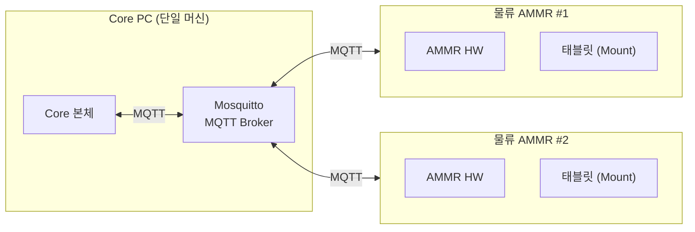

- **Core PC** — Core 본체 프로세스(ASP.NET Core)와 Mosquitto Broker가 같은 PC에서 운영된다.
- **물류 AMMR** — 현재 2대 운영. 추후 증설 가능성 있음. 각 AMMR은 Broker에 클라이언트로 접속한다.
- **태블릿** — AMMR 1대당 1대가 본체에 Mount된다. AMMR과 함께 Core와 MQTT로 통신하는 단말이며 별도 통신 채널이 없다. 적재 상태·배정 상태·상단 정보 등 표시 정보는 Core가 Job 지시(C-2)에 선탑재하고, 태블릿이 이 값과 자체 slot_state 판정으로 화면을 구성한다. 정합이 어긋나면 Core가 일괄보고 응답(C-3)으로 정정한다.
- **연결 망** — 사내 내부망 한정. 외부 인터넷 노출 없음.

### 2.2 Core와 AMMR의 역할 분담

| 영역                                   | 주체     | 비고                                                          |
|----------------------------------------|----------|---------------------------------------------------------------|
| Job 결정 (Move/Pickup/Dropoff/Charge) | Core     | 이송 요청을 Job Sequence로 전개하여 한 Job씩 지시             |
| Job 물리 수행                          | AMMR HW  | 자율 주행, Pickup·Dropoff 동작, 도킹·충전 등                  |
| Job 지시 수신 보고                     | AMMR HW  | Core Job 지시 수신 직후 즉시                                 |
| Job 수행 결과 보고                     | AMMR HW  | Job 종료 시 통합 보고                                         |
| AMMR HW 상태 보고                      | AMMR HW  | 초기 연결 일괄 + 상태 전이 시점                              |
| Slot 정합 판정 결과 보고 (slot_state)  | AMMR(태블릿+HW) | 초기 연결 일괄 + 외부 원인 전이 시 1 Slot              |
| 위치·BMS 스트리밍                     | AMMR HW  | 위치 1초·BMS 10초 주기 (태블릿 설정)                                        |
| Unit 식별 (Unit ID 확정)              | Core     | AMMR HW(로봇)는 Unit ID를 인식하지 못한다(QR 미판독). Core가 Job 지시(C-2)에 Unit 정보를 선탑재해 태블릿이 보관하며, 정합이 어긋나면 일괄보고 응답(C-3)으로 확정 Unit 정보·Job 배정을 내려줌 |
| 태블릿 표시 데이터 (적재·배정·상단 정보)   | Core 선탑재 / 태블릿 구성 | Core가 Job 지시(C-2)에 선탑재 · 상단·slot_state는 태블릿 자체 산출 · 정합 정정만 일괄보고 응답(C-3, §5.2)   |
| 충전 중단 결정                         | AMMR HW / Core | 자체 임계 도달 시 자율 중단은 AMMR HW. 단, 충전 중 Core가 Job을 지시하면 AMMR은 충전을 중단하고 이탈 후 수행 (§8.4) |

### 2.3 AMMR HW ↔ Core 권위 분담

다음 표는 어떤 데이터를 어느 쪽이 권위로 갖는지를 정리한다. AMMR HW가 권위인 데이터는 AMMR이 Core에 보고하고, Core가 권위인 데이터는 Core가 자체 판정 후 회신 메시지로 내려주거나 운영에 사용한다.

| 항목                                          | 권위 매체           | 비고                                                                       |
|-----------------------------------------------|---------------------|----------------------------------------------------------------------------|
| 위치 (node_id, x, y, a) 스트리밍                       | AMMR HW             | 1초 주기 (기본·태블릿 설정)                                              |
| AMMR HW 상태 전이                             | AMMR HW             | 8종 (§부록 A.1) |
| Slot 정합 판정 결과 (slot_state·6 Slot)      | AMMR(태블릿+HW)     | 초기 일괄 또는 외부 원인 전이 시 1 Slot                                   |
| Job 지시 수신                                 | AMMR HW             | Core Job 지시 수신 즉시 보고                                              |
| Job 수행 결과 (Move/Pickup/Dropoff/Charge)   | AMMR HW             | Job 종료 시 통합 보고                                                     |
| Battery (raw % 스트리밍)                       | AMMR HW             | 10초 주기 (기본·태블릿 설정)                                                                  |
| Battery 자체 임계 (대기 복귀·저전력 진입)      | AMMR HW             | AMMR이 보유·태블릿 설정 화면에서 변경 (기본값: 대기 80% / 저전력 20%). §8.3 자율 충전 판단 기준 |
| Battery 저전력 분류 (Core 운영 판단)           | Core (자체 판정)    | Core가 수신한 Battery raw %를 자체 기준으로 분류 — AMMR이 별도 보고하지 않고, Core도 분류 결과를 AMMR에 전달하지 않음 |
| Unit ID                                       | Core (자체 판정)    | AMMR HW(로봇)는 Unit ID를 인식하지 못한다(QR 미판독). 태블릿 보관값(추정 등급)이 일괄 보고에 실리며, Slot의 Unit 정보 확정은 Core가 회신으로 내려줌 |
| 태블릿 표시 데이터 (Unit 정보·Job 배정·상단 표시) | Core 선탑재 / 태블릿 구성 | Job 지시(C-2) 선탑재 + 태블릿 자체 산출 · 정합 정정만 일괄보고 응답(§5.2 C-3) |
| 충전 스테이션 위치                            | AMMR HW             | 태블릿 설정 화면의 충전 스테이션 번호가 단일 소스. Core는 충전 스테이션을 지정·보유하지 않음 (§8.5) |
| Job 결정                                      | Core                | AMMR은 Core 지시를 수행                                                   |

---

## 3. 통신 아키텍처

### 3.1 프로토콜

Core와 AMMR은 **MQTT v5.0** 으로 통신한다.

- Broker: **Eclipse Mosquitto** (Core PC에 함께 운영)
- Core, AMMR 양측 모두 Broker에 클라이언트로 접속해 Publish/Subscribe 방식으로 통신한다.
- AMMR HW 단절은 MQTT Last Will로 Core가 인지한다.

### 3.2 연결 구조

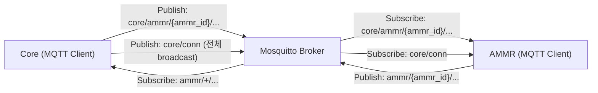

- **AMMR** — 자기 `ammr_id` 기준 Topic을 publish하고, Core가 자기에게 내리는 Topic(`core/ammr/{ammr_id}/#`)을 subscribe한다.
- **Core** — 모든 AMMR의 Topic을 wildcard subscribe하고, AMMR별 Topic(`core/ammr/{ammr_id}/…`)은 특정 AMMR에게 publish한다. 자신의 연결 상태(`core/conn`)는 전체 AMMR에 broadcast한다.

### 3.3 Topic 명명 규약

`{ammr_id}`는 AMMR 식별자다. 형식은 `AMMR-LOGI-001`, `AMMR-LOGI-002` 형태의 문자열이며, 값은 운영(설치) 시점에 Core 측이 할당한다.

#### AMMR → Core (AMMR이 publish, Core가 subscribe)

| Topic                              | 내용                    |
|-----------------------------------|-------------------------|
| `ammr/{ammr_id}/conn`             | 연결 상태 (retained·LWT)         |
| `ammr/{ammr_id}/state/snapshot`   | 일괄 보고 (초기 연결·core/conn 감지·주기·재요청(예비)·수동 발행 · 정합 상태+적재 정보) |
| `ammr/{ammr_id}/state/hw`         | AMMR HW 상태 전이       |
| `ammr/{ammr_id}/state/slot`       | Slot 상태 전이 (slot_state)   |
| `ammr/{ammr_id}/telemetry/pose`   | 위치 스트리밍 (기본 1초)     |
| `ammr/{ammr_id}/telemetry/bms`    | BMS 스트리밍 (기본 10초)      |
| `ammr/{ammr_id}/job/received`     | Job 지시 수신 확인      |
| `ammr/{ammr_id}/job/report`          | Job 수행 결과 통합 보고 |

#### Core → AMMR (Core가 publish, AMMR이 subscribe)

| Topic                                  | 내용              |
|---------------------------------------|-------------------|
| `core/conn`                            | Core 연결 상태 (retained·LWT·전체 broadcast) |
| `core/ammr/{ammr_id}/job/cmd`         | Job 지시 (단건)  |
| `core/ammr/{ammr_id}/state/reconcile` | 일괄보고 응답 (정합 정정·조건부) |
| `core/ammr/{ammr_id}/state/request`   | 일괄 보고 재전송 요청 (예비) |

표시 회신 계열은 제거했다 — 태블릿 표시는 Job 지시(C-2) 선탑재 + 태블릿 자체 slot_state 판정으로 구성한다. `state/reconcile`(C-3)은 Core 마스터 배정과 어긋나 정합을 맞춰야 할 때만 발행하는 일괄보고 응답이다 (평상시 무발행·재로드는 예외로 일치해도 발행). 적재 정보 일괄 재로드는 담당자가 `state/snapshot`(일괄 보고)을 수동 발행하는 것으로, `state/reconcile`로 응답받는다. `core/conn`은 Core 자신의 연결 상태(online/offline)를 전체 AMMR에 알리는 retained 메시지다 — AMMR은 이를 subscribe해 Core 재접속을 감지하면 일괄 보고(A-2)를 재발행하고, Core 단절(offline)을 감지하면 태블릿에 시스템 연결 끊김을 표시한다. `state/request`(C-4)는 현재 Core 운영 기본 경로가 아닌 예비 수단이며, 재동기화 기본 경로는 `core/conn` 발신 + 주기 일괄 보고다.

### 3.4 QoS / Retained / Last Will

#### QoS

| Topic                              | 분류                    | QoS  | 근거                                              |
|-----------------------------------|-------------------------|------|---------------------------------------------------|
| `ammr/{ammr_id}/conn`             | 연결 상태 (LWT)         | 1    | Retained로 늦은 접속에서도 단절 인지               |
| `ammr/{ammr_id}/state/snapshot`   | 일괄 보고               | 1    | 연결 직후 운영 상태 재구축의 입력                  |
| `ammr/{ammr_id}/state/hw`         | AMMR HW 상태 전이       | 1    | 단발성. 누락 시 운영 정합성 깨짐                  |
| `ammr/{ammr_id}/state/slot`       | Slot 상태 전이(slot_state) | 1    | 운영 정합 입력으로 누락 시 위험                 |
| `ammr/{ammr_id}/telemetry/pose`   | 위치 스트리밍 (기본 1초)     | 0    | 연속값. 1건 누락이 운영에 영향 없음               |
| `ammr/{ammr_id}/telemetry/bms`    | BMS 스트리밍 (기본 10초)      | 0    | 연속값. 임계 통과는 다음 보고에서 즉시 표면화     |
| `ammr/{ammr_id}/job/received`     | Job 지시 수신 확인      | 1    | 수신 진단·책임 분리                                |
| `ammr/{ammr_id}/job/report`          | Job 수행 결과 통합 보고 | 1    | 결과 누락 시 Job 종료 판정 불가                   |
| `core/conn`                       | Core 연결 상태 (LWT)    | 1    | Retained로 늦은 접속에서도 Core 상태 인지         |
| `core/ammr/{ammr_id}/job/cmd`     | Job 지시                | 1    | 미수신 시 운영 중단. `job_id` 멱등                |
| `core/ammr/{ammr_id}/state/reconcile` | 일괄보고 응답(정합 정정) | 1    | 정합 불일치 시 Core 확정 배정 정정               |
| `core/ammr/{ammr_id}/state/request` | 일괄 보고 재전송 요청(예비) | 1    | 예비 경로 — 사용 시 재구축 입력                  |

#### Retained

- `ammr/{ammr_id}/conn` 은 **Retained = true** 로 발행한다 — `online`은 AMMR이 CONNECT 직후 직접 발행하고, `offline`은 비정상 단절 시 Broker가 LWT로 자동 발행하거나 정상 종료·운영자 명시 해제 시 AMMR이 DISCONNECT 전에 직접 발행한다. Core가 늦게 접속해도 마지막 연결 상태를 즉시 인지한다.
- `core/conn` 도 **Retained = true** 로 발행한다 — Core가 Broker CONNECT 직후 `online`을 직접 발행하고, `offline`은 비정상 단절 시 Broker가 LWT로 자동 발행하거나 정상 종료 시 Core가 DISCONNECT 전에 직접 발행한다. AMMR이 늦게 접속해도 마지막 Core 연결 상태를 즉시 인지한다.
- 그 외 모든 Topic은 Retained = false.

#### Last Will

AMMR은 CONNECT 시 다음 LWT를 등록한다.

- **Topic**: `ammr/{ammr_id}/conn`
- **Payload**: `{"header": {"timestamp": null, "ammr_id": "AMMR-LOGI-001", "msg_id": null}, "body": {"status": "offline", "reason": "broker_disconnect", "connected_at": "2026-07-10 07:30:00.000"}}` — Broker가 CONNECT 때 등록한 payload를 그대로 재발행하므로 발행 시점 값을 못 넣어 `header.timestamp`·`header.msg_id`는 `null`이다 (실제 offline 시각은 수신 시점으로 판단·§3.5 예외)
- **QoS**: 1
- **Retained**: true
- **Will Delay Interval**: 10초 (순단 유예·§3.6)

AMMR HW와 Broker의 연결이 Keep Alive 임계 초과로 끊어지면 Broker가 자동 발행한다.

Core도 CONNECT 시 `core/conn` 을 Topic으로 하는 LWT(`{"header": {"timestamp": null, "ammr_id": null, "msg_id": null}, "body": {"status": "offline", "reason": "core_down", "connected_at": "2026-07-10 07:29:58.000"}}` · QoS 1 · Retained true)를 등록한다 — Core 프로세스나 Core 측 연결이 끊기면 Broker가 이 LWT를 자동 발행해 AMMR·태블릿이 Core 다운을 인지한다. `core/conn` payload는 발신 주체가 Core라서 `header.ammr_id` = `null`이다 (§3.5 예외).

### 3.5 Payload 인코딩·구조·공통 필드

모든 Payload는 **JSON (UTF-8)** 이다. 운영 부하 수준(AMMR 2대·초당 수십 건 이하 메시지)에서 인코딩 비용 부담이 없고, 디버깅·Log 가독성이 높다.

**구조 = `header` + `body`.** 모든 Payload는 봉투 메타를 담는 `header`와 메시지별 내용을 담는 `body` 두 객체로 구성된다. 전송·라우팅 메타를 MQTT 속성이나 Topic에만 의존하지 않고 Payload 안에 자기완결로 담아, Log에 Payload 문자열 하나만 남아도 메시지를 단독으로 해석할 수 있게 한다.

`header`는 다음 공통 필드를 담는다.

| 필드          | 타입    | 필수 | 설명                                                              |
|---------------|---------|------|-------------------------------------------------------------------|
| `timestamp`   | string\|null | 필수 | KST 현지시각 (예: `2026-07-10 07:30:00.123`) — 발행 시점. broker LWT는 `null` (아래 예외) |
| `ammr_id`     | string\|null | 필수 | AMMR 식별자 (예: `AMMR-LOGI-001`). `core/conn`은 `null` (아래 예외)               |
| `msg_id`      | string\|null | 필수 | 메시지 고유 ID (UUID). 추적·디버깅 용도. broker LWT는 `null` (아래 예외)          |

`body`는 메시지별 고유 필드를 담는다. 이하 메시지 상세 정의(§5)는 각 메시지의 **`body` 고유 필드만** 명시하며, `header`는 위 공통 구조를 공통 적용한다.

**필드 순서 = 고정.** `header`는 `timestamp → ammr_id → msg_id` 순(로그 한 줄 가독 = 시각 먼저), `body`의 상태 필드는 `hw_state → slots → pose → battery` 순으로 싣는다. 그 외 메시지별 고유 필드는 각 정의(§5) 표 순서를 따른다.

**header 예외 (구조·필드는 유지·값만 `null`):**
- `core/conn`(C-1)은 발신 주체가 Core라 특정 AMMR이 없어 `header.ammr_id` = `null`.
- broker 자동 발행 LWT(`broker_disconnect`·`core_down`)는 broker가 CONNECT 때 등록한 payload를 그대로 재발행해 발행 시점 값을 못 넣으므로 `header.timestamp` = `null`, `header.msg_id` = `null` (실제 offline 시각은 수신 시점으로 판단). AMMR/Core가 직접 발행하는 offline(`clean_shutdown` 등)은 실제 값을 넣는다.

모든 `timestamp`는 KST(UTC+9) 기준 현지시각이며, 시간대 오프셋 없이 `YYYY-MM-DD HH:MM:SS.mmm` 형식으로 전달한다 (예: `2026-07-10 07:30:00.123`).

표시에 쓰이는 문자열 값(`job_type`·`slot_state`·출발/도착 node_id 라벨 등 Core가 Job 지시(C-2)에 선탑재하는 값)은 영문 enum·식별자이며 UTF-8 문자열 그대로 전달되고, 태블릿은 한글 매핑·조립 없이 그대로 표시한다. 다만 사람 읽기용 라벨(`투입코드_유닛번호`)은 예외로, 태블릿이 선탑재된 `input_code`와 `unit_num`을 붙여 만든다 (§1.3). 상단 표시(HW 상태·최근 명령 등)는 태블릿이 자기 `hw_state`와 Core 선탑재 Job 정보로 자체 구성한다 (상세 = UI 정의 제안).

### 3.6 연결 수명 주기

#### 정상 시나리오

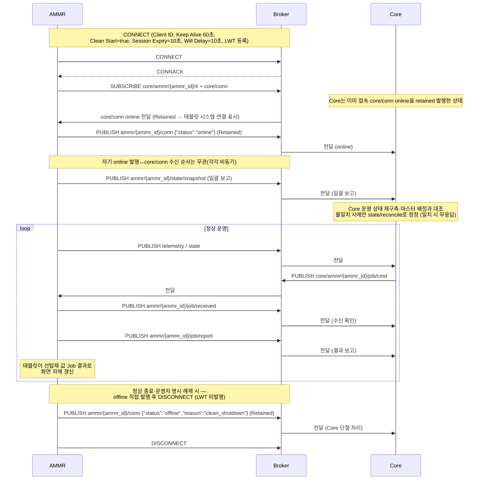

#### 비정상 단절 시나리오

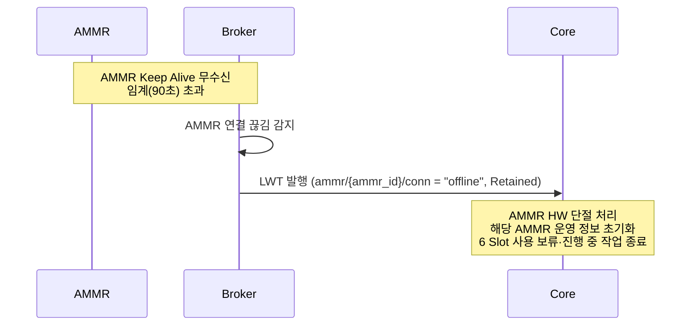

#### Core 다운 시나리오

Core 프로세스나 Core 측 연결이 끊기면 Broker가 `core/conn` LWT(offline)를 자동 발행하고, AMMR은 이를 수신해 태블릿에 시스템 연결 끊김을 표시한다. AMMR 자신의 MQTT 연결은 살아 있어도 시스템(Core) 권위 값을 받을 수 없기 때문이다.

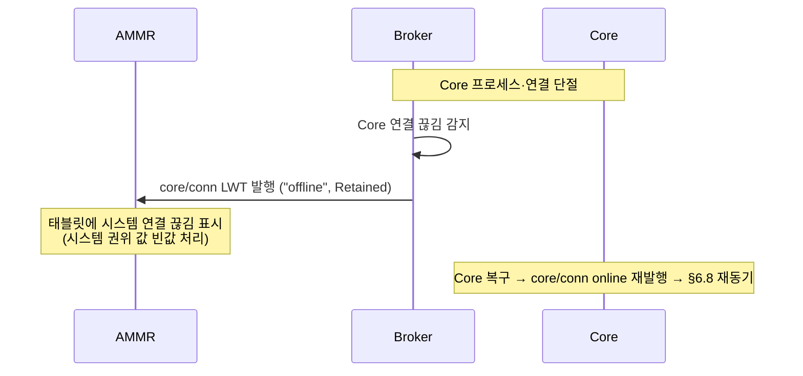

#### 핵심 파라미터

| 항목                            | 확정값  | 비고                                                  |
|---------------------------------|---------|-------------------------------------------------------|
| MQTT Keep Alive                | 60초    | AMMR PINGREQ 주기 (Mosquitto 기본)                    |
| Broker 측 단절 감지             | 90초    | Keep Alive × 1.5 (MQTT 표준 권장)                     |
| Clean Start / Session Expiry   | true / 10초 | 재접속 Clean Start=true로 세션 폐기 — 큐된 옛 Job 미배달. Session Expiry 10초는 Will Delay 유효 구간. 아래 근거 참조 |
| Will Delay Interval            | 10초    | LWT(offline) 발행을 유예 — 순단 후 유예 내 재접속하면 미발행(불필요한 단절 처리 회피). 조정 가능 |
| Client ID                      | `{ammr_id}` | 유일성 보장                                       |
| Broker 접속                    | 기본 포트 1883 (평문 MQTT·Mosquitto 기본) | 실제 접속 정보(IP·포트·자격증명)는 설치 시 Core 측이 제공하며, 담당자가 태블릿 설정 화면에 입력한다 |

**Clean Start=true·Session Expiry=10초·Will Delay=10초 근거**: 재접속 시 Clean Start=true로 세션을 폐기하므로 단절 중 Broker에 쌓인 옛 Job 지시가 뒤늦게 배달될 위험을 원천 차단한다. AMMR은 재연결할 때마다 SUBSCRIBE를 다시 수행하고 일괄 보고(A-2)를 재발행한다(§7.4). Will Delay Interval 10초는 짧은 통신 순단이 유예 내 재연결로 복구될 때 LWT(offline) 발행을 억제해 불필요한 단절 처리를 막으며, Session Expiry 10초는 이 유예가 유효하게 작동하도록 세션을 유지하는 구간이다.

#### AMMR CONNECT 설정 (필수)

AMMR은 매 CONNECT 시 다음을 설정한다 — Client ID = `{ammr_id}` · Clean Start = true · Session Expiry Interval = 10초 · Will Delay Interval = 10초(LWT) · Keep Alive = 60초 · LWT 등록(§3.4). 모두 Core 확정값이며 AMMR이 임의로 바꾸지 않는다. 세션·메시지 전달 의미에 영향을 주는 미명시 옵션(예: Message Expiry Interval)은 사용하지 않는다.

### 3.7 수신 확인 원칙

수신 확인 유무는 메시지 역할에 따라 나뉜다.

| 메시지 | 역할 | 수신 확인 · 응답 |
|---|---|---|
| C-2 Job 지시 | Core 명령 | 수신 확인 있음 — AMMR이 `job/received`로 즉시 확인. Core는 3초 안 미도달 시 AMMR HW 단절 처리 (§7.3) |
| C-4 일괄 보고 재전송 요청 (예비) | Core 요청 | 수신 확인 있음 — 별도 확인 메시지 없이 일괄 보고(A-2) 도착 자체가 확인. C-4는 현재 Core 운영 기본 경로가 아닌 예비 수단이다 (§4.2·§5.2 C-4) |
| C-3 일괄보고 응답 (정합 정정·조건부) | Core 응답 | 수신 확인 없음 — QoS 1 전달 보증만. 정합 불일치 시·재로드 시에만 발행 |
| A-2 일괄 보고 | AMMR 보고 | 수신 확인 없음 · 응답 조건부 — Core는 마스터 배정과 어긋날 때만 일괄보고 응답(C-3)으로 정정한다. 일치 시 무응답 (단 `trigger` = `manual` 재로드는 일치해도 응답) |
| A-3·A-4·A-8 보고 | AMMR 보고 | 수신 확인 없음 · 표시 회신 없음 — 태블릿이 선탑재 값·자체 slot_state 판정으로 표시를 갱신한다 |
| A-1·A-5·A-6 보고 | AMMR 보고 | 수신 확인 없음 · 응답 없음 — Core가 별도 메시지를 보내지 않는다 (QoS 보증만) |
| A-7 Job 지시 수신 확인 | AMMR 보고 | 그 자체가 C-2의 수신 확인이며, 이에 대한 별도 확인·응답은 없다 |
| 일괄 보고 수동 발행 (재로드) | 담당자 조작 | 응답 = 일괄보고 응답(C-3·Core 확정 배정). 3초 내 미도착 시 태블릿이 실패 처리(메시지 박스)·담당자 재시도 |

**주의**: 일괄보고 응답(C-3)은 정합 정정 응답이지 수신 확인이 아니다. 평상시 UI 갱신은 Job 지시 선탑재 값과 태블릿 자체 slot_state 판정으로 이루어지며, C-3는 정합이 어긋날 때 내려온다 (담당자 재로드는 일치해도 내려온다).

---

## 4. 메시지 카탈로그

이 절은 양방향 메시지 전체 목록을 요약한다. 상세 Payload 구조는 §5에서 정의한다.

### 4.1 AMMR → Core

| #   | Topic                              | 메시지 이름             | Trigger                                       | 주기·발행 조건            |
|-----|-----------------------------------|-------------------------|----------------------------------------------|---------------------------|
| A-1 | `ammr/{ammr_id}/conn`             | 연결 상태 (LWT)         | 연결 시 AMMR 발행 / 비정상 단절 시 Broker LWT 자동 발행 / 정상 종료·명시 해제 시 AMMR 직접 발행  | 발생 시점                 |
| A-2 | `ammr/{ammr_id}/state/snapshot`   | 일괄 보고 (정합 상태+적재 정보) | MQTT CONNECT 직후 / Core 연결 상태 online 감지 시 / 일괄 보고 재전송 요청(C-4) 수신 시(예비) / 주기 자동(기본 60초·태블릿 설정) / 담당자 수동 발행(재로드) | 발생 시점·주기 60초       |
| A-3 | `ammr/{ammr_id}/state/hw`         | AMMR HW 상태 전이       | 상태 전이 시점 (Job 종료 보고에 실리는 전이 제외 — §5.1 A-3) | 전이 시점 Event |
| A-4 | `ammr/{ammr_id}/state/slot`       | Slot 상태 전이          | 외부 원인 Slot 상태 전이 시점                | 전이 시점 Event (1 Slot) |
| A-5 | `ammr/{ammr_id}/telemetry/pose`   | 위치 스트리밍           | 주기                                          | 1초 (태블릿 설정)        |
| A-6 | `ammr/{ammr_id}/telemetry/bms`    | BMS 스트리밍            | 주기                                          | 10초 (태블릿 설정)        |
| A-7 | `ammr/{ammr_id}/job/received`     | Job 지시 수신 확인      | Core Job 지시 수신 직후                       | 수신 시점 Event          |
| A-8 | `ammr/{ammr_id}/job/report`          | Job 수행 결과 통합 보고 | Job 종료 시점                                 | Job 종료 Event           |

### 4.2 Core → AMMR

| #   | Topic                              | 메시지 이름   | Trigger          | 주기·발행 조건 |
|-----|-----------------------------------|---------------|-----------------|----------------|
| C-1 | `core/conn` | Core 연결 상태 | Core CONNECT 직후 online · 단절 시 offline(LWT) | 상태 변화 시점 |
| C-2 | `core/ammr/{ammr_id}/job/cmd`     | Job 지시      | Job 결정 시점   | Job 단위       |
| C-3 | `core/ammr/{ammr_id}/state/reconcile` | 일괄보고 응답 (정합 정정·조건부) | 일괄 보고(A-2)가 Core 마스터와 불일치 시·재로드 시 | 정합 정정 시점 |
| C-4 | `core/ammr/{ammr_id}/state/request` | 일괄 보고 재전송 요청 (예비) | Core가 특정 AMMR 상태를 즉시 당길 때 (예비·기본 경로 아님) | 발생 시점 |

Job 지시는 단일 Topic에서 `job_type` 필드로 4종(Move/Pickup/Dropoff/Charge)을 구분하며, 태블릿 표시에 필요한 Unit·위치 정보를 선탑재한다. C-3(`state/reconcile`)은 Core 마스터 배정과 어긋날 때 내려오는 일괄보고 응답이다 (평상시 무발행·담당자 재로드는 일치해도 발행). C-1(`core/conn`)은 Core 자신의 연결 상태를 전체 AMMR에 알리는 retained 메시지로, AMMR은 online 감지 시 일괄 보고(A-2)를 재발행하고 offline 감지 시 태블릿에 시스템 연결 끊김을 표시한다. C-4는 예비 수단이며 재동기화 기본 경로는 C-1 발신 + 주기 일괄 보고다.

---

## 5. 메시지 상세 정의

각 메시지 payload는 **`header`(공통 필드·§3.5)** 와 **`body`** 로 구성되며, 아래 표는 각 메시지의 **`body` 고유 필드**를 정의한다. 필드 타입은 §부록 A 참고. AMMR Slot ID는 식별자 명명 규칙을 따르며(예 `AMMR-LOGI-001-A1`~`A6`), 행 번호 1–6이 태블릿 화면의 Slot 번호와 일치한다.

### 5.1 AMMR → Core 메시지

#### A-1. 연결 상태 (LWT)

- **Topic**: `ammr/{ammr_id}/conn`
- **Trigger (online)**: AMMR이 CONNECT 직후 직접 publish
- **Trigger (offline — 비정상 단절)**: AMMR HW와 Broker 연결 끊김 시 Broker가 LWT 자동 발행 (`reason = broker_disconnect`)
- **Trigger (offline — 정상 종료)**: AMMR 정상 종료·운영자가 태블릿에서 시스템 연결을 명시적으로 해제하는 경우, AMMR이 DISCONNECT 전에 직접 publish (`reason = clean_shutdown`). Core는 어느 offline이든 AMMR HW 단절과 동일하게 처리하며, 재연결은 초기 연결 흐름(§6.1)과 동일하다
- **Retained**: true (Core가 늦게 접속해도 즉시 인지)

| 필드           | 타입             | 필수   | 설명                                                                                      |
|----------------|------------------|--------|-------------------------------------------------------------------------------------------|
| `status`       | enum (§부록 A.8) | 필수   | 연결 상태                                                                                 |
| `reason`       | enum (§부록 A.9) | 선택   | `offline`일 때 종료 사유                                                                  |
| `connected_at` | string           | 조건부 | offline 메시지에 실린 세션 접속 시각 (KST). online엔 없음(접속 시각 = `header.timestamp`) |

**예시**: 정상 연결

```json
{
  "header": {
    "timestamp": "2026-07-10 07:30:00.000",
    "ammr_id": "AMMR-LOGI-001",
    "msg_id": "0a1b2c3d-0001-4abc-8def-000000000001"
  },
  "body": {
    "status": "online"
  }
}
```

**예시**: LWT (Broker 자동 발행 — `timestamp`·`msg_id` = `null`·§3.4)

```json
{
  "header": {
    "timestamp": null,
    "ammr_id": "AMMR-LOGI-001",
    "msg_id": null
  },
  "body": {
    "status": "offline",
    "reason": "broker_disconnect",
    "connected_at": "2026-07-10 07:30:00.000"
  }
}
```

**예시**: 정상 종료·운영자 명시 해제 (AMMR 직접 발행)

```json
{
  "header": {
    "timestamp": "2026-07-10 18:00:00.000",
    "ammr_id": "AMMR-LOGI-001",
    "msg_id": "0a1b2c3d-0002-4abc-8def-000000000002"
  },
  "body": {
    "status": "offline",
    "reason": "clean_shutdown",
    "connected_at": "2026-07-10 07:30:00.000"
  }
}
```
#### A-2. 일괄 보고

- **Topic**: `ammr/{ammr_id}/state/snapshot`
- **Trigger**: 5가지 계기로 발행하며, 각 계기를 body `trigger` 값으로 구분해 싣는다 (§부록 A.10)
- **목적**: Core가 해당 AMMR의 운영 상태(HW 상태·위치·6 Slot 정합 상태(slot_state)·Slot별 Unit 식별값·Battery)를 일괄 재구축하기 위한 입력
- **회신**: Core는 이 보고로 운영 상태를 재구축한다. Core 마스터 배정과 어긋나 정합을 맞춰야 할 때만 일괄보고 응답(C-3 `state/reconcile`)을 내려준다 (평상시 무응답·§5.2 C-3). 단 `trigger` = `manual`이면 일치해도 응답한다

| 필드           | 타입               | 필수 | 설명                                                       |
|----------------|--------------------|------|------------------------------------------------------------|
| `trigger`      | enum (§부록 A.10) | 필수 | 이 보고의 발행 계기                                       |
| `hw_state`     | enum (§부록 A.1) | 필수 | 현재 AMMR HW 상태                                          |
| `slots`        | array[6]           | 필수 | 6 Slot 각각의 점유 정보 (아래 구조)                       |
| `pose`         | object             | 필수 | `{node_id, x, y, a}` — 현재 노드 + 현재 위치·방향각 (§5.1 A-5) |
| `battery`      | object             | 필수 | A-6 BMS 메시지의 필드 구조와 동일(§5.1 A-6)·단위는 §부록 A.5        |

`slots` 항목 구조:

| 필드           | 타입         | 필수 | 설명                                                |
|----------------|--------------|------|-----------------------------------------------------|
| `slot_id`      | string       | 필수 | AMMR Slot ID (예 `AMMR-LOGI-001-A1`)                |
| `slot_state`   | enum (§부록 A.7) | 필수 | 클라이언트(태블릿+HW)가 판정한 Slot 상태            |
| `unit_id`      | string\|null | 필수 | 적재 Unit 식별값(QR uuid). 태블릿 보관값(Core 명령 선탑재·담당자 입력). 미점유·미상이면 null |

**예시 JSON**

```json
{
  "header": {
    "timestamp": "2026-07-10 07:30:00.123",
    "ammr_id": "AMMR-LOGI-001",
    "msg_id": "0a1b2c3d-0003-4abc-8def-000000000003"
  },
  "body": {
    "trigger": "periodic",
    "hw_state": "idle",
    "slots": [
      { "slot_id": "AMMR-LOGI-001-A1", "slot_state": "occupied", "unit_id": "7f3d9e2a-1b4c-4f8a-9d6e-5c2b3a7e1f8d" },
      { "slot_id": "AMMR-LOGI-001-A2", "slot_state": "empty",    "unit_id": null },
      { "slot_id": "AMMR-LOGI-001-A3", "slot_state": "empty",    "unit_id": null },
      { "slot_id": "AMMR-LOGI-001-A4", "slot_state": "empty",    "unit_id": null },
      { "slot_id": "AMMR-LOGI-001-A5", "slot_state": "empty",    "unit_id": null },
      { "slot_id": "AMMR-LOGI-001-A6", "slot_state": "empty",    "unit_id": null }
    ],
    "pose": { "node_id": "WIP-CLN001", "x": 12.5, "y": 3.7, "a": 1.57 },
    "battery": { "battery_id": "BAT_A01", "soc": 87.3, "voltage": 50.1, "current": -2.1, "temperature": 28.5, "bmu_error": false }
  }
}
```

#### A-3. AMMR HW 상태 전이

- **Topic**: `ammr/{ammr_id}/state/hw`
- **Trigger**: AMMR HW 상태 전이 시점. **일반 규칙 — Job 수행 결과 통합 보고(A-8)에 실려 보고되는 전이(Job 종료 시점 전이)를 제외한 모든 상태 전이는 이 메시지로 보고한다.** Job 종료 전이를 이 메시지로 중복 발행하지 않는다.
- **회신**: Core는 이 보고로 운영 상태를 갱신한다. 상단 표시는 태블릿이 자기 hw_state로 자체 산출한다 (별도 표시 회신 없음).

전이별 보고 경로:

| 전이                                                        | 보고 경로 |
|--------------------------------------------------------------|-----------|
| Job 시작 (`idle → move/pickup/dropoff/charge`, 충전 중 Job 지시 수신 시 `charging → move` 등) | A-3 |
| Job 종료 (`move → idle`, `pickup → idle`, `dropoff → idle`, `charge → charging`(도킹) 등 — Job 종료 직후 상태) | A-8 `hw_state` 필드 (A-3 중복 발행 금지) |
| 충전 완료 (`charging → idle`)                                | A-3 |
| 저전력 진입 (`→ low_battery`)                                | A-3 (Job 종료와 동시 진입한 경우 A-8의 `hw_state = low_battery`로 보고·A-3 중복 발행 금지) |
| 저전력 자율 충전 도킹 (`low_battery → charging`)             | A-3 |
| 장애 진입 (`→ error`, Job 수행 중이 아닐 때 — 자기 진단 실패 등) | A-3 (Job 수행 중 장애는 A-8의 `hw_state = error`로 보고) |
| 장애 복구 (`error → idle`)                                   | A-3 |

| 필드          | 타입               | 필수 | 설명                                       |
|---------------|--------------------|------|--------------------------------------------|
| `hw_state`    | enum (§부록 A.1) | 필수 | 전이 후 상태                               |
| `prev_state`  | enum (§부록 A.1) | 선택 | 전이 전 상태 (디버깅 용도)                |
| `reason`      | string             | 선택 | 전이 사유 — 자유 문자열 (예: `self_diagnostic_failed`). Job 실패 Reason 코드(§부록 A.4)와는 별개 층위 |

**예시**: 충전 중 → 대기 자연 전이 (충전 완료)

```json
{
  "header": {
    "timestamp": "2026-07-10 07:35:12.456",
    "ammr_id": "AMMR-LOGI-001",
    "msg_id": "0a1b2c3d-0004-4abc-8def-000000000004"
  },
  "body": {
    "hw_state": "idle",
    "prev_state": "charging"
  }
}
```

#### A-4. Slot 상태 전이

- **Topic**: `ammr/{ammr_id}/state/slot`
- **Trigger**: 외부 원인(사람 개입 등)으로 Slot 상태 전이 시 1 Slot 단위 보고
- **주의**: Pickup·Dropoff Job 수행에 따른 Slot 변화는 이 메시지가 아닌 **Job 수행 결과 통합 보고(A-8)** payload에 포함되어 보고된다 (중복 보고 금지).
- **회신**: Core는 이 보고로 운영 상태를 갱신한다. 표시는 태블릿이 자체 판정한 slot_state로 반영하며 별도 표시 회신은 없다.

| 필드           | 타입         | 필수 | 설명                                              |
|----------------|--------------|------|---------------------------------------------------|
| `slot_id`      | string       | 필수 | 전이 Slot ID                                      |
| `slot_state`   | enum (§부록 A.7) | 필수 | 클라이언트 판정 Slot 상태 |
| `prev_slot_state` | enum (§부록 A.7) | 선택 | 전이 전 Slot 상태 (디버깅 용도) |
| `unit_id`      | string\|null | 필수 | 적재 Unit 식별값(QR). 미점유·미상이면 null        |

**예시**

```json
{
  "header": {
    "timestamp": "2026-07-10 07:40:23.789",
    "ammr_id": "AMMR-LOGI-001",
    "msg_id": "0a1b2c3d-0005-4abc-8def-000000000005"
  },
  "body": {
    "slot_id": "AMMR-LOGI-001-A3",
    "slot_state": "blocked",
    "prev_slot_state": "empty",
    "unit_id": null
  }
}
```

#### A-5. 위치 스트리밍

- **Topic**: `ammr/{ammr_id}/telemetry/pose`
- **Trigger**: 1초 주기 (기본·태블릿 설정)
- **QoS**: 0 (연속값, 1건 누락 허용)

| 필드      | 타입   | 필수 | 설명                          |
|-----------|--------|------|-------------------------------|
| `node_id` | string | 필수 | 현재 노드 id (논리 지점 라벨) |
| `x`       | float  | 필수 | x 좌표 (단위: m)              |
| `y`       | float  | 필수 | y 좌표 (단위: m)              |
| `a`       | float  | 필수 | 방향각 (단위: rad, 0~2π)      |

좌표·방향각 단위는 이 위치 스트리밍과 일괄 보고(A-2)가 공통으로 쓴다 (§부록 A.6). Job 지시의 목적지는 좌표가 아니라 논리 지점 라벨이다 (§5.2 C-2). 현재 노드(`node_id`)는 그 목적지(`work_location_id`)와 같은 논리 지점 라벨 층위이며, 우선은 Core가 지시한 목적지 노드를 그대로 회신한다.

**예시**

```json
{
  "header": {
    "timestamp": "2026-07-10 07:40:24.000",
    "ammr_id": "AMMR-LOGI-001",
    "msg_id": "0a1b2c3d-0006-4abc-8def-000000000006"
  },
  "body": {
    "node_id": "WIP-CLN001",
    "x": 12.51,
    "y": 3.72,
    "a": 1.58
  }
}
```

#### A-6. BMS 스트리밍

- **Topic**: `ammr/{ammr_id}/telemetry/bms`
- **Trigger**: 10초 주기 (기본·태블릿 설정)
- **QoS**: 0

| 필드           | 타입    | 필수 | 설명                                          |
|----------------|---------|------|-----------------------------------------------|
| `battery_id`   | string  | 필수 | Battery 팩 식별값                              |
| `soc`          | float   | 필수 | 충전 상태 (%, 0.0–100.0)                     |
| `voltage`      | float   | 필수 | 전압 (V)                                      |
| `current`      | float   | 필수 | 전류 (A) — 충전 시 양수, 방전 시 음수        |
| `temperature`  | float   | 필수 | 온도 (°C)                                     |
| `bmu_error`    | boolean | 필수 | BMU 오류 발생 여부                            |

**예시**

```json
{
  "header": {
    "timestamp": "2026-07-10 07:40:25.000",
    "ammr_id": "AMMR-LOGI-001",
    "msg_id": "0a1b2c3d-0007-4abc-8def-000000000007"
  },
  "body": {
    "battery_id": "BAT_A01",
    "soc": 87.1,
    "voltage": 50.0,
    "current": -2.0,
    "temperature": 28.6,
    "bmu_error": false
  }
}
```

#### A-7. Job 지시 수신 확인

- **Topic**: `ammr/{ammr_id}/job/received`
- **Trigger**: AMMR이 `core/ammr/{ammr_id}/job/cmd` 수신 직후 1회
- **목적**: Core가 AMMR 수신 여부 확인. 수신 확인 미수신 = 통신 문제 / 수신 확인 도달 + 결과 보고 늦음 = AMMR HW 문제 — 책임 분리

| 필드     | 타입          | 필수 | 설명                              |
|----------|---------------|------|-----------------------------------|
| `job_id` | integer       | 필수 | Core 지시의 `job_id`  |

**예시**

```json
{
  "header": {
    "timestamp": "2026-07-10 07:41:55.123",
    "ammr_id": "AMMR-LOGI-001",
    "msg_id": "0a1b2c3d-0008-4abc-8def-000000000008"
  },
  "body": {
    "job_id": 1024
  }
}
```

#### A-8. Job 수행 결과 통합 보고

- **Topic**: `ammr/{ammr_id}/job/report`
- **Trigger**: Job 종료 시점 (Move/Pickup/Dropoff/Charge 각 종료)
- **핵심**: 이 메시지는 Job 수행 결과를 통합 보고하는 단일 메시지이다. payload 분기는 §7.2 참조.
- **회신**: Core는 이 보고로 운영 상태를 갱신한다. 표시는 태블릿이 Job 결과·선탑재 값으로 자체 갱신한다 (별도 표시 회신 없음).

| 필드                 | 타입               | 필수    | 설명                                                         |
|----------------------|--------------------|---------|--------------------------------------------------------------|
| `job_id`             | integer            | 필수    | 대응되는 Job 지시의 `job_id`                     |
| `job_type`           | enum (§부록 A.2) | 필수    | 수행한 Job 종류                                             |
| `hw_state`           | enum (§부록 A.1) | 필수    | Job 종료 직후 AMMR HW 상태. 이 필드에 실린 전이는 A-3로 중복 발행하지 않는다 (§5.1 A-3). Charge Job은 도킹 완료 시점 보고라 `charging` |
| `job_result`         | enum (§부록 A.3) | 필수    | Job 수행 결과                                               |
| `reason`             | enum (§부록 A.4) | 조건부 | `job_result = failure` 시 필수 (`ammr_hw_*` 또는 `slot_*`)  |
| `slot`               | object             | 조건부 | Pickup·Dropoff 시 필수. 대상 AMMR Slot의 클라이언트 판정 상태. 구조 아래. |

`slot` 구조 (Pickup·Dropoff Job에 한정):

| 필드           | 타입         | 필수 | 설명                                          |
|----------------|--------------|------|-----------------------------------------------|
| `slot_id`      | string       | 필수 | 대상 AMMR Slot ID                             |
| `slot_state`   | enum (§부록 A.7) | 필수 | 클라이언트 판정 (Pickup 성공 `occupied`·Dropoff 성공 `empty`·실패 `job_failed`) |
| `unit_id`      | string\|null | 필수 | 적재 Unit 식별값(QR). 미점유·미상이면 null    |

**예시**: Pickup 성공

```json
{
  "header": {
    "timestamp": "2026-07-10 07:42:11.234",
    "ammr_id": "AMMR-LOGI-001",
    "msg_id": "0a1b2c3d-0009-4abc-8def-000000000009"
  },
  "body": {
    "job_id": 1024,
    "job_type": "pickup",
    "hw_state": "idle",
    "job_result": "success",
    "slot": {
      "slot_id": "AMMR-LOGI-001-A2",
      "slot_state": "occupied",
      "unit_id": "7f3d9e2a-1b4c-4f8a-9d6e-5c2b3a7e1f8d"
    }
  }
}
```

**예시**: Pickup 실패 (Slot 측 사유 — 출발 Slot 비어 있음)

```json
{
  "header": {
    "timestamp": "2026-07-10 07:42:11.234",
    "ammr_id": "AMMR-LOGI-001",
    "msg_id": "0a1b2c3d-000a-4abc-8def-00000000000a"
  },
  "body": {
    "job_id": 1024,
    "job_type": "pickup",
    "hw_state": "idle",
    "job_result": "failure",
    "reason": "slot_source_empty",
    "slot": {
      "slot_id": "AMMR-LOGI-001-A2",
      "slot_state": "job_failed",
      "unit_id": null
    }
  }
}
```

**예시**: AMMR HW 장애 (모든 Job 결과에 적용 가능)

```json
{
  "header": {
    "timestamp": "2026-07-10 07:42:11.234",
    "ammr_id": "AMMR-LOGI-001",
    "msg_id": "0a1b2c3d-000b-4abc-8def-00000000000b"
  },
  "body": {
    "job_id": 1025,
    "job_type": "move",
    "hw_state": "error",
    "job_result": "failure",
    "reason": "ammr_hw_navigation_lost"
  }
}
```


### 5.2 Core → AMMR 메시지

#### C-1. Core 연결 상태

- **Topic**: `core/conn` (Core 단일 · 전체 AMMR broadcast)
- **Trigger (online)**: Core가 Broker CONNECT 직후 직접 publish (retained)
- **Trigger (offline)**: Core 프로세스·연결 비정상 단절 시 Broker가 LWT 자동 발행(`reason = core_down`) / 정상 종료 시 Core가 DISCONNECT 전에 직접 publish (`reason = clean_shutdown`)
- **목적**: Core 자신의 연결 상태를 AMMR·태블릿에 알린다. AMMR은 `online` 감지 시 일괄 보고(A-2)를 재발행해 Core 재동기를 개시하고, `offline` 감지 시 태블릿에 시스템 연결 끊김을 표시한다.
- **Retained**: true (늦게 접속한 AMMR도 마지막 Core 상태를 즉시 인지)

| 필드           | 타입             | 필수   | 설명                                                           |
|----------------|------------------|--------|----------------------------------------------------------------|
| `status`       | enum (§부록 A.8) | 필수   | 연결 상태                                                      |
| `reason`       | enum (§부록 A.9) | 선택   | `offline`일 때 종료 사유                                       |
| `connected_at` | string           | 조건부 | offline 메시지에 실린 Core 세션 접속 시각 (KST). online엔 없음 |

**공통 필드 예외**: `core/conn` payload는 발신 주체가 Core라서 `ammr_id`를 포함하지 않는다 (§3.5 명시 예외).

**예시**: Core online

```json
{
  "header": {
    "timestamp": "2026-07-10 07:29:58.000",
    "ammr_id": null,
    "msg_id": "0a1b2c3d-0101-4abc-8def-000000000101"
  },
  "body": {
    "status": "online"
  }
}
```

**예시**: Core offline (LWT · Broker 자동 발행)

```json
{
  "header": {
    "timestamp": null,
    "ammr_id": null,
    "msg_id": null
  },
  "body": {
    "status": "offline",
    "reason": "core_down",
    "connected_at": "2026-07-10 07:29:58.000"
  }
}
```
#### C-2. Job 지시

- **Topic**: `core/ammr/{ammr_id}/job/cmd`
- **Trigger**: Core의 Job 결정 시점
- **수신 후 책임**: AMMR은 이 메시지 수신 즉시 `ammr/{ammr_id}/job/received` 로 수신 확인을 보고하고, Job 수행 종료 시점에 `ammr/{ammr_id}/job/report` 로 결과를 보고한다.
- **멱등성**: AMMR은 동일 `job_id` 중복 수신 시 1회만 처리한다 (QoS 1 중복 가능성 대비).
- **표시 정보 선탑재**: 표시 회신 계열을 제거했으므로, 태블릿이 표시에 필요한 값(적재 Unit 정보·출발/도착 위치)을 Core가 이 지시에 미리 싣는다. 태블릿은 이 값을 보관해 화면을 자체 구성한다 (라벨 조립·위치 표시 텍스트 = "AMMR 태블릿 UI 정의 제안" 참조).

| 필드               | 타입             | 필수    | 설명                                                     |
|--------------------|------------------|---------|----------------------------------------------------------|
| `job_id`           | integer          | 필수    | Job 고유 번호. AMMR은 동일 번호로 결과 보고 |
| `job_type`         | enum (§부록 A.2) | 필수    | 지시할 Job 종류                                          |
| `work_location_id` | string           | 조건부  | 작업 외부 지점 라벨(노드 id 문자열). Move·Pickup·Dropoff 시 필수 (Move=목적지 / Pickup=출발 외부 지점 / Dropoff=도착 외부 지점) |
| `slot_info`        | object           | 조건부  | Pickup·Dropoff 시 필수. `{ from_slot_id, to_slot_id }` — 이번 지시의 슬롯 이동 방향. Pickup=외부→AMMR / Dropoff=AMMR→외부 (Unit 전체 경로는 `unit`의 `from_location_id`·`to_location_id`) |
| `unit`             | object           | 조건부  | Pickup·Dropoff 시 필수. 대상 Unit 정보 (선탑재). 구조 아래. |

**job_type별 필요 필드**

| job_type | work_location_id | slot_info (from → to) | unit |
|----------|---------------|------------------------|------|
| `move`    | ✓ 목적지 지점    | –                        | –  |
| `pickup`  | ✓ 출발 외부 지점 | ✓ 외부 slot → AMMR slot  | ✓  |
| `dropoff` | ✓ 도착 외부 지점 | ✓ AMMR slot → 외부 slot  | ✓  |
| `charge`  | –              | –                        | –  |

**지점/슬롯 라벨**: 식별자 명명 규칙을 따르는 문자열. 지점 라벨(예: `WIP-CLN001` 세척 WIP, `CNC-RAC-A01` CNC 작업대)과 슬롯 라벨(예: `WIP-CLN001-A1`, `CNC-RAC-A01-BEFORE`, `AMMR-LOGI-001-A2`) 두 층위다. 목적지는 좌표가 아니라 논리 지점 라벨이며 AMMR이 자체 맵으로 물리 위치를 해석한다. 전체 라벨 목록은 설치 시 Core 측이 제공한다. Charge는 위치·unit 필드가 없다 — 충전 스테이션은 태블릿 설정값이 단일 소스다 (§8.5).

`unit` 구조 (Pickup·Dropoff 선탑재):

| 필드               | 타입    | 필수 | 설명                                                           |
|--------------------|---------|------|----------------------------------------------------------------|
| `unit_id`          | string  | 필수 | Unit 식별값 (QR uuid·§1.3). AMMR이 자체 인식하지 못하므로 Core가 선탑재 |
| `input_code`       | string  | 필수 | 투입코드 — GM `inputCode` 값 그대로(가공 없음)                |
| `unit_num`         | string  | 필수 | 유닛번호 — Core가 수신 수량을 Unit으로 나눌 때 부여하는 일련번호 |
| `model_name`       | string  | 필수 | 제품 모델 코드 (예: `H8-MAIN`)                                 |
| `version`          | string  | 필수 | 모델 버전 (예: `KM70`)                                         |
| `purpose`          | string  | 필수 | 제품 용도 — GM `purpose` 값 (별표 등 장식문자 제외)            |
| `tray_count`       | integer | 필수 | Unit을 구성하는 Tray 단 수                                     |
| `product_count`    | integer | 필수 | Unit 안 제품 개수 (최대 16)                                    |
| `from_location_id` | string  | 필수 | 출발 지점 라벨 — 이 Unit이 있는 공정·설비 (예: `WIP-CLN001`)   |
| `to_location_id`   | string  | 필수 | 도착 지점 라벨 — 이 Unit이 갈 다음 공정·설비 (예: `CNC-RAC-A02`) |

태블릿은 사람 읽기용 라벨을 `input_code`_`unit_num`으로 조립한다 (예 `26SF03002001_001`).

**예시**: Move

```json
{
  "header": {
    "timestamp": "2026-07-10 07:41:55.000",
    "ammr_id": "AMMR-LOGI-001",
    "msg_id": "0a1b2c3d-0102-4abc-8def-000000000102"
  },
  "body": {
    "job_id": 1025,
    "job_type": "move",
    "work_location_id": "WIP-CLN001"
  }
}
```

**예시**: Pickup

```json
{
  "header": {
    "timestamp": "2026-07-10 07:42:00.000",
    "ammr_id": "AMMR-LOGI-001",
    "msg_id": "0a1b2c3d-0103-4abc-8def-000000000103"
  },
  "body": {
    "job_id": 1024,
    "job_type": "pickup",
    "work_location_id": "WIP-CLN001",
    "slot_info": { "from_slot_id": "WIP-CLN001-A1", "to_slot_id": "AMMR-LOGI-001-A2" },
    "unit": {
      "unit_id": "7f3d9e2a-1b4c-4f8a-9d6e-5c2b3a7e1f8d",
      "input_code": "26SF03002001",
      "unit_num": "001",
      "model_name": "H8-MAIN",
      "version": "KM70",
      "purpose": "PV2차 선검증 (7월까지)",
      "tray_count": 5,
      "product_count": 16,
      "from_location_id": "WIP-CLN001",
      "to_location_id": "CNC-RAC-A02"
    }
  }
}
```

**예시**: Dropoff

```json
{
  "header": {
    "timestamp": "2026-07-10 07:45:00.000",
    "ammr_id": "AMMR-LOGI-001",
    "msg_id": "0a1b2c3d-0104-4abc-8def-000000000104"
  },
  "body": {
    "job_id": 1026,
    "job_type": "dropoff",
    "work_location_id": "CNC-RAC-A02",
    "slot_info": { "from_slot_id": "AMMR-LOGI-001-A2", "to_slot_id": "CNC-RAC-A02-BEFORE" },
    "unit": {
      "unit_id": "7f3d9e2a-1b4c-4f8a-9d6e-5c2b3a7e1f8d",
      "input_code": "26SF03002001",
      "unit_num": "001",
      "model_name": "H8-MAIN",
      "version": "KM70",
      "purpose": "PV2차 선검증 (7월까지)",
      "tray_count": 5,
      "product_count": 16,
      "from_location_id": "WIP-CLN001",
      "to_location_id": "CNC-RAC-A02"
    }
  }
}
```

**예시**: Charge (위치·unit 없음)

```json
{
  "header": {
    "timestamp": "2026-07-10 08:10:00.000",
    "ammr_id": "AMMR-LOGI-001",
    "msg_id": "0a1b2c3d-0105-4abc-8def-000000000105"
  },
  "body": {
    "job_id": 1027,
    "job_type": "charge"
  }
}
```

#### C-3. 일괄보고 응답 (정합 정정·조건부)

- **Topic**: `core/ammr/{ammr_id}/state/reconcile`
- **Trigger**: 일괄 보고(A-2) 수신 처리 후, **Core 마스터 배정과 AMMR 보고가 어긋나 정합을 맞춰야 할 때만** 발행. 일치하면 발행하지 않는다. 단 A-2 `trigger` = `manual`(담당자 재로드)이면 일치해도 발행한다 — 태블릿이 응답 도착으로 재로드 성공을 판정한다 (§7.3·§7.4).
- **목적**: Core가 확정한 6 Slot의 Unit 정보·Job 배정을 태블릿에 내려 정합을 맞춘다. 담당자 재로드(§6.5)에는 항상 응답하고, 그 밖에는 재연결 후 불일치 시 사용한다. 평상시 재연결·표시 갱신은 태블릿이 보유 상태와 자체 slot_state 판정으로 처리하므로 이 응답이 없다.

| 필드     | 타입     | 필수 | 설명                                              |
|----------|----------|------|---------------------------------------------------|
| `slots`  | array[6] | 필수 | Core 확정 Slot별 Unit 정보·Job 배정. 구조 아래.            |

`slots` 항목 구조:

| 필드        | 타입          | 필수 | 설명                                                              |
|-------------|---------------|------|-------------------------------------------------------------------|
| `slot_id`   | string        | 필수 | AMMR Slot ID                                                      |
| `unit`      | object\|null  | 필수 | Core 확정 적재 Unit 정보 (C-2 `unit` 구조와 동일). 빈 Slot·미확정이면 null |

**`unit`이 null일 때의 구분.** 한 Slot의 `unit`이 null로 오면 태블릿은 자기 `slot_state`로 두 경우를 가른다 — 센서가 미점유(`empty`)면 빈 Slot이고, 센서가 점유(`occupied`)인데 `unit`이 null이면 Core가 그 Slot을 확정하지 못한 것이므로 `blocked`(사용 보류)를 유지한다.

**예시**: 재로드 후 Slot A1 정정·나머지 빈 Slot

```json
{
  "header": {
    "timestamp": "2026-07-10 10:05:00.400",
    "ammr_id": "AMMR-LOGI-001",
    "msg_id": "0a1b2c3d-0106-4abc-8def-000000000106"
  },
  "body": {
    "slots": [
      {
        "slot_id": "AMMR-LOGI-001-A1",
        "unit": {
          "unit_id": "7f3d9e2a-1b4c-4f8a-9d6e-5c2b3a7e1f8d",
          "input_code": "26SF03002001",
          "unit_num": "001",
          "model_name": "H8-MAIN",
          "version": "KM70",
          "purpose": "PV2차 선검증 (7월까지)",
          "tray_count": 5,
          "product_count": 16,
          "from_location_id": "WIP-CLN001",
          "to_location_id": "CNC-RAC-A02"
        }
      },
      { "slot_id": "AMMR-LOGI-001-A2", "unit": null },
      { "slot_id": "AMMR-LOGI-001-A3", "unit": null },
      { "slot_id": "AMMR-LOGI-001-A4", "unit": null },
      { "slot_id": "AMMR-LOGI-001-A5", "unit": null },
      { "slot_id": "AMMR-LOGI-001-A6", "unit": null }
    ]
  }
}
```

#### C-4. 일괄 보고 재전송 요청 (예비)

> **예비 수단** — 현재 Core 운영 기본 경로가 아니다. 재동기화 기본 경로는 Core 연결 상태 발신(C-1 `online`)에 따른 AMMR의 일괄 보고 자발 재발행 + 주기 일괄 보고(A-2)다. C-4는 Core가 특정 AMMR 상태를 즉시 당겨야 할 때를 위한 예비 경로로 정의·구현만 유지하며(AMMR은 C-4 수신 시 A-2 재발행 동작을 구현해 둔다), Core는 평상시 발신하지 않는다.

- **Topic**: `core/ammr/{ammr_id}/state/request`
- **Trigger**: (예비 사용 시) Core가 특정 AMMR의 상태를 즉시 재수신해야 하는 시점
- **목적**: AMMR에게 일괄 보고(A-2) 재발행을 요청한다. AMMR은 이 메시지 수신 시 초기 연결 시와 같은 일괄 보고를 재발행한다.
- **수신 확인**: 별도 확인 메시지 없이 일괄 보고(A-2) 도착 자체가 수신 확인이다. 요청 후 3초(§7.3) 안에 도착하지 않으면 Core는 재요청할 수 있으며, 해당 AMMR은 일괄 보고 도착으로 운영 상태가 재구축될 때까지 신규 작업 대상에서 제외된다.

`body` 고유 필드 없음 — `header` 공통 필드(§3.5)만으로 구성되며 `body`는 빈 객체다.

**예시**

```json
{
  "header": {
    "timestamp": "2026-07-10 10:05:00.000",
    "ammr_id": "AMMR-LOGI-001",
    "msg_id": "0a1b2c3d-0107-4abc-8def-000000000107"
  },
  "body": {}
}
```


---

## 6. 통신 흐름·Sequence

### 6.1 초기 연결 및 일괄 보고

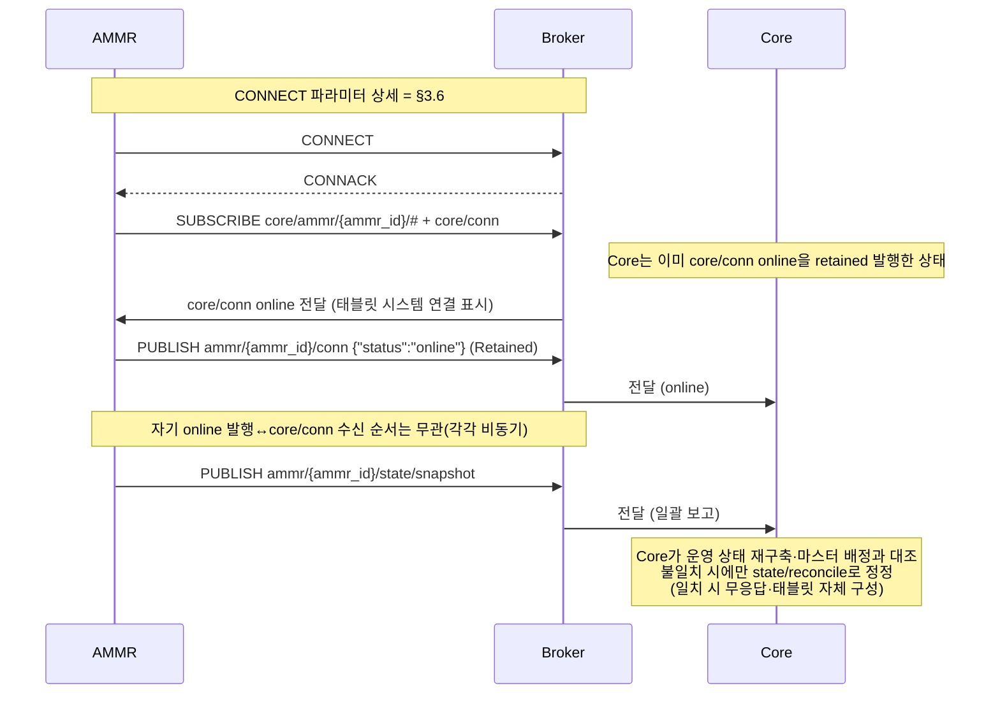

일괄 보고(A-2) 처리 후 Core는 마스터 배정과 대조해 불일치가 있을 때만 일괄보고 응답(C-3 `state/reconcile`)으로 정정한다. 평상시 태블릿 화면은 보유 상태와 자체 slot_state 판정으로 스스로 채운다.

### 6.2 Job Sequence

Core는 하나의 이송 요청을 Job Sequence(Move → Pickup → Move → Dropoff)로 전개하여 **한 번에 하나씩** 지시한다. 각 Job 지시 후 AMMR은 수신 확인(`job/received`)을 보고하고, Job 종료 시점에 결과(`job/report`)를 보고한다. 태블릿은 Job 결과와 지시에 선탑재된 값으로 적재·배정 화면을 자체 갱신한다 (별도 표시 회신 없음).

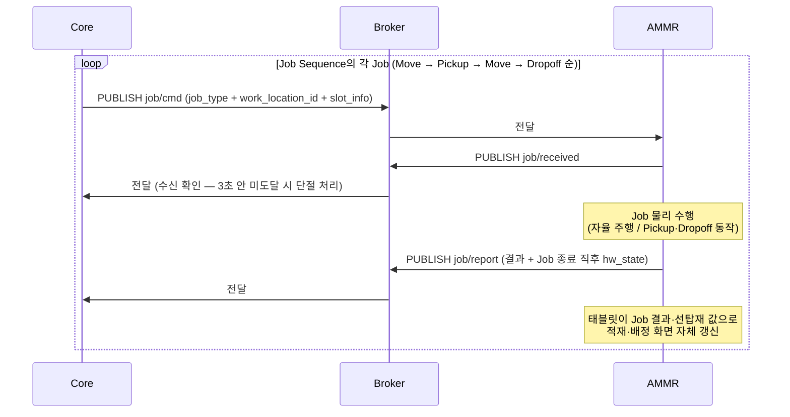

**주의**: AMMR은 Core의 다음 Job 지시 전에는 자체적으로 다음 동작을 수행하지 않는다. 1 Job 종료 → 결과 보고 → Core 판정 → 다음 Job 지시의 순환이다.

**※ 이송 상황별 Job Sequence**

| 이송 상황 | Job Sequence |
|-----------|--------------|
| 일반 이송 | Move → Pickup → Move → Dropoff |
| 적재 중 Unit의 후속 운반 (재로드·복구로 적재 Unit이 확정된 경우 등) | Move → Dropoff (AMMR이 이미 Unit을 적재한 상태라 Pickup 없음) |
| 충전 | Charge 단일 Job (§6.3) |

AMMR은 어떤 순서 조합이든 단건 Job 계약(§5.2 C-2)만으로 수행할 수 있어야 하며, Dropoff가 항상 Pickup 뒤에 온다고 가정하지 않는다.

Job 시작 시점의 상단 표시(HW 상태·최근 명령·명령 Slot)는 태블릿이 자기 hw_state와 Core 선탑재 Job 정보로 자체 구성한다 (상세 = UI 정의 제안·별도 표시 회신 없음).

### 6.3 Charge Job Sequence

Charge는 Core가 자체 결정하여 **단일 Charge Job**으로 지시한다. `work_location_id`이 없으며, AMMR은 태블릿 설정값으로 보유한 충전 스테이션으로 자체 이동·도킹한다 (§8.5). 도킹·충전·이탈·자체 임계에 따른 충전 중단 결정은 AMMR HW 자율 영역이다.

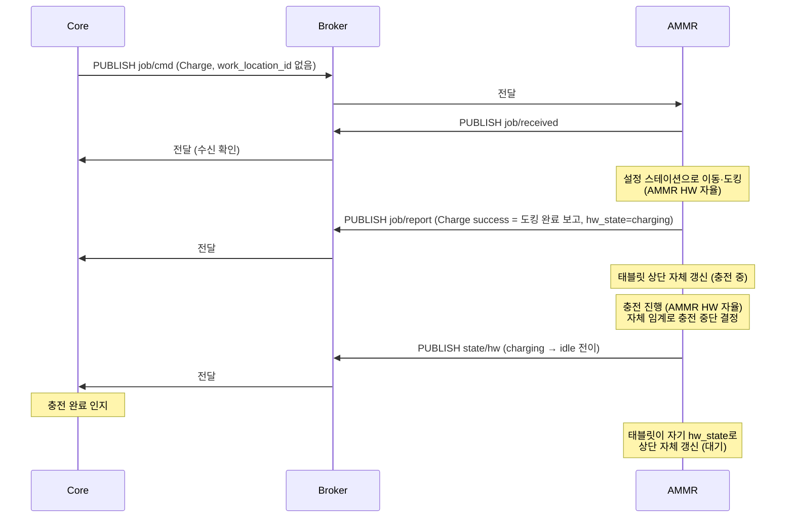

충전 중에도 Core는 이 AMMR에 Job을 지시할 수 있다 — 이 경우 AMMR은 충전을 중단하고 스테이션에서 이탈한 뒤 Job을 수행한다 (§8.4).

### 6.4 사람 개입에 따른 Slot 상태 외부 전이

사람이 AMMR Slot에서 Unit을 임의로 꺼내거나 올려놓는 경우 등 외부 원인 전이. 태블릿이 slot_state를 자체 판정해 해당 Slot 1개를 보고하고(A-4) 화면도 자체 반영한다. Core 지시 없이 일어난 변경이므로 해당 Slot의 Core 배정 정보(Unit·Job)는 무효가 되어, 태블릿은 그 Slot의 Core 관련 정보를 비우고 재로드(§6.5) 전까지 사용 보류로 둔다. Core는 운영 상태만 갱신한다 (별도 표시 회신 없음).

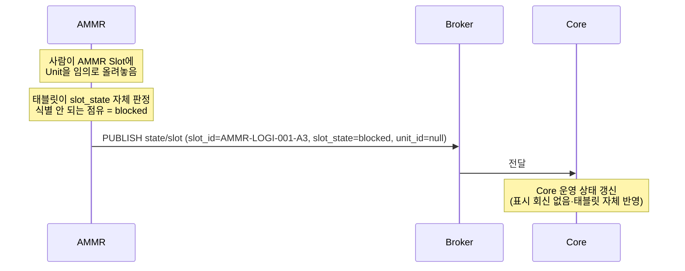

### 6.5 적재 정보 일괄 재로드

담당자가 태블릿에서 Slot 정합 이상(blocked)을 회복시키는 흐름이다. 시스템 연결이 끊긴 동안 담당자가 Slot별 입력 박스에 Unit ID를 입력해 두고, 재연결 후 [일괄 보고 재로드]를 실행한다 (태블릿 동작 세부는 "AMMR 태블릿 UI 정의 제안" 참조).

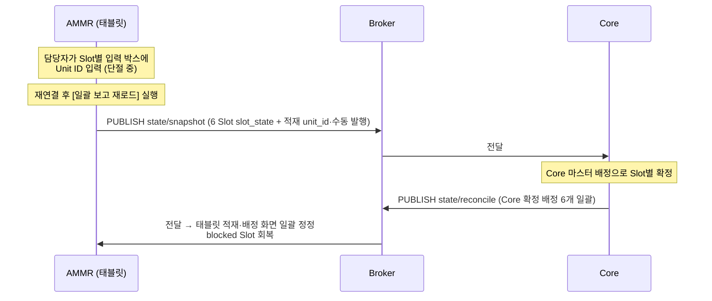

### 6.6 AMMR HW 장애 보고

AMMR HW가 물리적으로 실패한 경우. Job 수행 결과 통합 보고 payload(`hw_state=error` 또는 `ammr_hw_*` reason) 또는 상태 전이 Event(A-3)로 보고된다.

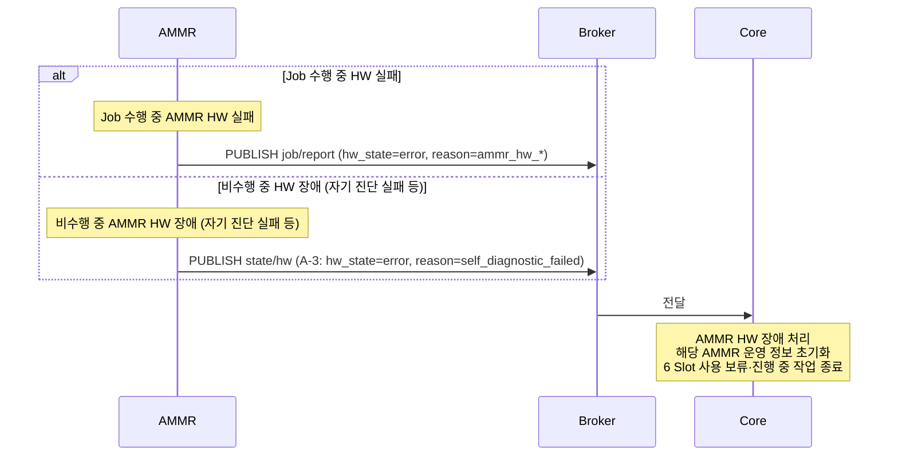

`hw_state=error` 가 보고되면 Core는 **payload 전체 신뢰 없음**으로 간주하여 Slot 정합 정보(slot_state) 부분은 무시하고 해당 AMMR의 운영 정보를 초기화한다.

### 6.7 AMMR HW 단절 (Last Will)

MQTT 경로는 살아있으나 AMMR HW가 Broker와의 연결을 잃은 경우. Broker가 LWT를 자동 발행한다.

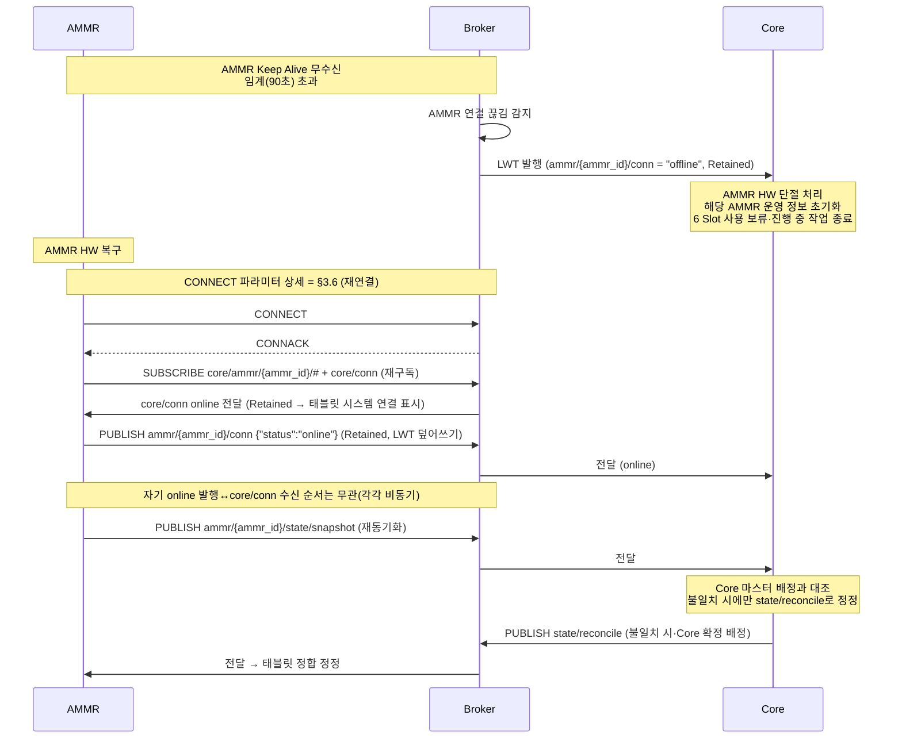

재연결 시 태블릿은 보유 상태와 자체 slot_state 판정으로 화면을 스스로 회복하며, Core는 마스터 배정과 어긋날 때만 일괄보고 응답(C-3)으로 정정한다. blocked로 남은 Slot의 회복은 적재 정보 일괄 재로드(§6.5)로 한다.

### 6.8 Core 측 재연결·Core 재시작 시 재동기화

Core가 재시작되거나 Core 측 MQTT 연결만 재수립된 경우, AMMR 측 재연결이 없어 일괄 보고가 자연 도달하지 않는다. Core는 재접속 직후 연결 상태(`core/conn` `online`)를 retained로 발행하며, AMMR이 이를 감지해 일괄 보고(A-2)를 재발행함으로써 재수신을 개시한다. (주기 일괄 보고로도 재동기화되며, 특정 AMMR을 즉시 당겨야 하면 일괄 보고 재전송 요청(C-4)을 예비로 쓴다.)

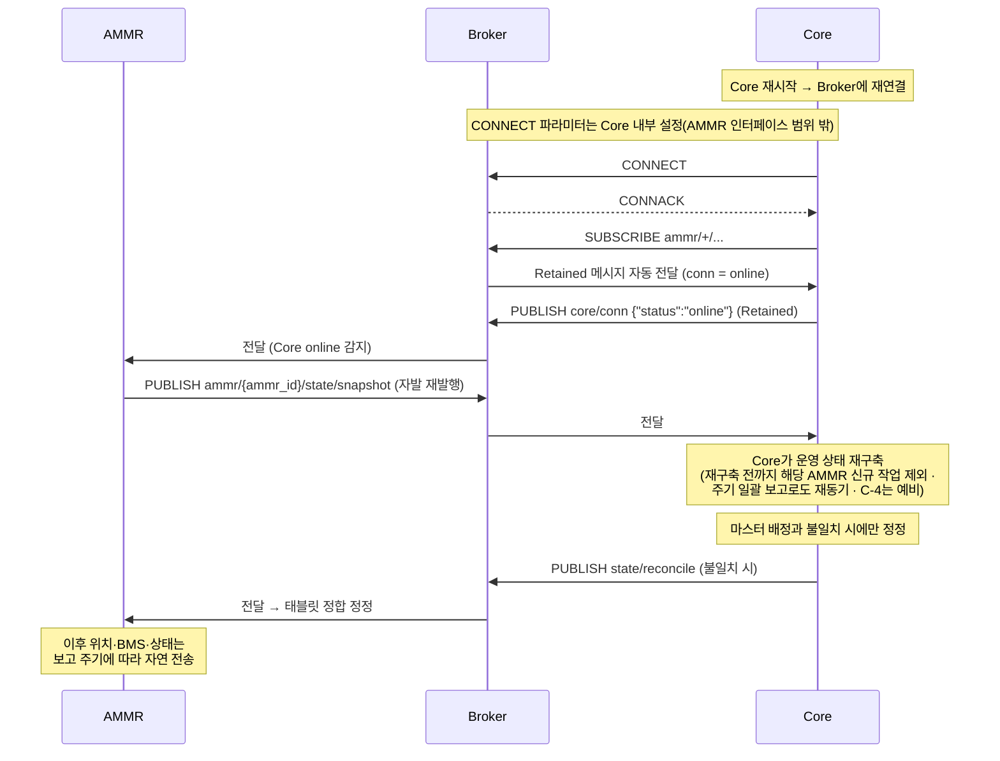

---

## 7. 오류 처리·재시도·Timeout

### 7.1 Reason 코드 분류

Job 실패 시 `reason` 필드에 사유를 기재한다. 코드 일람은 §부록 A.4에서 확정한다.

#### AMMR HW 측 카테고리 (`ammr_hw_*`)

| 코드                         | 의미                                  |
|------------------------------|---------------------------------------|
| `ammr_hw_navigation_lost`    | 자율 주행 실패 (위치 측위 불능 등)   |
| `ammr_hw_manipulator_fault`  | Manipulator 동작 실패                |
| `ammr_hw_vision_fault`       | Vision Sensor 실패                   |
| `ammr_hw_self_diagnostic`    | 자기 진단 실패                       |
| `ammr_hw_other`              | 그 외 AMMR HW 측 사유                |

이 카테고리 보고 시 Core는 **payload 전체 신뢰 없음**으로 간주하여 해당 AMMR의 운영 정보를 초기화하고 6 Slot을 사용 보류 처리한다.

#### Slot 측 카테고리 (`slot_*`)

| 코드                      | 의미                                                              |
|---------------------------|-------------------------------------------------------------------|
| `slot_source_empty`       | Pickup 출발 Slot이 비어 있음 (도착 시 slot_state empty)          |
| `slot_source_obstructed`  | Pickup 시 물리 충돌 감지 (Vision Sensor)                         |
| `slot_dest_occupied`      | Dropoff 목적지 Slot이 점유됨 (도착 시 slot_state occupied)       |
| `slot_dest_obstructed`    | Dropoff 시 물리 충돌 감지 (Vision Sensor)                        |
| `slot_other`              | 그 외 Slot 측 사유                                                |

이 카테고리 보고 시 Core는 해당 Slot의 클라이언트 정합 판정 결과를 반영해 운영을 결정한다 — Pickup 측 실패는 해당 이송을 종료하고, Dropoff 측 실패는 대체 목적지를 재판단해 새 Job으로 지시할 수 있다.

### 7.2 Job 결과 실패 처리 (payload 분기)

Job 수행 결과 통합 보고의 payload는 다음 4가지로 분기되어 Core가 처리한다. 분기 2~4의 상태 기준은 **장애 아님**(`idle` / `charging` / `low_battery`)이다 — `low_battery` 동반 시에도 결과 처리는 동일하며, 신규 Job 배정만 차단된다 (§8.3).

| #   | payload 조합                                                                  | Core 처리                                                          |
|-----|-------------------------------------------------------------------------------|--------------------------------------------------------------------|
| 1   | `hw_state = error` (job_result·reason 무관)                                   | AMMR HW 장애 처리 — 운영 정보 초기화 + 6 Slot 사용 보류            |
| 2   | `hw_state = 장애 아님(idle/charging/low_battery)` + `job_result = failure` + `reason = ammr_hw_*` | (1)과 동일 처리 (payload 전체 신뢰 없음)          |
| 3   | `hw_state = 장애 아님(idle/charging/low_battery)` + `job_result = failure` + `reason = slot_*` | 해당 Slot 정합 판정 반영 → 운영 결정 (Pickup 실패 = 이송 종료 / Dropoff 실패 = 대체 목적지 재지시 가능) |
| 4   | `hw_state = 장애 아님(idle/charging/low_battery)` + `job_result = success`    | 정상 갱신 → 다음 Job 진행                                          |

### 7.3 Keep Alive / Timeout 임계값

| 항목                          | 확정값  | 비고                                                                  |
|-------------------------------|---------|-----------------------------------------------------------------------|
| MQTT Keep Alive               | 60초    | AMMR이 PINGREQ를 보내는 주기 (Mosquitto 기본)                         |
| Broker 측 단절 감지 임계       | 90초    | Keep Alive × 1.5 (MQTT 표준 권장)                                     |
| LWT 발행 → Core 인지            | 즉시    | Broker가 자동 발행, Core가 wildcard subscribe로 수신                  |
| Job 지시 수신 확인 임계 (Core 측) | 3초     | Core가 Job 지시 후 `job/received` 수신을 기다리는 timeout. 운영 결과 및 AMMR 통신 지연 특성에 따라 조정 가능. |
| 일괄 보고 재전송 응답 임계 (Core 측·예비) | 3초  | (C-4 예비 사용 시) Core가 재전송 요청 후 일괄 보고(A-2) 도착을 기다리는 timeout — 미도달 시 재요청 가능. 위 항목과 같은 기준으로 조정 가능. |
| 재로드(수동 일괄 보고) 응답 대기 임계 (태블릿 측) | 3초 | 태블릿이 일괄 보고를 수동 발행([일괄 보고 재로드]) 후 일괄보고 응답(C-3)을 기다리는 timeout. 미도달 시 실패 처리(메시지 박스)·담당자 재시도. 조정 가능. |

### 7.4 재시도 정책

| 시나리오                       | AMMR 측 동작                                              | Core 측 동작                                                |
|--------------------------------|-----------------------------------------------------------|-------------------------------------------------------------|
| Broker 연결 끊김 (AMMR 측)    | 자동 재연결 시도 (Backoff). 재연결 = 새 세션 (Clean Start=true) — SUBSCRIBE 재수행 + conn online + 일괄 보고 재발행 | LWT 수신 → AMMR HW 단절 처리                |
| 단절 중 Job 지시               | (수신 없음 — 세션 비보존으로 Broker가 단절 클라이언트에 메시지를 보관하지 않음) | Job 지시 후 3초 안 수신 확인 미도달 → AMMR HW 단절 처리·해당 Job 종료. 재연결 후 뒤늦게 배달되는 옛 Job 지시는 없다 (stale Job 원천 차단) |
| Job 지시 수신 확인 미수신      | (해당 없음)                                               | AMMR HW 단절과 동일 처리                                    |
| Job 결과 미수신 (Core 측)     | (해당 없음 — AMMR은 1회만 보고)                          | 두절·장애 처리로 자연 처리 (별도 재요청 없음)               |
| 결과 메시지 중복 수신          | (해당 없음)                                               | `job_id`로 멱등 처리                                         |
| Job 지시 중복 수신             | `job_id`로 멱등 처리 (1회만 수행)                        | (재발행 없음)                                                |
| 일괄보고 응답·재로드 응답 미도착 | 표시 어긋남은 적재 정보 일괄 재로드(수동 일괄 보고)로 회복 (수동 발행 응답[C-3] 3초 내 미도착 시 태블릿 실패 표시·담당자 재시도) | (재발행 없음)                                |
| 일괄 보고 재전송 요청 응답 미도착 (예비) | (해당 없음)                                            | 재요청 가능 — 해당 AMMR은 일괄 보고 도착까지 신규 작업 대상 제외 |

**핵심**: Core는 진행 중이던 Job의 결과 재보고를 요청하지 않는다. 두절 후 재연결 시 일괄 보고 재발행(AMMR 측 재연결) 또는 Core 연결 상태 발신(Core 측 재연결·§6.8, C-4는 예비)으로 자연 재동기화한다. 수신 확인 미수신은 AMMR HW 단절과 동일하게 처리한다.

**재동기 대기 중 작업 제외 (상시)**: Core가 상태를 재구축하지 못한 AMMR(초기 일괄 보고 미수신·재시작 후 재구축 전·재동기 대기 중)은 재구축 완료까지 신규 작업 대상에서 제외하고, 일괄 보고(A-2) 도착으로 운영 상태가 재구축되면 자동 해제한다. 이는 재동기 경로(C-1 발신·주기 발행·C-4 예비)와 무관하게 적용되는 상시 규칙이다.

---

## 8. AMMR HW 자율 동작 영역

이 영역은 Core 간섭 없이 AMMR HW가 자체 처리하는 영역이다. AMMR 업체의 구현 책임이다.

### 8.1 자율 주행

- 위치 측위, 경로 결정, 장애물 회피, 물리적 이동의 모든 세부.
- Core는 목적지 논리 지점 라벨만 제공하고, 위치 해석·경로는 AMMR HW가 자체 맵으로 결정한다 (§5.2 C-2).

### 8.2 도킹 / 충전 / 이탈

- 충전 스테이션 도킹의 물리 절차.
- 충전 동작 자체.
- 도킹 완료 시점에 **Charge Job 수행 결과(`job/report`)** 1회 보고 → "도킹 완료 보고" 의 의미.
- 이후 충전 진행·완료는 AMMR HW가 자율 처리하며, **충전 완료 시점에 `state/hw` 로 `charging → idle` 전이를 별도 보고**한다.
- 자체 임계 도달에 따른 충전 중단 결정은 AMMR HW 자체 처리. 단, 충전 중 Core Job 지시 수신 시의 중단·이탈은 §8.4를 따른다.

### 8.3 저전력 자율 충전

- Battery가 태블릿 설정의 저전력 임계치(기본값 20%) 이하로 진입하면 AMMR HW가 자체적으로 다음 동작을 수행한다.
  - 현재 진행 중 단위 Job 완료 후 설정 스테이션으로 자율 이동·도킹·충전
  - 이 동작 진입 시 `state/hw` 로 `low_battery` 보고 (진행 중 Job의 종료와 동시에 진입한 경우엔 Job 수행 결과 보고의 `hw_state = low_battery`로 보고 — §5.1 A-3)
  - 도킹 시점에 `state/hw` 로 `charging` 전이 보고
  - 태블릿 설정의 대기 임계치(기본값 80%) 완충 시점에 `state/hw` 로 `idle` 전이 보고
- 이 자율 동작은 Core 다운 여부와 무관하게 작동한다.
- AMMR HW 상태가 `low_battery` 또는 `charging`인 동안 Core는 신규 Job 배정을 차단한다. 단, Core가 필요하다고 판단하면(대표 사례 = 충전 중 Battery 충분히 회복) 충전 완료를 기다리지 않고 Job을 지시할 수 있다 (§8.4).

### 8.4 충전 중 Job 지시 (충전 중단·이탈)

- Core는 충전 중(`charging`)인 AMMR에도 Job을 지시할 수 있다.
- 이 지시를 받으면 AMMR은 충전을 중단하고 스테이션에서 이탈한 뒤 Job을 수행한다 — 수신 확인·결과 보고는 일반 Job과 동일 (§6.2). 충전 이탈에 따른 상태 전이(`charging → move` 등 Job 시작 전이)는 A-3로 보고한다.
- Core가 어떤 기준으로 충전 중 AMMR에 Job을 지시하는지는 Core 내부 운영 판단 영역이다.

### 8.5 충전 스테이션 설정 (단일 소스)

- 충전 스테이션 위치는 **태블릿 설정 화면의 충전 스테이션 번호가 단일 소스**다. Core는 충전 스테이션 위치를 보유·지정하지 않는다.
- Core 지시 Charge Job(§6.3)과 저전력 자율 충전(§8.3) 모두 이 설정 스테이션을 사용한다.

### 8.6 Core 다운 중 자율 동작

- Core가 다운된 동안 진행 중이던 Job은 완료까지 수행한다.
- 완료 후 AMMR은 그 위치에서 대기한다 (자율 충전존 복귀 없음, 단 §8.3 저전력 자율 충전은 예외).
- Core 복구 시 Core 연결 상태 발신(§6.8, C-4는 예비) 및 보고 재개로 자연 재동기화한다.

---

## 9. 인증·보안

### 9.1 MQTT 인증

- **사용자명/비밀번호 인증**을 적용한다 — MQTT CONNECT의 username/password. TLS는 적용하지 않는다 (사내 내부망 한정 운영 전제·§9.3).
- 자격증명(MQTT 접속 ID·비밀번호)은 설치 시 Core 측이 AMMR별로 발급·제공하며, 담당자가 태블릿 설정 화면에 입력한다 (§3.6 Broker 접속).
- **자격증명 규칙·발급 값**: MQTT username은 해당 AMMR의 `ammr_id`, password는 `{ammr_id}@core` 형식으로 발급한다. 현재 운영 2대의 값은 아래와 같으며, 담당자가 설치 시 태블릿 설정 화면에 입력한다.

| AMMR | MQTT username | MQTT password |
|------|---------------|---------------|
| 물류 AMMR #1 | `AMMR-LOGI-001` | `AMMR-LOGI-001@core` |
| 물류 AMMR #2 | `AMMR-LOGI-002` | `AMMR-LOGI-002@core` |

AMMR 증설 시 같은 규칙(`{ammr_id}` / `{ammr_id}@core`)으로 확장한다. 이 자격증명은 사내 내부망 한정·평문 MQTT 전제의 운영값이다 (§9.3).

이 값을 문서에 싣는 것은 AMMR 업체가 자체 환경에서 통신 모듈을 붙여 스스로 검증할 수 있도록 하기 위한 테스트 목적이다. 정식 운영 시점에는 자격증명을 변경할 수 있으며, 변경 시 Core 측이 AMMR별로 다시 발급·제공한다.

### 9.2 Topic 권한 (Broker ACL)

Broker(Mosquitto) 측에 다음 ACL을 적용한다.

| 클라이언트     | 허용 권한                                                                  |
|----------------|----------------------------------------------------------------------------|
| AMMR `{ammr_id}` | Publish: `ammr/{ammr_id}/#` / Subscribe: `core/ammr/{ammr_id}/#` · `core/conn`           |
| Core           | Publish: `core/ammr/+/#` · `core/conn` / Subscribe: `ammr/+/#`                             |

각 AMMR은 자기 `ammr_id` 외 다른 AMMR의 Topic에 publish할 수 없다.

### 9.3 사내 내부망 전제

- 이 시스템은 사내 내부망 한정 운영. 외부 인터넷 노출 없음.
- 방화벽·NAT 설정은 운영팀 영역.

---

## 10. 부록

### A. 데이터 타입·enum 정의

각 타입의 값과 의미는 이 부록이 단일 권위다. 부록 밖에서는 타입을 가리키고 값 일람을 다시 나열하지 않는다 (맥락상 개별 값을 지목하는 것은 허용).

- 수록 대상 = 메시지가 쓰는 모든 enum·단위 (한 메시지 전용도 수록)
- 절 이름 = 쓰이는 범위를 포함한 타입명 (예: `Job 실패 Reason 코드`·`연결 종료 Reason 코드`)
  · 필드명이 같아도 값 집합이 다르면 별개 절로 둔다

#### A.1 AMMR HW 상태 (`hw_state`)

8종 — Job 수행 중에는 수행 중인 Job 동작을, Job이 없을 때는 운영 상태를 보고한다.

| 값             | 분류        | 의미                                                                       |
|----------------|-------------|----------------------------------------------------------------------------|
| `move`         | Job 동작    | Move Job 수행 중 (이동)                                                    |
| `pickup`       | Job 동작    | Pickup Job 수행 중                                                         |
| `dropoff`      | Job 동작    | Dropoff Job 수행 중                                                        |
| `charge`       | Job 동작    | Charge Job 수행 중 (충전존 이동·도킹)                                      |
| `idle`         | 운영 상태   | 대기 — 작업 배정 대기 중 (충전 완료 후 또는 작업 종료 후)                 |
| `charging`     | 운영 상태   | 충전 중 — 충전존 도킹 후 충전 중                                          |
| `low_battery`  | 운영 상태   | 저전력 — 자체 임계(태블릿 설정·기본값 20%) 이하 진입. 자율 충전 동작 진입 (§8.3) |
| `error`        | 운영 상태   | 장애 — 고장 또는 수리 중                                                  |

AMMR HW가 위 8종으로 포괄되지 않는 새로운 물리 상태를 가지면, 업체는 이를 임의로 8종 중 하나에 끼워 맞추거나 무단으로 새 값을 발행하지 않는다. Core에 알리고, Core가 검토해 이 enum을 확장한다.

#### A.2 Job 종류 (`job_type`)

| 값          | 의미                                                |
|-------------|-----------------------------------------------------|
| `move`      | 지정 지점으로 자율 주행                            |
| `pickup`    | 외부 Slot에서 AMMR Slot으로 Unit 적재             |
| `dropoff`   | AMMR Slot에서 외부 Slot으로 Unit 하역             |
| `charge`    | 설정 스테이션에서 도킹·충전 (`work_location_id` 없음)  |

#### A.3 Job 결과 (`job_result`)

| 값        | 의미                                                        |
|-----------|-------------------------------------------------------------|
| `success` | Job 정상 완료 (Charge는 도킹 완료 시점)                    |
| `failure` | Job 실패 — `reason` 필드에 사유 기재 (§부록 A.4)           |

#### A.4 Job 실패 Reason 코드 (`reason`)

§7.1의 분류 체계를 따르는 확정 코드 일람이다.

| 코드                         | 카테고리    | 의미                                              |
|------------------------------|-------------|---------------------------------------------------|
| `ammr_hw_navigation_lost`    | AMMR HW 측 | 자율 주행 실패 (위치 측위 불능 등)               |
| `ammr_hw_manipulator_fault`  | AMMR HW 측 | Manipulator 동작 실패                            |
| `ammr_hw_vision_fault`       | AMMR HW 측 | Vision Sensor 실패                               |
| `ammr_hw_self_diagnostic`    | AMMR HW 측 | 자기 진단 실패                                   |
| `ammr_hw_other`              | AMMR HW 측 | 그 외 AMMR HW 측 사유                            |
| `slot_source_empty`          | Slot 측    | Pickup 출발 Slot이 비어 있음                     |
| `slot_source_obstructed`     | Slot 측    | Pickup 시 물리 충돌 감지 (Vision Sensor)         |
| `slot_dest_occupied`         | Slot 측    | Dropoff 목적지 Slot이 점유됨                     |
| `slot_dest_obstructed`       | Slot 측    | Dropoff 시 물리 충돌 감지 (Vision Sensor)        |
| `slot_other`                 | Slot 측    | 그 외 Slot 측 사유                               |

#### A.5 BMS 필드 단위

| 필드          | 단위    | 범위           |
|---------------|---------|----------------|
| `soc`         | %       | 0.0–100.0      |
| `voltage`     | V       | (Battery 사양) |
| `current`     | A       | 충전 시 양수 / 방전 시 음수 (Battery 사양) |
| `temperature` | °C      | (Battery 사양) |

#### A.6 좌표·방향각 단위

위치 스트리밍(A-5)·일괄 보고(A-2) 공통 단위다. Job 지시의 목적지는 좌표가 아니라 논리 지점 라벨이다 (§5.2 C-2).

| 필드  | 단위         |
|-------|--------------|
| `x`   | m            |
| `y`   | m            |
| `a`   | rad (0~2π) |

#### A.7 slot_state (Slot 정합 상태)

슬롯 보고(A-2·A-4·A-8)의 `slot_state` 값 일람. 클라이언트(태블릿+HW)가 보유 Unit 정보와 Sensor로 판정한다. `prev_slot_state`(전이 전 Slot 상태·디버깅용)도 이 값을 쓴다.

| 값           | 의미                                            |
|--------------|-------------------------------------------------|
| `occupied`   | 정상 점유 (Unit 식별됨)                         |
| `empty`      | 미점유 (빈 슬롯)                                |
| `blocked`    | 사용 보류 (식별 안 되는 점유·사람 임의 개입 등) |
| `job_failed` | Job 실패로 인한 이상 상태                       |

> 표시 텍스트는 Core가 내려준 값(`job_type`·`slot_state`·출발/도착 라벨 등)을 태블릿이 그대로 표시한다 — 한글 매핑·조립 없음 (사람 읽기용 라벨 `투입코드_유닛번호`만 예외 = 태블릿이 `input_code`와 `unit_num`을 붙여 만듦·§1.3). 상단 HW 상태만 AMMR 자체 보고값(`hw_state`)을 표시한다. 상세 = "AMMR 태블릿 UI 정의 제안".

#### A.8 연결 상태 (`status`)

연결 상태 보고(A-1·C-1)의 `status` 값 일람.

| 값        | 의미                                                          |
|-----------|---------------------------------------------------------------|
| `online`  | 연결됨 — CONNECT 직후 발신 주체가 직접 발행                    |
| `offline` | 연결 끊김 — Broker LWT 자동 발행 또는 정상 종료 시 직접 발행   |

#### A.9 연결 종료 Reason 코드 (`reason`)

연결 상태 보고(A-1·C-1)가 `offline`일 때 싣는 종료 사유 일람.

| 값                  | 쓰는 곳 | 의미                                                     |
|---------------------|---------|----------------------------------------------------------|
| `broker_disconnect` | A-1     | AMMR HW와 Broker 연결 끊김 — Broker가 LWT 자동 발행      |
| `core_down`         | C-1     | Core 프로세스·연결 비정상 단절 — Broker가 LWT 자동 발행  |
| `clean_shutdown`    | A-1·C-1 | 정상 종료·운영자 명시 해제 — DISCONNECT 전 직접 발행     |

#### A.10 일괄 보고 발행 계기 (`trigger`)

일괄 보고(A-2)의 `trigger` 값 일람. Core가 발행 계기를 이 값으로 구분한다.

| 값            | 의미                                                            |
|---------------|-----------------------------------------------------------------|
| `connect`     | AMMR이 Broker에 CONNECT 한 직후 1회                             |
| `core_online` | Core 연결 상태 online 감지 시 1회 (Core 재접속·재시작 복구)     |
| `requested`   | Core의 일괄 보고 재전송 요청(C-4) 수신 시 1회 (예비)            |
| `periodic`    | 주기 자동 발행 (기본 60초·태블릿 설정값으로 조정)               |
| `manual`      | 담당자가 태블릿에서 [일괄 보고 재로드] 실행 시 1회 (수동 발행)  |

### B. 확정 사항 일람

업체 협의 없이 전량 Core가 확정한다 — HW 의존 값도 보고 형식·어휘는 Core가 정하고 AMMR이 맞춘다. 단, 충전 스테이션 번호·Battery 임계치·스트리밍 주기 등 현장마다 달라지는 설치값은 예외로 태블릿 설정에 위임하고, hw_state가 8종 밖 새 물리 상태를 만나면 업체가 Core에 알려 Core가 enum 확장 여부를 정한다(§부록 A.1). 이 표는 이 문서 곳곳에 정의된 확정값의 한눈 일람이다.

| #  | 분류          | 확정 내용                                                                  | 관련 절      |
|----|---------------|----------------------------------------------------------------------------|--------------|
| 1  | 프로토콜      | MQTT v5.0                                                                  | §3.1        |
| 2  | Topic          | `ammr/{ammr_id}/…` · `core/ammr/{ammr_id}/…` · `core/conn` 체계 (일괄보고 응답·재전송 요청 포함) | §3.3        |
| 3  | Topic          | `ammr_id` = 문자열 `AMMR-LOGI-001` 형식 · 설치 시 Core 측 할당 · MQTT Client ID로도 사용 | §3.3, §3.6 |
| 4  | QoS           | Job 지시·상태·회신·conn = 1 / 스트리밍(pose·bms) = 0                       | §3.4        |
| 5  | Retained      | `ammr/…/conn`·`core/conn` Topic만 true (online: 각자 직접 발행 / offline: Broker LWT 또는 정상 종료 시 직접 발행) · 그 외 false | §3.4        |
| 6  | 인코딩        | JSON (UTF-8)                                                               | §3.5        |
| 7  | 공통 필드     | Payload=`header`+`body` · 공통 `msg_id` 필수 (UUID·broker LWT는 null)                                                   | §3.5        |
| 8  | 수명 주기     | Keep Alive 60초 / Broker 단절 감지 90초 (1.5×·Mosquitto 기본)              | §3.6, §7.3 |
| 9  | 수명 주기     | Clean Start = true · Session Expiry = 10초 · Will Delay = 10초 (재접속 Clean Start=true가 stale Job 차단 · Will Delay가 순단 offline 억제)  | §3.6        |
| 10 | Slot 상태     | Slot은 클라이언트 판정 `slot_state` 4종. 일괄 보고(A-2)에 `unit_id`(QR) 동반, Unit 상세·확정 배정은 Core가 Job 지시 선탑재·정합 정정으로 제공 | §5.1, §부록 A.7 |
| 11 | 목적지        | `work_location_id` = 논리 지점 라벨 문자열 (좌표 미전송·AMMR 자체 맵 해석) | §5.2 C-2    |
| 12 | 좌표 단위     | m·rad — 위치 스트리밍(A-5)·일괄 보고(A-2) 공통                             | §부록 A.6   |
| 13 | BMS           | `current` 부호 = 충전 양수 / 방전 음수                                     | §5.1 A-6    |
| 14 | Reason 코드   | `ammr_hw_*` 5종 + `slot_*` 5종 (Pickup 충돌 `slot_source_obstructed` 포함) | §7.1, §부록 A.4 |
| 15 | enum          | `hw_state` = 영문 8종 | §부록 A.1   |
| 16 | Job 필드      | `priority` 필드 없음 (Job은 한 번에 하나 지시)                             | §5.2 C-2    |
| 17 | 재동기화      | Core 측 재연결·재시작 시 Core 연결 상태 발신(C-1 online) → AMMR A-2 재발행 → 불일치 시 일괄보고 응답(C-3) · C-4는 예비 | §5.2 C-1, §5.2 C-3, §5.2 C-4, §6.8 |
| 18 | 인증          | 사용자명/비밀번호 (username=`ammr_id` / pw=`{ammr_id}@core`·TLS 없음·사내망 전제)                                   | §9.1        |
| 19 | Topic 권한     | Broker ACL 적용                                                            | §9.2        |
| 20 | Charge        | 단일 Charge Job · `work_location_id` 없음 · 충전 스테이션 = 태블릿 설정 단일 소스 | §6.3, §8.5  |
| 21 | Broker 접속   | 기본 포트 1883 (평문 MQTT·Mosquitto 기본) · 실제 접속 정보(IP·포트·자격증명)는 설치 시 Core 측 제공·태블릿 설정 입력 | §3.6, §9.1  |
| 22 | 표시          | 표시 회신 계열 제거 — 태블릿 표시는 Job 지시(C-2) 선탑재 + 태블릿 자체 slot_state 판정으로 구성 · 정합 정정만 일괄보고 응답(C-3·조건부) | §4.2, §5.2  |
| 23 | 적재 정보     | 일괄 보고(A-2)가 6 Slot slot_state + Slot별 `unit_id`(QR·태블릿 보관) 동반 · 적재 정보 재로드 = 담당자가 일괄 보고를 수동 발행(별도 재로드 토픽 없음·`trigger`=`manual`로 구분·응답 = 일괄보고 응답 C-3·일치해도 응답) | §5.1 A-2, §6.5 |
| 24 | Core 연결     | `core/conn`(retained·LWT·broadcast) — Core online/offline 발신 → AMMR이 online 시 A-2 재발행·offline 시 태블릿 표시 · 재동기 기본 경로(C-4는 예비) | §3.4, §5.2 C-1, §6.8 |
| 25 | Slot 정합     | 정합 판정 주체 = 클라이언트(태블릿+HW). Core는 결과 수신·unit 배정 마스터 보유 · 정합 어긋날 때만 일괄보고 응답(C-3·재로드는 예외로 일치해도 응답) | §2.2, §5.1 |
| 26 | Job 지시      | `job_id` 정수(고유) · 표시정보 선탑재(`work_location_id` + `slot_info{from_slot_id,to_slot_id}` + `unit`·job_type별 필요분) | §5.2 C-2 |
| 27 | Unit 정보     | `unit_id`(QR)·`input_code`·`unit_num`·`model_name`·`version`·`purpose`·`tray_count`·`product_count`·`from_location_id`·`to_location_id`(공정·설비 지점 층위·슬롯은 지시 시점 `slot_info`가 결정) · 라벨은 태블릿이 input_code+unit_num 조립 | §1.3, §5.2 C-2 |
| 28 | 연결 상태 body | offline conn(broker LWT·정상 종료) body에 `connected_at`(세션 접속 시각·KST) 동반 — LWT는 null인 `header.timestamp` 보완, 공통으로 세션 앵커 역할 · online엔 없음 | §3.4, §5.1 A-1, §5.2 C-1 |
| 29 | 일괄 보고 계기 | A-2 body `trigger`로 발행 계기 5종 구분 · `manual`(담당자 재로드)이면 마스터 일치해도 일괄보고 응답(C-3) 발행 | §5.1 A-2, §5.2 C-3, §부록 A.10 |
| 30 | 위치 노드     | pose에 `node_id`(논리 지점 라벨) 동반 — 좌표(x·y·a)와 함께 현재 노드 보고 · 우선은 Core 지시 목적지 노드를 그대로 회신 | §5.1 A-2·A-5 |
| 31 | Job 지시      | Job 지시 수신확인 임계(Core 측) = 3초 — `job/received` 미도달 시 AMMR HW 단절 처리 | §5.2 C-2, §7.3 |
