# Core ↔ 물류 AMMR Interface Control Document

> 이 문서는 Core 시스템과 물류 AMMR 사이의 MQTT 통신 인터페이스를 정의한다. 기준 본체 = Core SRS + Core SAD. 이 문서의 모든 항목은 Core가 확정한 값이며, AMMR 측 구현이 이 값에 맞춘다. 이 문서가 정한 것이 기준 본체와 충돌하면 기준 본체가 우선하며, 이 문서는 운영 합의 영역만 권위로 갖는다.
> 이 문서는 `Core_ICD_AMMR_v0_1_d27.md` 기준으로 작성되었습니다.
> 최종 업데이트: 2026-07-14 10:38

---

## 1. 문서 개요

### 1.1 목적

이 문서는 Core 시스템과 물류 AMMR 사이의 통신 인터페이스를 정의한다. AMMR 업체가 이 문서를 기반으로 Core와의 통신 모듈을 구현·검증할 수 있도록 작성된다.

### 1.2 범위

이 문서는 **Core ↔ 물류 AMMR** 인터페이스 한정이다. AMMR에 Mount된 태블릿도 이 인터페이스의 수신·표시 단말로서 범위에 포함된다 — 태블릿은 AMMR과 함께 Core와 MQTT로 통신하며 별도 통신 채널을 사용하지 않고, 태블릿 소프트웨어는 AMMR 업체가 자체 개발한다 (Core는 UI 정의 제안 문서로 화면 정의만 제공).

다음은 이 문서 범위 밖이다.

- AMMR HW 내부 제어 로직 (자율 주행·도킹·충전 등 — 업체 영역)
- Core 내부 구현 (도메인 로직·DB·서비스 계층 — Core 영역)
- Core와 다른 외부 시스템(GM·SM·WIP 중계 프로그램·Dashboard) 간 인터페이스
- 태블릿 화면 구성·디자인 세부 (별도 문서 "AMMR 태블릿 UI 정의 제안" 참조)
- CNC 공정 AMMR (별개 장비, 이 문서의 "AMMR"은 물류 AMMR만 가리킨다)

### 1.3 용어 및 약어

| 약어    | 의미                                                                |
|---------|---------------------------------------------------------------------|
| Core    | 물류 작업 시스템 (메인 서버)                                        |
| AMMR    | Autonomous Mobile Manipulator Robot (자율 이동 Manipulator 로봇)  |
| 태블릿  | AMMR 1대당 1대 본체에 Mount되는 표시·설정 단말. AMMR과 함께 Core와 MQTT로 통신 |
| MQTT    | Message Queuing Telemetry Transport (메시지 Queue Telemetry 프로토콜) |
| Broker  | MQTT 메시지 중계 미들웨어 (이 시스템: Mosquitto)                    |
| LWT     | Last Will and Testament (MQTT 단절 시 자동 발행 메시지)            |
| QoS     | Quality of Service (MQTT 전달 보증 수준 0/1/2)                     |
| Slot    | 1 Unit이 적재되는 물리적 위치. AMMR은 6 Slot 보유                  |
| Unit    | Core가 추적하는 적재 단위 (1 Slot에 1 Unit)                        |
| Unit UUID | Unit 식별에 쓰는 시스템 권위 QR 식별값. Tray마다 유니크하며 각 Tray의 QR 코드에 인코딩된다. Core가 이 값으로 소속 Unit을 식별하므로 한 Unit의 어느 Tray 값이든 같은 Unit으로 식별된다. 재로드 입력·표시 회신에 사용 |
| 라벨    | `투입코드_유닛번호` 형식의 사람 읽기용 Unit 표기 (예: `26SF03002-001_001`). 투입코드 = GM에서 수신한 inputCode 원형 (하이픈 포함 여부 등 형식은 GM 데이터를 그대로 따름) · 유닛번호 = Core가 수신 수량을 Unit으로 나눌 때 부여하는 일련번호 |
| WIP     | Work In Process (공정 간 임시 보관 장비)                           |
| Job     | AMMR 내부 수행 단위 (Move / Pickup / Dropoff / Charge 4종)         |
| BMS     | Battery Management System                                          |
| BMU     | Battery Management Unit                                            |
| SoC     | State of Charge (Battery 충전 상태, %)                              |

---

## 2. 시스템 Context

### 2.1 시스템 구성

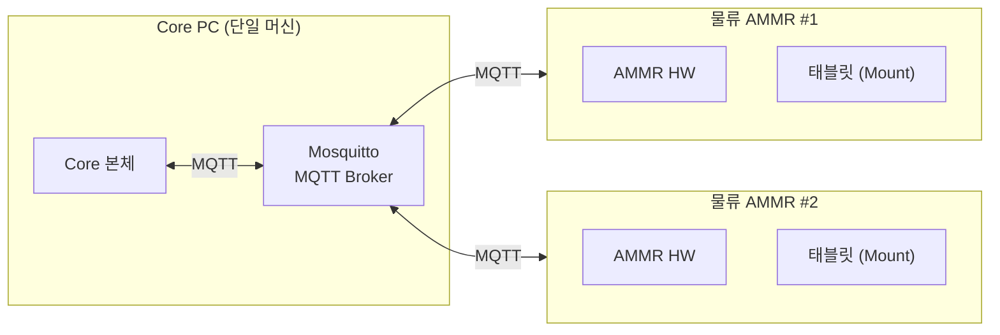

- **Core PC** — Core 본체 프로세스(ASP.NET Core)와 Mosquitto Broker가 같은 PC에서 운영된다.
- **물류 AMMR** — 현재 2대 운영. 추후 증설 가능성 있음. 각 AMMR은 Broker에 클라이언트로 접속한다.
- **태블릿** — AMMR 1대당 1대가 본체에 Mount된다. AMMR과 함께 Core와 MQTT로 통신하는 단말이며 별도 통신 채널이 없다. 적재 상태·배정 상태·상단 정보 등 시스템 권위 표시 정보는 Core가 회신 메시지(C-2·C-3·C-4·C-6·C-7)로 내려준다.
- **연결 망** — 사내 내부망 한정. 외부 인터넷 노출 없음.

### 2.2 Core와 AMMR의 역할 분담

| 영역                                   | 주체     | 비고                                                          |
|----------------------------------------|----------|---------------------------------------------------------------|
| Job 결정 (Move/Pickup/Dropoff/Charge) | Core     | 이송 요청을 Job Sequence로 전개하여 한 Job씩 지시             |
| Job 물리 수행                          | AMMR HW  | 자율 주행, Pickup·Dropoff 동작, 도킹·충전 등                  |
| Job 지시 수신 보고                     | AMMR HW  | Core Job 지시 수신 직후 즉시                                 |
| Job 수행 결과 보고                     | AMMR HW  | Job 종료 시 통합 보고                                         |
| AMMR HW 상태 보고                      | AMMR HW  | 초기 연결 일괄 + 상태 전이 시점                              |
| Slot 점유 Sensor 보고                  | AMMR HW  | 초기 연결 일괄 + 외부 원인 전이 시 1 Slot                    |
| 위치·BMS 스트리밍                     | AMMR HW  | 위치 1초·BMS 10초 주기                                        |
| Unit 식별 (Unit ID 확정)              | Core     | AMMR은 Unit ID를 알지 못함. 점유 신호만 보고하고, Slot의 Unit 정보는 Core가 표시 회신으로 내려줌 |
| 태블릿 표시 데이터 (적재·배정·상단 정보)   | Core     | AMMR 보고(Slot 변동·Job 결과·상태 전이·일괄 보고·재로드)에 대한 회신 메시지로 제공 (§5.2)   |
| 충전 중단 결정                         | AMMR HW / Core | 자체 임계 도달 시 자율 중단은 AMMR HW. 단, 충전 중 Core가 Job을 지시하면 AMMR은 충전을 중단하고 이탈 후 수행 (§8.4) |

### 2.3 AMMR HW ↔ Core 권위 분담

다음 표는 어떤 데이터를 어느 쪽이 권위로 갖는지를 정리한다. AMMR HW가 권위인 데이터는 AMMR이 Core에 보고하고, Core가 권위인 데이터는 Core가 자체 판정 후 회신 메시지로 내려주거나 운영에 사용한다.

| 항목                                          | 권위 매체           | 비고                                                                       |
|-----------------------------------------------|---------------------|----------------------------------------------------------------------------|
| 위치 (x, y, a) 스트리밍                       | AMMR HW             | 1초 주기 (AMMR HW 설정 가변)                                              |
| AMMR HW 상태 전이                             | AMMR HW             | 8종 — `move`/`pickup`/`dropoff`/`charge`/`idle`/`charging`/`low_battery`/`error` (§부록 A.1) |
| Slot 점유 Sensor (6 Slot)                    | AMMR HW             | 초기 일괄 또는 외부 원인 전이 시 1 Slot                                   |
| Job 지시 수신                                 | AMMR HW             | Core Job 지시 수신 즉시 보고                                              |
| Job 수행 결과 (Move/Pickup/Dropoff/Charge)   | AMMR HW             | Job 종료 시 통합 보고                                                     |
| Battery (raw % 스트리밍)                       | AMMR HW             | 10초 주기                                                                  |
| Battery 자체 임계 (저전력 진입·대기 복귀)      | AMMR HW             | AMMR이 보유·태블릿 설정 화면에서 변경 (기본값: 저전력 20% / 대기 80%). §8.3 자율 충전 판단 기준 |
| Battery 저전력 분류 (Core 운영 판단)           | Core (자체 판정)    | Core가 수신한 Battery raw %를 자체 기준으로 분류 — AMMR이 별도 보고하지 않고, Core도 분류 결과를 AMMR에 전달하지 않음 |
| Unit ID                                       | Core (자체 판정)    | AMMR은 Unit ID를 알지 못함. Slot의 Unit 정보는 Core가 회신으로 내려줌     |
| 태블릿 표시 데이터 (Unit 정보·Job 배정·시스템 상태) | Core          | AMMR 보고에 대한 회신 (§5.2 C-2·C-3·C-4·C-6·C-7)                 |
| 충전 스테이션 위치                            | AMMR HW             | 태블릿 설정 화면의 충전 스테이션 번호가 단일 소스. Core는 충전 스테이션을 지정·보유하지 않음 (§8.5) |
| Job 결정                                      | Core                | AMMR은 Core 지시를 수행                                                   |

---

## 3. 통신 아키텍처

### 3.1 프로토콜

Core와 AMMR은 **MQTT v5.0** 으로 통신한다.

- Broker: **Eclipse Mosquitto** (Core PC에 함께 운영)
- Core, AMMR 양측 모두 Broker에 클라이언트로 접속해 Publish/Subscribe 방식으로 통신한다.
- AMMR HW 단절은 MQTT Last Will로 Core가 인지한다.

### 3.2 연결 구조

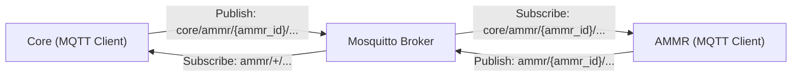

- **AMMR** — 자기 `ammr_id` 기준 Topic을 publish하고, Core가 자기에게 내리는 Topic(`core/ammr/{ammr_id}/#`)을 subscribe한다.
- **Core** — 모든 AMMR의 Topic을 wildcard subscribe하고, 특정 AMMR에게만 publish한다.

### 3.3 Topic 명명 규약

`{ammr_id}`는 AMMR 식별자다. 형식은 `ammr-001`, `ammr-002` 형태의 문자열이며, 값은 운영(설치) 시점에 Core 측이 할당한다.

#### AMMR → Core (AMMR이 publish, Core가 subscribe)

| Topic                              | 내용                    |
|-----------------------------------|-------------------------|
| `ammr/{ammr_id}/state/snapshot`   | 일괄 보고 (초기 연결·재요청 수신 시) |
| `ammr/{ammr_id}/state/hw`         | AMMR HW 상태 전이       |
| `ammr/{ammr_id}/state/slot`       | Slot 점유 Sensor 변화   |
| `ammr/{ammr_id}/telemetry/pose`   | 위치 스트리밍 (1초)     |
| `ammr/{ammr_id}/telemetry/bms`    | BMS 스트리밍 (10초)      |
| `ammr/{ammr_id}/job/received`     | Job 지시 수신 확인      |
| `ammr/{ammr_id}/job/ack`          | Job 수행 결과 통합 보고 |
| `ammr/{ammr_id}/reload/request`   | 적재 정보 일괄 재로드 요청 |
| `ammr/{ammr_id}/conn`             | 연결 상태 (LWT)         |

#### Core → AMMR (Core가 publish, AMMR이 subscribe)

| Topic                                  | 내용              |
|---------------------------------------|-------------------|
| `core/ammr/{ammr_id}/job/cmd`         | Job 지시 (단건)  |
| `core/ammr/{ammr_id}/display/slot`    | Slot 변동 표시 회신 |
| `core/ammr/{ammr_id}/display/job`     | Job 결과 표시 회신 |
| `core/ammr/{ammr_id}/display/state`   | AMMR 상태 표시 회신 |
| `core/ammr/{ammr_id}/display/snapshot` | 일괄 표시 회신 |
| `core/ammr/{ammr_id}/reload/result`   | 적재 정보 일괄 재로드 응답 |
| `core/ammr/{ammr_id}/state/request`   | 일괄 보고 재전송 요청 |

`display/*` Topic들은 태블릿 표시용 회신 계열이고, `reload/*` Pair는 적재 정보 일괄 재로드의 요청·응답이며, `state/request`는 일괄 보고(A-1) 재발행을 요청하는 Core 요청이다.

### 3.4 QoS / Retained / Last Will

#### QoS

| Topic                              | 분류                    | QoS  | 근거                                              |
|-----------------------------------|-------------------------|------|---------------------------------------------------|
| `ammr/{ammr_id}/state/snapshot`   | 일괄 보고               | 1    | 연결 직후 운영 상태 재구축의 입력                  |
| `ammr/{ammr_id}/state/hw`         | AMMR HW 상태 전이       | 1    | 단발성. 누락 시 운영 정합성 깨짐                  |
| `ammr/{ammr_id}/state/slot`       | Slot 점유 Sensor 변화   | 1    | 정합성 판정 입력으로 누락 시 위험                 |
| `ammr/{ammr_id}/telemetry/pose`   | 위치 스트리밍 (1초)     | 0    | 연속값. 1건 누락이 운영에 영향 없음               |
| `ammr/{ammr_id}/telemetry/bms`    | BMS 스트리밍 (10초)      | 0    | 연속값. 임계 통과는 다음 보고에서 즉시 표면화     |
| `ammr/{ammr_id}/job/received`     | Job 지시 수신 확인      | 1    | 수신 진단·책임 분리                                |
| `ammr/{ammr_id}/job/ack`          | Job 수행 결과 통합 보고 | 1    | 결과 누락 시 Job 종료 판정 불가                   |
| `ammr/{ammr_id}/reload/request`   | 재로드 요청             | 1    | 담당자 조치의 입력. 누락 시 회복 지연             |
| `ammr/{ammr_id}/conn`             | 연결 상태 (LWT)         | 1    | Retained로 늦은 접속에서도 단절 인지               |
| `core/ammr/{ammr_id}/job/cmd`     | Job 지시                | 1    | 미수신 시 운영 중단. `job_id` 멱등                |
| `core/ammr/{ammr_id}/display/slot` | Slot 변동 표시 회신    | 1    | 태블릿 표시 정합                                  |
| `core/ammr/{ammr_id}/display/job` | Job 결과 표시 회신      | 1    | 태블릿 표시 정합                                  |
| `core/ammr/{ammr_id}/display/state` | AMMR 상태 표시 회신    | 1    | 태블릿 상단 표시 정합                             |
| `core/ammr/{ammr_id}/display/snapshot` | 일괄 표시 회신      | 1    | 재연결 직후 태블릿 화면 회복                      |
| `core/ammr/{ammr_id}/reload/result` | 재로드 응답           | 1    | 담당자 조치의 결과. 누락 시 회복 지연             |
| `core/ammr/{ammr_id}/state/request` | 일괄 보고 재전송 요청 | 1    | 미수신 시 Core 운영 상태 재구축 불가              |

#### Retained

- `ammr/{ammr_id}/conn` 만 **Retained = true** 로 발행한다 — `online`은 AMMR이 CONNECT 직후 직접 발행하고, `offline`은 비정상 단절 시 Broker가 LWT로 자동 발행하거나 정상 종료·운영자 명시 해제 시 AMMR이 DISCONNECT 전에 직접 발행한다. Core가 늦게 접속해도 마지막 연결 상태를 즉시 인지한다.
- 그 외 모든 Topic은 Retained = false.

#### Last Will

AMMR은 CONNECT 시 다음 LWT를 등록한다.

- **Topic**: `ammr/{ammr_id}/conn`
- **Payload**: `{"ammr_id": "ammr-001", "timestamp": "<CONNECT 시점>", "status": "offline", "reason": "broker_disconnect"}` — 공통 필드 포함. LWT payload는 CONNECT 시점에 등록되어 Broker가 그대로 발행하므로 `timestamp`는 발행 시점이 아니라 등록(CONNECT) 시점 값이다 (§3.5 공통 필드 규칙의 명시 예외)
- **QoS**: 1
- **Retained**: true
- **Will Delay Interval**: 10초 (순단 유예·§3.6)

AMMR HW와 Broker의 연결이 Keep Alive 임계 초과로 끊어지면 Broker가 자동 발행한다.

### 3.5 Payload 인코딩·공통 필드

모든 Payload는 **JSON (UTF-8)** 이다. 운영 부하 수준(AMMR 2대·초당 수십 건 이하 메시지)에서 인코딩 비용 부담이 없고, 디버깅·Log 가독성이 높다.

모든 Payload는 다음 공통 필드를 포함한다.

| 필드          | 타입    | 필수 | 설명                                                              |
|---------------|---------|------|-------------------------------------------------------------------|
| `ammr_id`     | string  | 필수 | AMMR 식별자 (예: `ammr-001`)                                      |
| `timestamp`   | string  | 필수 | KST 현지시각 (예: `2026-07-10 07:30:00.123`) — 발행 시점         |
| `msg_id`      | string  | 선택 | 메시지 고유 ID (UUID). 추적·디버깅 용도                           |

위 공통 필드는 이하 메시지 상세 정의에서 매번 반복 표기하지 않고, **메시지별 고유 필드만** 명시한다. 유일한 예외는 LWT payload다 — CONNECT 시점에 등록되는 고정 payload라 `timestamp`가 발행 시점이 아니라 등록 시점 값이다 (§3.4).

모든 `timestamp`는 KST(UTC+9) 기준 현지시각이며, 시간대 오프셋 없이 `YYYY-MM-DD HH:MM:SS.mmm` 형식으로 전달한다 (예: `2026-07-10 07:30:00.123`).

한글 값을 담는 표시 필드(§5.2 회신 계열의 시스템 상태·출발/도착 라벨)는 UTF-8 문자열 그대로 전달되며, 태블릿은 이 값을 가공 없이 표시한다.

### 3.6 연결 수명 주기

#### 정상 시나리오

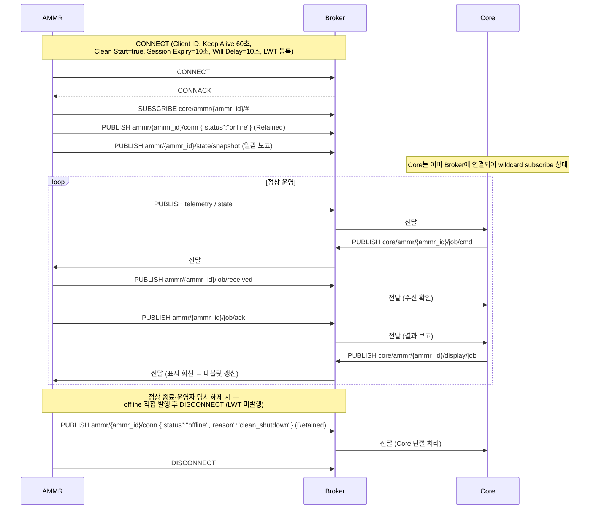

#### 비정상 단절 시나리오

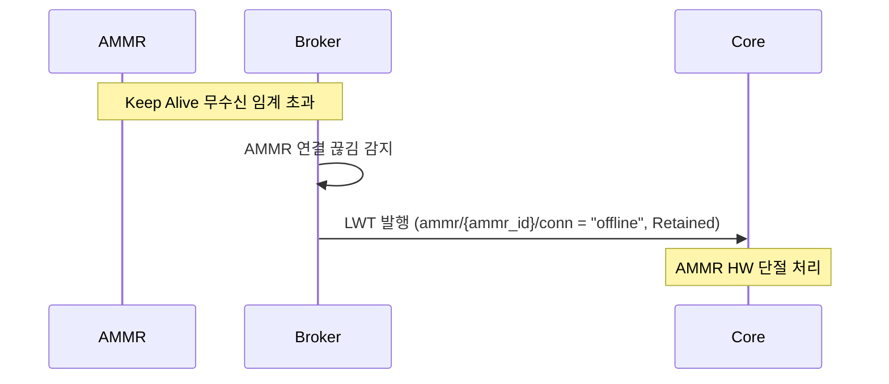

#### 핵심 파라미터

| 항목                            | 확정값  | 비고                                                  |
|---------------------------------|---------|-------------------------------------------------------|
| MQTT Keep Alive                | 60초    | AMMR PINGREQ 주기 (Mosquitto 기본)                    |
| Broker 측 단절 감지             | 90초    | Keep Alive × 1.5 (MQTT 표준 권장)                     |
| Clean Start / Session Expiry   | true / 10초 | 재접속 Clean Start=true로 세션 폐기 — 큐된 옛 Job 미배달. Session Expiry 10초는 Will Delay 유효 구간. 아래 근거 참조 |
| Will Delay Interval            | 10초    | LWT(offline) 발행을 유예 — 순단 후 유예 내 재접속하면 미발행(불필요한 단절 처리 회피). 조정 가능 |
| Client ID                      | `{ammr_id}` | 유일성 보장                                       |
| Broker 접속                    | 기본 포트 1883 (평문 MQTT·Mosquitto 기본) | 실제 접속 정보(IP·포트·자격증명)는 설치 시 Core 측이 제공하며, 담당자가 태블릿 설정 화면에 입력한다 |

**Clean Start=true·Session Expiry=10초·Will Delay=10초 근거**: 재접속 시 Clean Start=true로 세션을 폐기하므로 단절 중 Broker에 쌓인 옛 Job 지시가 뒤늦게 배달될 위험을 원천 차단한다. AMMR은 재연결할 때마다 SUBSCRIBE를 다시 수행하고 일괄 보고(A-1)를 재발행한다(§7.4). Will Delay Interval 10초는 짧은 통신 순단이 유예 내 재연결로 복구될 때 LWT(offline) 발행을 억제해 불필요한 단절 처리를 막으며, Session Expiry 10초는 이 유예가 유효하게 작동하도록 세션을 유지하는 구간이다.

#### AMMR CONNECT 설정 (필수)

AMMR은 매 CONNECT 시 다음을 설정한다 — Client ID = `{ammr_id}` · Clean Start = true · Session Expiry Interval = 10초 · Will Delay Interval = 10초(LWT) · Keep Alive = 60초 · LWT 등록(§3.4). 모두 Core 확정값이며 AMMR이 임의로 바꾸지 않는다. 세션·메시지 전달 의미에 영향을 주는 미명시 옵션(예: Message Expiry Interval)은 사용하지 않는다.

### 3.7 수신 확인 원칙

수신 확인 유무는 메시지 역할에 따라 나뉜다.

| 메시지                                   | 역할        | 수신 확인                                                        |
|------------------------------------------|-------------|-------------------------------------------------------------------|
| C-1 Job 지시                             | Core 명령   | 있음 — AMMR이 `job/received`로 즉시 확인. Core는 3초 안 미도달 시 AMMR HW 단절 처리 (§7.3) |
| C-5 일괄 보고 재전송 요청                | Core 요청   | 있음 — 별도 확인 메시지 없이 일괄 보고(A-1) 도착 자체가 확인. 3초(§7.3) 안 미도달 시 Core는 재요청할 수 있으며, 해당 AMMR은 일괄 보고 도착까지 신규 작업 대상에서 제외된다 |
| C-2·C-3·C-6·C-7 표시 회신 / C-4 재로드 응답 | Core 응답   | 없음 — QoS 1 전달 보증만. 표시가 어긋나면 적재 정보 일괄 재로드(§6.5)로 회복 |
| A-1~A-8 보고 (A-6 포함)                  | AMMR 보고   | 없음 — Core가 별도 확인 메시지를 보내지 않음 (QoS 보증만). A-6은 그 자체가 C-1의 수신 확인이며 그에 대한 별도 확인은 없다 |
| A-9 재로드 요청                          | AMMR 요청   | 응답 = C-4 재로드 응답. 3초 내 미도착 시 태블릿이 실패 처리(메시지 박스)·담당자 재시도  |

**주의**: AMMR 보고(A-1·A-2·A-3·A-7)에 뒤따르는 표시 회신(C-7·C-6·C-2·C-3)은 수신 확인이 아니라 태블릿 표시 데이터 응답이다. 회신이 도착하지 않아도 AMMR 측 재발행 의무는 없다.

---

## 4. 메시지 카탈로그

이 절은 양방향 메시지 전체 목록을 요약한다. 상세 Payload 구조는 §5에서 정의한다.

### 4.1 AMMR → Core

| #   | Topic                              | 메시지 이름             | Trigger                                       | 주기·발행 조건            |
|-----|-----------------------------------|-------------------------|----------------------------------------------|---------------------------|
| A-1 | `ammr/{ammr_id}/state/snapshot`   | 일괄 보고               | MQTT CONNECT 직후 / 일괄 보고 재전송 요청(C-5) 수신 시 / 주기 자동(기본 60초·태블릿 설정) | 발생 시점·주기 60초       |
| A-2 | `ammr/{ammr_id}/state/hw`         | AMMR HW 상태 전이       | 상태 전이 시점 (Job 종료 보고에 실리는 전이 제외 — §5.1 A-2) | 전이 시점 Event |
| A-3 | `ammr/{ammr_id}/state/slot`       | Slot 점유 Sensor 변화   | 외부 원인 Slot ON↔OFF 전이 시점              | 전이 시점 Event (1 Slot) |
| A-4 | `ammr/{ammr_id}/telemetry/pose`   | 위치 스트리밍           | 주기                                          | 1초 (HW 설정 가변)        |
| A-5 | `ammr/{ammr_id}/telemetry/bms`    | BMS 스트리밍            | 주기                                          | 10초 (HW 설정 가변)        |
| A-6 | `ammr/{ammr_id}/job/received`     | Job 지시 수신 확인      | Core Job 지시 수신 직후                       | 수신 시점 Event          |
| A-7 | `ammr/{ammr_id}/job/ack`          | Job 수행 결과 통합 보고 | Job 종료 시점                                 | Job 종료 Event           |
| A-8 | `ammr/{ammr_id}/conn`             | 연결 상태 (LWT)         | 연결 시 AMMR 발행 / 비정상 단절 시 Broker LWT 자동 발행 / 정상 종료·명시 해제 시 AMMR 직접 발행  | 발생 시점                 |
| A-9 | `ammr/{ammr_id}/reload/request`   | 적재 정보 일괄 재로드 요청 | 담당자가 태블릿에서 [Slot별 적재 정보 재로드] 실행 | 실행 시점 Event    |

### 4.2 Core → AMMR

| #   | Topic                              | 메시지 이름   | Trigger          | 주기·발행 조건 |
|-----|-----------------------------------|---------------|-----------------|----------------|
| C-1 | `core/ammr/{ammr_id}/job/cmd`     | Job 지시      | Job 결정 시점   | Job 단위       |
| C-2 | `core/ammr/{ammr_id}/display/slot` | Slot 변동 표시 회신 | Slot 점유 Sensor 변화(A-3) 수신 시 | 수신 처리 시점 |
| C-3 | `core/ammr/{ammr_id}/display/job` | Job 결과 표시 회신 | Job 수행 결과 통합 보고(A-7) 수신 시 | 수신 처리 시점 |
| C-4 | `core/ammr/{ammr_id}/reload/result` | 적재 정보 일괄 재로드 응답 | 재로드 요청(A-9) 수신 시 | 수신 처리 시점 |
| C-5 | `core/ammr/{ammr_id}/state/request` | 일괄 보고 재전송 요청 | Core 측 통신 재연결·Core 재시작 복구 시점 | 발생 시점 |
| C-6 | `core/ammr/{ammr_id}/display/state` | AMMR 상태 표시 회신 | AMMR HW 상태 전이(A-2) 수신 시 | 수신 처리 시점 |
| C-7 | `core/ammr/{ammr_id}/display/snapshot` | 일괄 표시 회신 | 일괄 보고(A-1) 수신 시 | 수신 처리 시점 |

Job 지시는 단일 Topic에서 `job_type` 필드로 4종(Move/Pickup/Dropoff/Charge)을 구분한다. C-2·C-3·C-4·C-6·C-7은 태블릿 표시 데이터를 내려주는 회신 계열이다 — AMMR은 이 payload를 태블릿 적재 상태·배정 상태·상단 정보 영역 갱신에 사용한다.

---

## 5. 메시지 상세 정의

각 메시지는 **공통 필드(§3.5)** 외에 다음 고유 필드를 갖는다. 필드 타입은 §부록 A 참고. `slot_index`는 0–5이며, 태블릿 화면의 Slot 번호 1–6은 `slot_index + 1`로 표시된다.

### 5.1 AMMR → Core 메시지

#### A-1. 일괄 보고

- **Topic**: `ammr/{ammr_id}/state/snapshot`
- **Trigger**: ① AMMR이 Broker에 CONNECT 한 직후 1회 ② Core의 일괄 보고 재전송 요청(C-5) 수신 시 1회 ③ 주기 자동 발행 (기본 60초·태블릿 설정값으로 조정)
- **목적**: Core가 해당 AMMR의 운영 상태(HW 상태·위치·6 Slot 점유·Battery)를 일괄 재구축하기 위한 입력
- **회신**: Core는 이 보고를 처리한 뒤 6 Slot 전체 표시 정보를 일괄 표시 회신(C-7)으로 내려준다

| 필드           | 타입               | 필수 | 설명                                                       |
|----------------|--------------------|------|------------------------------------------------------------|
| `hw_state`     | enum (§부록 A.1) | 필수 | 현재 AMMR HW 상태                                          |
| `pose`         | object             | 필수 | `{x: float, y: float, a: float}` — 현재 위치 + 방향각      |
| `slots`        | array[6]           | 필수 | 6 Slot 각각의 점유 정보 (아래 구조)                       |
| `battery`      | object             | 필수 | A-5 BMS 메시지의 필드 구조와 동일 (§부록 A.5 참조)        |

`slots` 항목 구조:

| 필드           | 타입         | 필수 | 설명                                                |
|----------------|--------------|------|-----------------------------------------------------|
| `slot_index`   | integer 0–5  | 필수 | Slot 번호                                           |
| `occupied`     | boolean      | 필수 | Slot Sensor ON/OFF                                  |

**예시 JSON**

```json
{
  "ammr_id": "ammr-001",
  "timestamp": "2026-07-10 07:30:00.123",
  "hw_state": "idle",
  "pose": { "x": 12.5, "y": 3.7, "a": 1.57 },
  "slots": [
    { "slot_index": 0, "occupied": true },
    { "slot_index": 1, "occupied": false },
    { "slot_index": 2, "occupied": false },
    { "slot_index": 3, "occupied": false },
    { "slot_index": 4, "occupied": false },
    { "slot_index": 5, "occupied": false }
  ],
  "battery": { "soc": 87.3, "voltage": 50.1, "current": -2.1, "temperature": 28.5, "bmu_error": false, "battery_id": "BAT_A01" }
}
```

#### A-2. AMMR HW 상태 전이

- **Topic**: `ammr/{ammr_id}/state/hw`
- **Trigger**: AMMR HW 상태 전이 시점. **일반 규칙 — Job 수행 결과 통합 보고(A-7)에 실려 보고되는 전이(Job 종료 시점 전이)를 제외한 모든 상태 전이는 이 메시지로 보고한다.** Job 종료 전이를 이 메시지로 중복 발행하지 않는다.
- **회신**: Core는 이 보고를 처리한 뒤 AMMR 상태 표시 회신(C-6)을 내려준다.

전이별 보고 경로:

| 전이                                                        | 보고 경로 |
|--------------------------------------------------------------|-----------|
| Job 시작 (`idle → move/pickup/dropoff/charge`, 충전 중 Job 지시 수신 시 `charging → move` 등) | A-2 |
| Job 종료 (`move → idle`, `pickup → idle`, `dropoff → idle`, `charge → charging`(도킹) 등 — Job 종료 직후 상태) | A-7 `hw_state` 필드 (A-2 중복 발행 금지) |
| 충전 완료 (`charging → idle`)                                | A-2 |
| 저전력 진입 (`→ low_battery`)                                | A-2 (Job 종료와 동시 진입한 경우 A-7의 `hw_state = low_battery`로 보고·A-2 중복 발행 금지) |
| 저전력 자율 충전 도킹 (`low_battery → charging`)             | A-2 |
| 장애 진입 (`→ error`, Job 수행 중이 아닐 때 — 자기 진단 실패 등) | A-2 (Job 수행 중 장애는 A-7의 `hw_state = error`로 보고) |
| 장애 복구 (`error → idle`)                                   | A-2 |

| 필드          | 타입               | 필수 | 설명                                       |
|---------------|--------------------|------|--------------------------------------------|
| `hw_state`    | enum (§부록 A.1) | 필수 | 전이 후 상태                               |
| `prev_state`  | enum (§부록 A.1) | 선택 | 전이 전 상태 (디버깅 용도)                |
| `reason`      | string             | 선택 | 전이 사유 — 자유 문자열 (예: `self_diagnostic_failed`). Job 실패 Reason 코드(§부록 A.4)와는 별개 층위 |

**예시**: 충전 중 → 대기 자연 전이 (충전 완료)

```json
{
  "ammr_id": "ammr-001",
  "timestamp": "2026-07-10 07:35:12.456",
  "hw_state": "idle",
  "prev_state": "charging"
}
```

#### A-3. Slot 점유 Sensor 변화

- **Topic**: `ammr/{ammr_id}/state/slot`
- **Trigger**: 외부 원인(사람 개입 등)으로 Slot ON↔OFF 전이 시 1 Slot 단위 보고
- **주의**: Pickup·Dropoff Job 수행에 따른 Slot 변화는 이 메시지가 아닌 **Job 수행 결과 통합 보고(A-7)** payload에 포함되어 보고된다 (중복 보고 금지).
- **회신**: Core는 이 보고를 처리한 뒤 해당 Slot의 표시 정보를 Slot 변동 표시 회신(C-2)으로 내려준다.

| 필드           | 타입         | 필수 | 설명                                              |
|----------------|--------------|------|---------------------------------------------------|
| `slot_index`   | integer 0–5  | 필수 | 전이 Slot 번호                                    |
| `occupied`     | boolean      | 필수 | 전이 후 ON/OFF                                    |

**예시**

```json
{
  "ammr_id": "ammr-001",
  "timestamp": "2026-07-10 07:40:23.789",
  "slot_index": 2,
  "occupied": true
}
```

#### A-4. 위치 스트리밍

- **Topic**: `ammr/{ammr_id}/telemetry/pose`
- **Trigger**: 1초 주기 (AMMR HW 설정 가변)
- **QoS**: 0 (연속값, 1건 누락 허용)

| 필드 | 타입  | 필수 | 설명                       |
|------|-------|------|----------------------------|
| `x`  | float | 필수 | x 좌표 (단위: m)          |
| `y`  | float | 필수 | y 좌표 (단위: m)          |
| `a`  | float | 필수 | 방향각 (단위: rad, 0~2π)  |

좌표·방향각 단위는 이 위치 스트리밍 전용이다 (§부록 A.6). Job 지시의 목적지는 좌표가 아니라 논리 지점 라벨이다 (§5.2 C-1).

**예시**

```json
{
  "ammr_id": "ammr-001",
  "timestamp": "2026-07-10 07:40:24.000",
  "x": 12.51,
  "y": 3.72,
  "a": 1.58
}
```

#### A-5. BMS 스트리밍

- **Topic**: `ammr/{ammr_id}/telemetry/bms`
- **Trigger**: 10초 주기 (AMMR HW 설정 가변)
- **QoS**: 0

| 필드           | 타입    | 필수 | 설명                                          |
|----------------|---------|------|-----------------------------------------------|
| `battery_id`   | string  | 필수 | Battery 팩 식별값                              |
| `soc`          | float   | 필수 | 충전 상태 (%, 0.0–100.0)                     |
| `voltage`      | float   | 필수 | 전압 (V)                                      |
| `current`      | float   | 필수 | 전류 (A) — 충전 시 양수, 방전 시 음수        |
| `temperature`  | float   | 필수 | 온도 (°C)                                     |
| `bmu_error`    | boolean | 필수 | BMU 오류 발생 여부                            |

**예시**

```json
{
  "ammr_id": "ammr-001",
  "timestamp": "2026-07-10 07:40:25.000",
  "battery_id": "BAT_A01",
  "soc": 87.1,
  "voltage": 50.0,
  "current": -2.0,
  "temperature": 28.6,
  "bmu_error": false
}
```

#### A-6. Job 지시 수신 확인

- **Topic**: `ammr/{ammr_id}/job/received`
- **Trigger**: AMMR이 `core/ammr/{ammr_id}/job/cmd` 수신 직후 1회
- **목적**: Core가 AMMR 수신 여부 확인. 수신 확인 미수신 = 통신 문제 / 수신 확인 도달 + 결과 보고 늦음 = AMMR HW 문제 — 책임 분리

| 필드     | 타입          | 필수 | 설명                              |
|----------|---------------|------|-----------------------------------|
| `job_id` | string (UUID) | 필수 | Core 지시의 `job_id`              |

**예시**

```json
{
  "ammr_id": "ammr-001",
  "timestamp": "2026-07-10 07:41:55.123",
  "job_id": "8c4f1b2e-5a3d-4f7c-9e80-6b1a2d3c4e5f"
}
```

#### A-7. Job 수행 결과 통합 보고

- **Topic**: `ammr/{ammr_id}/job/ack`
- **Trigger**: Job 종료 시점 (Move/Pickup/Dropoff/Charge 각 종료)
- **핵심**: 이 메시지는 Job 수행 결과를 통합 보고하는 단일 메시지이다. payload 분기는 §7.2 참조.
- **회신**: Core는 이 보고를 처리한 뒤 Job 결과 표시 회신(C-3)을 내려준다.

| 필드                 | 타입               | 필수    | 설명                                                         |
|----------------------|--------------------|---------|--------------------------------------------------------------|
| `job_id`             | string (UUID)      | 필수    | 대응되는 Job 지시의 `job_id`                                 |
| `job_type`           | enum (§부록 A.2) | 필수    | Move / Pickup / Dropoff / Charge                            |
| `hw_state`           | enum (§부록 A.1) | 필수    | Job 종료 직후 AMMR HW 상태. 이 필드에 실린 전이는 A-2로 중복 발행하지 않는다 (§5.1 A-2). Charge Job은 도킹 완료 시점 보고라 `charging` |
| `job_result`         | enum (§부록 A.3) | 필수    | `success` / `failure`                                       |
| `reason`             | enum (§부록 A.4) | 조건부 | `job_result = failure` 시 필수 (`ammr_hw_*` 또는 `slot_*`)  |
| `slot`               | object             | 조건부 | Pickup·Dropoff 시 필수. 대상 AMMR Slot의 Sensor 상태. 구조 아래. |

`slot` 구조 (Pickup·Dropoff Job에 한정):

| 필드           | 타입         | 필수 | 설명                                          |
|----------------|--------------|------|-----------------------------------------------|
| `slot_index`   | integer 0–5  | 필수 | 대상 AMMR Slot 번호                           |
| `occupied`     | boolean      | 필수 | Pickup 성공 시 true, Dropoff 성공 시 false  |

**예시**: Pickup 성공

```json
{
  "ammr_id": "ammr-001",
  "timestamp": "2026-07-10 07:42:11.234",
  "job_id": "9d5a44e2-6b7f-4c3a-9e21-8d0f5b6a7c43",
  "job_type": "pickup",
  "hw_state": "idle",
  "job_result": "success",
  "slot": {
    "slot_index": 1,
    "occupied": true
  }
}
```

**예시**: Pickup 실패 (Slot 측 사유 — 출발 Slot 비어 있음)

```json
{
  "ammr_id": "ammr-001",
  "timestamp": "2026-07-10 07:42:11.234",
  "job_id": "9d5a44e2-6b7f-4c3a-9e21-8d0f5b6a7c43",
  "job_type": "pickup",
  "hw_state": "idle",
  "job_result": "failure",
  "reason": "slot_source_empty",
  "slot": {
    "slot_index": 1,
    "occupied": false
  }
}
```

**예시**: AMMR HW 장애 (모든 Job 결과에 적용 가능)

```json
{
  "ammr_id": "ammr-001",
  "timestamp": "2026-07-10 07:42:11.234",
  "job_id": "8c4f1b2e-5a3d-4f7c-9e80-6b1a2d3c4e5f",
  "job_type": "move",
  "hw_state": "error",
  "job_result": "failure",
  "reason": "ammr_hw_navigation_lost"
}
```

#### A-8. 연결 상태 (LWT)

- **Topic**: `ammr/{ammr_id}/conn`
- **Trigger (online)**: AMMR이 CONNECT 직후 직접 publish
- **Trigger (offline — 비정상 단절)**: AMMR HW와 Broker 연결 끊김 시 Broker가 LWT 자동 발행 (`reason = broker_disconnect`)
- **Trigger (offline — 정상 종료)**: AMMR 정상 종료·운영자가 태블릿에서 시스템 연결을 명시적으로 해제하는 경우, AMMR이 DISCONNECT 전에 직접 publish (`reason = clean_shutdown`). Core는 어느 offline이든 AMMR HW 단절과 동일하게 처리하며, 재연결은 초기 연결 흐름(§6.1)과 동일하다
- **Retained**: true (Core가 늦게 접속해도 즉시 인지)

| 필드     | 타입   | 필수 | 설명                                                           |
|----------|--------|------|----------------------------------------------------------------|
| `status` | enum   | 필수 | `online` / `offline`                                          |
| `reason` | string | 선택 | `offline`일 때 사유 (예: `broker_disconnect`, `clean_shutdown`)|

**예시**: 정상 연결

```json
{
  "ammr_id": "ammr-001",
  "timestamp": "2026-07-10 07:30:00.000",
  "status": "online"
}
```

**예시**: LWT (Broker 자동 발행 — `timestamp`는 등록(CONNECT) 시점 값·§3.4)

```json
{
  "ammr_id": "ammr-001",
  "timestamp": "2026-07-10 07:30:00.000",
  "status": "offline",
  "reason": "broker_disconnect"
}
```

**예시**: 정상 종료·운영자 명시 해제 (AMMR 직접 발행)

```json
{
  "ammr_id": "ammr-001",
  "timestamp": "2026-07-10 18:00:00.000",
  "status": "offline",
  "reason": "clean_shutdown"
}
```

#### A-9. 적재 정보 일괄 재로드 요청

- **Topic**: `ammr/{ammr_id}/reload/request`
- **Trigger**: 담당자가 태블릿 설정 화면에서 [Slot별 적재 정보 재로드]를 실행한 시점 (시스템 연결이 유효한 동안에만 실행 가능)
- **목적**: 6 Slot 전체의 Sensor 상태와 담당자가 입력한 Unit UUID를 Core에 일괄 전달하여, Slot별 적재 정보를 다시 맞춘다. 주로 통신 단절 중 사람이 AMMR Slot의 Unit을 임의로 다룬 뒤 재연결 시점에 상태를 다시 맞추는 데 쓴다.
- **응답**: Core는 Slot별 결과를 적재 정보 일괄 재로드 응답(C-4)으로 일괄 회신한다.

| 필드    | 타입     | 필수 | 설명                                          |
|---------|----------|------|-----------------------------------------------|
| `slots` | array[6] | 필수 | 6 Slot 전체 (부분 전송 없음). 항목 구조 아래. |

`slots` 항목 구조:

| 필드           | 타입          | 필수 | 설명                                                           |
|----------------|---------------|------|----------------------------------------------------------------|
| `slot_index`   | integer 0–5   | 필수 | Slot 번호                                                      |
| `occupied`     | boolean       | 필수 | 현재 Slot Sensor ON/OFF                                        |
| `unit_uuid`    | string\|null  | 필수 | 담당자가 입력한 QR 식별값 (해당 Slot 적재 Unit의 Tray QR 값 — 가상 키보드 또는 QR 리딩 입력. 입력 박스가 비어 있으면 null) |

**예시**

```json
{
  "ammr_id": "ammr-001",
  "timestamp": "2026-07-10 09:12:00.000",
  "slots": [
    { "slot_index": 0, "occupied": true,  "unit_uuid": "7f3d9e2a-1b4c-4f8a-9d6e-5c2b3a7e1f8d" },
    { "slot_index": 1, "occupied": false, "unit_uuid": null },
    { "slot_index": 2, "occupied": true,  "unit_uuid": "2e8c4f1d-3a9b-4e7c-8d5f-6a1b2c3d4e5f" },
    { "slot_index": 3, "occupied": false, "unit_uuid": null },
    { "slot_index": 4, "occupied": false, "unit_uuid": null },
    { "slot_index": 5, "occupied": false, "unit_uuid": null }
  ]
}
```

### 5.2 Core → AMMR 메시지

#### C-1. Job 지시

- **Topic**: `core/ammr/{ammr_id}/job/cmd`
- **Trigger**: Core의 Job 결정 시점
- **수신 후 책임**: AMMR은 이 메시지 수신 즉시 `ammr/{ammr_id}/job/received` 로 수신 확인을 보고하고, Job 수행 종료 시점에 `ammr/{ammr_id}/job/ack` 로 결과를 보고한다.
- **멱등성**: AMMR은 동일 `job_id` 중복 수신 시 1회만 처리한다 (QoS 1 중복 가능성 대비).

| 필드             | 타입             | 필수    | 설명                                                          |
|------------------|------------------|---------|---------------------------------------------------------------|
| `job_id`         | string (UUID)    | 필수    | Job 고유 ID. AMMR은 동일 ID로 결과 보고                       |
| `job_type`       | enum (§부록 A.2)| 필수    | Move / Pickup / Dropoff / Charge                             |
| `destination`    | object           | 조건부 | Move 시 필수 / Pickup·Dropoff 없음 (`slot_target.external_location` 사용) / Charge 없음 (아래 참조). 목적지 논리 지점 라벨. 구조 아래. |
| `slot_target`    | object           | 조건부 | Pickup·Dropoff 시 필수. 외부 Slot + AMMR Slot Pair. 구조 아래.|

`destination` 구조:

```jsonc
{ "node_id": "WIP_CLEAN" }
```

**목적지는 좌표가 아니라 논리 지점 라벨이다.** Core는 좌표·경로를 전송하지 않으며, AMMR이 자체 맵으로 라벨의 물리 위치를 해석하고 경로를 결정한다.

- **라벨 형식**: 영문 대문자·숫자·언더스코어로 구성된 문자열. 지점 라벨(예: `WIP_CLEAN` 세척 WIP, `WIP_RESTACK` 되담기 WIP, `CNC01` CNC 1 작업대)과 슬롯 라벨(지점 라벨 + 물리 슬롯 라벨. 예: `WIP_CLEAN_A1`, `CNC01_A2`) 두 층위로 구성된다.
- **사용 층위**: Move의 `destination`은 지점 라벨, Pickup·Dropoff의 `external_location`은 슬롯 라벨을 사용한다.
- **목록 제공**: 전체 라벨 목록(지점·슬롯)은 설치 시 Core 측이 제공하며, AMMR 자체 맵의 물리 위치와 1:1로 매핑해 보유한다.
- **Charge는 `destination` 없음**: 충전 스테이션 위치는 태블릿 설정값이 단일 소스이며 Core가 지정하지 않는다 (§8.5).

`slot_target` 구조 (Pickup·Dropoff Job):

| 필드                  | 타입         | 필수 | 설명                                                           |
|-----------------------|--------------|------|----------------------------------------------------------------|
| `external_location`   | object       | 필수 | 외부 Slot 위치 — `destination`과 동일 구조 (슬롯 라벨)        |
| `ammr_slot_index`     | integer 0–5  | 필수 | Pickup 시 적재할 / Dropoff 시 내릴 AMMR Slot 번호             |

**예시**: Move

```json
{
  "ammr_id": "ammr-001",
  "timestamp": "2026-07-10 07:41:55.000",
  "job_id": "8c4f1b2e-5a3d-4f7c-9e80-6b1a2d3c4e5f",
  "job_type": "move",
  "destination": { "node_id": "WIP_CLEAN" }
}
```

**예시**: Pickup

```json
{
  "ammr_id": "ammr-001",
  "timestamp": "2026-07-10 07:42:00.000",
  "job_id": "9d5a44e2-6b7f-4c3a-9e21-8d0f5b6a7c43",
  "job_type": "pickup",
  "slot_target": {
    "external_location": { "node_id": "WIP_CLEAN_A1" },
    "ammr_slot_index": 1
  }
}
```

**예시**: Dropoff

```json
{
  "ammr_id": "ammr-001",
  "timestamp": "2026-07-10 07:45:00.000",
  "job_id": "ae6b71c9-2d4e-4f8b-a350-6c9d2e1f4b87",
  "job_type": "dropoff",
  "slot_target": {
    "external_location": { "node_id": "CNC02_A1" },
    "ammr_slot_index": 1
  }
}
```

**예시**: Charge (`destination` 없음)

```json
{
  "ammr_id": "ammr-001",
  "timestamp": "2026-07-10 08:10:00.000",
  "job_id": "bf7c93a5-1e6d-4b2f-8a49-3d5e7f0c2b61",
  "job_type": "charge"
}
```

#### 표시 회신 공통 구조 (C-2·C-3·C-4·C-6·C-7)

C-2·C-3·C-4·C-6·C-7은 태블릿 표시 데이터를 내려주는 회신 계열이며, 다음 두 공통 구조를 사용한다. AMMR은 이 값을 태블릿 화면에 가공 없이 표시한다.

`header` 구조 — 태블릿 상단 정보 영역의 시스템 권위 값:

| 필드                 | 타입           | 필수 | 설명                                                          |
|----------------------|----------------|------|---------------------------------------------------------------|
| `system_status`      | string (§부록 A.7) | 필수 | 시스템(Core)이 판단한 AMMR 상태 표시 텍스트 — `Move`/`Pickup`/`Dropoff`/`Charge`/`대기`/`충전 중`/`저전력`/`장애` |
| `active_slot_index`  | integer 0–5\|null | 필수 | 현재 수행 중인 작업이 사용하는 AMMR Slot 번호. 작업이 없으면 null |

`slot_info` 구조 — Slot 1개의 표시 정보:

| 필드            | 타입           | 필수 | 설명                                                          |
|-----------------|----------------|------|---------------------------------------------------------------|
| `slot_index`    | integer 0–5    | 필수 | Slot 번호                                                     |
| `system_status` | string (§부록 A.7) | 필수 | 시스템이 판단한 Slot 상태 표시 텍스트 — `정상` / `정합성 이상` |
| `unit`          | object\|null   | 필수 | 적재 Unit 정보. 비어 있거나 시스템이 Unit을 식별하지 못하면 null. 구조 아래. |
| `job`           | object\|null   | 필수 | 이 Slot에 배정된 Job 정보. 배정이 없으면 null (태블릿은 작업 배정 대기로 표시). 구조 아래. |

`unit` 구조:

| 필드         | 타입    | 필수 | 설명                                                       |
|--------------|---------|------|------------------------------------------------------------|
| `uuid`       | string  | 필수 | 이 Unit의 QR 식별값 (Tray별 유니크 UUID 중 Core가 식별 근거로 보유한 값 — §1.3 Unit UUID). 태블릿 적재 정보 관리 입력 박스의 기본값으로 사용 |
| `label`      | string  | 필수 | `투입코드_유닛번호` 사람 읽기용 표기 (예: `26SF03002-001_001`) — 투입코드 = GM inputCode 원형·유닛번호 = Core 부여 일련번호 (§1.3) |
| `model`      | string  | 필수 | 제품 모델 코드 (예: `H8-MAIN`)                             |
| `version`    | string  | 필수 | 모델 버전 (예: `KM70`)                                     |
| `tray_count` | integer | 필수 | Unit을 구성하는 Tray 단 수                                 |
| `quantity`   | integer | 필수 | Unit 안 제품 개수 (최대 16)                                |

`job` 구조:

| 필드                | 타입   | 필수 | 설명                                                        |
|---------------------|--------|------|-------------------------------------------------------------|
| `source_label`      | string | 필수 | 출발 위치 표시 텍스트 (공정명 + Slot 라벨. 예: `세척 WIP 슬롯 A1`) |
| `destination_label` | string | 필수 | 도착 위치 표시 텍스트 (예: `되담기 WIP 슬롯 B3`)            |

`정합성 이상`인 Slot은 시스템이 해당 Slot을 사용 보류로 판단했다는 의미이며, 이때 `unit`·`job`은 null이다. 정합성 이상의 세부 사유 분류는 Core 내부 판정 영역이라 이 회신에 실리지 않는다 — 담당자는 태블릿에서 입력값·Slot 실물을 확인한 뒤 적재 정보 일괄 재로드(§6.5)로 회복한다.

#### C-2. Slot 변동 표시 회신

- **Topic**: `core/ammr/{ammr_id}/display/slot`
- **Trigger**: Slot 점유 Sensor 변화(A-3) 수신 처리 시점
- **목적**: 변동이 발생한 Slot의 표시 정보(Unit 정보·Job 배정·시스템 상태)와 상단 정보 영역 값을 태블릿에 내려준다.

| 필드     | 타입   | 필수 | 설명                          |
|----------|--------|------|-------------------------------|
| `header` | object | 필수 | 표시 회신 공통 구조 참조      |
| `slot`   | object | 필수 | `slot_info` 구조 — 변동 Slot 1개 |

**예시**: 사람이 임의로 Unit을 올려놓아 시스템이 해당 Slot을 정합성 이상으로 판단한 경우

```json
{
  "ammr_id": "ammr-001",
  "timestamp": "2026-07-10 07:40:24.100",
  "header": { "system_status": "대기", "active_slot_index": null },
  "slot": {
    "slot_index": 2,
    "system_status": "정합성 이상",
    "unit": null,
    "job": null
  }
}
```

#### C-3. Job 결과 표시 회신

- **Topic**: `core/ammr/{ammr_id}/display/job`
- **Trigger**: Job 수행 결과 통합 보고(A-7) 수신 처리 시점 (Job 4종 전부)
- **목적**: Job 결과 반영 후의 대상 Slot 표시 정보와 상단 정보 영역 값을 태블릿에 내려준다.

| 필드       | 타입             | 필수 | 설명                                                     |
|------------|------------------|------|----------------------------------------------------------|
| `job_id`   | string (UUID)    | 필수 | 대응되는 Job의 `job_id`                                  |
| `job_type` | enum (§부록 A.2)| 필수 | Move / Pickup / Dropoff / Charge                        |
| `header`   | object           | 필수 | 표시 회신 공통 구조 참조                                 |
| `slot`     | object\|null     | 필수 | `slot_info` 구조 — Pickup·Dropoff의 대상 AMMR Slot. Move·Charge는 null |

**예시**: Pickup 성공 회신 (적재 Unit 정보·배정 표시)

```json
{
  "ammr_id": "ammr-001",
  "timestamp": "2026-07-10 07:42:11.500",
  "job_id": "9d5a44e2-6b7f-4c3a-9e21-8d0f5b6a7c43",
  "job_type": "pickup",
  "header": { "system_status": "대기", "active_slot_index": null },
  "slot": {
    "slot_index": 1,
    "system_status": "정상",
    "unit": {
      "uuid": "7f3d9e2a-1b4c-4f8a-9d6e-5c2b3a7e1f8d",
      "label": "26SF03002-001_001",
      "model": "H8-MAIN",
      "version": "KM70",
      "tray_count": 5,
      "quantity": 16
    },
    "job": {
      "source_label": "세척 WIP 슬롯 A1",
      "destination_label": "되담기 WIP 슬롯 B3"
    }
  }
}
```

#### C-4. 적재 정보 일괄 재로드 응답

- **Topic**: `core/ammr/{ammr_id}/reload/result`
- **Trigger**: 적재 정보 일괄 재로드 요청(A-9) 수신 처리 시점
- **목적**: Slot별 확정·검사 결과를 6 Slot 일괄로 내려준다. 태블릿 적재 상태·배정 상태 화면이 이 응답으로 일괄 갱신된다.

| 필드     | 타입     | 필수 | 설명                              |
|----------|----------|------|-----------------------------------|
| `header` | object   | 필수 | 표시 회신 공통 구조 참조          |
| `slots`  | array[6] | 필수 | `slot_info` 구조 × 6 (전체 Slot)  |

Slot별 결과는 세 가지이며, `slot_info` 필드 조합으로 구분된다.

| 결과        | `system_status` | `unit`  | 태블릿 표시                            |
|-------------|-----------------|---------|----------------------------------------|
| 정상        | `정상`          | 값 있음 | Unit 정보·Job 배정 표시                |
| 빈 Slot     | `정상`          | null    | 비어 있음 표기                         |
| 정합성 이상 | `정합성 이상`   | null    | 정합성 이상 표기 (사용 보류)           |

**예시**: Slot 0 정상·Slot 2 정합성 이상·나머지 빈 Slot

```json
{
  "ammr_id": "ammr-001",
  "timestamp": "2026-07-10 09:12:00.800",
  "header": { "system_status": "대기", "active_slot_index": null },
  "slots": [
    {
      "slot_index": 0,
      "system_status": "정상",
      "unit": {
        "uuid": "7f3d9e2a-1b4c-4f8a-9d6e-5c2b3a7e1f8d",
        "label": "26SF03002-001_001",
        "model": "H8-MAIN",
        "version": "KM70",
        "tray_count": 5,
        "quantity": 16
      },
      "job": {
        "source_label": "CNC 1 작업대 슬롯 A2",
        "destination_label": "되담기 WIP 슬롯 B3"
      }
    },
    { "slot_index": 1, "system_status": "정상", "unit": null, "job": null },
    { "slot_index": 2, "system_status": "정합성 이상", "unit": null, "job": null },
    { "slot_index": 3, "system_status": "정상", "unit": null, "job": null },
    { "slot_index": 4, "system_status": "정상", "unit": null, "job": null },
    { "slot_index": 5, "system_status": "정상", "unit": null, "job": null }
  ]
}
```

#### C-5. 일괄 보고 재전송 요청

- **Topic**: `core/ammr/{ammr_id}/state/request`
- **Trigger**: Core 측 통신 재연결·Core 재시작 복구 시점 (AMMR 측 재연결 없이 Core만 재기동된 경우 등)
- **목적**: AMMR에게 일괄 보고(A-1) 재발행을 요청한다. AMMR은 이 메시지 수신 시 초기 연결 시와 같은 일괄 보고를 재발행한다.
- **수신 확인**: 별도 확인 메시지 없이 일괄 보고(A-1) 도착 자체가 수신 확인이다. 요청 후 3초(§7.3) 안에 도착하지 않으면 Core는 재요청할 수 있으며, 해당 AMMR은 일괄 보고 도착으로 운영 상태가 재구축될 때까지 신규 작업 대상에서 제외된다.

고유 필드 없음 — 공통 필드(§3.5)만으로 구성된다.

**예시**

```json
{
  "ammr_id": "ammr-001",
  "timestamp": "2026-07-10 10:05:00.000"
}
```

#### C-6. AMMR 상태 표시 회신

- **Topic**: `core/ammr/{ammr_id}/display/state`
- **Trigger**: AMMR HW 상태 전이(A-2) 수신 처리 시점
- **목적**: 전이 반영 후의 태블릿 상단 정보 영역 값(시스템 상태·작업 슬롯)을 내려준다. Job 시작 전이에 대한 이 회신이 상단 "수행 중" 표시(Move·Pickup 등)를 공급하고, 충전 완료·저전력 진입·장애 진입 같은 운영 상태 전이도 이 회신으로 상단에 반영된다.

| 필드     | 타입   | 필수 | 설명                          |
|----------|--------|------|-------------------------------|
| `header` | object | 필수 | 표시 회신 공통 구조 참조      |

**예시**: 충전 완료 보고(`charging → idle`) 수신 처리 후

```json
{
  "ammr_id": "ammr-001",
  "timestamp": "2026-07-10 07:35:12.600",
  "header": { "system_status": "대기", "active_slot_index": null }
}
```

**예시**: Job 시작 전이 보고(`idle → move`) 수신 처리 후

```json
{
  "ammr_id": "ammr-001",
  "timestamp": "2026-07-10 07:41:56.200",
  "header": { "system_status": "Move", "active_slot_index": 1 }
}
```

#### C-7. 일괄 표시 회신

- **Topic**: `core/ammr/{ammr_id}/display/snapshot`
- **Trigger**: 일괄 보고(A-1) 수신 처리 시점 — 초기 연결·AMMR 재연결·일괄 보고 재전송 요청(C-5) 응답 전부
- **목적**: 운영 상태 재구축 직후 6 Slot 전체의 표시 정보와 상단 정보 영역 값을 일괄로 내려준다. 단절 동안 빈값 처리된 태블릿 화면(적재·배정·상단)이 이 회신으로 재연결 직후 자동 회복된다.

payload 구조는 적재 정보 일괄 재로드 응답(C-4)과 동일하며, Slot별 결과 구분(정상·빈 Slot·정합성 이상)도 같은 표를 따른다.

| 필드     | 타입     | 필수 | 설명                              |
|----------|----------|------|-----------------------------------|
| `header` | object   | 필수 | 표시 회신 공통 구조 참조          |
| `slots`  | array[6] | 필수 | `slot_info` 구조 × 6 (전체 Slot)  |

**예시**: 재연결 후 일괄 보고 수신 처리 — Slot 0 정상 적재·나머지 빈 Slot

```json
{
  "ammr_id": "ammr-001",
  "timestamp": "2026-07-10 10:05:00.400",
  "header": { "system_status": "대기", "active_slot_index": null },
  "slots": [
    {
      "slot_index": 0,
      "system_status": "정상",
      "unit": {
        "uuid": "7f3d9e2a-1b4c-4f8a-9d6e-5c2b3a7e1f8d",
        "label": "26SF03002-001_001",
        "model": "H8-MAIN",
        "version": "KM70",
        "tray_count": 5,
        "quantity": 16
      },
      "job": {
        "source_label": "CNC 1 작업대 슬롯 A2",
        "destination_label": "되담기 WIP 슬롯 B3"
      }
    },
    { "slot_index": 1, "system_status": "정상", "unit": null, "job": null },
    { "slot_index": 2, "system_status": "정상", "unit": null, "job": null },
    { "slot_index": 3, "system_status": "정상", "unit": null, "job": null },
    { "slot_index": 4, "system_status": "정상", "unit": null, "job": null },
    { "slot_index": 5, "system_status": "정상", "unit": null, "job": null }
  ]
}
```

---

## 6. 통신 흐름·Sequence

### 6.1 초기 연결 및 일괄 보고

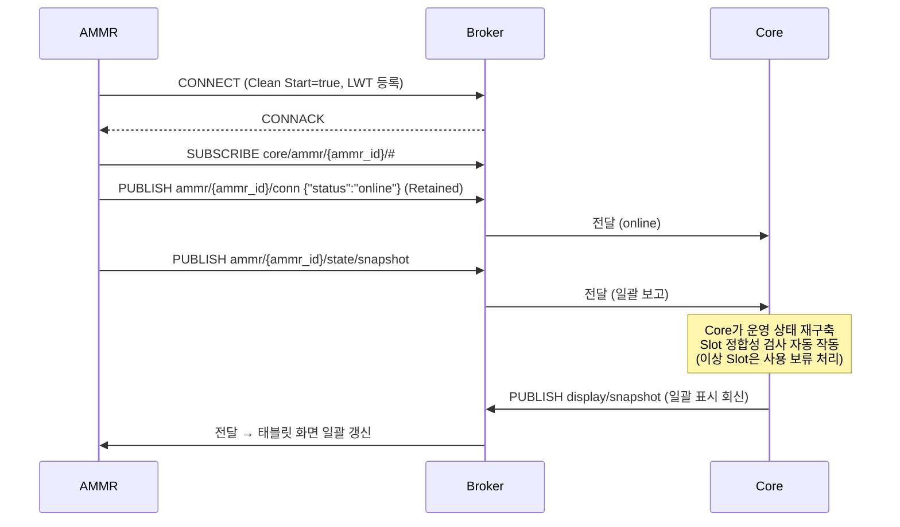

일괄 보고(A-1) 처리 직후 Core는 일괄 표시 회신(C-7)을 내려주며, 단절·재시작 동안 비어 있던 태블릿의 시스템 권위 표시(적재·배정·상단)가 이 시점에 채워진다.

### 6.2 Job Sequence

Core는 하나의 이송 요청을 Job Sequence(Move → Pickup → Move → Dropoff)로 전개하여 **한 번에 하나씩** 지시한다. 각 Job 지시 후 AMMR은 수신 확인(`job/received`)을 보고하고, Job 종료 시점에 결과(`job/ack`)를 보고하며, Core는 결과 처리 후 표시 회신(`display/job`)을 내려준다.

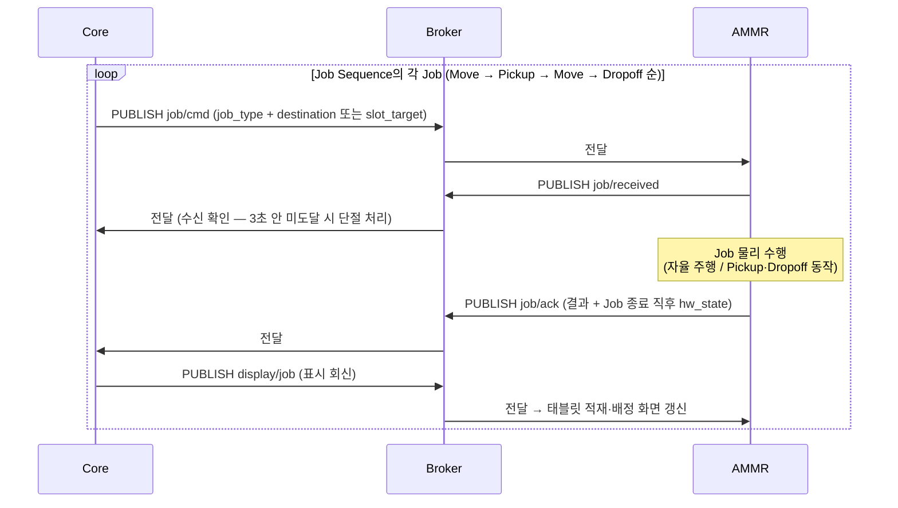

**주의**: AMMR은 Core의 다음 Job 지시 전에는 자체적으로 다음 동작을 수행하지 않는다. 1 Job 종료 → 결과 보고 → Core 판정 → 다음 Job 지시의 순환이다.

**※ 이송 상황별 Job Sequence**

| 이송 상황 | Job Sequence |
|-----------|--------------|
| 일반 이송 | Move → Pickup → Move → Dropoff |
| 적재 중 Unit의 후속 운반 (재로드·복구로 적재 Unit이 확정된 경우 등) | Move → Dropoff (AMMR이 이미 Unit을 적재한 상태라 Pickup 없음) |
| 충전 | Charge 단일 Job (§6.3) |

AMMR은 어떤 순서 조합이든 단건 Job 계약(§5.2 C-1)만으로 수행할 수 있어야 하며, Dropoff가 항상 Pickup 뒤에 온다고 가정하지 않는다.

Job 시작 시점의 상단 표시(시스템 상태 = 수행 중 동작·작업 슬롯)는 별도 규칙 없이 Job 시작 전이 보고(A-2)에 대한 AMMR 상태 표시 회신(C-6)으로 공급된다.

### 6.3 Charge Job Sequence

Charge는 Core가 자체 결정하여 **단일 Charge Job**으로 지시한다. `destination`이 없으며, AMMR은 태블릿 설정값으로 보유한 충전 스테이션으로 자체 이동·도킹한다 (§8.5). 도킹·충전·이탈·자체 임계에 따른 충전 중단 결정은 AMMR HW 자율 영역이다.

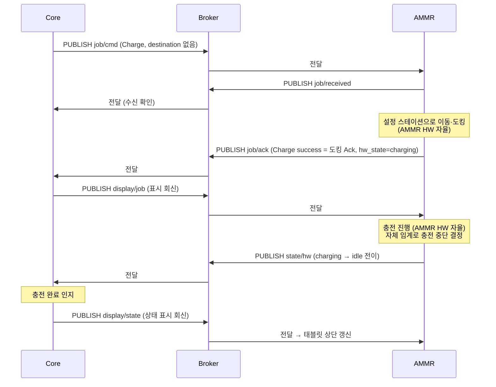

충전 중에도 Core는 이 AMMR에 Job을 지시할 수 있다 — 이 경우 AMMR은 충전을 중단하고 스테이션에서 이탈한 뒤 Job을 수행한다 (§8.4).

### 6.4 사람 개입에 따른 Slot Sensor 외부 전이

사람이 AMMR Slot에서 Unit을 임의로 꺼내거나 올려놓는 경우 등 외부 원인 전이. AMMR은 해당 Slot 1개를 보고하고(A-3), Core는 판정 결과를 표시 회신(C-2)으로 내려준다.

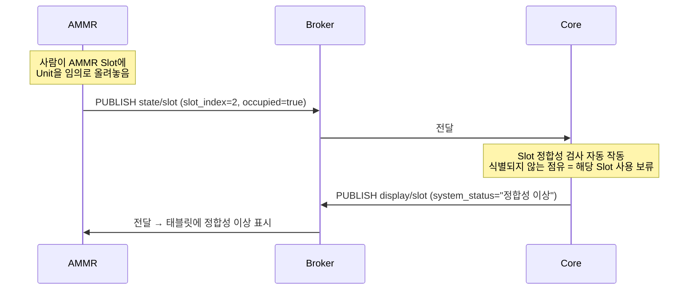

### 6.5 적재 정보 일괄 재로드

담당자가 태블릿에서 Slot 정합성 이상을 회복시키는 흐름이다. 시스템 연결이 끊긴 동안 담당자가 Slot별 입력 박스에 Unit UUID를 입력해 두고, 재연결 후 [Slot별 적재 정보 재로드]를 실행한다 (태블릿 동작 세부는 "AMMR 태블릿 UI 정의 제안" 참조).

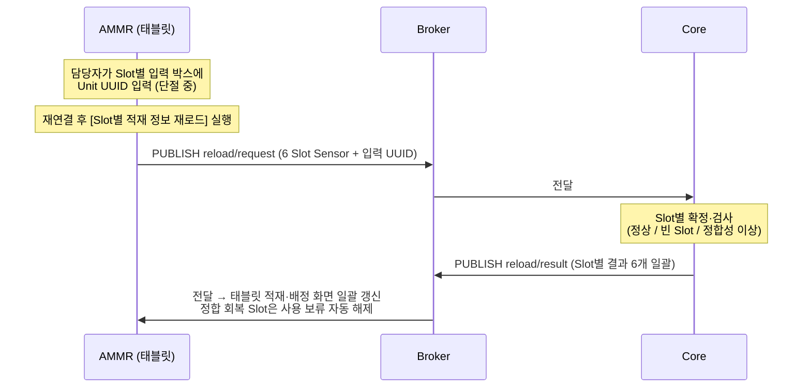

### 6.6 AMMR HW 장애 보고

AMMR HW가 물리적으로 실패한 경우. Job 수행 결과 통합 보고 payload(`hw_state=error` 또는 `ammr_hw_*` reason) 또는 상태 전이 Event(A-2)로 보고된다.

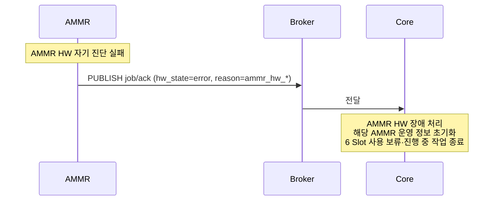

`hw_state=error` 가 보고되면 Core는 **payload 전체 신뢰 없음**으로 간주하여 Slot Sensor 정보 부분은 무시하고 해당 AMMR의 운영 정보를 초기화한다.

### 6.7 AMMR HW 단절 (Last Will)

MQTT 경로는 살아있으나 AMMR HW가 Broker와의 연결을 잃은 경우. Broker가 LWT를 자동 발행한다.

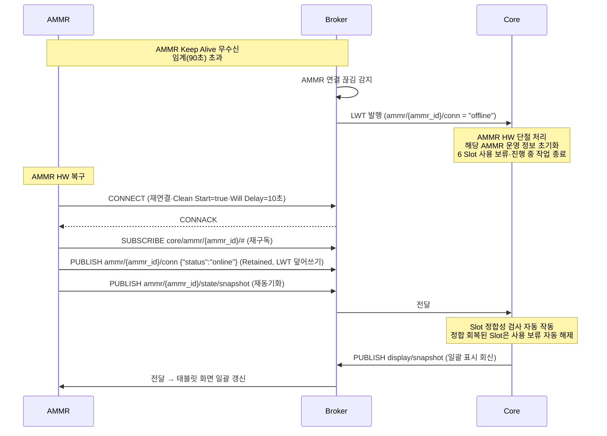

재연결 시 일괄 보고(A-1) 처리 직후 Core가 일괄 표시 회신(C-7)을 내려주므로, 단절 동안 빈값 처리된 태블릿 화면은 재연결 직후 자동 회복된다. 정합성 이상으로 남은 Slot의 회복은 적재 정보 일괄 재로드(§6.5)로 한다.

### 6.8 Core 측 재연결·Core 재시작 시 재동기화

Core가 재시작되거나 Core 측 MQTT 연결만 재수립된 경우, AMMR 측 재연결이 없어 일괄 보고가 자연 도달하지 않는다. Core는 일괄 보고 재전송 요청(C-5)을 발신하여 재수신을 개시한다.

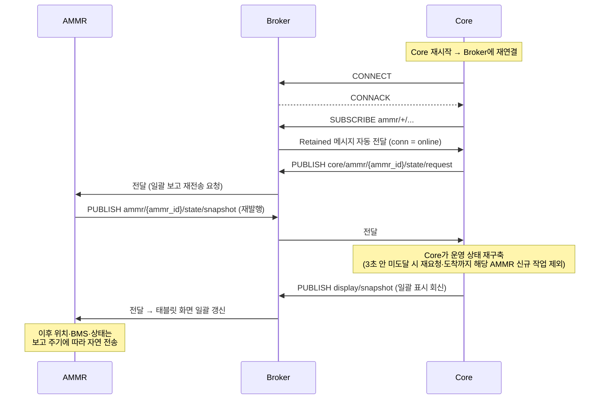

---

## 7. 오류 처리·재시도·Timeout

### 7.1 Reason 코드 분류

Job 실패 시 `reason` 필드에 사유를 기재한다. 코드 일람은 §부록 A.4에서 확정한다.

#### AMMR HW 측 카테고리 (`ammr_hw_*`)

| 코드                         | 의미                                  |
|------------------------------|---------------------------------------|
| `ammr_hw_navigation_lost`    | 자율 주행 실패 (위치 측위 불능 등)   |
| `ammr_hw_manipulator_fault`  | Manipulator 동작 실패                |
| `ammr_hw_vision_fault`       | Vision Sensor 실패                   |
| `ammr_hw_self_diagnostic`    | 자기 진단 실패                       |
| `ammr_hw_other`              | 그 외 AMMR HW 측 사유                |

이 카테고리 보고 시 Core는 **payload 전체 신뢰 없음**으로 간주하여 해당 AMMR의 운영 정보를 초기화하고 6 Slot을 사용 보류 처리한다.

#### Slot 측 카테고리 (`slot_*`)

| 코드                      | 의미                                                              |
|---------------------------|-------------------------------------------------------------------|
| `slot_source_empty`       | Pickup 출발 Slot이 비어 있음 (도착 시 Sensor OFF)                |
| `slot_source_obstructed`  | Pickup 시 물리 충돌 감지 (Vision Sensor)                         |
| `slot_dest_occupied`      | Dropoff 목적지 Slot이 점유됨 (도착 시 Sensor ON)                 |
| `slot_dest_obstructed`    | Dropoff 시 물리 충돌 감지 (Vision Sensor)                        |
| `slot_other`              | 그 외 Slot 측 사유                                                |

이 카테고리 보고 시 Core는 해당 Slot의 정합성 검사 후 운영을 결정한다 — Pickup 측 실패는 해당 이송을 종료하고, Dropoff 측 실패는 대체 목적지를 재판단해 새 Job으로 지시할 수 있다.

### 7.2 Job 결과 실패 처리 (payload 분기)

Job 수행 결과 통합 보고의 payload는 다음 4가지로 분기되어 Core가 처리한다. 분기 2~4의 상태 기준은 **장애 아님**(`idle` / `charging` / `low_battery`)이다 — `low_battery` 동반 시에도 결과 처리는 동일하며, 신규 Job 배정만 차단된다 (§8.3).

| #   | payload 조합                                                                  | Core 처리                                                          |
|-----|-------------------------------------------------------------------------------|--------------------------------------------------------------------|
| 1   | `hw_state = error` (job_result·reason 무관)                                   | AMMR HW 장애 처리 — 운영 정보 초기화 + 6 Slot 사용 보류            |
| 2   | `hw_state = 장애 아님(idle/charging/low_battery)` + `job_result = failure` + `reason = ammr_hw_*` | (1)과 동일 처리 (payload 전체 신뢰 없음)          |
| 3   | `hw_state = 장애 아님(idle/charging/low_battery)` + `job_result = failure` + `reason = slot_*` | 해당 Slot 정합성 검사 → 운영 결정 (Pickup 실패 = 이송 종료 / Dropoff 실패 = 대체 목적지 재지시 가능) |
| 4   | `hw_state = 장애 아님(idle/charging/low_battery)` + `job_result = success`    | 정상 갱신 → 다음 Job 진행                                          |

### 7.3 Keep Alive / Timeout 임계값

| 항목                          | 확정값  | 비고                                                                  |
|-------------------------------|---------|-----------------------------------------------------------------------|
| MQTT Keep Alive               | 60초    | AMMR이 PINGREQ를 보내는 주기 (Mosquitto 기본)                         |
| Broker 측 단절 감지 임계       | 90초    | Keep Alive × 1.5 (MQTT 표준 권장)                                     |
| LWT 발행 → Core 인지            | 즉시    | Broker가 자동 발행, Core가 wildcard subscribe로 수신                  |
| Job 지시 수신 확인 임계 (Core 측) | 3초     | Core가 Job 지시 후 `job/received` 수신을 기다리는 timeout. 운영 결과 및 AMMR 통신 지연 특성에 따라 조정 가능. |
| 일괄 보고 재전송 응답 임계 (Core 측) | 3초  | Core가 재전송 요청(C-5) 후 일괄 보고(A-1) 도착을 기다리는 timeout — 미도달 시 재요청 가능·해당 AMMR은 도착까지 신규 작업 대상 제외. 위 항목과 같은 기준으로 조정 가능. |
| 재로드 응답 대기 임계 (태블릿 측) | 3초 | 태블릿이 재로드 요청(A-9) 후 C-4 응답을 기다리는 timeout. 미도달 시 실패 처리(메시지 박스)·담당자 재시도. 조정 가능. |

### 7.4 재시도 정책

| 시나리오                       | AMMR 측 동작                                              | Core 측 동작                                                |
|--------------------------------|-----------------------------------------------------------|-------------------------------------------------------------|
| Broker 연결 끊김 (AMMR 측)    | 자동 재연결 시도 (Backoff). 재연결 = 새 세션 (Clean Start=true) — SUBSCRIBE 재수행 + conn online + 일괄 보고 재발행 | LWT 수신 → AMMR HW 단절 처리                |
| 단절 중 Job 지시               | (수신 없음 — 세션 비보존으로 Broker가 단절 클라이언트에 메시지를 보관하지 않음) | Job 지시 후 3초 안 수신 확인 미도달 → AMMR HW 단절 처리·해당 Job 종료. 재연결 후 뒤늦게 배달되는 옛 Job 지시는 없다 (stale Job 원천 차단) |
| Job 지시 수신 확인 미수신      | (해당 없음)                                               | AMMR HW 단절과 동일 처리                                    |
| Job 결과 미수신 (Core 측)     | (해당 없음 — AMMR은 1회만 보고)                          | 두절·장애 처리로 자연 처리 (별도 재요청 없음)               |
| 결과 메시지 중복 수신          | (해당 없음)                                               | `job_id`로 멱등 처리                                         |
| Job 지시 중복 수신             | `job_id`로 멱등 처리 (1회만 수행)                        | (재발행 없음)                                                |
| 표시 회신·재로드 응답 미도착   | 표시 어긋남은 적재 정보 일괄 재로드로 회복 (재로드 응답 3초 내 미도착 시 태블릿 실패 표시·담당자 재시도) | (재발행 없음)                                |
| 일괄 보고 재전송 요청 응답 미도착 | (해당 없음)                                            | 재요청 가능 — 해당 AMMR은 일괄 보고 도착까지 신규 작업 대상 제외 |

**핵심**: Core는 진행 중이던 Job의 결과 재보고를 요청하지 않는다. 두절 후 재연결 시 일괄 보고 재발행(AMMR 측 재연결) 또는 재전송 요청(Core 측 재연결·§6.8)으로 자연 재동기화한다. 수신 확인 미수신은 AMMR HW 단절과 동일하게 처리한다.

---

## 8. AMMR HW 자율 동작 영역

이 영역은 Core 간섭 없이 AMMR HW가 자체 처리하는 영역이다. AMMR 업체의 구현 책임이다.

### 8.1 자율 주행

- 위치 측위, 경로 결정, 장애물 회피, 물리적 이동의 모든 세부.
- Core는 목적지 논리 지점 라벨만 제공하고, 위치 해석·경로는 AMMR HW가 자체 맵으로 결정한다 (§5.2 C-1).

### 8.2 도킹 / 충전 / 이탈

- 충전 스테이션 도킹의 물리 절차.
- 충전 동작 자체.
- 도킹 완료 시점에 **Charge Job 수행 결과(`job/ack`)** 1회 보고 → "도킹 Ack" 의 의미.
- 이후 충전 진행·완료는 AMMR HW가 자율 처리하며, **충전 완료 시점에 `state/hw` 로 `charging → idle` 전이를 별도 보고**한다.
- 자체 임계 도달에 따른 충전 중단 결정은 AMMR HW 자체 처리. 단, 충전 중 Core Job 지시 수신 시의 중단·이탈은 §8.4를 따른다.

### 8.3 저전력 자율 충전

- Battery가 태블릿 설정의 저전력 임계치(기본값 20%) 이하로 진입하면 AMMR HW가 자체적으로 다음 동작을 수행한다.
  - 현재 진행 중 단위 Job 완료 후 설정 스테이션으로 자율 이동·도킹·충전
  - 이 동작 진입 시 `state/hw` 로 `low_battery` 보고 (진행 중 Job의 종료와 동시에 진입한 경우엔 Job 수행 결과 보고의 `hw_state = low_battery`로 보고 — §5.1 A-2)
  - 도킹 시점에 `state/hw` 로 `charging` 전이 보고
  - 태블릿 설정의 대기 임계치(기본값 80%) 완충 시점에 `state/hw` 로 `idle` 전이 보고
- 이 자율 동작은 Core 다운 여부와 무관하게 작동한다.
- AMMR HW 상태가 `low_battery` 또는 `charging`인 동안 Core는 신규 Job 배정을 차단한다. 단, 충전 중 Battery가 충분히 회복되었다고 Core가 판단하면 충전 완료를 기다리지 않고 Job을 지시할 수 있다 (§8.4).

### 8.4 충전 중 Job 지시 (충전 중단·이탈)

- Core는 충전 중(`charging`)인 AMMR에도 Job을 지시할 수 있다.
- 이 지시를 받으면 AMMR은 충전을 중단하고 스테이션에서 이탈한 뒤 Job을 수행한다 — 수신 확인·결과 보고는 일반 Job과 동일 (§6.2). 충전 이탈에 따른 상태 전이(`charging → move` 등 Job 시작 전이)는 A-2로 보고한다.
- Core가 어떤 기준으로 충전 중 AMMR에 Job을 지시하는지는 Core 내부 운영 판단 영역이다.

### 8.5 충전 스테이션 설정 (단일 소스)

- 충전 스테이션 위치는 **태블릿 설정 화면의 충전 스테이션 번호가 단일 소스**다. Core는 충전 스테이션 위치를 보유·지정하지 않는다.
- Core 지시 Charge Job(§6.3)과 저전력 자율 충전(§8.3) 모두 이 설정 스테이션을 사용한다.

### 8.6 Core 다운 중 자율 동작

- Core가 다운된 동안 진행 중이던 Job은 완료까지 수행한다.
- 완료 후 AMMR은 그 위치에서 대기한다 (자율 충전존 복귀 없음, 단 §8.3 저전력 자율 충전은 예외).
- Core 복구 시 일괄 보고 재전송 요청(C-5·§6.8) 및 보고 재개로 자연 재동기화한다.

---

## 9. 인증·보안

### 9.1 MQTT 인증

- **사용자명/비밀번호 인증**을 적용한다 — MQTT CONNECT의 username/password. TLS는 적용하지 않는다 (사내 내부망 한정 운영 전제·§9.3).
- 자격증명(MQTT 접속 ID·비밀번호)은 설치 시 Core 측이 AMMR별로 발급·제공하며, 담당자가 태블릿 설정 화면에 입력한다 (§3.6 Broker 접속).
- **자격증명 규칙·발급 값**: MQTT username은 해당 AMMR의 `ammr_id`, password는 `{ammr_id}@core` 형식으로 발급한다. 현재 운영 2대의 값은 아래와 같으며, 담당자가 설치 시 태블릿 설정 화면에 입력한다.

| AMMR | MQTT username | MQTT password |
|------|---------------|---------------|
| 물류 AMMR #1 | `ammr-001` | `ammr-001@core` |
| 물류 AMMR #2 | `ammr-002` | `ammr-002@core` |

AMMR 증설 시 같은 규칙(`{ammr_id}` / `{ammr_id}@core`)으로 확장한다. 이 자격증명은 사내 내부망 한정·평문 MQTT 전제의 운영값이다 (§9.3).

### 9.2 Topic 권한 (Broker ACL)

Broker(Mosquitto) 측에 다음 ACL을 적용한다.

| 클라이언트     | 허용 권한                                                                  |
|----------------|----------------------------------------------------------------------------|
| AMMR `{ammr_id}` | Publish: `ammr/{ammr_id}/#` / Subscribe: `core/ammr/{ammr_id}/#`           |
| Core           | Publish: `core/ammr/+/#` / Subscribe: `ammr/+/#`                          |

각 AMMR은 자기 `ammr_id` 외 다른 AMMR의 Topic에 publish할 수 없다.

### 9.3 사내 내부망 전제

- 이 시스템은 사내 내부망 한정 운영. 외부 인터넷 노출 없음.
- 방화벽·NAT 설정은 운영팀 영역.

---

## 10. 부록

### A. 데이터 타입·enum 정의

#### A.1 AMMR HW 상태 (`hw_state`)

8종 — Job 수행 중에는 수행 중인 Job 동작을, Job이 없을 때는 운영 상태를 보고한다.

| 값             | 분류        | 의미                                                                       |
|----------------|-------------|----------------------------------------------------------------------------|
| `move`         | Job 동작    | Move Job 수행 중 (이동)                                                    |
| `pickup`       | Job 동작    | Pickup Job 수행 중                                                         |
| `dropoff`      | Job 동작    | Dropoff Job 수행 중                                                        |
| `charge`       | Job 동작    | Charge Job 수행 중 (충전존 이동·도킹)                                      |
| `idle`         | 운영 상태   | 대기 — 작업 배정 대기 중 (충전 완료 후 또는 작업 종료 후)                 |
| `charging`     | 운영 상태   | 충전 중 — 충전존 도킹 후 충전 중                                          |
| `low_battery`  | 운영 상태   | 저전력 — 자체 임계(태블릿 설정·기본값 20%) 이하 진입. 자율 충전 동작 진입 (§8.3) |
| `error`        | 운영 상태   | 장애 — 고장 또는 수리 중                                                  |

#### A.2 Job 종류 (`job_type`)

| 값          | 의미                                                |
|-------------|-----------------------------------------------------|
| `move`      | 지정 지점으로 자율 주행                            |
| `pickup`    | 외부 Slot에서 AMMR Slot으로 Unit 적재             |
| `dropoff`   | AMMR Slot에서 외부 Slot으로 Unit 하역             |
| `charge`    | 설정 스테이션에서 도킹·충전 (`destination` 없음)  |

#### A.3 Job 결과 (`job_result`)

| 값        | 의미                                                        |
|-----------|-------------------------------------------------------------|
| `success` | Job 정상 완료 (Charge는 도킹 완료 시점)                    |
| `failure` | Job 실패 — `reason` 필드에 사유 기재 (§부록 A.4)           |

#### A.4 Reason 코드 (`reason`)

§7.1의 분류 체계를 따르는 확정 코드 일람이다.

| 코드                         | 카테고리    | 의미                                              |
|------------------------------|-------------|---------------------------------------------------|
| `ammr_hw_navigation_lost`    | AMMR HW 측 | 자율 주행 실패 (위치 측위 불능 등)               |
| `ammr_hw_manipulator_fault`  | AMMR HW 측 | Manipulator 동작 실패                            |
| `ammr_hw_vision_fault`       | AMMR HW 측 | Vision Sensor 실패                               |
| `ammr_hw_self_diagnostic`    | AMMR HW 측 | 자기 진단 실패                                   |
| `ammr_hw_other`              | AMMR HW 측 | 그 외 AMMR HW 측 사유                            |
| `slot_source_empty`          | Slot 측    | Pickup 출발 Slot이 비어 있음                     |
| `slot_source_obstructed`     | Slot 측    | Pickup 시 물리 충돌 감지 (Vision Sensor)         |
| `slot_dest_occupied`         | Slot 측    | Dropoff 목적지 Slot이 점유됨                     |
| `slot_dest_obstructed`       | Slot 측    | Dropoff 시 물리 충돌 감지 (Vision Sensor)        |
| `slot_other`                 | Slot 측    | 그 외 Slot 측 사유                               |

#### A.5 BMS 필드 단위

| 필드          | 단위    | 범위           |
|---------------|---------|----------------|
| `soc`         | %       | 0.0–100.0      |
| `voltage`     | V       | (Battery 사양) |
| `current`     | A       | 충전 시 양수 / 방전 시 음수 (Battery 사양) |
| `temperature` | °C      | (Battery 사양) |

#### A.6 좌표·방향각 단위

위치 스트리밍(A-4) 전용이다. Job 지시의 목적지는 좌표가 아니라 논리 지점 라벨이다 (§5.2 C-1).

| 필드  | 단위         |
|-------|--------------|
| `x`   | m            |
| `y`   | m            |
| `a`   | rad (0~2π) |

#### A.7 표시 텍스트 값 (`system_status`)

표시 회신(C-2·C-3·C-4·C-6·C-7)의 `system_status` 필드 값 일람. 태블릿은 이 텍스트를 가공 없이 표시한다 (§3.5). `header`의 `system_status`·`active_slot_index`는 회신 발행 시점에 Core가 판단한 현재 값이다.

| 위치          | 값                                                                | 의미                            |
|---------------|--------------------------------------------------------------------|---------------------------------|
| `header`      | `Move` / `Pickup` / `Dropoff` / `Charge` / `대기` / `충전 중` / `저전력` / `장애` | 시스템이 판단한 AMMR 상태 (Job 수행 중 = Job 동작 / Job 없음 = 운영 상태) |
| `slot_info`   | `정상` / `정합성 이상`                                             | 시스템이 판단한 Slot 상태 (`정합성 이상` = 사용 보류) |

### B. 확정 사항 일람

업체 협의 없이 전량 Core가 확정한다 — HW 의존 값도 Core가 정하고 AMMR이 맞춘다. 이 표는 이 문서 곳곳에 정의된 확정값의 한눈 일람이다.

| #  | 분류          | 확정 내용                                                                  | 관련 절      |
|----|---------------|----------------------------------------------------------------------------|--------------|
| 1  | 프로토콜      | MQTT v5.0                                                                  | §3.1        |
| 2  | Topic          | `ammr/{ammr_id}/…` · `core/ammr/{ammr_id}/…` 체계 (표시 회신·재로드·재전송 요청 포함) | §3.3        |
| 3  | Topic          | `ammr_id` = 문자열 `ammr-001` 형식 · 설치 시 Core 측 할당 · MQTT Client ID로도 사용 | §3.3, §3.6 |
| 4  | QoS           | Job 지시·상태·회신·conn = 1 / 스트리밍(pose·bms) = 0                       | §3.4        |
| 5  | Retained      | `conn` Topic만 true (online: AMMR 직접 발행 / offline: Broker LWT 또는 정상 종료 시 AMMR 직접 발행) · 그 외 false | §3.4        |
| 6  | 인코딩        | JSON (UTF-8)                                                               | §3.5        |
| 7  | 공통 필드     | `msg_id` = 선택 (추적용)                                                   | §3.5        |
| 8  | 수명 주기     | Keep Alive 60초 / Broker 단절 감지 90초 (1.5×·Mosquitto 기본)              | §3.6, §7.3 |
| 9  | 수명 주기     | Clean Start = true · Session Expiry = 10초 · Will Delay = 10초 (재접속 Clean Start=true가 stale Job 차단 · Will Delay가 순단 offline 억제)  | §3.6        |
| 10 | Slot Sensor   | `sensor_value` 필드 없음 — 점유는 `occupied` 단일. Unit 식별은 Core가 표시 회신으로 제공 | §5.1, §5.2 |
| 11 | 목적지        | `destination`/`external_location` = 논리 지점 라벨 (좌표 미전송·AMMR 자체 맵 해석) | §5.2 C-1    |
| 12 | 좌표 단위     | m·rad — 위치 스트리밍(A-4) 전용                                            | §부록 A.6   |
| 13 | BMS           | `current` 부호 = 충전 양수 / 방전 음수                                     | §5.1 A-5    |
| 14 | Reason 코드   | `ammr_hw_*` 5종 + `slot_*` 5종 (Pickup 충돌 `slot_source_obstructed` 포함) | §7.1, §부록 A.4 |
| 15 | enum          | `hw_state` = 영문 8종 (`move`/`pickup`/`dropoff`/`charge`/`idle`/`charging`/`low_battery`/`error`) | §부록 A.1   |
| 16 | Job 필드      | `priority` 필드 없음 (Job은 한 번에 하나 지시)                             | §5.2 C-1    |
| 17 | 재동기화      | Core 측 재연결·재시작 시 일괄 보고 재전송 요청(C-5) → A-1 재발행 → 일괄 표시 회신(C-7) | §5.2 C-5, §6.8 |
| 18 | 인증          | 사용자명/비밀번호 (username=`ammr_id` / pw=`{ammr_id}@core`·TLS 없음·사내망 전제)                                   | §9.1        |
| 19 | Topic 권한     | Broker ACL 적용                                                            | §9.2        |
| 20 | Charge        | 단일 Charge Job · `destination` 없음 · 충전 스테이션 = 태블릿 설정 단일 소스 | §6.3, §8.5  |
| 21 | Broker 접속   | 기본 포트 1883 (평문 MQTT·Mosquitto 기본) · 실제 접속 정보(IP·포트·자격증명)는 설치 시 Core 측 제공·태블릿 설정 입력 | §3.6, §9.1  |
| 22 | 표시 회신     | AMMR 보고 전건에 표시 회신 — Slot 변동(C-2)·Job 결과(C-3)·상태 전이(C-6)·일괄 보고(C-7)·재로드(C-4) · 상단 값(header)은 모든 회신에 동반 | §4.2, §5.2  |
