# Core ↔ 물류 AMMR Interface Control Document

> 이 문서는 `Core_ICD_AMMR_v0_1_d15.md` 기준으로 작성되었습니다.
> 최종 업데이트: 2026-07-04 14:21

---

## 표기 규약

- **[협의]** — 이 ICD 초안에서 합리적 제안을 담은 항목. AMMR 업체와의 협의를 거쳐 확정한다. 단독 [협의] = 절 전체 협의 / [협의: 구체 내용] = 단일 항목 협의.
- 이 ICD가 정한 것이 기준 본체와 충돌하면 기준 본체가 우선한다. 이 ICD는 운영 합의 영역만 권위로 갖는다.

---

## 1. 문서 개요

### 1.1 목적

이 문서는 Core 시스템과 물류 AMMR 사이의 통신 인터페이스를 정의한다. AMMR 업체가 이 문서를 기반으로 Core와의 통신 모듈을 구현·검증할 수 있도록 작성된다.

### 1.2 범위

이 문서는 **Core ↔ 물류 AMMR** 인터페이스 한정이다. 다음은 이 문서 범위 밖이다.

- AMMR HW 내부 제어 로직 (자율 주행·도킹·충전 등 — 업체 영역)
- Core 내부 구현 (도메인 로직·DB·서비스 계층 — Core 영역)
- Core와 다른 외부 시스템(GM·SM·WIP 중계 프로그램·Dashboard) 간 인터페이스
- CNC 공정 AMMR (별개 장비, 이 문서의 "AMMR"은 물류 AMMR만 가리킨다)

### 1.3 용어 및 약어

| 약어    | 의미                                                                |
|---------|---------------------------------------------------------------------|
| Core    | 물류 작업 시스템 (메인 서버)                                        |
| AMMR    | Autonomous Mobile Manipulator Robot (자율 이동 Manipulator 로봇)  |
| MQTT    | Message Queuing Telemetry Transport (메시지 Queue Telemetry 프로토콜) |
| Broker  | MQTT 메시지 중계 미들웨어 (이 시스템: Mosquitto)                    |
| LWT     | Last Will and Testament (MQTT 단절 시 자동 발행 메시지)            |
| QoS     | Quality of Service (MQTT 전달 보증 수준 0/1/2)                     |
| Slot    | 1 Unit이 적재되는 물리적 위치. AMMR은 6 Slot 보유                  |
| Unit    | Core가 추적하는 적재 단위 (1 Slot에 1 Unit)                        |
| WIP     | Work In Process (공정 간 임시 보관 장비)                           |
| Job     | AMMR 내부 수행 단위 (Move / Pickup / Dropoff / Charge 4종)         |
| Transfer | Core 내부 이송 요청 단위. 1 Transfer가 여러 Job으로 전개됨         |
| BMS     | Battery Management System                                          |
| BMU     | Battery Management Unit                                            |
| SoC     | State of Charge (Battery 충전 상태, %)                              |

---

## 2. 시스템 Context

### 2.1 시스템 구성

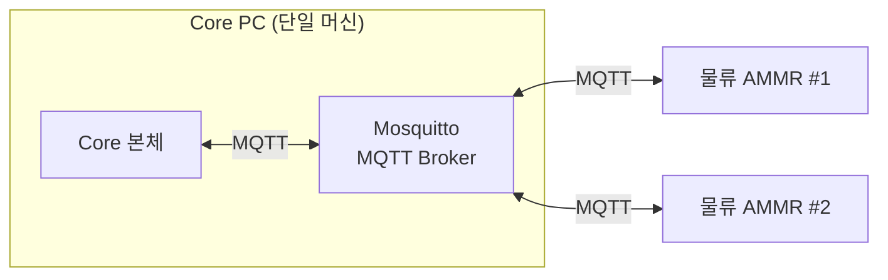

- **Core PC** — Core 본체 프로세스(ASP.NET Core)와 Mosquitto Broker가 같은 PC에서 운영된다.
- **물류 AMMR** — 현재 2대 운영. 추후 증설 가능성 있음. 각 AMMR은 Broker에 클라이언트로 접속한다.
- **연결 망** — 사내 내부망 한정. 외부 인터넷 노출 없음.

### 2.2 Core와 AMMR의 역할 분담

| 영역                                   | 주체     | 비고                                                          |
|----------------------------------------|----------|---------------------------------------------------------------|
| Job 결정 (Move/Pickup/Dropoff/Charge) | Core     | Transfer를 Job Sequence로 전개하여 한 Job씩 지시                |
| Job 물리 수행                          | AMMR HW  | 자율 주행, Pickup·Dropoff 동작, 도킹·충전 등                  |
| Job 지시 수신 보고                     | AMMR HW  | Core Job 지시 수신 직후 즉시                                 |
| Job 수행 결과 보고                     | AMMR HW  | Job 종료 시 통합 보고                                         |
| AMMR HW 상태 보고                      | AMMR HW  | 초기 연결 일괄 + 상태 전이 시점                              |
| Slot 점유 Sensor 보고                  | AMMR HW  | 초기 연결 일괄 + 외부 원인 전이 시 1 Slot                    |
| 위치·BMS 스트리밍                     | AMMR HW  | 위치 1초·BMS 5초 주기                                        |
| Unit 식별 (Unit ID 확정)              | Core     | AMMR은 Unit ID를 알지 못함. Slot Sensor 식별값만 보고         |
| 충전 중단 결정                         | AMMR HW  | 자체 임계로 결정 (Core 간섭 없음)                            |

### 2.3 AMMR HW ↔ Core 권위 분담

다음 표는 어떤 데이터를 어느 쪽이 권위로 갖는지를 정리한다. AMMR HW가 권위인 데이터는 AMMR이 Core에 보고하고, Core가 권위인 데이터는 Core가 자체 판정 후 운영에 사용한다.

| 항목                                          | 권위 매체           | 비고                                                                       |
|-----------------------------------------------|---------------------|----------------------------------------------------------------------------|
| 위치 (x, y, a) 스트리밍                       | AMMR HW             | 1초 주기 (AMMR HW 설정 가변)                                              |
| AMMR HW 상태 전이                             | AMMR HW             | 대기/이동 중/작업 중/충전 중/저전력/장애                                  |
| Slot 점유 Sensor (6 Slot)                    | AMMR HW             | 초기 일괄 또는 외부 원인 전이 시 1 Slot                                   |
| Job 지시 수신                                 | AMMR HW             | Core Job 지시 수신 즉시 보고                                              |
| Job 수행 결과 (Move/Pickup/Dropoff/Charge)   | AMMR HW             | Job 종료 시 통합 보고                                                     |
| Battery (raw % 스트리밍)                       | AMMR HW             | 5초 주기                                                                  |
| Battery 저전력 분류 (정상/저전력)              | Core (자체 판정)    | Core가 raw %를 임계값으로 분류 — AMMR이 별도 보고 안 함                    |
| Unit ID                                       | Core (자체 판정)    | AMMR은 Unit ID를 알지 못함                                                |
| Transfer / Job 결정                          | Core                | AMMR은 Core 지시를 수행                                                   |

---

## 3. 통신 아키텍처

### 3.1 프로토콜

Core와 AMMR은 **MQTT v3.1.1** 또는 **v5.0** 으로 통신한다. [협의: 버전 확정]

- Broker: **Eclipse Mosquitto** (Core PC에 함께 운영)
- Core, AMMR 양측 모두 Broker에 클라이언트로 접속해 Publish/Subscribe 방식으로 통신한다.
- AMMR HW 단절은 MQTT Last Will로 Core가 인지한다.

### 3.2 연결 구조

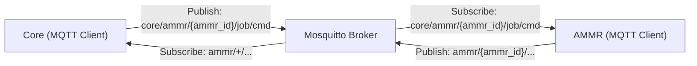

- **AMMR** — 자기 `ammr_id` 기준 Topic을 publish하고, Core가 지시한 Job Topic을 subscribe한다.
- **Core** — 모든 AMMR의 상태·결과 Topic을 wildcard subscribe하고, 특정 AMMR에게만 Job Topic을 publish한다.

### 3.3 Topic 명명 규약

**[협의]** 이 절은 초안 제안이다. Topic prefix·구분자·식별자 정책은 업체와 협의 후 확정한다.

`{ammr_id}`는 AMMR 식별자(예: `ammr_001`, `ammr_002`). [협의: 식별자 형식·할당 방식]

#### AMMR → Core (AMMR이 publish, Core가 subscribe)

| Topic                              | 내용                    |
|-----------------------------------|-------------------------|
| `ammr/{ammr_id}/state/snapshot`   | 초기 일괄 보고          |
| `ammr/{ammr_id}/state/hw`         | AMMR HW 상태 전이       |
| `ammr/{ammr_id}/state/slot`       | Slot 점유 Sensor 변화   |
| `ammr/{ammr_id}/telemetry/pose`   | 위치 스트리밍 (1초)     |
| `ammr/{ammr_id}/telemetry/bms`    | BMS 스트리밍 (5초)      |
| `ammr/{ammr_id}/job/received`     | Job 지시 수신 ack       |
| `ammr/{ammr_id}/job/ack`          | Job 수행 결과 통합 보고 |
| `ammr/{ammr_id}/conn`             | 연결 상태 (LWT)         |

#### Core → AMMR (Core가 publish, AMMR이 subscribe)

| Topic                                  | 내용              |
|---------------------------------------|-------------------|
| `core/ammr/{ammr_id}/job/cmd`         | Job 지시 (단건)  |

### 3.4 QoS / Retained / Last Will

**[협의]** QoS 레벨과 Retained 적용은 통신 비용·신뢰성·중복 처리 부담을 종합 평가하여 확정한다.

#### QoS 제안

| Topic                              | 분류                    | 제안 QoS  | 근거                                              |
|-----------------------------------|-------------------------|-----------|---------------------------------------------------|
| `ammr/{ammr_id}/state/snapshot`   | 초기 일괄 보고          | 1         | 연결 직후 권위 재구축의 입력                       |
| `ammr/{ammr_id}/state/hw`         | AMMR HW 상태 전이       | 1         | 단발성. 누락 시 운영 정합성 깨짐                  |
| `ammr/{ammr_id}/state/slot`       | Slot 점유 Sensor 변화   | 1         | 정합성 검사 입력으로 누락 시 Block 마킹 없음 위험 |
| `ammr/{ammr_id}/telemetry/pose`   | 위치 스트리밍 (1초)     | 0         | 연속값. 1건 누락이 운영에 영향 없음               |
| `ammr/{ammr_id}/telemetry/bms`    | BMS 스트리밍 (5초)      | 0         | 연속값. 임계 통과는 다음 보고에서 즉시 표면화     |
| `ammr/{ammr_id}/job/received`     | Job 지시 수신 ack       | 1         | 수신 진단·책임 분리                                |
| `ammr/{ammr_id}/job/ack`          | Job 수행 결과 통합 보고 | 1         | 결과 누락 시 Job 종료 판정 불가                   |
| `ammr/{ammr_id}/conn`             | 연결 상태 (LWT)         | 1         | Retained로 늦은 접속에서도 단절 인지               |
| `core/ammr/{ammr_id}/job/cmd`     | Job 지시 (Core → AMMR)  | 1         | 미수신 시 운영 중단. `job_id` 멱등                |

#### Retained 제안

- `ammr/{ammr_id}/conn` 의 LWT 메시지는 **Retained = true** 로 발행한다 → Core가 늦게 접속해도 단절 상태를 즉시 인지.
- AMMR이 정상 연결 시 같은 Topic에 `online` payload를 **Retained = true** 로 직접 발행하여 LWT를 덮어쓴다.
- 그 외 Topic은 Retained = false. [협의]

#### Last Will

AMMR은 CONNECT 시 다음 LWT를 등록한다.

- **Topic**: `ammr/{ammr_id}/conn`
- **Payload**: `{"status": "offline", "reason": "broker_disconnect"}`
- **QoS**: 1
- **Retained**: true

AMMR HW와 Broker의 연결이 Keep Alive 임계 초과로 끊어지면 Broker가 자동 발행한다.

### 3.5 Payload 인코딩

**[협의]** 이 ICD는 **JSON (UTF-8)** 을 권장한다. 근거: 운영 부하 수준(AMMR 2대·초당 수십 건 이하 메시지)에서 인코딩 비용 부담이 없고, 디버깅·Log 가독성이 높다. Protobuf 등 바이너리 포맷이 필요하면 업체와 협의 후 변경 가능.

모든 Payload는 다음 공통 필드를 포함한다.

| 필드          | 타입    | 필수 | 설명                                                              |
|---------------|---------|------|-------------------------------------------------------------------|
| `ammr_id`     | string  | 필수 | AMMR 식별자                                                       |
| `timestamp`   | string  | 필수 | ISO 8601 UTC (예: `2026-05-15T07:30:00.123Z`) — 발행 시점         |
| `msg_id`      | string  | 선택 | 메시지 고유 ID (UUID). 추적·디버깅 용도. [협의: 필수 여부]        |

위 공통 필드는 이하 메시지 상세 정의에서 매번 반복 표기하지 않고, **메시지별 고유 필드만** 명시한다.

### 3.6 연결 수명 주기

#### 정상 시나리오

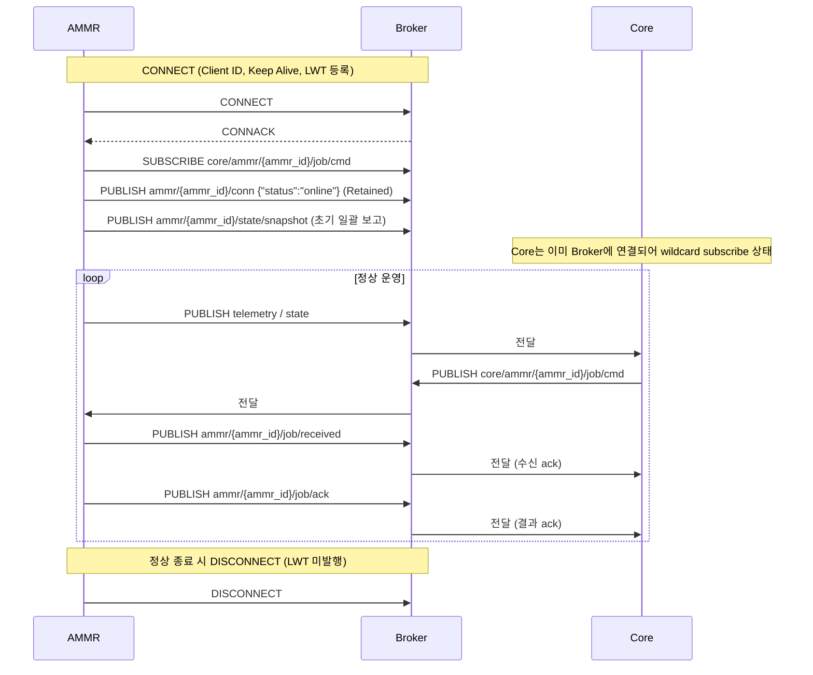

#### 비정상 단절 시나리오

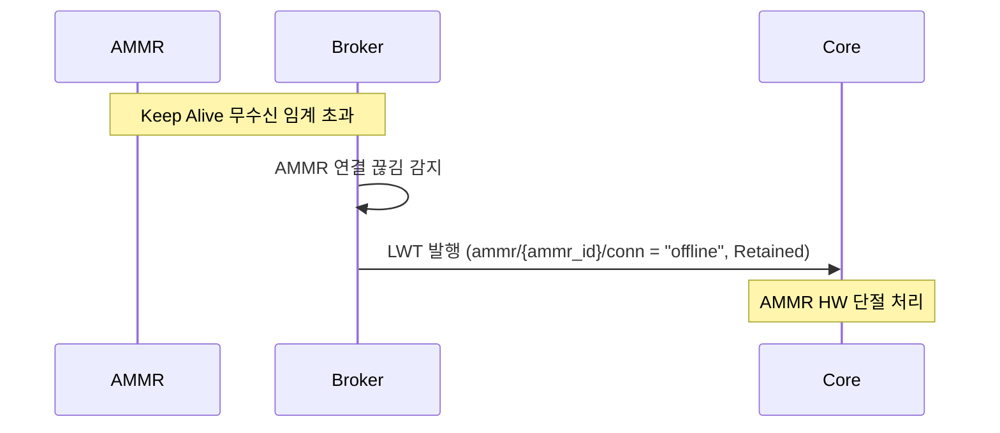

#### 핵심 파라미터 [협의]

| 항목                            | 제안값  | 비고                                                  |
|---------------------------------|---------|-------------------------------------------------------|
| MQTT Keep Alive                | 30초    | AMMR PINGREQ 주기. 두절 감지 임계의 1.5배 = 45초 내   |
| Clean Session                  | false   | 단절 시 Queue잉된 메시지 보존. [협의]                    |
| Client ID                      | `{ammr_id}` | 유일성 보장. AMMR 측에서 결정.                |

---

## 4. 메시지 카탈로그

이 절은 양방향 메시지 전체 목록을 요약한다. 상세 Payload 구조는 §5에서 정의한다.

### 4.1 AMMR → Core

| #   | Topic                              | 메시지 이름             | Trigger                                       | 주기·발행 조건            |
|-----|-----------------------------------|-------------------------|----------------------------------------------|---------------------------|
| A-1 | `ammr/{ammr_id}/state/snapshot`   | 초기 일괄 보고          | MQTT CONNECT 직후                            | 1회                       |
| A-2 | `ammr/{ammr_id}/state/hw`         | AMMR HW 상태 전이       | 상태 전이 시점                                | 전이 시점 Event          |
| A-3 | `ammr/{ammr_id}/state/slot`       | Slot 점유 Sensor 변화   | 외부 원인 Slot ON↔OFF 전이 시점              | 전이 시점 Event (1 Slot) |
| A-4 | `ammr/{ammr_id}/telemetry/pose`   | 위치 스트리밍           | 주기                                          | 1초 (HW 설정 가변)        |
| A-5 | `ammr/{ammr_id}/telemetry/bms`    | BMS 스트리밍            | 주기                                          | 5초 (HW 설정 가변)        |
| A-6 | `ammr/{ammr_id}/job/received`     | Job 지시 수신 ack       | Core Job 지시 수신 직후                       | 수신 시점 Event          |
| A-7 | `ammr/{ammr_id}/job/ack`          | Job 수행 결과 통합 보고 | Job 종료 시점                                 | Job 종료 Event           |
| A-8 | `ammr/{ammr_id}/conn`             | 연결 상태 (LWT)         | 단절 시 Broker 자동 발행 / 연결 시 AMMR 발행  | 발생 시점                 |

### 4.2 Core → AMMR

| #   | Topic                              | 메시지 이름   | Trigger          | 주기·발행 조건 |
|-----|-----------------------------------|---------------|-----------------|----------------|
| C-1 | `core/ammr/{ammr_id}/job/cmd`     | Job 지시      | Job 결정 시점   | Job 단위       |

Job 지시는 단일 Topic에서 `job_type` 필드로 4종(Move/Pickup/Dropoff/Charge)을 구분한다.

---

## 5. 메시지 상세 정의

각 메시지는 **공통 필드(§3.5)** 외에 다음 고유 필드를 갖는다. 필드 타입은 §부록 A 참고.

### 5.1 AMMR → Core 메시지

#### A-1. 초기 일괄 보고

- **Topic**: `ammr/{ammr_id}/state/snapshot`
- **Trigger**: AMMR이 Broker에 CONNECT 후 1회
- **목적**: Core가 권위 측 InMemory를 재구축하기 위한 최초 상태 일괄 제공

| 필드           | 타입               | 필수 | 설명                                                       |
|----------------|--------------------|------|------------------------------------------------------------|
| `hw_state`     | enum (§부록 A.1) | 필수 | 현재 AMMR HW 상태                                          |
| `pose`         | object             | 필수 | `{x: float, y: float, a: float}` — 현재 위치 + 방향각      |
| `slots`        | array[6]           | 필수 | 6 Slot 각각의 점유 정보 (아래 구조)                       |
| `battery`      | object             | 필수 | A-5 BMS 메시지의 필드 구조와 동일 (§부록 A.4 참조)        |

`slots` 항목 구조:

| 필드           | 타입         | 필수 | 설명                                                |
|----------------|--------------|------|-----------------------------------------------------|
| `slot_index`   | integer 0–5  | 필수 | Slot 번호                                           |
| `occupied`     | boolean      | 필수 | Slot Sensor ON/OFF                                  |
| `sensor_value` | string\|null | 선택 | Slot Sensor 식별값 (점유 시). [협의: 형식·필요 여부]|

**예시 JSON**

```json
{
  "ammr_id": "ammr_001",
  "timestamp": "2026-05-15T07:30:00.123Z",
  "hw_state": "idle",
  "pose": { "x": 12.5, "y": 3.7, "a": 1.57 },
  "slots": [
    { "slot_index": 0, "occupied": true,  "sensor_value": "S0_OCC" },
    { "slot_index": 1, "occupied": false, "sensor_value": null },
    { "slot_index": 2, "occupied": false, "sensor_value": null },
    { "slot_index": 3, "occupied": false, "sensor_value": null },
    { "slot_index": 4, "occupied": false, "sensor_value": null },
    { "slot_index": 5, "occupied": false, "sensor_value": null }
  ],
  "battery": { "soc": 87.3, "voltage": 50.1, "current": -2.1, "temperature": 28.5, "bmu_error": false, "battery_id": "BAT_A01" }
}
```

#### A-2. AMMR HW 상태 전이

- **Topic**: `ammr/{ammr_id}/state/hw`
  - **Trigger**: AMMR HW 상태 전이 시점 (Job 종료 통합 보고에 포함되지 않는 전이 — 충전 중→대기, 자기 진단, 저전력 진입 등)

| 필드          | 타입               | 필수 | 설명                                       |
|---------------|--------------------|------|--------------------------------------------|
| `hw_state`    | enum (§부록 A.1) | 필수 | 전이 후 상태                               |
| `prev_state`  | enum (§부록 A.1) | 선택 | 전이 전 상태 (디버깅 용도)                |
| `reason`      | string             | 선택 | 전이 사유 (예: `self_diagnostic_failed`)  |

**예시**: 충전 중 → 대기 자연 전이

```json
{
  "ammr_id": "ammr_001",
  "timestamp": "2026-05-15T07:35:12.456Z",
  "hw_state": "idle",
  "prev_state": "charging"
}
```

#### A-3. Slot 점유 Sensor 변화

- **Topic**: `ammr/{ammr_id}/state/slot`
- **Trigger**: 외부 원인(사람 개입 등)으로 Slot ON↔OFF 전이 시 1 Slot 단위 보고
- **주의**: Pickup·Dropoff Job 수행에 따른 Slot 변화는 이 메시지가 아닌 **Job 수행 결과 통합 보고(A-7)** payload에 포함되어 보고된다 (중복 보고 금지).

| 필드           | 타입         | 필수 | 설명                                              |
|----------------|--------------|------|---------------------------------------------------|
| `slot_index`   | integer 0–5  | 필수 | 전이 Slot 번호                                    |
| `occupied`     | boolean      | 필수 | 전이 후 ON/OFF                                    |
| `sensor_value` | string\|null | 선택 | Slot Sensor 식별값 (점유 시). [협의]              |

**예시**

```json
{
  "ammr_id": "ammr_001",
  "timestamp": "2026-05-15T07:40:23.789Z",
  "slot_index": 2,
  "occupied": true,
  "sensor_value": "S2_OCC"
}
```

#### A-4. 위치 스트리밍

- **Topic**: `ammr/{ammr_id}/telemetry/pose`
- **Trigger**: 1초 주기 (AMMR HW 설정 가변)
- **QoS**: 0 (연속값, 1건 누락 허용)

| 필드 | 타입  | 필수 | 설명                       |
|------|-------|------|----------------------------|
| `x`  | float | 필수 | x 좌표 (단위: m) [협의]   |
| `y`  | float | 필수 | y 좌표 (단위: m) [협의]   |
| `a`  | float | 필수 | 방향각 (단위: rad) [협의] |

**예시**

```json
{
  "ammr_id": "ammr_001",
  "timestamp": "2026-05-15T07:40:24.000Z",
  "x": 12.51,
  "y": 3.72,
  "a": 1.58
}
```

#### A-5. BMS 스트리밍

- **Topic**: `ammr/{ammr_id}/telemetry/bms`
- **Trigger**: 5초 주기 (AMMR HW 설정 가변)
- **QoS**: 0

| 필드           | 타입    | 필수 | 설명                                          |
|----------------|---------|------|-----------------------------------------------|
| `battery_id`   | string  | 필수 | Battery 팩 식별값                              |
| `soc`          | float   | 필수 | 충전 상태 (%, 0.0–100.0)                     |
| `voltage`      | float   | 필수 | 전압 (V)                                      |
| `current`      | float   | 필수 | 전류 (A) — 충전 시 양수, 방전 시 음수 [협의] |
| `temperature`  | float   | 필수 | 온도 (°C)                                     |
| `bmu_error`    | boolean | 필수 | BMU 오류 발생 여부                            |

**예시**

```json
{
  "ammr_id": "ammr_001",
  "timestamp": "2026-05-15T07:40:25.000Z",
  "battery_id": "BAT_A01",
  "soc": 87.1,
  "voltage": 50.0,
  "current": -2.0,
  "temperature": 28.6,
  "bmu_error": false
}
```

#### A-6. Job 지시 수신 ack

- **Topic**: `ammr/{ammr_id}/job/received`
- **Trigger**: AMMR이 `core/ammr/{ammr_id}/job/cmd` 수신 직후 1회
  - **목적**: Core가 AMMR 수신 여부 확인. 수신 ack 미수신 = 통신 문제 / 수신 ack 적용됨 + 결과 ack 늦음 = AMMR HW 문제 — 책임 분리

| 필드     | 타입          | 필수 | 설명                              |
|----------|---------------|------|-----------------------------------|
| `job_id` | string (UUID) | 필수 | Core 지시의 `job_id`              |

**예시**

```json
{
  "ammr_id": "ammr_001",
  "timestamp": "2026-05-15T07:41:55.123Z",
  "job_id": "job_8c4f..."
}
```

#### A-7. Job 수행 결과 통합 보고

- **Topic**: `ammr/{ammr_id}/job/ack`
- **Trigger**: Job 종료 시점 (Move/Pickup/Dropoff/Charge 각 종료)
- **핵심**: 이 메시지는 Job 수행 결과를 통합 보고하는 단일 메시지이다. payload 분기는 §7.2 참조.

| 필드                 | 타입               | 필수    | 설명                                                         |
|----------------------|--------------------|---------|--------------------------------------------------------------|
| `job_id`             | string             | 필수    | 대응되는 Job 지시의 `job_id`                                 |
| `job_type`           | enum (§부록 A.2) | 필수    | Move / Pickup / Dropoff / Charge                            |
| `hw_state`           | enum (§부록 A.1) | 필수    | Job 종료 직후 AMMR HW 상태                                  |
| `job_result`         | enum               | 필수    | `success` / `failure`                                       |
| `reason`             | enum (§부록 A.3) | 선택    | 실패 시 사유 (`ammr_hw_*` 또는 `slot_*`)                    |
| `slot_sensor_value`  | object             | 조건부 | Pickup·Dropoff 시 필수. AMMR Slot Sensor 식별값. 구조 아래. |

`slot_sensor_value` 구조 (Pickup·Dropoff Job에 한정):

| 필드           | 타입         | 필수 | 설명                                          |
|----------------|--------------|------|-----------------------------------------------|
| `slot_index`   | integer 0–5  | 필수 | 대상 AMMR Slot 번호                           |
| `occupied`     | boolean      | 필수 | Pickup 성공 시 true, Dropoff 성공 시 false  |
| `sensor_value` | string\|null | 선택 | Slot Sensor 식별값. [협의]                    |

**예시**: Pickup 성공

```json
{
  "ammr_id": "ammr_001",
  "timestamp": "2026-05-15T07:42:11.234Z",
  "job_id": "job_8c4f...",
  "job_type": "pickup",
  "hw_state": "idle",
  "job_result": "success",
  "slot_sensor_value": {
    "slot_index": 1,
    "occupied": true,
    "sensor_value": "S1_OCC"
  }
}
```

**예시**: Pickup 실패 (Slot 측 사유)

```json
{
  "ammr_id": "ammr_001",
  "timestamp": "2026-05-15T07:42:11.234Z",
  "job_id": "job_8c4f...",
  "job_type": "pickup",
  "hw_state": "idle",
  "job_result": "failure",
  "reason": "slot_source_empty",
  "slot_sensor_value": {
    "slot_index": 1,
    "occupied": false,
    "sensor_value": null
  }
}
```

**예시**: AMMR HW 장애 (모든 Job 결과에 적용 가능)

```json
{
  "ammr_id": "ammr_001",
  "timestamp": "2026-05-15T07:42:11.234Z",
  "job_id": "job_8c4f...",
  "job_type": "move",
  "hw_state": "error",
  "job_result": "failure",
  "reason": "ammr_hw_navigation_lost"
}
```

#### A-8. 연결 상태 (LWT)

- **Topic**: `ammr/{ammr_id}/conn`
- **Trigger (online)**: AMMR이 CONNECT 직후 직접 publish
- **Trigger (offline)**: AMMR HW와 Broker 연결 끊김 시 Broker가 LWT 자동 발행
- **Retained**: true (Core가 늦게 접속해도 즉시 인지)

| 필드     | 타입   | 필수 | 설명                                                           |
|----------|--------|------|----------------------------------------------------------------|
| `status` | enum   | 필수 | `online` / `offline`                                          |
| `reason` | string | 선택 | `offline`일 때 사유 (예: `broker_disconnect`, `clean_shutdown`)|

**예시**: 정상 연결

```json
{
  "ammr_id": "ammr_001",
  "timestamp": "2026-05-15T07:30:00.000Z",
  "status": "online"
}
```

**예시**: LWT (Broker 자동 발행)

```json
{
  "ammr_id": "ammr_001",
  "timestamp": "2026-05-15T08:00:45.000Z",
  "status": "offline",
  "reason": "broker_disconnect"
}
```

### 5.2 Core → AMMR 메시지

#### C-1. Job 지시

- **Topic**: `core/ammr/{ammr_id}/job/cmd`
- **Trigger**: Core의 Job 결정 시점
- **수신 후 책임**: AMMR은 이 메시지 수신 즉시 `ammr/{ammr_id}/job/received` 로 수신 ack를 보고하고, Job 수행 종료 시점에 `ammr/{ammr_id}/job/ack` 로 결과를 보고한다.
- **멱등성**: AMMR은 동일 `job_id` 중복 수신 시 1회만 처리한다 (QoS 1 중복 가능성 대비).

| 필드             | 타입             | 필수    | 설명                                                          |
|------------------|------------------|---------|---------------------------------------------------------------|
| `job_id`         | string (UUID)    | 필수    | Job 고유 ID. AMMR은 동일 ID로 결과 보고                       |
| `job_type`       | enum (§부록 A.2)| 필수    | Move / Pickup / Dropoff / Charge                             |
| `destination`    | object           | 조건부 | Move·Charge 시 필수. 목적지 좌표 또는 노드 ID. 구조 아래.    |
| `slot_target`    | object           | 조건부 | Pickup·Dropoff 시 필수. 외부 Slot + AMMR Slot Pair. 구조 아래.|
| `priority`       | integer          | 선택    | Job 우선순위 (디버깅·Logging 용도). [협의: 사용 여부]            |

`destination` 구조 [협의: 좌표 기반 vs 노드 ID 기반 선택]:

```jsonc
// 옵션 A: 좌표 기반
{ "x": 15.2, "y": 8.4, "a": 0.0 }

// 옵션 B: 노드 ID 기반 (AMMR HW가 사내 지도 보유)
{ "node_id": "WIP_GEN_A_IN" }
```

`slot_target` 구조 (Pickup·Dropoff Job):

| 필드                  | 타입         | 필수 | 설명                                                           |
|-----------------------|--------------|------|----------------------------------------------------------------|
| `external_location`   | object       | 필수 | 외부 Slot 정보 — `destination`과 동일 구조 (좌표 또는 node ID)|
| `ammr_slot_index`     | integer 0–5  | 필수 | Pickup 시 적재할 / Dropoff 시 내릴 AMMR Slot 번호             |

**예시**: Move

```json
{
  "ammr_id": "ammr_001",
  "timestamp": "2026-05-15T07:41:55.000Z",
  "job_id": "job_8c4f...",
  "job_type": "move",
  "destination": { "node_id": "WIP_GEN_A_IN" }
}
```

**예시**: Pickup

```json
{
  "ammr_id": "ammr_001",
  "timestamp": "2026-05-15T07:42:00.000Z",
  "job_id": "job_9d5a...",
  "job_type": "pickup",
  "slot_target": {
    "external_location": { "node_id": "WIP_GEN_A_OUT_3" },
    "ammr_slot_index": 1
  }
}
```

**예시**: Dropoff

```json
{
  "ammr_id": "ammr_001",
  "timestamp": "2026-05-15T07:45:00.000Z",
  "job_id": "job_ae6b...",
  "job_type": "dropoff",
  "slot_target": {
    "external_location": { "node_id": "CNC_2_IN" },
    "ammr_slot_index": 1
  }
}
```

**예시**: Charge

```json
{
  "ammr_id": "ammr_001",
  "timestamp": "2026-05-15T08:10:00.000Z",
  "job_id": "job_bf7c...",
  "job_type": "charge",
  "destination": { "node_id": "CHARGE_STATION_1" }
}
```

---

## 6. 통신 흐름·Sequence

### 6.1 초기 연결 및 일괄 보고

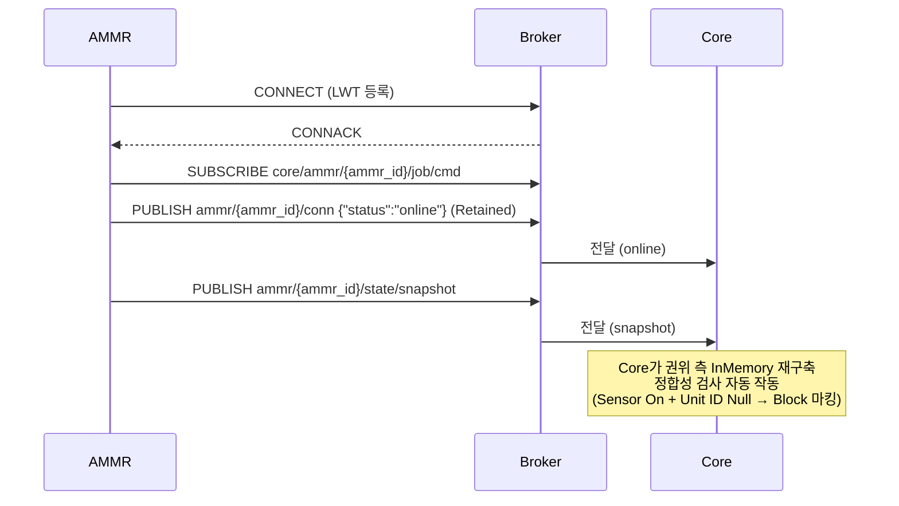

### 6.2 Job Sequence (Transfer 전개)

Core는 1 Transfer를 Job 4개 Sequence(Move → Pickup → Move → Dropoff)로 전개하여 **한 번에 하나씩** 지시한다. 각 Job 지시 후 AMMR은 수신 ack(`job/received`)를 보고하고, Job 종료 시점에 결과 ack(`job/ack`)를 보고한다.

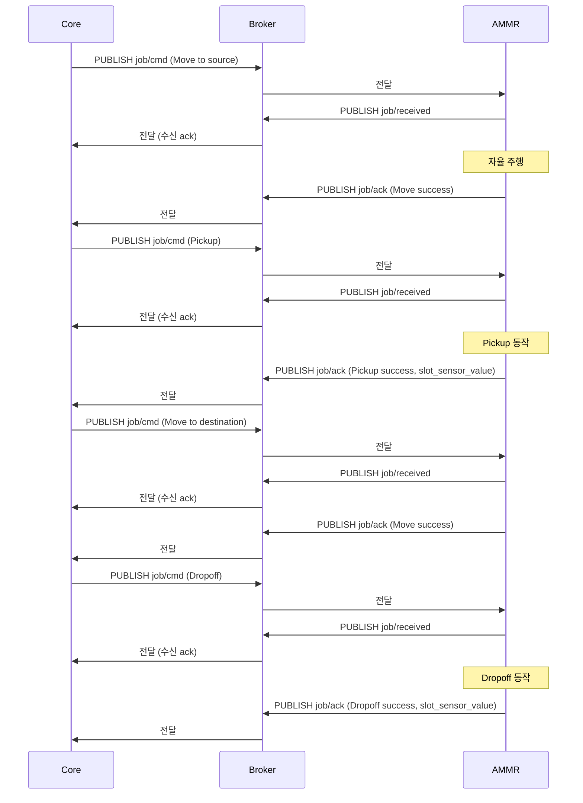

**주의**: AMMR은 Core의 다음 Job 지시 전에는 자체적으로 다음 동작을 수행하지 않는다. 1 Job 종료 → 결과 보고 → Core 판정 → 다음 Job 지시의 순환이다.

### 6.3 Charge Job Sequence

Charge는 Core가 자체 결정하여 Move → Charge 2 Job으로 지시한다. 도킹·충전·이탈·충전 중단 결정은 AMMR HW 자율 영역이다.

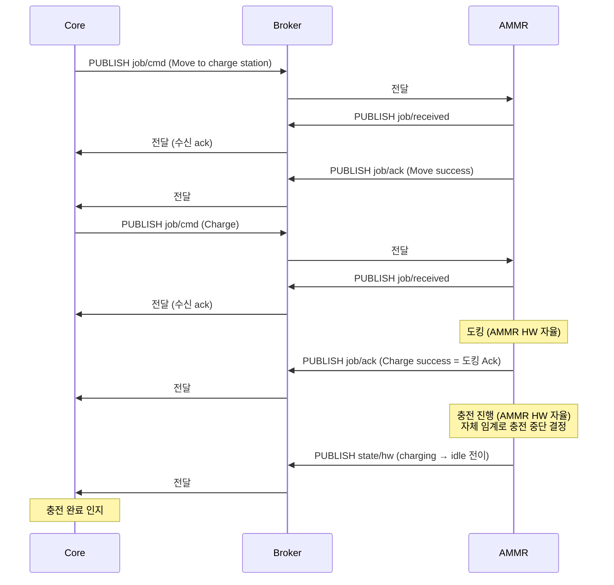

### 6.4 사람 개입에 따른 Slot Sensor 외부 전이

사람이 AMMR Slot에서 Unit을 임의로 꺼내거나 다른 Unit으로 교체하는 경우 등 외부 원인 전이.

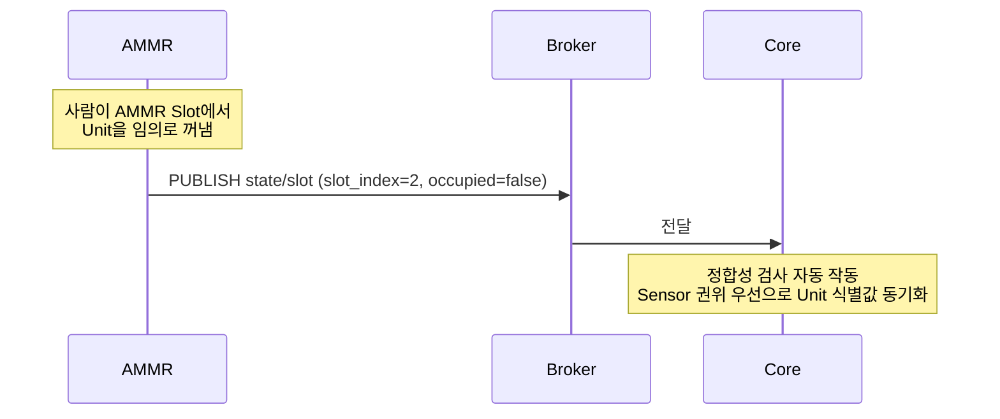

### 6.5 AMMR HW 장애 보고

AMMR HW가 물리적으로 실패한 경우. Job 수행 결과 통합 보고 payload 또는 별도 상태 전이 Event로 보고된다.

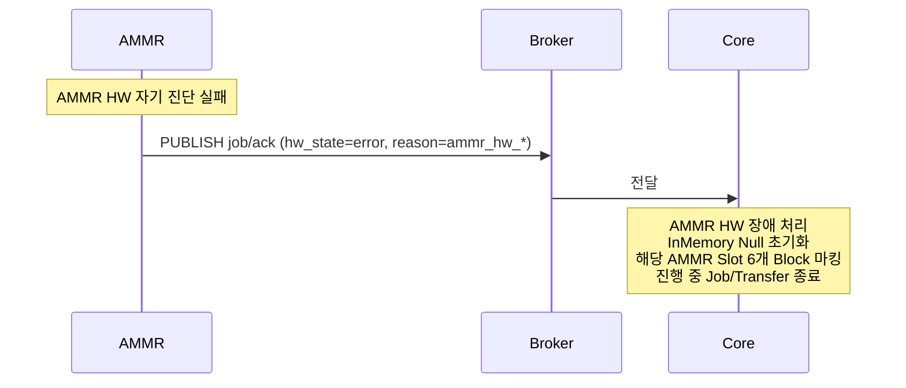

`hw_state=error` 가 보고되면 Core는 **payload 전체 신뢰 없음**로 간주하여 Slot Sensor 식별값 부분은 무시하고 InMemory를 Null 초기화한다.

### 6.6 AMMR HW 단절 (Last Will)

MQTT 경로는 살아있으나 AMMR HW가 Broker와의 연결을 잃은 경우. Broker가 LWT를 자동 발행한다.

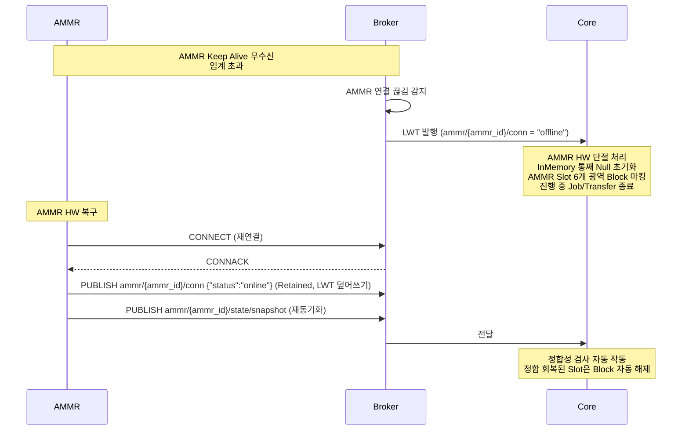

### 6.7 Core 재시작 시 재동기화

Core가 재시작되면 InMemory 상태가 소실되므로 AMMR으로부터 재수신으로 권위를 재구축한다.

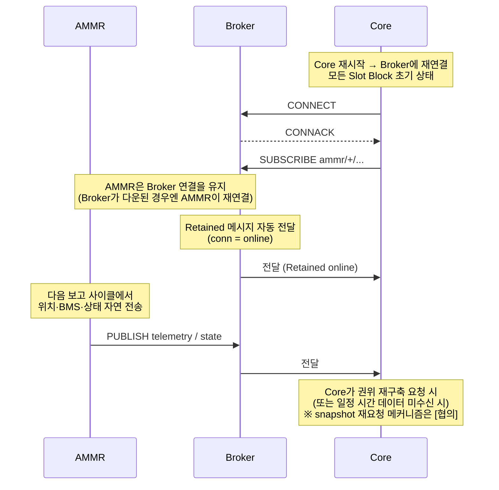

**[협의]** Core 재시작 시 AMMR에게 일괄 보고(snapshot) 재전송을 요청하는 메커니즘 도입 여부. 옵션 — (a) Core가 별도 명령 Topic으로 요청 / (b) AMMR이 일정 주기마다 자체 snapshot 재전송 / (c) Retained된 최신 state Topic으로 자연 재수신.

---

## 7. 오류 처리·재시도·Timeout

### 7.1 Reason 코드 분류

  Job 실패 시 `reason` 필드에 사유를 기재한다. 이 ICD는 분류 체계와 대표 코드를 정의하며, 구체 코드 Mapping은 **[협의]** 후 §부록 A.3에서 확정한다.

#### AMMR HW 측 카테고리 (`ammr_hw_*`)

| 코드 (제안)                  | 의미                                  |
|------------------------------|---------------------------------------|
| `ammr_hw_navigation_lost`    | 자율 주행 실패 (위치 측위 불능 등)   |
| `ammr_hw_manipulator_fault`  | Manipulator 동작 실패                |
| `ammr_hw_vision_fault`       | Vision Sensor 실패                   |
| `ammr_hw_self_diagnostic`    | 자기 진단 실패                       |
| `ammr_hw_other`              | 그 외 AMMR HW 측 사유                |

이 카테고리 보고 시 Core는 **payload 전체 신뢰 없음**로 간주하여 InMemory Null 초기화 + Slot 6개 광역 Block 마킹을 수행한다.

#### Slot 측 카테고리 (`slot_*`)

| 코드 (제안)               | 의미                                                              |
|---------------------------|-------------------------------------------------------------------|
| `slot_source_empty`       | Pickup 출발 Slot이 비어 있음 (도착 시 Sensor OFF)                |
| `slot_dest_occupied`      | Dropoff 목적지 Slot이 점유됨 (도착 시 Sensor ON)                 |
| `slot_dest_obstructed`    | Dropoff 시 물리 충돌 감지 (Vision Sensor)                        |
| `slot_other`              | 그 외 Slot 측 사유                                                |

이 카테고리 보고 시 Core는 Slot 측 정합성 검사 + 동적 Fallback을 적용한다.

### 7.2 Job 결과 실패 처리 (payload 분기)

Job 수행 결과 통합 보고의 payload는 다음 4가지로 분기되어 Core가 처리한다.

| #   | payload 조합                                                                  | Core 처리                                                          |
|-----|-------------------------------------------------------------------------------|--------------------------------------------------------------------|
| 1   | `hw_state = error` (job_result·reason 무관)                                   | AMMR HW 장애 처리 — InMemory Null + Slot 6개 광역 Block            |
| 2   | `hw_state = idle/charging` + `job_result = failure` + `reason = ammr_hw_*`   | (1)과 동일 처리                                                    |
| 3   | `hw_state = idle/charging` + `job_result = failure` + `reason = slot_*`      | Slot Sensor 식별값 InMemory 갱신 → 정합성 검사 → Fallback 진입     |
| 4   | `hw_state = idle/charging` + `job_result = success`                           | 정상 갱신 → 다음 Job 진행 / Transfer 완료                          |

### 7.3 Keep Alive / Last Will 임계값

**[협의]** 사내 망 환경과 운영 안정성 측정 결과에 따라 확정한다.

| 항목                          | 제안값  | 비고                                                                  |
|-------------------------------|---------|-----------------------------------------------------------------------|
| MQTT Keep Alive               | 30초    | AMMR이 PINGREQ를 보내는 주기                                          |
| Broker 측 단절 감지 임계       | 45초    | Keep Alive × 1.5 (MQTT 표준 권장)                                     |
| LWT 발행 → Core 인지            | 즉시    | Broker가 자동 발행, Core가 wildcard subscribe로 수신                  |
| Job 지시 수신 ack 임계 (Core 측) | 3초     | Core가 Job 지시 후 `job/received` 수신을 기다리는 timeout. 운영 결과 및 AMMR 통신 지연 특성에 따라 조정 가능. |

### 7.4 재시도 정책

| 시나리오                       | AMMR 측 동작                                              | Core 측 동작                                                |
|--------------------------------|-----------------------------------------------------------|-------------------------------------------------------------|
| Broker 연결 끊김              | 자동 재연결 시도 (Backoff). 재연결 후 snapshot 재전송      | LWT 수신 → AMMR HW 단절 처리                                |
| Job 지시 미수신                | (QoS 1 + Clean Session = false로 Broker가 Queue잉)          | (재발행 필요 없음)                                                |
| Job 지시 수신 ack 미수신      | (해당 없음)                                               | AMMR HW 단절과 동일 처리                                    |
| Job 결과 미수신 (Core 측)     | (해당 없음 — AMMR은 1회만 보고)                          | 두절·장애 처리로 자연 처리 (별도 재요청 없음)               |
| 결과 메시지 중복 수신          | (해당 없음)                                               | `job_id`로 멱등 처리                                         |
| Job 지시 중복 수신             | `job_id`로 멱등 처리 (1회만 수행)                        | (재발행 필요 없음)                                                |

**핵심**: Core는 진행 중이던 Job의 결과 재보고를 요청하지 않는다. 두절 후 재연결 시 snapshot 재전송으로 자연 재동기화한다. 수신 ack 미수신은 AMMR HW 단절과 동일하게 처리한다.

---

## 8. AMMR HW 자율 동작 영역

이 영역은 Core 간섭 없이 AMMR HW가 자체 처리하는 영역이다. AMMR 업체의 구현 책임이다.

### 8.1 자율 주행

- 위치 측위, 경로 결정, 장애물 회피, 물리적 이동의 모든 세부.
- Core는 `destination` 정보만 제공하고, 경로는 AMMR HW가 결정한다.

### 8.2 도킹 / 충전 / 이탈

- 충전 스테이션 도킹의 물리 절차.
- 충전 동작 자체.
- 도킹 완료 시점에 **Charge Job 수행 결과(`job/ack`)** 1회 보고 → "도킹 Ack" 의 의미.
- 이후 충전 진행·완료는 AMMR HW가 자율 처리하며, **충전 완료 시점에 `state/hw` 로 `charging → idle` 전이를 별도 보고**한다.
- 충전 중단 결정(자체 임계 도달, 80% 완충 등)은 AMMR HW 자체 처리.

### 8.3 저전력 자율 충전

- Battery 20% 이하 진입 시 AMMR HW가 자체적으로 다음 동작을 수행한다.
  - 현재 진행 중 단위 Job 완료 후 자율 충전존 이동·충전·완충
  - 이 동작 진입 시 `state/hw` 로 `low_battery` 보고
  - 완충(80%) 시점에 `state/hw` 로 `idle` 전이 보고

이 자율 동작은 Core 다운 여부와 무관하게 작동한다.

### 8.4 Core 다운 중 자율 동작

- Core가 다운된 동안 진행 중이던 Job은 완료까지 수행한다.
- 완료 후 AMMR은 그 위치에서 대기한다 (자율 충전존 복귀 없음, 단 §8.4 저전력 자율 충전은 예외).
- Core 복구 시 AMMR으로부터 재수신으로 자연 재동기화한다.

---

## 9. 인증·보안

  **[협의]** 이 절은 전 영역이 협의 대상이다. 이 ICD는 최소 권장 사항만 기재한다.

### 9.1 MQTT 인증 방식

옵션 제안:

| 옵션             | 설명                                                                      |
|------------------|---------------------------------------------------------------------------|
| (a) 사용자명/비밀번호 | MQTT CONNECT Payload의 username/password. 최소 보안 수준               |
| (b) TLS + 위 (a) | TLS 8883 Port + 사용자명/비밀번호. 사내망 전제 시 권장                   |
| (c) Mutual TLS  | 클라이언트 인증서 기반. 고보안 환경 (사내망 + 외부 노출 가능성 있을 시) |

### 9.2 Topic 권한

Broker(Mosquitto) 측에 다음과 같은 ACL을 적용 제안.

| 클라이언트     | 허용 권한                                                                  |
|----------------|----------------------------------------------------------------------------|
| AMMR `{ammr_id}` | Publish: `ammr/{ammr_id}/#` / Subscribe: `core/ammr/{ammr_id}/#`           |
| Core           | Publish: `core/ammr/+/#` / Subscribe: `ammr/+/#`                          |

각 AMMR은 자기 `ammr_id` 외 다른 AMMR의 Topic에 publish할 수 없다.

### 9.3 사내 내부망 전제

- 이 시스템은 사내 내부망 한정 운영. 외부 인터넷 노출 없음.
- 방화벽·NAT 설정은 운영팀 영역.

---

## 10. 부록

### A. 데이터 타입·enum 정의

#### A.1 AMMR HW 상태 (`hw_state`)

| 값             | 의미                                                                       |
|----------------|----------------------------------------------------------------------------|
| `idle`         | 대기 — 작업 배정 대기 중 (충전 완료 후 또는 작업 종료 후)                 |
| `moving`       | 이동 중 — Move Job 수행 중                                                |
| `working`      | 작업 중 — Pickup·Dropoff Job 수행 중                                      |
| `charging`     | 충전 중 — 충전존에서 충전 중                                              |
| `low_battery`  | 저전력 — HW 자체 임계 통과 (Battery 20% 이하 진입). 자율 충전 동작 진입   |
| `error`        | 장애 — 고장 또는 수리 중                                                  |

[협의: enum 값 영문 표기 vs 한글 표기. 이 ICD는 영문 권장]

#### A.2 Job 종류 (`job_type`)

| 값          | 의미                                                |
|-------------|-----------------------------------------------------|
| `move`      | 지정 위치로 자율 주행                              |
| `pickup`    | 외부 Slot에서 AMMR Slot으로 Unit 적재             |
| `dropoff`   | AMMR Slot에서 외부 Slot으로 Unit 하역             |
| `charge`    | 충전 스테이션에서 도킹·충전                       |

#### A.3 Reason 코드 (`reason`)

§7.1 참조. 구체 코드 Mapping은 [협의] 후 이 절에서 확정.

#### A.4 BMS 필드 단위

| 필드          | 단위    | 범위           |
|---------------|---------|----------------|
| `soc`         | %       | 0.0–100.0      |
| `voltage`     | V       | (Battery 사양) |
| `current`     | A       | (Battery 사양) |
| `temperature` | °C      | (Battery 사양) |

#### A.5 좌표·방향각 단위 [협의]

| 필드  | 단위         |
|-------|--------------|
| `x`   | m            |
| `y`   | m            |
| `a`   | rad (0~2π) |

[협의: m vs mm, rad vs deg, 좌표계 원점·방향]

### B. 변경 이력

| 버전         | 일자       | 변경 내용                                                                 |
|--------------|------------|---------------------------------------------------------------------------|
| v0.1 (Draft) | 2026-05-15 | 초안 작성 (Core SRS v2.0 Draft / Core SAD v1.0 Draft 기반)                |
| v0.1 (Draft) | 2026-05-15 | 외부 표기 정리·표기 일관성·수신 ack 도입·헤더 표기 통일 (자체 Review 라운드 1) |
| v0.1 (Draft) | 2026-05-15 | 자체 Review 라운드 2 — 변경 이력 d1/d2 분리                                |
| v0.1 (Draft) | 2026-05-15 | 자체 Review 라운드 3 — §10.B 표 정렬·§10.C #20 관련 절 보충             |
| v0.1 (Draft) | 2026-05-15 | 수신 ack 사항 SRS d67 sync + §10.C #20 행 제거·표 정렬                    |
| v0.1 (Draft) | 2026-05-19 | 외부전달 Fork 어휘 자연어화 적용 (인수인계 §6.19에 따른 어휘 풀이)           |

### C. 미정·협의 사항 일람

이 문서 작성 시점 기준 업체 협의가 필요한 항목 일람.

| #  | 분류          | 항목                                                                       | 관련 절      |
|----|---------------|----------------------------------------------------------------------------|--------------|
| 1  | 프로토콜      | MQTT 버전 (v3.1.1 vs v5.0)                                                 | §3.1        |
| 2  | Topic          | Topic prefix·구분자·식별자 정책                                           | §3.3        |
| 3  | Topic          | `ammr_id` 식별자 형식·할당 방식                                           | §3.3        |
| 4  | QoS·Retained | Topic별 QoS 레벨 확정                                                       | §3.4        |
| 5  | QoS·Retained | Retained 적용 Topic 확정                                                    | §3.4        |
| 6  | 인코딩        | Payload 인코딩 (JSON vs Protobuf 등)                                      | §3.5        |
| 7  | 공통 필드     | `msg_id` 필드 필수 여부                                                    | §3.5        |
| 8  | 수명 주기     | MQTT Keep Alive 값                                                         | §3.6, §7.3 |
| 9  | 수명 주기     | Clean Session 정책                                                         | §3.6        |
| 10 | Slot Sensor   | `sensor_value` 필드 형식 (string 구조)·필요 여부                          | §5.1        |
| 11 | 좌표          | `destination` 구조 (좌표 기반 vs 노드 ID 기반 vs 양립)                     | §5.2        |
| 12 | 좌표          | 좌표 단위 (m vs mm), 방향각 단위 (rad vs deg), 좌표계 원점·방향           | §부록 A.5   |
| 13 | BMS           | `current` 부호 규약 (충전 +/방전 - vs 반대)                                | §5.1.A-5    |
| 14 | Reason 코드   | `ammr_hw_*` / `slot_*` 코드 Mapping 확정                                      | §7.1, §A.3 |
| 15 | enum          | `hw_state` 등 enum 값 영문 vs 한글 표기                                    | §A.1        |
| 16 | Job 우선순위  | `priority` 필드 사용 여부                                                  | §5.2        |
| 17 | 재동기화      | Core 재시작 시 snapshot 재요청 메커니즘 (Core 명령 / 주기 자체 재전송 / Retained)| §6.7        |
| 18 | 인증          | MQTT 인증 방식 ((a) 사용자명/비밀번호 / (b) TLS+사용자명 / (c) Mutual TLS) | §9.1        |
| 19 | Topic 권한     | Broker ACL 정책 적용 여부                                                  | §9.2        |
