# Core ↔ 물류 AMMR Interface Control Document

> 이 문서는 `Core_ICD_AMMR_v1_3_0_d355.md` 기준으로 작성되었습니다.
> 최종 업데이트: 2026-09-17 14:58

---

## 1. 문서 개요

### 1.1 목적

이 문서는 Core 시스템과 물류 AMMR 사이의 통신 인터페이스를 정의한다. AMMR 업체가 이 문서를 기반으로 Core와의 통신 모듈을 구현·검증할 수 있도록 작성된다.

이 문서의 모든 항목은 Core가 확정한 값이며, AMMR 측 구현이 이 값에 맞춘다. 이 문서가 정한 것이 기준 본체(Core SRS·SAD)와 충돌하면 기준 본체가 우선하며, 이 문서는 운영 합의 영역만 권위로 갖는다.

### 1.2 범위

이 문서는 **Core ↔ 물류 AMMR** 인터페이스 한정이다. AMMR에 Mount된 태블릿도 이 인터페이스의 수신·표시 단말로서 범위에 포함된다. 태블릿은 AMMR과 함께 Core와 MQTT로 통신하며 별도 통신 채널을 사용하지 않고, 태블릿 소프트웨어는 AMMR 업체가 자체 개발한다 (Core는 "AMMR 태블릿 UI 정의 제안" 문서로 UI 정의만 제공).

다음은 이 문서 범위 밖이다.

- AMMR HW 내부 제어 로직 (자율 주행·도킹·충전 등 — 업체 영역)
- Core 내부 구현 (Core 영역)
- Core와 다른 외부 시스템 간 인터페이스
- 태블릿 화면 구성·디자인 세부 (별도 문서 "AMMR 태블릿 UI 정의 제안" 참조)
- CNC 공정 AMMR (별개 장비, 이 문서의 "AMMR"은 물류 AMMR만 가리킨다)

### 1.3 용어 및 약어

| 약어         | 의미 |
|--------------|---|
| Core         | 물류 작업 시스템 (메인 서버) |
| AMMR         | Autonomous Mobile Manipulator Robot (자율 이동 Manipulator 로봇) |
| 태블릿       | AMMR 본체에 Mount되는 표시·설정 단말. AMMR과 함께 Core와 MQTT로 통신 |
| MQTT         | Message Queuing Telemetry Transport (메시지 Queue Telemetry 프로토콜) |
| Broker       | MQTT 메시지 중계 미들웨어 (이 시스템: Mosquitto) |
| LWT          | Last Will and Testament (MQTT 단절 시 자동 발행 메시지) |
| QoS          | Quality of Service (MQTT 전달 보증 수준 0/1/2) |
| Slot         | 1 Unit이 적재되는 물리적 위치. AMMR은 6 Slot 보유 |
| Unit         | Core가 추적하는 적재 단위 (1 Slot에 1 Unit) |
| Unit ID      | Unit마다 유니크한 시스템 권위 식별값(UUID). Core가 부여·관리하며 실물에는 인쇄되지 않는다. Job 지시 선탑재·일괄보고 응답으로 Core가 내려준다 |
| Tray ID      | Tray마다 유니크한 시스템 권위 식별값(UUID). 각 Tray의 QR 코드에 인코딩된다. Core가 이 값으로 소속 Unit을 판정하므로 한 Unit의 어느 Tray 값이든 같은 Unit으로 풀린다. 담당자가 태블릿에 넣어 들어온다 |
| 라벨         | `투입코드_유닛번호` 형식의 사람 읽기용 Unit 표기 (예: `26SF03002001_001`). 태블릿이 Core 선탑재 `input_code`+`unit_num`으로 조립한다. 투입코드 = Core 제공 값 그대로(가공 없음) · 유닛번호 = Core가 담당자 실입고 수량을 Unit으로 나눌 때 부여하는 일련번호 |
| WIP          | Work In Process (공정의 Unit 대기 Slot을 갖춘 설비) |
| Job          | Core가 한 번에 지시하는 AMMR 수행 단위 (4종·§부록 A.2) |
| FMS          | Fleet Management System (AMMR 주행 관제 시스템. AMMR이 위치 측위·경로·이동 정보를 이 시스템에서 받는다) |
| Safety Field | 안전 라이다가 감시하는 보호 영역. 이 영역에 물체가 들어오면 AMMR이 일시 정지한다 (§8.8) |
| BMS          | Battery Management System |
| BMU          | Battery Management Unit |
| SoC          | State of Charge (Battery 충전 상태, %) |

---

## 2. 시스템 Context

### 2.1 시스템 구성

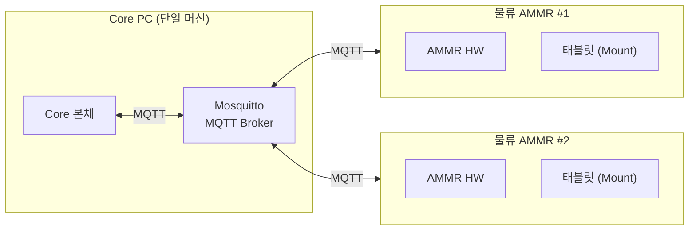
```mermaid
flowchart LR
    subgraph CorePC["Core PC (단일 머신)"]
        CoreApp["Core 본체"]
        Mosquitto["Mosquitto<br/>MQTT Broker"]
        CoreApp <-->|MQTT| Mosquitto
    end

    subgraph AMMR1["물류 AMMR #1"]
        HW1["AMMR HW"]
        TAB1["태블릿 (Mount)"]
    end

    subgraph AMMR2["물류 AMMR #2"]
        HW2["AMMR HW"]
        TAB2["태블릿 (Mount)"]
    end

    Mosquitto <-->|MQTT| AMMR1
    Mosquitto <-->|MQTT| AMMR2
```

- **Core PC** — Core 본체 프로세스와 Mosquitto Broker가 같은 PC에서 운영된다.
- **물류 AMMR** — 현재 2대 운영. 추후 증설 가능성 있음. 각 AMMR은 Broker에 클라이언트로 접속한다.
- **태블릿** — AMMR 본체에 Mount된다. AMMR과 함께 Core와 MQTT로 통신하는 단말이며 별도 통신 채널이 없다. 적재 상태·배정 상태 표시 정보는 Core가 Job 지시(C-2)에 선탑재하고, 상단 고정 영역 표시값과 slot_state는 태블릿이 자체 산출한다. 태블릿은 선탑재 값과 자체 산출을 결합해 화면을 구성하며, 정합이 어긋나면 Core가 일괄보고 응답(C-3)으로 정정한다.
- **연결 망** — 사내 내부망 한정. 외부 인터넷 노출 없음.

### 2.2 Core와 AMMR의 역할 분담

| 영역                                          | 주체                      | 비고 |
|-----------------------------------------------|---------------------------|---|
| Job 결정 (Move/Pickup/Dropoff/Charge)         | Core                      | 이송 요청을 Job Sequence로 전개하여 한 Job씩 지시 |
| Job 물리 수행                                 | AMMR                      | 자율 주행, Pickup·Dropoff 동작, 도킹·충전 등 |
| Job 지시 수신 확인                            | AMMR                      | Core Job 지시 수신 직후 즉시 |
| Job 수행 결과 보고                            | AMMR                      | Job 종료 시 통합 보고 |
| AMMR HW 상태 보고                             | AMMR                      | 초기 연결 일괄 + 상태 전이 시점 |
| Slot 정합 판정 결과 보고 (slot_state)         | AMMR                      | 초기 연결 일괄 + 상태 전이 시 1 Slot (Job 동작·사람 개입 무관) |
| 위치·BMS 스트리밍                             | AMMR                      | 위치 1초·BMS 10초 주기 (초기값·태블릿 설정) |
| Unit 식별 (Unit ID 확정)                      | Core                      | AMMR은 Tray ID를 자체 인식하지 못한다. Core가 Job 지시(C-2)에 Unit 정보를 선탑재해 태블릿이 보관하며, 정합이 어긋나면 일괄보고 응답(C-3)으로 확정 Unit 정보·Job 배정을 내려줌 |
| 태블릿 표시 데이터 (적재·배정·상단 고정 영역) | Core 선탑재 / 태블릿 구성 | Core가 Job 지시(C-2)에 선탑재 · 상단 고정 영역·slot_state는 AMMR 자체 산출 · 정합 정정만 일괄보고 응답(C-3) |
| 충전 중단 결정                                | AMMR / Core               | 자체 임계 도달 시 자율 중단은 AMMR HW. 단, 충전 중 Core가 Job을 지시하면 AMMR은 충전을 중단하고 이탈 후 수행 (§8.5) |
| 최근 명령 재요청·재발행                       | AMMR / Core               | 담당자가 태블릿에서 요청하면 AMMR이 발행하고, Core는 그 AMMR에 마지막으로 발행한 Job을 그대로 다시 지시한다 (§6.9) |

### 2.3 AMMR HW ↔ Core 권위 분담

다음 표는 어떤 데이터를 어느 쪽이 권위로 갖는지를 정리한다. AMMR이 권위인 데이터는 AMMR이 Core에 보고하고, Core가 권위인 데이터는 Core가 자체 판정 후 회신 메시지로 내려주거나 운영에 사용한다.

| 항목                                                   | 권위 매체                 | 비고 |
|--------------------------------------------------------|---------------------------|---|
| 위치 (node_id, x, y, a) 스트리밍                       | AMMR                      | 1초 주기 (초기값·태블릿 설정) |
| AMMR HW 상태 전이                                      | AMMR                      | 12종 (§부록 A.1) |
| Slot 정합 판정 결과 (slot_state·6 Slot)                | AMMR                      | 초기 일괄 또는 상태 전이 시 1 Slot (Job 동작·사람 개입 무관) |
| Job 지시 수신                                          | AMMR                      | Core Job 지시 수신 즉시 보고 |
| Job 수행 결과 (Move/Pickup/Dropoff/Charge)             | AMMR                      | Job 종료 시 통합 보고 |
| Battery (raw % 스트리밍)                               | AMMR                      | 10초 주기 (초기값·태블릿 설정) |
| Battery 자체 임계 (충전 종료·재충전·저전력 진입)       | AMMR                      | AMMR이 보유·태블릿 설정 화면에서 변경 (초기값: 충전 종료 80% / 재충전 70% / 저전력 20%). 자율 충전 판단 기준값이다 |
| Battery 저전력 분류 (Core 운영 판단)                   | Core (자체 판정)          | Core가 수신한 Battery raw %를 자체 기준으로 분류 — AMMR이 별도 보고하지 않고, Core도 분류 결과를 AMMR에 전달하지 않음 |
| Unit ID                                                | Core (자체 판정)          | AMMR은 Tray ID를 자체 인식하지 못한다. 태블릿 보관값이 일괄 보고에 실리며, Slot의 Unit 정보 확정은 Core가 회신으로 내려줌 |
| 태블릿 표시 데이터 (Unit 정보·Job 배정·상단 고정 영역) | Core 선탑재 / 태블릿 구성 | Job 지시(C-2) 선탑재 + AMMR 자체 산출 · 정합 정정만 일괄보고 응답(C-3) |
| 충전 스테이션 위치                                     | AMMR                      | 태블릿 설정 화면의 충전 스테이션 번호가 단일 출처. Core는 충전 스테이션을 지정·보유하지 않음 (§8.6) |
| Job 결정                                               | Core                      | AMMR은 Core 지시를 수행 |
| 운전 모드 (자동·수동)                                  | AMMR                      | 담당자가 태블릿에서 바꿔 AMMR이 보유·재접속 후에도 유지·재시작하면 수동으로 시작. 모든 발신 메시지 `header.mode`로 보고 (§8.9) |

---

## 3. 통신 아키텍처

### 3.1 프로토콜

Core와 AMMR은 **MQTT v5.0** 으로 통신한다.

- Broker: **Eclipse Mosquitto** (Core PC에 함께 운영)
- Core, AMMR 양측 모두 Broker에 클라이언트로 접속해 Publish/Subscribe 방식으로 통신한다.
- AMMR HW 단절은 MQTT Last Will로 Core가 인지한다.

### 3.2 연결 구조

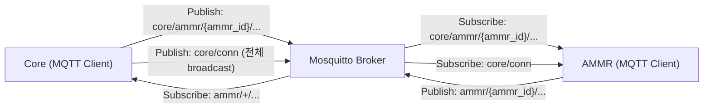
```mermaid
flowchart LR
    Core["Core (MQTT Client)"]
    Broker["Mosquitto Broker"]
    AMMR["AMMR (MQTT Client)"]

    Core -->|"Publish: core/ammr/{ammr_id}/..."| Broker
    Broker -->|"Subscribe: core/ammr/{ammr_id}/..."| AMMR
    Core -->|"Publish: core/conn (전체 broadcast)"| Broker
    Broker -->|"Subscribe: core/conn"| AMMR

    AMMR -->|"Publish: ammr/{ammr_id}/..."| Broker
    Broker -->|"Subscribe: ammr/+/..."| Core
```

- **AMMR** — 자기 `ammr_id` 기준 Topic을 publish하고, Core가 자기에게 내리는 Topic(`core/ammr/{ammr_id}/#`)과 Core 연결 상태(`core/conn`)를 subscribe한다.
- **Core** — 모든 AMMR의 Topic을 wildcard subscribe하고, AMMR별 Topic(`core/ammr/{ammr_id}/…`)은 특정 AMMR에게 publish한다. 자신의 연결 상태(`core/conn`)는 전체 AMMR에 broadcast한다.

### 3.3 Topic 명명 규약

`{ammr_id}`는 AMMR 식별자다. 형식은 `AMMR-LOGI001`, `AMMR-LOGI002` 형태의 문자열이며, 값은 운영(설치) 시점에 Core 측이 할당한다. Topic 경로에는 이 값을 소문자로 바꿔 넣는다. `AMMR-LOGI001`이면 `ammr/ammr-logi001/conn` 형태다. MQTT Topic은 대소문자를 구분하므로 소문자 표기가 계약이며, 이 소문자 값은 MQTT 접속 사용자명(§9.1)과 같다. payload의 `ammr_id` 필드에는 할당받은 식별자 값을 그대로 싣는다. 이 식별자 값은 자격증명과 함께 설치 시 Core 측이 제공하며, AMMR이 보유해 payload와 화면 표시에 쓴다. AMMR은 이 식별자 하나로 Broker에 접속하며, 한 식별자에 접속은 하나다(§3.6).

#### AMMR → Core (AMMR이 publish, Core가 subscribe)

| Topic                           | 내용 |
|---------------------------------|---|
| `ammr/{ammr_id}/conn`           | 연결 상태 (retained·LWT) |
| `ammr/{ammr_id}/state/snapshot` | 일괄 보고 (core/conn 감지·주기·재전송 요청(예비)·수동 발행·모드 전환·장애 복구 · 정합 상태+적재 정보) |
| `ammr/{ammr_id}/state/hw`       | AMMR HW 상태 전이 |
| `ammr/{ammr_id}/state/slot`     | Slot 상태 전이 (slot_state) |
| `ammr/{ammr_id}/telemetry/pose` | 위치 스트리밍 (초기값 1초) |
| `ammr/{ammr_id}/telemetry/bms`  | BMS 스트리밍 (초기값 10초) |
| `ammr/{ammr_id}/job/received`   | Job 지시 수신 확인 |
| `ammr/{ammr_id}/job/report`     | Job 수행 결과 통합 보고 |
| `ammr/{ammr_id}/state/config`   | 설정값 보고 (예비·조회 요청 응답) |
| `ammr/{ammr_id}/job/resume`     | 최근 명령 재요청 (담당자 조작) |

#### Core → AMMR (Core가 publish, AMMR이 subscribe)

| Topic                                 | 내용                                         |
|---------------------------------------|----------------------------------------------|
| `core/conn`                           | Core 연결 상태 (retained·LWT·전체 broadcast) |
| `core/ammr/{ammr_id}/job/cmd`         | Job 지시 (단건)                              |
| `core/ammr/{ammr_id}/state/reconcile` | 일괄보고 응답 (정합 정정·조건부)             |
| `core/ammr/{ammr_id}/state/request`   | 일괄 보고 재전송 요청 (예비)                 |
| `core/ammr/{ammr_id}/config/request`  | 설정값 조회 요청 (예비)                      |
| `core/ammr/{ammr_id}/job/received`    | 재요청 수신 확인                             |
| `core/ammr/{ammr_id}/job/rejected`    | 재요청 거절 (다시 지시하지 않을 때·사유)     |

태블릿 표시는 Job 지시(C-2) 선탑재 + 태블릿 자체 slot_state 판정으로 구성한다. `state/reconcile`(C-3)은 Core 확정 배정과 어긋나 정합을 맞춰야 할 때만 발행하는 일괄보고 응답이다 (평상시 무발행·재로드와 재요청 선행 보고는 예외로 일치해도 발행). 적재 정보 일괄 재로드는 담당자가 `state/snapshot`(일괄 보고)을 수동 발행하는 것으로, `state/reconcile`로 응답받는다. `core/conn`은 Core 자신의 연결 상태(online/offline)를 전체 AMMR에 알리는 retained 메시지다. AMMR은 이를 subscribe해 Core 재접속을 감지하면 일괄 보고(A-2)를 재발행하고, Core 단절(offline)을 감지하면 태블릿에 시스템 연결 끊김을 표시한다. `state/request`(C-4)는 현재 Core 운영 기본 경로가 아닌 예비 수단이며, 재동기화 기본 경로는 `core/conn` 발신 + 주기 일괄 보고다.

### 3.4 QoS / Retained / Last Will

#### QoS

| Topic                                 | 분류                        | QoS | 근거                                          |
|---------------------------------------|-----------------------------|-----|-----------------------------------------------|
| `ammr/{ammr_id}/conn`                 | 연결 상태 (LWT)             | 1   | Retained로 늦은 접속에서도 단절 인지          |
| `ammr/{ammr_id}/state/snapshot`       | 일괄 보고                   | 1   | 연결 직후 운영 상태 재구축의 입력             |
| `ammr/{ammr_id}/state/hw`             | AMMR HW 상태 전이           | 1   | 단발성. 누락 시 운영 정합성 깨짐              |
| `ammr/{ammr_id}/state/slot`           | Slot 상태 전이(slot_state)  | 1   | 운영 정합 입력으로 누락 시 위험               |
| `ammr/{ammr_id}/telemetry/pose`       | 위치 스트리밍 (초기값 1초)  | 0   | 연속값. 1건 누락이 운영에 영향 없음           |
| `ammr/{ammr_id}/telemetry/bms`        | BMS 스트리밍 (초기값 10초)  | 0   | 연속값. 임계 통과는 다음 보고에서 즉시 표면화 |
| `ammr/{ammr_id}/job/received`         | Job 지시 수신 확인          | 1   | 수신 진단·책임 분리                           |
| `ammr/{ammr_id}/job/report`           | Job 수행 결과 통합 보고     | 1   | 결과 누락 시 Job 종료 판정 불가               |
| `ammr/{ammr_id}/state/config`         | 설정값 보고 (예비)          | 1   | 설정 조회 응답·단발 보고                      |
| `ammr/{ammr_id}/job/resume`           | 최근 명령 재요청            | 1   | 누락 시 담당자 조작이 사라짐                  |
| `core/conn`                           | Core 연결 상태 (LWT)        | 1   | Retained로 늦은 접속에서도 Core 상태 인지     |
| `core/ammr/{ammr_id}/job/cmd`         | Job 지시                    | 1   | 미수신 시 운영 중단. `job_id` 멱등            |
| `core/ammr/{ammr_id}/state/reconcile` | 일괄보고 응답(정합 정정)    | 1   | 정합 불일치 시 Core 확정 배정 정정            |
| `core/ammr/{ammr_id}/state/request`   | 일괄 보고 재전송 요청(예비) | 1   | 예비 경로 — 사용 시 재구축 입력               |
| `core/ammr/{ammr_id}/config/request`  | 설정값 조회 요청 (예비)     | 1   | 예비 경로·단발 조회 요청                      |
| `core/ammr/{ammr_id}/job/received`    | 재요청 수신 확인            | 1   | 미도달 시 태블릿이 요청 실패로 판정           |
| `core/ammr/{ammr_id}/job/rejected`    | 재요청 거절                 | 1   | 미도달 시 태블릿이 재지시 없음으로 판정       |

#### Retained

- `ammr/{ammr_id}/conn`은 **Retained = true** 로 발행한다 — `online`은 AMMR이 CONNECT 직후 직접 발행하고, `offline`은 비정상 단절 시 Broker가 LWT로 자동 발행하거나 정상 종료·담당자 명시 해제 시 AMMR이 DISCONNECT 전에 직접 발행한다. Core가 늦게 접속해도 마지막 연결 상태를 즉시 인지한다.
- `core/conn`도 **Retained = true** 로 발행한다 — Core가 Broker CONNECT 직후 `online`을 직접 발행하고, `offline`은 비정상 단절 시 Broker가 LWT로 자동 발행하거나 정상 종료 시 Core가 DISCONNECT 전에 직접 발행한다. AMMR이 늦게 접속해도 마지막 Core 연결 상태를 즉시 인지한다.
- 그 외 모든 Topic은 Retained = false.

#### Last Will

AMMR은 CONNECT 시 다음 LWT를 등록한다.

- **Topic**: `ammr/{ammr_id}/conn`
- **Payload**: `{"header": {"timestamp": null, "ammr_id": "AMMR-LOGI001", "mode": null, "msg_id": null}, "body": {"status": "offline", "reason": "broker_disconnect", "connected_at": "2026-07-10 07:30:00.000"}}` — Broker가 CONNECT 때 등록한 payload를 그대로 재발행하므로 발행 시점 값을 못 넣어 `header.timestamp`·`header.msg_id`는 `null`이다 (실제 offline 시각은 수신 시점으로 판단·§3.5 예외)
- **QoS**: 1
- **Retained**: true
- **Will Delay Interval**: 10초 (순단 유예·§3.6)

AMMR HW와 Broker의 연결이 Keep Alive 임계 초과로 끊어지면 Broker가 자동 발행한다.

Core도 CONNECT 시 `core/conn`을 Topic으로 하는 LWT(`{"header": {"timestamp": null, "ammr_id": null, "mode": null, "msg_id": null}, "body": {"status": "offline", "reason": "broker_disconnect", "connected_at": "2026-07-10 07:29:58.000"}}` · QoS 1 · Retained true)를 등록한다. Core 프로세스나 Core 측 연결이 끊기면 Broker가 이 LWT를 자동 발행해 AMMR·태블릿이 Core 다운을 인지한다. `core/conn` payload는 발신 주체가 Core라서 `header.ammr_id` = `null`이다 (§3.5 예외).

### 3.5 Payload 인코딩·구조·공통 필드

모든 Payload는 **JSON (UTF-8)** 이다. 운영 부하 수준(AMMR 2대·초당 수십 건 이하 메시지)에서 인코딩 비용 부담이 없고, 디버깅·Log 가독성이 높다.

**구조 = `header` + `body`.** 모든 Payload는 전송·라우팅 메타와 메시지 해석 맥락을 담는 `header`와 메시지별 내용을 담는 `body` 두 객체로 구성된다. 이 둘을 MQTT 속성이나 Topic에만 의존하지 않고 Payload 안에 자기완결로 담아, Log에 Payload 문자열 하나만 남아도 메시지를 단독으로 해석할 수 있게 한다.

`header`는 다음 공통 필드를 담는다.

| 필드        | 타입         | 필수 | 설명 |
|-------------|--------------|------|---|
| `timestamp` | string\|null | 필수 | KST 현지시각 (예: `2026-07-10 07:30:00.123`) — 발행 시점. broker LWT는 `null` (아래 예외) |
| `ammr_id`   | string\|null | 필수 | AMMR 식별자 (예: `AMMR-LOGI001`). `core/conn`은 `null` (아래 예외) |
| `mode`      | enum\|null   | 필수 | 운전 모드 — 이 메시지를 발행한 쪽의 운전 모드 (§부록 A.13). Core 발신 메시지와 broker LWT는 `null` (아래 예외) |
| `msg_id`    | string\|null | 필수 | 메시지 고유 ID (UUID). 추적·디버깅 용도. broker LWT는 `null` (아래 예외) |

`body`는 메시지별 고유 필드를 담는다. 이하 메시지 상세 정의(§5)는 각 메시지의 **`body` 고유 필드만** 명시하며, `header`는 위 공통 구조를 공통 적용한다.

**필드 순서 = 고정.** `header`는 `timestamp → ammr_id → mode → msg_id` 순(Log 한 줄 가독 = 시각·주체·모드 먼저·추적용 식별자는 뒤), `body`의 상태 필드는 `hw_state → slots → pose → battery` 순으로 싣는다. 그 외 메시지별 고유 필드는 각 정의(§5) 표 순서를 따른다.

**header 예외 (구조·필드는 유지·값만 `null`):**
- `core/conn`(C-1)은 발신 주체가 Core라 특정 AMMR이 없어 `header.ammr_id` = `null`.
- broker 자동 발행 LWT(`broker_disconnect`)는 broker가 CONNECT 때 등록한 payload를 그대로 재발행해 발행 시점 값을 못 넣으므로 `header.timestamp` = `null`, `header.msg_id` = `null` (실제 offline 시각은 수신 시점으로 판단). AMMR/Core가 직접 발행하는 offline(`clean_shutdown` 등)은 실제 값을 넣는다.
- Core가 발행하는 메시지(C-1~C-7)는 발신 주체가 Core라 운전 모드가 없어 `header.mode` = `null`. broker 자동 발행 LWT도 등록 시점 payload를 그대로 재발행하므로 `header.mode` = `null`.

모든 `timestamp`는 KST(UTC+9) 기준 현지시각이며, 시간대 오프셋 없이 `YYYY-MM-DD HH:MM:SS.mmm` 형식으로 전달한다 (예: `2026-07-10 07:30:00.123`).

표시에 쓰이는 문자열 값(`job_type`·출발/도착 설비 ID 등 Core가 Job 지시(C-2)에 선탑재하는 값)은 UTF-8 문자열 그대로 전달되고, 태블릿은 한글 매핑·조립 없이 그대로 표시한다. 대부분 영문 enum·식별자이며, `purpose`처럼 한글이 담기는 자유 문자열도 있다. 태블릿이 자체 판정하는 `slot_state`도 와이어에는 이 영문 enum으로 싣는다 (화면 표시 방식 = "AMMR 태블릿 UI 정의 제안"). 다만 사람 읽기용 라벨(`투입코드_유닛번호`)은 예외로, 태블릿이 선탑재된 `input_code`와 `unit_num`을 붙여 만든다 (§1.3). 상단 고정 영역은 태블릿이 자기 보고값(`hw_state`·`pose`·BMS)과 Core 선탑재 Job 정보로 자체 구성한다 (상세 = "AMMR 태블릿 UI 정의 제안").

**값 없음 관대 수용.** 값 없음을 나타내는 필드(타입 `…|null` 필드·header 공통 필드 포함)는 `null`·빈 문자열(`""`)·빈 객체(`{}`)를 모두 동등하게 '없음'으로 취급한다. 보내는 쪽은 어느 형태로 실어도 되고, 받는 쪽이 '없음'으로 정규화해 동일하게 처리한다. 이 규칙은 양방향에 같게 적용된다. 값이 필수인 필드(정상 메시지의 `msg_id` 등)는 여전히 실제 값을 넣으며, 이 규칙은 값 없음이 허용된 필드에 한한다. Core는 필드 자체가 없는 경우도 '없음'으로 정규화하지만, 이 계약에서는 값 없음 필드도 실어 보낸다. 필드 구성은 각 메시지의 필드 표를 따른다.

### 3.6 연결 수명 주기

#### 정상 시나리오

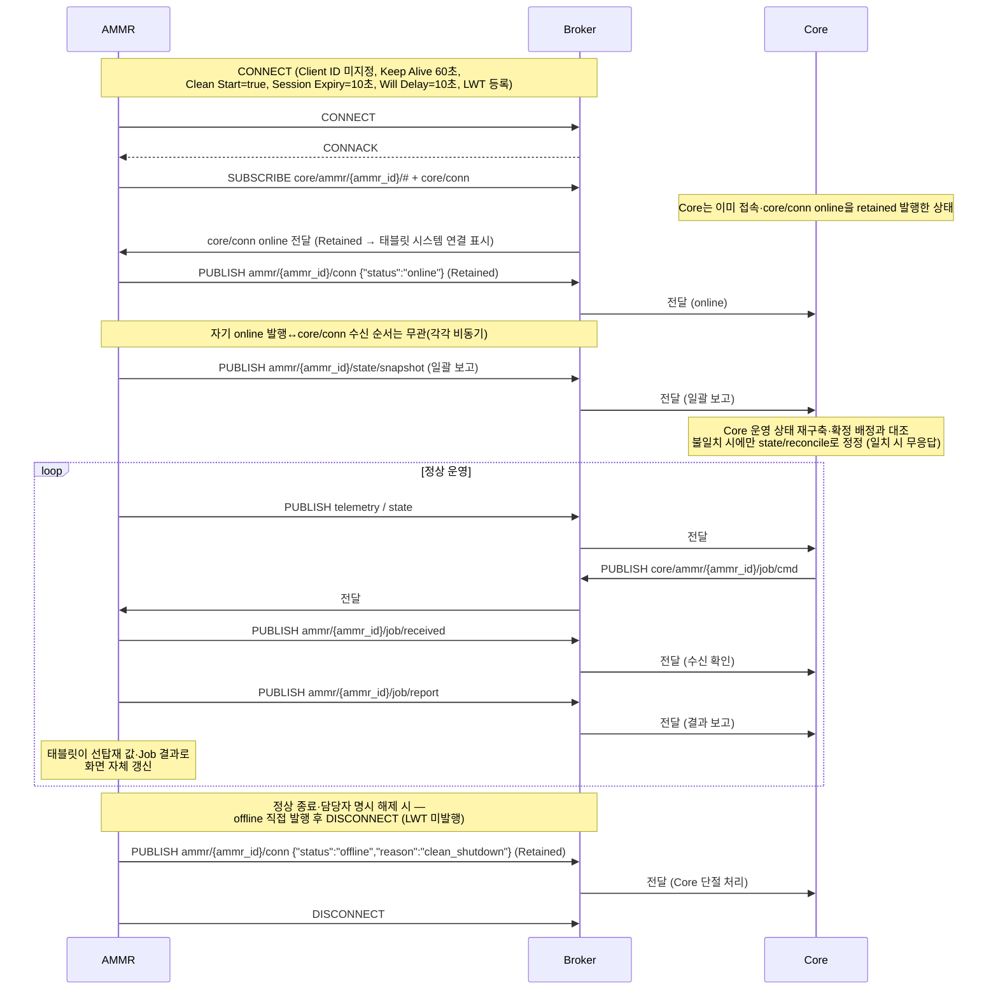
```mermaid
sequenceDiagram
    participant A as AMMR
    participant B as Broker
    participant C as Core

    Note over A,B: CONNECT (Client ID 미지정, Keep Alive 60초,<br/>Clean Start=true, Session Expiry=10초, Will Delay=10초, LWT 등록)
    A->>B: CONNECT
    B-->>A: CONNACK
    A->>B: SUBSCRIBE core/ammr/{ammr_id}/#35; + core/conn
    Note over C: Core는 이미 접속·core/conn online을 retained 발행한 상태
    B->>A: core/conn online 전달 (Retained → 태블릿 시스템 연결 표시)
    A->>B: PUBLISH ammr/{ammr_id}/conn {"status":"online"} (Retained)
    B->>C: 전달 (online)
    Note over A,B: 자기 online 발행↔core/conn 수신 순서는 무관(각각 비동기)
    A->>B: PUBLISH ammr/{ammr_id}/state/snapshot (일괄 보고)
    B->>C: 전달 (일괄 보고)
    Note over C: Core 운영 상태 재구축·확정 배정과 대조<br/>불일치 시에만 state/reconcile로 정정 (일치 시 무응답)

    loop 정상 운영
        A->>B: PUBLISH telemetry / state
        B->>C: 전달
        C->>B: PUBLISH core/ammr/{ammr_id}/job/cmd
        B->>A: 전달
        A->>B: PUBLISH ammr/{ammr_id}/job/received
        B->>C: 전달 (수신 확인)
        A->>B: PUBLISH ammr/{ammr_id}/job/report
        B->>C: 전달 (결과 보고)
        Note over A: 태블릿이 선탑재 값·Job 결과로<br/>화면 자체 갱신
    end

    Note over A,B: 정상 종료·담당자 명시 해제 시 —<br/>offline 직접 발행 후 DISCONNECT (LWT 미발행)
    A->>B: PUBLISH ammr/{ammr_id}/conn {"status":"offline","reason":"clean_shutdown"} (Retained)
    B->>C: 전달 (Core 단절 처리)
    A->>B: DISCONNECT
```

#### 비정상 단절 시나리오

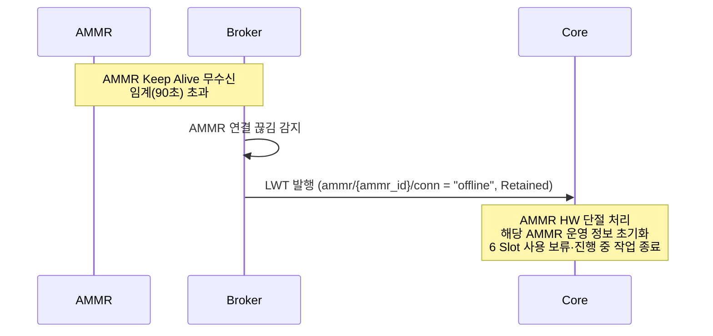
```mermaid
sequenceDiagram
    participant A as AMMR
    participant B as Broker
    participant C as Core

    Note over A,B: AMMR Keep Alive 무수신<br/>임계(90초) 초과
    B->>B: AMMR 연결 끊김 감지
    B->>C: LWT 발행 (ammr/{ammr_id}/conn = "offline", Retained)
    Note over C: AMMR HW 단절 처리<br/>해당 AMMR 운영 정보 초기화<br/>6 Slot 사용 보류·진행 중 작업 종료
```

#### Core 다운 시나리오

Core 프로세스나 Core 측 연결이 끊기면 Broker가 `core/conn` LWT(offline)를 자동 발행하고, AMMR은 이를 수신해 태블릿에 시스템 연결 끊김을 표시한다.

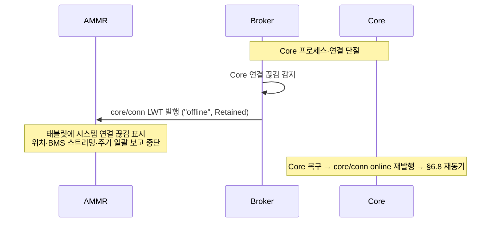
```mermaid
sequenceDiagram
    participant A as AMMR
    participant B as Broker
    participant C as Core

    Note over C,B: Core 프로세스·연결 단절
    B->>B: Core 연결 끊김 감지
    B->>A: core/conn LWT 발행 ("offline", Retained)
    Note over A: 태블릿에 시스템 연결 끊김 표시<br/>위치·BMS 스트리밍·주기 일괄 보고 중단
    Note over C: Core 복구 → core/conn online 재발행 → §6.8 재동기
```

#### 핵심 파라미터

| 항목                         | 확정값                                    | 비고 |
|------------------------------|-------------------------------------------|---|
| MQTT Keep Alive              | 60초                                      | AMMR PINGREQ 주기 (Mosquitto 기본) |
| Broker 측 단절 감지          | 90초                                      | Keep Alive × 1.5 (MQTT 표준 권장) |
| Clean Start / Session Expiry | true / 10초                               | 재접속 Clean Start=true로 세션 폐기 — 큐된 옛 Job 미배달. Session Expiry 10초는 Will Delay 유효 구간. 아래 근거 참조 |
| Will Delay Interval          | 10초                                      | LWT(offline) 발행을 유예 — 순단 후 유예 내 재접속하면 미발행(불필요한 단절 처리 회피). Core 결정으로 조정 가능 |
| Client ID                    | 지정하지 않음 (Broker가 접속 ID로 배정)   | 배정값은 CONNACK의 Assigned Client Identifier로 회신 · Broker 구성 요건 = §9.4 |
| Broker 접속                  | 기본 포트 1883 (평문 MQTT·Mosquitto 기본) | 실제 접속 정보(IP·포트·자격증명)는 설치 시 Core 측이 제공하며, 담당자가 태블릿 설정 화면에 입력한다 |

**Clean Start=true·Session Expiry=10초·Will Delay=10초 근거**: 재접속 시 Clean Start=true로 세션을 폐기하므로 단절 중 Broker에 쌓인 옛 Job 지시가 뒤늦게 배달될 위험을 원천 차단한다. AMMR은 재연결할 때마다 SUBSCRIBE를 다시 수행하고 일괄 보고(A-2)를 재발행한다. Will Delay Interval 10초는 짧은 통신 순단이 유예 내 재연결로 복구될 때 LWT(offline) 발행을 억제해 불필요한 단절 처리를 막으며, Session Expiry 10초는 이 유예가 유효하게 작동하도록 세션을 유지하는 구간이다.

#### AMMR CONNECT 설정 (필수)

AMMR은 매 CONNECT 시 다음을 설정한다 — Client ID = 지정하지 않음(빈 값) · Clean Start = true · Session Expiry Interval = 10초 · Will Delay Interval = 10초(LWT) · Keep Alive = 60초 · LWT 등록(§3.4). 모두 Core 확정값이며 AMMR이 임의로 바꾸지 않는다. 현장 사정으로 값을 바꿔야 하면 Core 측에 알린다. 세션·메시지 전달 의미에 영향을 주는 미명시 옵션(예: Message Expiry Interval)은 사용하지 않는다.

**Client ID 미지정 근거**: Broker가 MQTT 접속 ID를 Client ID로 배정하도록 구성한다(§9.4). AMMR이 값을 따로 넣지 않아도 접속 ID와 같은 값이 세션 이름이 되므로, 태블릿에 입력할 항목이 늘지 않고 접속 ID·Topic 경로·세션 이름이 한 값으로 모인다. 배정 결과는 CONNACK의 Assigned Client Identifier로 회신되어 AMMR이 확인할 수 있다.

이 구성은 자격증명이 겹쳤을 때의 안전장치이기도 하다. 두 AMMR에 같은 접속 ID가 잘못 설정되면 세션 이름까지 같아져 한쪽만 접속을 유지하고 나머지는 즉시 끊긴다(MQTT 세션 인계). 세션 이름이 서로 다르면 두 AMMR이 동시에 접속한 채 같은 Job 지시를 함께 수신해 같은 작업을 중복 수행하므로, 접속이 반복해서 끊겨 설정 오류가 즉시 드러나는 쪽이 안전하다.

### 3.7 수신 확인 원칙

수신 확인 유무는 메시지 역할에 따라 나뉜다.

| 메시지                                        | 역할        | 수신 확인 · 응답 |
|-----------------------------------------------|-------------|---|
| C-2 Job 지시                                  | Core 명령   | 수신 확인 있음 — AMMR이 `job/received`로 즉시 확인. Core는 3초 안 미도달 시 AMMR HW 단절 처리 (§7.3) |
| C-4 일괄 보고 재전송 요청 (예비)              | Core 요청   | 수신 확인 있음 — 별도 확인 메시지 없이 일괄 보고(A-2) 도착 자체가 확인. C-4는 현재 Core 운영 기본 경로가 아닌 예비 수단이다 |
| C-5 설정값 조회 요청 (예비)                   | Core 요청   | 수신 확인 있음 — 별도 확인 메시지 없이 설정값 보고(A-9) 도착 자체가 확인. C-5는 예비 수단이다 |
| C-3 일괄보고 응답 (정합 정정·조건부)          | Core 응답   | 수신 확인 없음 — QoS 1 전달 보증만. 정합 불일치 시·재로드·재요청 선행 보고 시에만 발행 |
| C-6 재요청 수신 확인                          | Core 응답   | 수신 확인 없음 — QoS 1 전달 보증만 |
| C-7 재요청 거절                               | Core 응답   | 수신 확인 없음 — QoS 1 전달 보증만 |
| C-1 Core 연결 상태                            | Core 알림   | 수신 확인 없음 — retained broadcast. AMMR은 online 감지 시 일괄 보고(A-2) 재발행으로 반응하며 별도 확인 메시지는 없다 |
| A-2 일괄 보고                                 | AMMR 보고   | 수신 확인 없음 · 응답 조건부 — Core는 확정 배정과 어긋날 때만 일괄보고 응답(C-3)으로 정정한다. 일치 시 무응답 (단 `trigger` = `manual`(재로드)·`resume`(재요청 선행 보고)은 일치해도 응답) |
| A-3·A-4·A-8 보고                              | AMMR 보고   | 수신 확인 없음 — 태블릿이 선탑재 값·자체 slot_state 판정으로 표시를 갱신한다 |
| A-1·A-5·A-6 보고                              | AMMR 보고   | 수신 확인 없음 · 응답 없음 — Core가 별도 메시지를 보내지 않는다 (QoS 보증만) |
| A-7 Job 지시 수신 확인                        | AMMR 보고   | 그 자체가 C-2의 수신 확인이며, 이에 대한 별도 확인·응답은 없다 |
| A-10 최근 명령 재요청                         | AMMR 요청   | 수신 확인 있음 — 재요청 수신 확인(C-6)이 그 확인. 응답 대기 한도(태블릿 설정값·초기값 3초) 내 미도착 시 태블릿이 실패 처리·담당자 재시도 · 재요청 결과는 이어 오는 Job 지시(C-2) 또는 재요청 거절(C-7)로 드러난다 (확인 뒤 한도 내 둘 다 미도착 = 재지시 없음) |
| 일괄 보고 수동 발행 (재로드·재요청 선행 보고) | 담당자 조작 | 응답 = 일괄보고 응답(C-3·Core 확정 배정·받은 계기 값을 그대로 실음). 응답 대기 한도(초기값 3초) 내 미도착 시 태블릿이 실패 처리·담당자 재시도 (이때 최근 명령 재요청은 보내지 않는다) |

**주의**: 일괄보고 응답(C-3)은 정합 정정 응답이지 수신 확인이 아니다. 평상시 UI 갱신은 Job 지시 선탑재 값과 태블릿 자체 slot_state 판정으로 이루어지며, C-3는 정합이 어긋날 때 내려온다 (재로드와 재요청 선행 보고는 예외로 일치해도 내려온다). 재요청 수신 확인(C-6)은 반대로 순수 수신 확인이며 다시 지시할지 여부를 담지 않으며, 최근 명령 재요청 결과는 이어 오는 Job 지시(C-2) 또는 재요청 거절(C-7)로 드러난다.

---

## 4. 메시지 카탈로그

이 절은 양방향 메시지 전체 목록을 요약한다. 상세 Payload 구조는 §5에서 정의한다.

### 4.1 AMMR → Core

| #    | Topic                           | 메시지 이름                     | Trigger | 주기·발행 조건                           |
|------|---------------------------------|---------------------------------|---|------------------------------------------|
| A-1  | `ammr/{ammr_id}/conn`           | 연결 상태 (LWT)                 | 연결 시 AMMR 발행 / 비정상 단절 시 Broker LWT 자동 발행 / 정상 종료·명시 해제 시 AMMR 직접 발행 | 발생 시점                                |
| A-2  | `ammr/{ammr_id}/state/snapshot` | 일괄 보고 (정합 상태+적재 정보) | Core 연결 상태 online 감지 시 / 일괄 보고 재전송 요청(C-4) 수신 시(예비) / 주기 자동(초기값 60초·태블릿 설정·Core online 중) / 담당자 수동 발행(재로드·재요청 선행 보고) / 운전 모드 전환 시 / 장애에서 정상 복귀 시 | 발생 시점·주기 60초 (초기값·태블릿 설정) |
| A-3  | `ammr/{ammr_id}/state/hw`       | AMMR HW 상태 전이               | 상태 전이 시점 (Job 종료 보고에 실리는 전이 제외 — A-8) | 전이 시점 Event                          |
| A-4  | `ammr/{ammr_id}/state/slot`     | Slot 상태 전이                  | Slot 상태 전이 시점 (Job 동작·사람 개입 무관) | 전이 시점 Event (1 Slot)                 |
| A-5  | `ammr/{ammr_id}/telemetry/pose` | 위치 스트리밍                   | 주기 (Core online 중) | 1초 (초기값·태블릿 설정)                 |
| A-6  | `ammr/{ammr_id}/telemetry/bms`  | BMS 스트리밍                    | 주기 (Core online 중) | 10초 (초기값·태블릿 설정)                |
| A-7  | `ammr/{ammr_id}/job/received`   | Job 지시 수신 확인              | Core Job 지시 수신 직후 | 수신 시점 Event                          |
| A-8  | `ammr/{ammr_id}/job/report`     | Job 수행 결과 통합 보고         | Job 종료 시점 | Job 종료 Event                           |
| A-9  | `ammr/{ammr_id}/state/config`   | 설정값 보고 (예비)              | 설정값 조회 요청(C-5) 수신 시(예비) | 요청 수신 시점                           |
| A-10 | `ammr/{ammr_id}/job/resume`     | 최근 명령 재요청                | 담당자가 태블릿에서 [최근 명령 재요청] 실행 | 조작 시점 Event                          |

### 4.2 Core → AMMR

| #   | Topic                                 | 메시지 이름                      | Trigger | 주기·발행 조건 |
|-----|---------------------------------------|----------------------------------|---|----------------|
| C-1 | `core/conn`                           | Core 연결 상태                   | CONNECT 직후 online 직접 발행 / 비정상 단절 시 Broker LWT 자동 발행 / 정상 종료 시 Core 직접 발행 | 상태 변화 시점 |
| C-2 | `core/ammr/{ammr_id}/job/cmd`         | Job 지시                         | Job 결정 시점 | Job 단위       |
| C-3 | `core/ammr/{ammr_id}/state/reconcile` | 일괄보고 응답 (정합 정정·조건부) | 일괄 보고(A-2)가 Core 확정 배정과 불일치 시·재로드·재요청 선행 보고 시 | 정합 정정 시점 |
| C-4 | `core/ammr/{ammr_id}/state/request`   | 일괄 보고 재전송 요청 (예비)     | Core가 특정 AMMR 상태를 즉시 당길 때 (예비·기본 경로 아님) | 발생 시점      |
| C-5 | `core/ammr/{ammr_id}/config/request`  | 설정값 조회 요청 (예비)          | Core가 현장 설정값을 확인해야 할 때 (예비·기본 경로 아님) | 발생 시점      |
| C-6 | `core/ammr/{ammr_id}/job/received`    | 재요청 수신 확인                 | 최근 명령 재요청(A-10) 수신 직후 | 요청 수신 시점 |
| C-7 | `core/ammr/{ammr_id}/job/rejected`    | 재요청 거절                      | 최근 명령 재요청(A-10)을 다시 지시하지 않기로 정한 직후 (C-6 뒤) | 요청 처리 시점 |

Job 지시는 단일 Topic에서 `job_type` 필드로 4종(Move/Pickup/Dropoff/Charge)을 구분하며, 태블릿 표시에 필요한 Unit·위치 정보를 선탑재한다. C-3(`state/reconcile`)은 Core 확정 배정과 어긋날 때 내려오는 일괄보고 응답이다 (평상시 무발행·재로드와 재요청 선행 보고는 예외로 일치해도 발행). C-1(`core/conn`)은 Core 자신의 연결 상태를 전체 AMMR에 알리는 retained 메시지로, AMMR은 online 감지 시 일괄 보고(A-2)를 재발행하고 offline 감지 시 태블릿에 시스템 연결 끊김을 표시한다. C-4는 예비 수단이며 재동기화 기본 경로는 C-1 발신 + 주기 일괄 보고다.

---

## 5. 메시지 상세 정의

각 메시지 payload는 **`header`(공통 필드·§3.5)** 와 **`body`** 로 구성되며, 아래 표는 각 메시지의 **`body` 고유 필드**를 정의한다. 필드 타입은 §부록 A 참고. AMMR Slot ID는 `AMMR-LOGI001-A1`~`A6` 형식이며, 행 번호 1~6이 태블릿 화면의 Slot 번호와 일치한다.

### 5.1 AMMR → Core 메시지

#### A-1. 연결 상태 (LWT)

- **Topic**: `ammr/{ammr_id}/conn`
- **Trigger (online)**: AMMR이 CONNECT 직후 직접 publish
- **Trigger (offline — 비정상 단절)**: AMMR HW와 Broker 연결 끊김 시 Broker가 LWT 자동 발행 (`reason = broker_disconnect`)
- **Trigger (offline — 정상 종료)**: AMMR 정상 종료·담당자가 태블릿에서 시스템 연결을 명시적으로 해제하는 경우, AMMR이 DISCONNECT 전에 직접 publish (`reason = clean_shutdown`). Core는 어느 offline이든 AMMR HW 단절과 동일하게 처리하며, 재연결은 초기 연결 흐름(§6.1)과 동일하다
- **Retained**: true (Core가 늦게 접속해도 즉시 인지)

| 필드           | 타입             | 필수   | 설명 |
|----------------|------------------|--------|---|
| `status`       | enum (§부록 A.8) | 필수   | 연결 상태 |
| `reason`       | enum (§부록 A.9) | 조건부 | `offline`일 때 필수 — 종료 사유 |
| `connected_at` | string           | 조건부 | offline 메시지에 실린 세션 접속 시각 (KST). online엔 없음(접속 시각 = `header.timestamp`) |

**예시**: 정상 연결

```json
{
  "header": {
    "timestamp": "2026-07-10 07:30:00.000",
    "ammr_id": "AMMR-LOGI001",
    "mode": "auto",
    "msg_id": "0a1b2c3d-0001-4abc-8def-000000000001"
  },
  "body": {
    "status": "online"
  }
}
```

**예시**: LWT (Broker 자동 발행 — `timestamp`·`msg_id` = `null`·§3.4)

```json
{
  "header": {
    "timestamp": null,
    "ammr_id": "AMMR-LOGI001",
    "mode": null,
    "msg_id": null
  },
  "body": {
    "status": "offline",
    "reason": "broker_disconnect",
    "connected_at": "2026-07-10 07:30:00.000"
  }
}
```

**예시**: 정상 종료·담당자 명시 해제 (AMMR 직접 발행)

```json
{
  "header": {
    "timestamp": "2026-07-10 18:00:00.000",
    "ammr_id": "AMMR-LOGI001",
    "mode": "auto",
    "msg_id": "0a1b2c3d-0002-4abc-8def-000000000002"
  },
  "body": {
    "status": "offline",
    "reason": "clean_shutdown",
    "connected_at": "2026-07-10 07:30:00.000"
  }
}
```

#### A-2. 일괄 보고

- **Topic**: `ammr/{ammr_id}/state/snapshot`
- **Trigger**: 7가지 계기로 발행하며, 각 계기를 body `trigger` 값으로 구분해 싣는다 (§부록 A.10). Core 연결 상태 online을 감지해 발행하면(`core_online`) 그 발행 시점부터 주기를 다시 잰다. 재동기 직후에 주기 발행이 곧바로 겹치지 않는다. 나머지 계기(`requested`·`manual`·`resume`·`mode_changed`·`error_cleared`)는 주기에 영향을 주지 않는다
- **목적**: Core가 해당 AMMR의 운영 상태(HW 상태·위치·6 Slot 정합 상태(slot_state)·Slot별 Unit 식별값·Battery)를 일괄 재구축하기 위한 입력
- **회신**: Core는 이 보고로 운영 상태를 재구축한다. Core 확정 배정과 어긋나 정합을 맞춰야 할 때만 일괄보고 응답(C-3 `state/reconcile`)을 내려준다 (평상시 무응답). 단 `trigger`가 `manual`·`resume`이면 일치해도 응답한다. 응답에는 받은 `trigger` 값을 그대로 싣는다

| 필드       | 타입              | 필수 | 설명                                                         |
|------------|-------------------|------|--------------------------------------------------------------|
| `trigger`  | enum (§부록 A.10) | 필수 | 이 보고의 발행 계기                                          |
| `hw_state` | enum (§부록 A.1)  | 필수 | 현재 AMMR HW 상태                                            |
| `slots`    | array[6]          | 필수 | 6 Slot 각각의 점유 정보 (아래 구조)                          |
| `pose`     | object            | 필수 | `{node_id, x, y, a}` — 현재 Node ID + 현재 위치·방향각 (A-5) |
| `battery`  | object            | 필수 | A-6 BMS 메시지의 필드 구조와 동일·단위는 §부록 A.5           |

`slots` 항목 구조:

| 필드              | 타입             | 필수 | 설명 |
|-------------------|------------------|------|---|
| `slot_id`         | string           | 필수 | AMMR Slot ID (예 `AMMR-LOGI001-A1`) |
| `slot_state`      | enum (§부록 A.7) | 필수 | 클라이언트 판정 Slot 상태 |
| `unit_or_tray_id` | string\|null     | 필수 | 태블릿 보관 적재 식별값. Core가 내려준 값이면 Unit ID·담당자가 태블릿에 넣은 값이면 Tray ID. Core는 어느 쪽이든 소속 Unit으로 푼다. 미점유·미상이면 null |

**예시 JSON**

```json
{
  "header": {
    "timestamp": "2026-07-10 07:30:00.123",
    "ammr_id": "AMMR-LOGI001",
    "mode": "auto",
    "msg_id": "0a1b2c3d-0003-4abc-8def-000000000003"
  },
  "body": {
    "trigger": "core_online",
    "hw_state": "idle",
    "slots": [
      { "slot_id": "AMMR-LOGI001-A1", "slot_state": "empty",    "unit_or_tray_id": null },
      { "slot_id": "AMMR-LOGI001-A2", "slot_state": "empty",    "unit_or_tray_id": null },
      { "slot_id": "AMMR-LOGI001-A3", "slot_state": "empty",    "unit_or_tray_id": null },
      { "slot_id": "AMMR-LOGI001-A4", "slot_state": "empty",    "unit_or_tray_id": null },
      { "slot_id": "AMMR-LOGI001-A5", "slot_state": "empty",    "unit_or_tray_id": null },
      { "slot_id": "AMMR-LOGI001-A6", "slot_state": "empty",    "unit_or_tray_id": null }
    ],
    "pose": { "node_id": "WIP-CLN001", "x": 12.5, "y": 3.7, "a": 90.0 },
    "battery": { "battery_id": "BAT_A01", "soc": 87.3, "voltage": 50.1, "current": -2.1, "temperature": 28.5, "bmu_error": false }
  }
}
```

**예시**: 모드 전환 (담당자가 수동으로 바꾼 시점 1회)

```json
{
  "header": {
    "timestamp": "2026-07-10 09:12:40.500",
    "ammr_id": "AMMR-LOGI001",
    "mode": "manual",
    "msg_id": "0a1b2c3d-0010-4abc-8def-000000000010"
  },
  "body": {
    "trigger": "mode_changed",
    "hw_state": "idle",
    "slots": [
      { "slot_id": "AMMR-LOGI001-A1", "slot_state": "occupied", "unit_or_tray_id": "7f3d9e2a-1b4c-4f8a-9d6e-5c2b3a7e1f8d" },
      { "slot_id": "AMMR-LOGI001-A2", "slot_state": "empty",    "unit_or_tray_id": null },
      { "slot_id": "AMMR-LOGI001-A3", "slot_state": "empty",    "unit_or_tray_id": null },
      { "slot_id": "AMMR-LOGI001-A4", "slot_state": "empty",    "unit_or_tray_id": null },
      { "slot_id": "AMMR-LOGI001-A5", "slot_state": "empty",    "unit_or_tray_id": null },
      { "slot_id": "AMMR-LOGI001-A6", "slot_state": "empty",    "unit_or_tray_id": null }
    ],
    "pose": { "node_id": "WIP-CLN001", "x": 12.5, "y": 3.7, "a": 90.0 },
    "battery": { "battery_id": "BAT_A01", "soc": 81.2, "voltage": 49.8, "current": -1.8, "temperature": 28.9, "bmu_error": false }
  }
}
```

#### A-3. AMMR HW 상태 전이

- **Topic**: `ammr/{ammr_id}/state/hw`
- **Trigger**: AMMR HW 상태 전이 시점. **일반 규칙 — Job 수행 결과 통합 보고(A-8)에 실려 보고되는 전이(Job 종료 시점 전이)를 제외한 모든 상태 전이는 이 메시지로 보고한다.** Job 종료 전이를 이 메시지로 중복 발행하지 않는다.
- **회신**: Core는 이 보고로 운영 상태를 갱신한다.

전이별 보고 경로:

| 전이 | 보고 경로 |
|---|---|
| Job 시작 (`idle → move/pickup/dropoff/charge`, 충전 중 Job 지시 수신 시 `charging → move` 등) | A-3 |
| Job 종료 (`move → idle`, `pickup → idle`, `dropoff → idle`, `charge → charging`·`docked`(도킹) 등 — Job 종료 직후 상태) | A-8 `hw_state` 필드 (A-3 중복 발행 금지) |
| 충전 종료 (`charging → docked`) | A-3 |
| 재충전 시작 (`docked → charging`) | A-3 |
| 담당자 조작 (`idle → move/pickup/dropoff/charge`, `move/pickup/dropoff → idle`, `charge → charging`·`docked`(도킹) — 티칭·테스트) | A-3 |
| 저전력 진입 (`→ low_battery`) | A-3 (Job 종료와 동시 진입한 경우 A-8의 `hw_state = low_battery`로 보고·A-3 중복 발행 금지) |
| 저전력 자율 충전 도킹 (`low_battery → charging`) | A-3 |
| 자체 충전 진입 (`idle → self_charge`, Job 대기 한도 초과) | A-3 |
| 자체 충전 도킹 (`self_charge → charging`·`docked`) | A-3 |
| 수동 전환으로 자체 충전 복귀 중단 (`self_charge → idle`) | A-3 |
| 안전 정지 진입 (`→ paused`, Safety Field 감지·범퍼 충돌) | A-3 |
| 안전 정지 해제 (`paused → move`·`pickup`·`dropoff` 등 재개) | A-3 |
| 장애 진입 (`→ error`, Job 수행 중이 아닐 때 — 자기 진단 실패 등) | A-3 (Job 수행 중 장애는 A-8의 `hw_state = error`로 보고) |
| 장애 복구 (`error →` 해제 시점의 실제 상태 `idle`·`charging`·`docked` · 장애 중 자율 충전 이동 중이었으면 `self_charge`·`low_battery`) | A-3 |
| 원점 복귀 시작 (담당자 조작 = 수동 모드의 그때 상태 또는 `error` → `manipulator_homing` · 접근 중 중단 뒤 복귀는 A-8 `hw_state`) | A-3 |
| 원점 복귀 완료 (`manipulator_homing` → 담당자 조작은 시작 전 상태 · 접근 중 중단 뒤 복귀는 `idle`이고 설비 측 실패였으면 `error`) | A-3 |
| 원점 복귀 실패 (`manipulator_homing` → `error`) | A-3 |

| 필드         | 타입              | 필수 | 설명                                                     |
|--------------|-------------------|------|----------------------------------------------------------|
| `hw_state`   | enum (§부록 A.1)  | 필수 | 전이 후 상태                                             |
| `prev_state` | enum (§부록 A.1)  | 필수 | 전이 전 상태                                             |
| `reason`     | enum (§부록 A.11) | 필수 | 전이 사유. Job 실패 Reason 코드(§부록 A.4)와는 별개 층위 |

**예시**: 충전 중 → 도킹 자연 전이 (충전 종료)

```json
{
  "header": {
    "timestamp": "2026-07-10 08:25:12.456",
    "ammr_id": "AMMR-LOGI001",
    "mode": "auto",
    "msg_id": "0a1b2c3d-0004-4abc-8def-000000000004"
  },
  "body": {
    "hw_state": "docked",
    "prev_state": "charging",
    "reason": "charge_completed"
  }
}
```

#### A-4. Slot 상태 전이

- **Topic**: `ammr/{ammr_id}/state/slot`
- **Trigger**: Slot 상태 전이 시 1 Slot 단위 보고 — Pickup·Dropoff 동작으로 생긴 전이든 사람 개입으로 생긴 전이든 전이 시점에 바로 발행한다
- **주의**: Job 수행 결과 통합 보고(A-8)는 Job 종료 시점의 Slot 상태를 따로 싣는다. 같은 전이가 A-4와 A-8에 함께 실려도 되며, A-4는 전이 시점을·A-8은 종료 시점 상태를 알린다.
- **회신**: Core는 이 보고로 운영 상태를 갱신한다. 진행 중인 Pickup·Dropoff가 다루는 Slot의 전이는 상태만 반영하고, 배정·이송 판단은 그 Job 결과(A-8)로 한다. 표시는 태블릿이 자체 판정한 slot_state로 반영한다.

| 필드              | 타입             | 필수 | 설명                                                                      |
|-------------------|------------------|------|---------------------------------------------------------------------------|
| `slot_id`         | string           | 필수 | 전이 Slot ID                                                              |
| `slot_state`      | enum (§부록 A.7) | 필수 | 클라이언트 판정 Slot 상태                                                 |
| `prev_slot_state` | enum (§부록 A.7) | 필수 | 전이 전 Slot 상태                                                         |
| `unit_or_tray_id` | string\|null     | 필수 | 태블릿 보관 적재 식별값 (Unit ID 또는 Tray ID·§1.3). 미점유·미상이면 null |

**예시**

```json
{
  "header": {
    "timestamp": "2026-07-10 07:40:23.789",
    "ammr_id": "AMMR-LOGI001",
    "mode": "auto",
    "msg_id": "0a1b2c3d-0005-4abc-8def-000000000005"
  },
  "body": {
    "slot_id": "AMMR-LOGI001-A3",
    "slot_state": "blocked",
    "prev_slot_state": "empty",
    "unit_or_tray_id": null
  }
}
```

#### A-5. 위치 스트리밍

- **Topic**: `ammr/{ammr_id}/telemetry/pose`
- **Trigger**: 1초 주기 (초기값·태블릿 설정) — Core 연결 상태가 `online`인 동안만 발행 (C-1)
- **QoS**: 0 (연속값, 1건 누락 허용)

| 필드      | 타입         | 필수 | 설명                                                   |
|-----------|--------------|------|--------------------------------------------------------|
| `node_id` | string\|null | 필수 | AMMR 맵의 현재 Node ID. 어느 Node에도 있지 않으면 null |
| `x`       | float        | 필수 | x 좌표 (단위: m)                                       |
| `y`       | float        | 필수 | y 좌표 (단위: m)                                       |
| `a`       | float        | 필수 | 방향각 (단위: 도, 0~360)                               |

좌표·방향각 단위는 이 위치 스트리밍과 일괄 보고(A-2)·Job 수행 결과 보고(A-8)가 공통으로 쓴다 (§부록 A.6). Job 지시의 목적지는 좌표가 아니라 설비 ID다 (C-2). `node_id`는 AMMR 맵의 Node ID다. AMMR은 Job 지시 목적지(`work_location_id`)를 자기 맵으로 해석해 이동하고, 현재 위치는 자기 맵 Node ID를 그대로 보고한다. Node 사이를 지나는 동안처럼 어느 Node에도 있지 않을 때는 `null`로 보낸다.

**예시**

```json
{
  "header": {
    "timestamp": "2026-07-10 07:40:24.000",
    "ammr_id": "AMMR-LOGI001",
    "mode": "auto",
    "msg_id": "0a1b2c3d-0006-4abc-8def-000000000006"
  },
  "body": {
    "node_id": "WIP-CLN001",
    "x": 12.51,
    "y": 3.72,
    "a": 92.0
  }
}
```

#### A-6. BMS 스트리밍

- **Topic**: `ammr/{ammr_id}/telemetry/bms`
- **Trigger**: 10초 주기 (초기값·태블릿 설정) — Core 연결 상태가 `online`인 동안만 발행 (C-1)
- **QoS**: 0

| 필드          | 타입    | 필수 | 설명                                  |
|---------------|---------|------|---------------------------------------|
| `battery_id`  | string  | 필수 | Battery 팩 식별값                     |
| `soc`         | float   | 필수 | 충전 상태 (%, 0.0~100.0)              |
| `voltage`     | float   | 필수 | 전압 (V)                              |
| `current`     | float   | 필수 | 전류 (A) — 충전 시 양수, 방전 시 음수 |
| `temperature` | float   | 필수 | 온도 (°C)                             |
| `bmu_error`   | boolean | 필수 | BMU 오류 발생 여부                    |

**예시**

```json
{
  "header": {
    "timestamp": "2026-07-10 07:40:25.000",
    "ammr_id": "AMMR-LOGI001",
    "mode": "auto",
    "msg_id": "0a1b2c3d-0007-4abc-8def-000000000007"
  },
  "body": {
    "battery_id": "BAT_A01",
    "soc": 87.1,
    "voltage": 50.0,
    "current": -2.0,
    "temperature": 28.6,
    "bmu_error": false
  }
}
```

#### A-7. Job 지시 수신 확인

- **Topic**: `ammr/{ammr_id}/job/received`
- **Trigger**: AMMR이 `core/ammr/{ammr_id}/job/cmd` 수신 직후 1회
- **목적**: Core가 AMMR 수신 여부 확인. 수신 확인 미수신 = 통신 문제 / 수신 확인 도달 + 결과 보고 늦음 = AMMR HW 문제 — 책임 분리

| 필드     | 타입          | 필수 | 설명                                                               |
|----------|---------------|------|--------------------------------------------------------------------|
| `job_id` | integer\|null | 필수 | Core 지시의 `job_id`. 받은 지시에 값이 없었으면 값 없음으로 싣는다 |

**예시**

```json
{
  "header": {
    "timestamp": "2026-07-10 07:42:06.123",
    "ammr_id": "AMMR-LOGI001",
    "mode": "auto",
    "msg_id": "0a1b2c3d-0008-4abc-8def-000000000008"
  },
  "body": {
    "job_id": 1024
  }
}
```

#### A-8. Job 수행 결과 통합 보고

- **Topic**: `ammr/{ammr_id}/job/report`
- **Trigger**: Job 종료 시점 (Move/Pickup/Dropoff/Charge 각 종료)
- **핵심**: 이 메시지는 Job 수행 결과를 통합 보고하는 단일 메시지이다. payload 분기는 §7.2 참조.
- **회신**: Core는 이 보고로 운영 상태를 갱신한다. 표시는 태블릿이 Job 결과·선탑재 값으로 자체 갱신한다.

| 필드         | 타입                   | 필수   | 설명 |
|--------------|------------------------|--------|---|
| `job_id`     | integer\|null          | 필수   | 대응되는 Job 지시의 `job_id`. 계약 밖 지시로 거부한 경우는 아래 예외를 따른다 |
| `job_type`   | enum (§부록 A.2)\|null | 필수   | 수행한 Job 종류. 계약 밖 값으로 거부한 경우는 아래 예외를 따른다 |
| `hw_state`   | enum (§부록 A.1)       | 필수   | Job 종료 직후 AMMR HW 상태. 이 필드에 실린 전이는 A-3로 중복 발행하지 않는다. Charge Job은 도킹 완료 시점 보고라 `charging` 또는 `docked` (재충전 임계 이하면 `charging`). 수행에 진입하지 않은 거부는 회신 시점의 현재 상태를 싣는다 (`job_concurrent_request`도 같다 · 일시 정지 중이면 `paused`) |
| `job_result` | enum (§부록 A.3)       | 필수   | Job 수행 결과 |
| `reason`     | enum (§부록 A.4)       | 조건부 | `job_result = failure` 시 필수 (`ammr_hw_*`·`slot_*`·`job_*`·`equip_*`) |
| `slot`       | object                 | 조건부 | Pickup·Dropoff 시 필수. 대상 AMMR Slot의 클라이언트 판정 상태. 구조 아래. 수행에 진입하지 않은 거부는 아래 예외를 따른다. |
| `pose`       | object                 | 필수   | `{node_id, x, y, a}` — Job 종료 시점 위치 (구조 = A-5) |

`slot` 구조 (대상 AMMR Slot을 특정한 지시에 한정):

| 필드              | 타입             | 필수 | 설명 |
|-------------------|------------------|------|---|
| `slot_id`         | string           | 필수 | 대상 AMMR Slot ID |
| `slot_state`      | enum (§부록 A.7) | 필수 | Job 종료 시점의 클라이언트 판정 (Pickup 성공 `occupied`·Dropoff 성공 `empty`·수행 중 실패 `job_failed` — 다만 도착 Slot 점유(`slot_dest_occupied`)로 인한 실패는 `job_failed`를 싣지 않고 판정값 그대로(Dropoff는 대체 목적지 재지시로 이어지는 정상 갈래·Pickup은 사람이 채운 점유를 A-4로 보고한 값)·설비 접점 실패(`equip_*`)도 Slot을 건드리지 못한 것이라 판정값 그대로·수행 미진입 거부(`ammr_hw_error_state`·`ammr_hw_low_battery_state`·`ammr_hw_self_charge_state`·`ammr_hw_manual_mode`·`ammr_hw_resume_pending`·`job_invalid_request`·`job_concurrent_request`)는 현재 판정 상태 그대로) |
| `unit_or_tray_id` | string\|null     | 필수 | 태블릿 보관 적재 식별값 (Unit ID 또는 Tray ID·§1.3). 미점유·미상이면 null |

수행에 진입하지 않은 거부(`ammr_hw_error_state`·`ammr_hw_low_battery_state`·`ammr_hw_self_charge_state`·`ammr_hw_manual_mode`·`ammr_hw_resume_pending`·`job_invalid_request`·`job_concurrent_request`)는 지시가 대상 AMMR Slot을 특정하지 못하면(`slot_info`에 자기 AMMR Slot이 없으면) `slot`을 싣지 않는다. 대상 Slot을 특정할 수 있으면 그 Slot의 현재 판정 상태를 그대로 싣는다 (실패 흔적 없음).

계약 밖 `job_type` 값을 받아 거부한 경우(`job_invalid_request`)에는 받은 값을 그대로 실어 회신한다. 이 필드에 한해 부록 A.2 일람 밖 문자열을 허용한다. 받은 지시에 `job_type`·`job_id` 값이 없었으면 값 없음으로 싣는다. 잘못 온 지시를 그대로 돌려줘야 Core가 무엇을 잘못 보냈는지 가려낼 수 있어 값 제약을 두지 않는다. `slot`은 위 예외를 그대로 따른다. `job_type`이 계약 밖이어도 지시가 자기 AMMR Slot을 특정했으면 그 Slot의 현재 판정 상태를 싣는다.

**예시**: Move 성공 (적재 변화가 없는 Job — `slot` 필드 없음)

```json
{
  "header": {
    "timestamp": "2026-07-10 07:42:05.100",
    "ammr_id": "AMMR-LOGI001",
    "mode": "auto",
    "msg_id": "0a1b2c3d-000c-4abc-8def-00000000000c"
  },
  "body": {
    "job_id": 1023,
    "job_type": "move",
    "hw_state": "idle",
    "job_result": "success",
    "pose": { "node_id": "WIP-CLN001", "x": 12.5, "y": 3.7, "a": 90.0 }
  }
}
```

**예시**: Pickup 성공

```json
{
  "header": {
    "timestamp": "2026-07-10 07:42:11.234",
    "ammr_id": "AMMR-LOGI001",
    "mode": "auto",
    "msg_id": "0a1b2c3d-0009-4abc-8def-000000000009"
  },
  "body": {
    "job_id": 1024,
    "job_type": "pickup",
    "hw_state": "idle",
    "job_result": "success",
    "slot": {
      "slot_id": "AMMR-LOGI001-A1",
      "slot_state": "occupied",
      "unit_or_tray_id": "7f3d9e2a-1b4c-4f8a-9d6e-5c2b3a7e1f8d"
    },
    "pose": { "node_id": "WIP-CLN001", "x": 12.5, "y": 3.7, "a": 90.0 }
  }
}
```

**예시**: Dropoff 성공 (AMMR Slot 비움)

```json
{
  "header": {
    "timestamp": "2026-07-10 07:45:05.870",
    "ammr_id": "AMMR-LOGI001",
    "mode": "auto",
    "msg_id": "0a1b2c3d-000e-4abc-8def-00000000000e"
  },
  "body": {
    "job_id": 1026,
    "job_type": "dropoff",
    "hw_state": "idle",
    "job_result": "success",
    "slot": {
      "slot_id": "AMMR-LOGI001-A1",
      "slot_state": "empty",
      "unit_or_tray_id": null
    },
    "pose": { "node_id": "CNC-RAC-A02", "x": 20.4, "y": 8.1, "a": 180.0 }
  }
}
```

**예시**: Pickup 실패 (Slot 측 사유 — 출발 Slot 비어 있음)

```json
{
  "header": {
    "timestamp": "2026-07-10 07:42:11.234",
    "ammr_id": "AMMR-LOGI001",
    "mode": "auto",
    "msg_id": "0a1b2c3d-000a-4abc-8def-00000000000a"
  },
  "body": {
    "job_id": 1024,
    "job_type": "pickup",
    "hw_state": "idle",
    "job_result": "failure",
    "reason": "slot_source_empty",
    "slot": {
      "slot_id": "AMMR-LOGI001-A1",
      "slot_state": "job_failed",
      "unit_or_tray_id": null
    },
    "pose": { "node_id": "WIP-CLN001", "x": 12.5, "y": 3.7, "a": 90.0 }
  }
}
```

**예시**: AMMR HW 장애 (모든 Job 결과에 적용 가능)

```json
{
  "header": {
    "timestamp": "2026-07-10 07:42:20.500",
    "ammr_id": "AMMR-LOGI001",
    "mode": "auto",
    "msg_id": "0a1b2c3d-000b-4abc-8def-00000000000b"
  },
  "body": {
    "job_id": 1025,
    "job_type": "move",
    "hw_state": "error",
    "job_result": "failure",
    "reason": "ammr_hw_fms_fault",
    "pose": { "node_id": null, "x": 18.3, "y": 6.2, "a": 45.0 }
  }
}
```

**예시**: 계약 밖 Job 종류 거부 (받은 `job_type` 값 그대로·지시가 특정한 Slot의 현재 상태 동반)

```json
{
  "header": {
    "timestamp": "2026-07-10 07:50:03.400",
    "ammr_id": "AMMR-LOGI001",
    "mode": "auto",
    "msg_id": "0a1b2c3d-000f-4abc-8def-00000000000f"
  },
  "body": {
    "job_id": 1027,
    "job_type": "unload",
    "hw_state": "idle",
    "job_result": "failure",
    "reason": "job_invalid_request",
    "slot": {
      "slot_id": "AMMR-LOGI001-A1",
      "slot_state": "empty",
      "unit_or_tray_id": null
    },
    "pose": { "node_id": "WIP-CLN001", "x": 12.5, "y": 3.7, "a": 90.0 }
  }
}
```

#### A-9. 설정값 보고 (예비)

> **예비 수단** — 설정값 조회 요청(C-5)에 대한 응답으로만 발행한다. 설정값의 단일 출처는 태블릿이며, Core는 이 값을 보유하지 않고 필요한 시점에만 조회한다.

- **Topic**: `ammr/{ammr_id}/state/config`
- **Trigger**: 설정값 조회 요청(C-5) 수신 직후 1회
- **목적**: 태블릿에 설정된 현장 운영값을 Core에 알린다. 필드 순서는 아래 표 순서로 고정한다 (태블릿 설정 화면 순서와 같게 두었다).

| 필드                         | 타입    | 필수 | 설명 |
|------------------------------|---------|------|---|
| `host_ip`                    | string  | 필수 | 시스템 Host IP — AMMR이 Core MQTT Broker에 접속할 IP 주소 |
| `host_port`                  | integer | 필수 | 시스템 포트 — Core MQTT Broker 접속 포트 |
| `mqtt_username`              | string  | 필수 | MQTT 접속 ID (Core MQTT Broker 접속 자격증명) |
| `mqtt_password`              | string  | 필수 | MQTT 접속 비밀번호 (Core MQTT Broker 접속 자격증명) |
| `snapshot_interval_sec`      | float   | 필수 | 일괄 보고(A-2) 발행 주기 (초·초기값 60) |
| `pose_interval_sec`          | float   | 필수 | 위치 스트리밍(A-5) 발행 주기 (초·초기값 1) |
| `bms_interval_sec`           | float   | 필수 | BMS 스트리밍(A-6) 발행 주기 (초·초기값 10) |
| `reconnect_timeout_sec`      | float   | 필수 | Broker 재연결 한도 (초·초기값 300) |
| `response_timeout_sec`       | float   | 필수 | 응답 대기 한도 (초·초기값 3) — 재로드·최근 명령 재요청이 일괄보고 응답·수신 확인·재지시 명령을 각각 기다리는 한도 |
| `charge_station_id`          | string  | 필수 | 충전 스테이션 번호 (§8.6) |
| `battery_full_threshold`     | float   | 필수 | Battery 충전 종료 임계치 (%·초기값 80) |
| `battery_recharge_threshold` | float   | 필수 | Battery 재충전 임계치 (%·초기값 70) |
| `battery_low_threshold`      | float   | 필수 | Battery 저전력 진입 임계치 (%·초기값 20) |
| `idle_wait_timeout_sec`      | float   | 필수 | Job 대기 한도 (초·초기값 10) — 초과 시 `self_charge` 진입 |
| `move_timeout_sec`           | float   | 필수 | Move Job 수행 한도 (초·초기값 300) |
| `pickup_dropoff_timeout_sec` | float   | 필수 | Pickup·Dropoff Job 수행 한도 (초·초기값 300) |
| `interlock_timeout_sec`      | float   | 필수 | 설비 Interlock 확보 대기 한도 (초·초기값 180) |

**예시**

```json
{
  "header": {
    "timestamp": "2026-07-10 10:05:00.250",
    "ammr_id": "AMMR-LOGI001",
    "mode": "auto",
    "msg_id": "0a1b2c3d-000d-4abc-8def-00000000000d"
  },
  "body": {
    "host_ip": "192.168.0.10",
    "host_port": 1883,
    "mqtt_username": "ammr-logi001",
    "mqtt_password": "ammr-logi001@core",
    "snapshot_interval_sec": 60.0,
    "pose_interval_sec": 1.0,
    "bms_interval_sec": 10.0,
    "reconnect_timeout_sec": 300.0,
    "response_timeout_sec": 3.0,
    "charge_station_id": "1",
    "battery_full_threshold": 80.0,
    "battery_recharge_threshold": 70.0,
    "battery_low_threshold": 20.0,
    "idle_wait_timeout_sec": 10.0,
    "move_timeout_sec": 300.0,
    "pickup_dropoff_timeout_sec": 300.0,
    "interlock_timeout_sec": 180.0
  }
}
```

#### A-10. 최근 명령 재요청

- **Topic**: `ammr/{ammr_id}/job/resume`
- **Trigger**: 담당자가 태블릿에서 [최근 명령 재요청]을 실행한 시점 1회. 태블릿은 이 요청 직전에 일괄 보고(A-2 · `trigger` = `resume`)를 먼저 발행하고, 그 일괄보고 응답(C-3)을 받은 뒤 이 요청을 보낸다
- **목적**: 실패로 끝난 작업을 다시 지시해 달라고 Core에 요청한다. Core는 이 AMMR에 마지막으로 발행한 Job을 그대로 다시 지시한다 (§6.9)
- **회신**: 재요청 수신 확인(C-6). C-6이 응답 대기 한도(태블릿 설정값·초기값 3초) 안에 도착하지 않으면 태블릿이 실패 처리하고 담당자가 다시 시도한다 (§7.3). 재요청 결과는 C-6 뒤에 오는 이 요청에 답한 Job 지시(C-2) 또는 재요청 거절(C-7)로 드러나며, 둘 다 `resume_job_id`에 이 요청의 `job_id`를 싣는다. Job 지시가 오면 화면은 그 지시의 선탑재 값으로 갱신되고, 거절이 오면 태블릿은 실린 사유를 안내한다. 같은 한도 안에 둘 다 오지 않으면 태블릿은 재지시 없음으로 처리한다 (§7.3). 그 밖의 Job 지시는 재지시로 치지 않는다

| 필드     | 타입    | 필수 | 설명 |
|----------|---------|------|---|
| `job_id` | integer | 필수 | 재요청하는 대상 Job의 `job_id` (태블릿이 최근 명령으로 보유). 최근 명령이 없으면 요청을 보내지 않는다 |

**상태 선행 발행**: 장애·단절로 Core 측 운영 정보가 비고 6 Slot이 사용 보류로 잠긴 채면 재발행한 Job이 Core 측 검증을 통과하지 못한다. 그래서 태블릿이 요청 직전에 일괄 보고를 한 번 올려 상태와 사용 보류를 먼저 회복시킨다. 잠금이 이미 풀린 상태에서 눌러도 같은 값을 다시 올릴 뿐이라 늘 발행한다. Core는 이 보고에 일치해도 일괄보고 응답(C-3)을 보내며, 태블릿은 그 응답을 받은 뒤 요청을 보낸다. 응답이 응답 대기 한도 안에 오지 않으면 요청을 보내지 않고 실패로 처리한다 (§7.3). 요청 성패 판정은 재요청 수신 확인(C-6)이 쥔다.

**재요청 중 다른 지시**: 요청을 누른 순간부터 재지시 명령이나 재요청 거절(C-7)이 도착하거나 대기에 실패할 때까지 AMMR은 이 요청에 답하지 않은 Job 지시를 수행하지 않고 거부한다 (`ammr_hw_resume_pending`). Core 측 보류와 이미 선 이송의 처리는 §6.9를 따른다.

**Core 측 처리**: Core는 이 AMMR에 마지막으로 발행한 Job을 찾아 payload를 그대로 쓰고 `job_id`만 새로 발급해 재발행하며, 재발행 순서의 첫 Job에는 이 요청의 `job_id`를 `resume_job_id`에 그대로 싣는다 (§6.9). 재지시 성공 여부는 AMMR이 다시 지시한 Job을 수행한 결과로 정해지며, 수행하지 못하면 그 사유가 Job 수행 결과(A-8)로 회신된다. `job_id`가 없는 요청은 계약에 어긋나므로 Core는 무시한다 (재요청 수신 확인(C-6)도 보내지 않으며, 태블릿은 응답 대기 한도가 지나 실패로 안내한다).

**예시**

```json
{
  "header": {
    "timestamp": "2026-07-10 11:20:05.100",
    "ammr_id": "AMMR-LOGI001",
    "mode": "auto",
    "msg_id": "0a1b2c3d-0011-4abc-8def-000000000011"
  },
  "body": {
    "job_id": 1026
  }
}
```

### 5.2 Core → AMMR 메시지

#### C-1. Core 연결 상태

- **Topic**: `core/conn` (Core 단일 · 전체 AMMR broadcast)
- **Trigger (online)**: Core가 Broker CONNECT 직후 직접 publish (retained)
- **Trigger (offline)**: Core 프로세스·연결 비정상 단절 시 Broker가 LWT 자동 발행(`reason = broker_disconnect`) / 정상 종료 시 Core가 DISCONNECT 전에 직접 publish (`reason = clean_shutdown`)
- **목적**: Core 자신의 연결 상태를 AMMR·태블릿에 알린다. AMMR은 `online` 감지 시 일괄 보고(A-2)를 재발행해 Core 재동기를 개시하고, `offline` 감지 시 태블릿에 시스템 연결 끊김을 표시한다.
- **Retained**: true (늦게 접속한 AMMR도 마지막 Core 상태를 즉시 인지)

**주기 발행 조건.** AMMR은 마지막으로 받은 `core/conn`이 `online`인 동안에만 위치·BMS 스트리밍(A-5·A-6)과 주기 일괄 보고(A-2)를 발행한다. `offline`을 받으면 셋을 모두 멈추고, `online`을 다시 받으면 일괄 보고(A-2)를 재발행한 뒤(§6.8) 다음 주기부터 재개한다. `core/conn`을 아직 한 번도 받지 못한 동안도 미발행으로 다룬다. Core 측 비정상 단절은 Broker의 유예를 거쳐 `offline`이 도착하므로, 도착 전까지 발행이 이어지는 것은 정상이다. 상태 변화 시점에 올리는 연결 상태(A-1)는 그대로 발행한다.

| 필드           | 타입             | 필수   | 설명                                                           |
|----------------|------------------|--------|----------------------------------------------------------------|
| `status`       | enum (§부록 A.8) | 필수   | 연결 상태                                                      |
| `reason`       | enum (§부록 A.9) | 조건부 | `offline`일 때 필수 — 종료 사유                                |
| `connected_at` | string           | 조건부 | offline 메시지에 실린 Core 세션 접속 시각 (KST). online엔 없음 |

**공통 필드 예외**: `core/conn` payload는 발신 주체가 Core라서 `ammr_id` 값을 `null`로 싣는다 (§3.5 명시 예외).

**예시**: Core online

```json
{
  "header": {
    "timestamp": "2026-07-10 07:29:58.000",
    "ammr_id": null,
    "mode": null,
    "msg_id": "0a1b2c3d-0101-4abc-8def-000000000101"
  },
  "body": {
    "status": "online"
  }
}
```

**예시**: Core offline (LWT · Broker 자동 발행)

```json
{
  "header": {
    "timestamp": null,
    "ammr_id": null,
    "mode": null,
    "msg_id": null
  },
  "body": {
    "status": "offline",
    "reason": "broker_disconnect",
    "connected_at": "2026-07-10 07:29:58.000"
  }
}
```

#### C-2. Job 지시

- **Topic**: `core/ammr/{ammr_id}/job/cmd`
- **Trigger**: Core의 Job 결정 시점
- **수신 후 책임**: AMMR은 이 메시지 수신 즉시 `ammr/{ammr_id}/job/received`로 수신 확인을 보고하고, Job 수행 종료 시점에 `ammr/{ammr_id}/job/report`로 결과를 보고한다. 계약에 어긋난 지시(필수 필드 누락·다른 AMMR Slot 지정 등)를 받은 경우에도 수신 확인은 보내고, 수행 없이 결과 보고로 실패를 회신한다 (`reason` = `job_invalid_request`). 앞선 Job을 수행하는 중에 새 지시를 받은 경우에도 수신 확인은 보내고, 수행 없이 결과 보고로 실패를 회신한다 (`reason` = `job_concurrent_request`). 앞선 Job은 그대로 이어 수행하며, 새 지시를 대신 수행하거나 뒤에 쌓아 두지 않는다. 담당자가 최근 명령 재요청을 누른 뒤 재지시나 거절이 도착하거나 대기에 실패할 때까지(§6.9) 그 요청에 답하지 않은 지시(`resume_job_id`가 없거나 요청의 `job_id`와 다른 지시)를 받은 경우에도 수신 확인은 보내고, 수행 없이 결과 보고로 실패를 회신한다 (`reason` = `ammr_hw_resume_pending`).
- **멱등성**: AMMR은 동일 `job_id` 중복 수신 시 1회만 처리한다 (QoS 1 중복 가능성 대비).
- **선탑재 정보**: 태블릿 표시와 AMMR 취급에 필요한 값(적재 Unit 정보·출발/도착 위치)을 Core가 이 지시에 미리 싣는다. 태블릿은 이 값을 보관해 화면을 자체 구성한다 (라벨 조립·위치 표시 텍스트 = "AMMR 태블릿 UI 정의 제안" 참조).

| 필드               | 타입             | 필수   | 설명 |
|--------------------|------------------|--------|---|
| `job_id`           | integer          | 필수   | Job 고유 번호. AMMR은 동일 번호로 결과 보고 |
| `resume_job_id`    | integer          | 조건부 | 재요청(§6.9)으로 다시 낸 순서의 첫 Job에만 싣는다. 받은 최근 명령 재요청(A-10)의 `job_id`를 그대로 싣고, 그 밖의 Job에는 싣지 않는다 |
| `job_type`         | enum (§부록 A.2) | 필수   | 지시할 Job 종류 |
| `work_location_id` | string           | 조건부 | 작업 대상 외부 설비 ID. Move·Pickup·Dropoff 시 필수 (Move=목적지 / Pickup=출발 외부 설비 / Dropoff=도착 외부 설비) |
| `slot_info`        | object           | 조건부 | Pickup·Dropoff 시 필수, Move 시 참고용. `{ from_slot_id, to_slot_id }` — Pickup=외부→AMMR / Dropoff=AMMR→외부. Move는 뒤따를 Job과 같은 방향으로 예정 Slot을 싣는다 (Unit 전체 경로는 `unit`의 `from_location_id`·`to_location_id`) |
| `unit`             | object           | 조건부 | Pickup·Dropoff 시 필수. 대상 Unit 정보 (선탑재). 구조 아래. |

**job_type별 필요 필드**

| job_type  | work_location_id    | slot_info (from → to)   | unit |
|-----------|---------------------|-------------------------|------|
| `move`    | ✓ 목적지 설비 ID    | 참고용 (예정 Slot)      | –    |
| `pickup`  | ✓ 출발 외부 설비 ID | ✓ 외부 slot → AMMR slot | ✓    |
| `dropoff` | ✓ 도착 외부 설비 ID | ✓ AMMR slot → 외부 slot | ✓    |
| `charge`  | –                   | –                       | –    |

**설비 ID·Slot ID**: 설비 ID(예: `WIP-CLN001` 세척·블라스팅 WIP, `CNC-RAC-A02` CNC 작업대)와 Slot ID(예: `WIP-CLN001-A1`, `CNC-RAC-A02-BEFORE`, `CNC-RAC-A02-AFTER`, `AMMR-LOGI001-A1`) 두 층위다. 목적지는 좌표가 아니라 설비 ID이며 AMMR이 자체 맵으로 물리 위치를 해석한다. 전체 목록은 설치 시 Core 측이 "물류 AMMR 설비 ID · Slot ID 목록"으로 제공한다. Charge는 위치·unit 필드가 없다. 충전 스테이션은 태블릿 설정값이 단일 출처다 (§8.6).

**설비와 Slot의 짝**: `work_location_id`와 `slot_info`의 외부 Slot은 한 짝이다. Pickup의 `from_slot_id`와 Dropoff의 `to_slot_id`는 `work_location_id`가 가리키는 설비에 속한 Slot이어야 한다. Slot ID가 설비 ID로 시작하므로 두 값만으로 판정한다. 다른 설비의 Slot을 지정한 지시는 계약 위반이라 AMMR은 수행하지 않고 거부한다 (`reason` = `job_invalid_request`).

**Move의 예정 Slot (참고용)**: Core는 Move 지시에 뒤따를 Pickup·Dropoff에서 다룰 Slot을 `slot_info`에 미리 싣는다. 방향은 뒤따를 Job과 같아, 출발지로 가는 Move는 Pickup 방향(외부→AMMR)이고 목적지로 가는 Move는 Dropoff 방향(AMMR→외부)이다. AMMR은 `work_location_id`로 시작하는 쪽 Slot을 골라 그 Slot 지점 앞에 선다. 이 값이 없거나 `work_location_id`와 짝이 아니거나 그 Slot 지점을 맵에서 찾지 못하면 설비 기본 지점으로 이동한다. 어느 쪽으로 갔든 Move 결과는 성공으로 보고한다. Move의 `slot_info`에는 위 짝 검증을 걸지 않으며 이 값 때문에 지시를 거부하지 않는다. 이 값은 Core 발행 시점의 예정이라 뒤따르는 Pickup·Dropoff 지시의 `slot_info`와 다를 수 있다. 실제로 다룰 Slot은 그 지시가 쥐며 AMMR은 나중 지시를 따른다.

`unit` 구조 (Pickup·Dropoff 선탑재):

| 필드               | 타입              | 필수 | 설명                                                                      |
|--------------------|-------------------|------|---------------------------------------------------------------------------|
| `unit_id`          | string            | 필수 | Unit 식별값 (UUID·§1.3). AMMR이 자체 인식하지 못하므로 Core가 선탑재      |
| `input_code`       | string            | 필수 | 투입코드 — Core 제공 값 그대로(가공 없음)                                 |
| `unit_num`         | string            | 필수 | 유닛번호 — Core가 담당자 실입고 수량을 Unit으로 나눌 때 부여하는 일련번호 |
| `model_name`       | string            | 필수 | 제품 모델 코드 (예: `H8-MAIN`)                                            |
| `version`          | string            | 필수 | 모델 버전 (예: `KM70`)                                                    |
| `purpose`          | string\|null      | 필수 | 제품 용도 — Core 제공 값 그대로(가공 없음). 외부 값이 비어 있으면 null    |
| `tray_type`        | enum (§부록 A.12) | 필수 | Unit의 Tray 종류. AMMR이 집고 놓는 방식을 가르는 값                       |
| `tray_count`       | integer           | 필수 | Unit을 구성하는 Tray 단 수 (최소 2단~최대 5단)                            |
| `product_count`    | integer           | 필수 | Unit 안 제품 개수 (최대 16)                                               |
| `from_location_id` | string            | 필수 | 출발 설비 ID — 이 Unit이 출발한 공정·설비 (예: `WIP-CLN001`)              |
| `to_location_id`   | string            | 필수 | 도착 설비 ID — 이 Unit이 갈 다음 공정·설비 (예: `CNC-RAC-A02`)            |

태블릿은 사람 읽기용 라벨을 `input_code`_`unit_num`으로 조립한다 (예 `26SF03002001_001`).

**예시**: Move

```json
{
  "header": {
    "timestamp": "2026-07-10 07:41:55.000",
    "ammr_id": "AMMR-LOGI001",
    "mode": null,
    "msg_id": "0a1b2c3d-0102-4abc-8def-000000000102"
  },
  "body": {
    "job_id": 1023,
    "job_type": "move",
    "work_location_id": "WIP-CLN001",
    "slot_info": { "from_slot_id": "WIP-CLN001-A1", "to_slot_id": "AMMR-LOGI001-A1" }
  }
}
```

**예시**: Pickup

```json
{
  "header": {
    "timestamp": "2026-07-10 07:42:06.000",
    "ammr_id": "AMMR-LOGI001",
    "mode": null,
    "msg_id": "0a1b2c3d-0103-4abc-8def-000000000103"
  },
  "body": {
    "job_id": 1024,
    "job_type": "pickup",
    "work_location_id": "WIP-CLN001",
    "slot_info": { "from_slot_id": "WIP-CLN001-A1", "to_slot_id": "AMMR-LOGI001-A1" },
    "unit": {
      "unit_id": "7f3d9e2a-1b4c-4f8a-9d6e-5c2b3a7e1f8d",
      "input_code": "26SF03002001",
      "unit_num": "001",
      "model_name": "H8-MAIN",
      "version": "KM70",
      "purpose": "★PV2차 선검증 (7월까지)",
      "tray_type": "process",
      "tray_count": 5,
      "product_count": 16,
      "from_location_id": "WIP-CLN001",
      "to_location_id": "CNC-RAC-A02"
    }
  }
}
```

**예시**: Dropoff

```json
{
  "header": {
    "timestamp": "2026-07-10 07:45:00.000",
    "ammr_id": "AMMR-LOGI001",
    "mode": null,
    "msg_id": "0a1b2c3d-0104-4abc-8def-000000000104"
  },
  "body": {
    "job_id": 1026,
    "job_type": "dropoff",
    "work_location_id": "CNC-RAC-A02",
    "slot_info": { "from_slot_id": "AMMR-LOGI001-A1", "to_slot_id": "CNC-RAC-A02-BEFORE" },
    "unit": {
      "unit_id": "7f3d9e2a-1b4c-4f8a-9d6e-5c2b3a7e1f8d",
      "input_code": "26SF03002001",
      "unit_num": "001",
      "model_name": "H8-MAIN",
      "version": "KM70",
      "purpose": "★PV2차 선검증 (7월까지)",
      "tray_type": "process",
      "tray_count": 5,
      "product_count": 16,
      "from_location_id": "WIP-CLN001",
      "to_location_id": "CNC-RAC-A02"
    }
  }
}
```

**예시**: Charge (위치·unit 없음)

```json
{
  "header": {
    "timestamp": "2026-07-10 08:10:00.000",
    "ammr_id": "AMMR-LOGI001",
    "mode": null,
    "msg_id": "0a1b2c3d-0105-4abc-8def-000000000105"
  },
  "body": {
    "job_id": 1028,
    "job_type": "charge"
  }
}
```

**예시**: 최근 명령 재요청으로 다시 낸 첫 Move (실패한 Dropoff 1026의 재요청에 답함)

```json
{
  "header": {
    "timestamp": "2026-07-10 11:20:05.300",
    "ammr_id": "AMMR-LOGI001",
    "mode": null,
    "msg_id": "0a1b2c3d-010a-4abc-8def-00000000010a"
  },
  "body": {
    "job_id": 1029,
    "resume_job_id": 1026,
    "job_type": "move",
    "work_location_id": "CNC-RAC-A02",
    "slot_info": { "from_slot_id": "AMMR-LOGI001-A1", "to_slot_id": "CNC-RAC-A02-BEFORE" }
  }
}
```

#### C-3. 일괄보고 응답 (정합 정정·조건부)

- **Topic**: `core/ammr/{ammr_id}/state/reconcile`
- **Trigger**: 일괄 보고(A-2) 수신 처리 후, **Core 확정 배정과 AMMR 보고가 어긋나 정합을 맞춰야 할 때만** 발행. 일치하면 발행하지 않는다. 단 A-2 `trigger`가 `manual`(담당자 재로드)·`resume`(재요청 선행 보고)이면 일치해도 발행한다. AMMR이 `error`인 동안 받은 일괄 보고에는 발행하지 않는다 (§6.6). 담당자 조작이라 태블릿이 자기 계기 값이 실린 응답의 도착으로 처리 결과를 판정한다 (§7.3·§7.4).
- **목적**: Core가 확정한 6 Slot의 Unit 정보·Job 배정을 태블릿에 내려 정합을 맞춘다. 담당자 재로드(§6.5)와 재요청 선행 보고(§6.9)에는 항상 응답하고, 그 밖에는 일괄 보고 수신 시 불일치가 있을 때 사용한다. 평상시 재연결·표시 갱신은 태블릿이 보유 상태와 자체 slot_state 판정으로 처리하므로 이 응답이 없다.

| 필드      | 타입              | 필수 | 설명 |
|-----------|-------------------|------|---|
| `trigger` | enum (§부록 A.10) | 필수 | 이 응답이 답하는 일괄 보고(A-2)의 `trigger` 값 그대로. 태블릿은 이 값으로 자기 수동 발행의 응답을 가린다 |
| `slots`   | array[6]          | 필수 | Core 확정 Slot별 Unit 정보·Job 배정. 구조 아래. |

`slots` 항목 구조:

| 필드      | 타입         | 필수 | 설명                                                                       |
|-----------|--------------|------|----------------------------------------------------------------------------|
| `slot_id` | string       | 필수 | AMMR Slot ID                                                               |
| `unit`    | object\|null | 필수 | Core 확정 적재 Unit 정보 (C-2 `unit` 구조와 동일). 빈 Slot·미확정이면 null |

**`unit`이 null일 때의 구분.** 한 Slot의 `unit`이 null로 오면 태블릿은 자기 Slot 점유 판정으로 두 경우를 가른다 — 점유가 없으면 빈 Slot이므로 `empty`로 두고, 점유가 있는데 `unit`이 null이면 Core가 그 Slot의 적재를 확정하지 못한 것이므로 `blocked`(사용 보류)로 둔다.

**예시**: 재로드 후 Slot A1 정정·A3는 사용 보류 유지·나머지 빈 Slot

```json
{
  "header": {
    "timestamp": "2026-07-10 07:43:30.400",
    "ammr_id": "AMMR-LOGI001",
    "mode": null,
    "msg_id": "0a1b2c3d-0106-4abc-8def-000000000106"
  },
  "body": {
    "trigger": "manual",
    "slots": [
      {
        "slot_id": "AMMR-LOGI001-A1",
        "unit": {
          "unit_id": "7f3d9e2a-1b4c-4f8a-9d6e-5c2b3a7e1f8d",
          "input_code": "26SF03002001",
          "unit_num": "001",
          "model_name": "H8-MAIN",
          "version": "KM70",
          "purpose": "★PV2차 선검증 (7월까지)",
          "tray_type": "process",
          "tray_count": 5,
          "product_count": 16,
          "from_location_id": "WIP-CLN001",
          "to_location_id": "CNC-RAC-A02"
        }
      },
      { "slot_id": "AMMR-LOGI001-A2", "unit": null },
      { "slot_id": "AMMR-LOGI001-A3", "unit": null },
      { "slot_id": "AMMR-LOGI001-A4", "unit": null },
      { "slot_id": "AMMR-LOGI001-A5", "unit": null },
      { "slot_id": "AMMR-LOGI001-A6", "unit": null }
    ]
  }
}
```

#### C-4. 일괄 보고 재전송 요청 (예비)

> **예비 수단** — 현재 Core 운영 기본 경로가 아니다. 재동기화 기본 경로는 Core 연결 상태 발신(C-1 `online`)에 따른 AMMR의 일괄 보고 자발 재발행 + 주기 일괄 보고(A-2)다. C-4는 Core가 특정 AMMR 상태를 즉시 당겨야 할 때를 위한 예비 경로로 정의·구현만 유지하며(AMMR은 C-4 수신 시 A-2 재발행 동작을 구현해 둔다), Core는 평상시 발신하지 않는다.

- **Topic**: `core/ammr/{ammr_id}/state/request`
- **Trigger**: (예비 사용 시) Core가 특정 AMMR의 상태를 즉시 재수신해야 하는 시점
- **목적**: AMMR에게 일괄 보고(A-2) 재발행을 요청한다. AMMR은 이 메시지 수신 시 초기 연결 시와 같은 일괄 보고를 재발행한다.
- **수신 확인**: 별도 확인 메시지 없이 일괄 보고(A-2) 도착 자체가 수신 확인이다. 요청 후 3초(§7.3) 안에 도착하지 않으면 Core는 요청을 다시 보낼 수 있으며, 해당 AMMR은 일괄 보고 도착으로 운영 상태가 재구축될 때까지 신규 작업 대상에서 제외된다.

`body` 고유 필드는 없다. `header` 공통 필드(§3.5)만으로 구성되며 `body`는 빈 객체다.

**예시**

```json
{
  "header": {
    "timestamp": "2026-07-10 10:05:00.000",
    "ammr_id": "AMMR-LOGI001",
    "mode": null,
    "msg_id": "0a1b2c3d-0107-4abc-8def-000000000107"
  },
  "body": {}
}
```

#### C-5. 설정값 조회 요청 (예비)

> **예비 수단** — 현재 Core 운영 기본 경로가 아니다. 설정값의 단일 출처는 태블릿이며, Core는 현장 설정값을 확인해야 할 때를 위해 이 경로를 정의·구현만 유지하고(AMMR은 C-5 수신 시 A-9 발행 동작을 구현해 둔다) 평상시 발신하지 않는다.

- **Topic**: `core/ammr/{ammr_id}/config/request`
- **Trigger**: (예비 사용 시) Core가 태블릿 설정값을 확인해야 하는 시점
- **목적**: AMMR에게 설정값 보고(A-9) 발행을 요청한다. AMMR은 이 메시지 수신 시 현재 태블릿 설정값을 보고한다.
- **수신 확인**: 별도 확인 메시지 없이 설정값 보고(A-9) 도착 자체가 수신 확인이다. 요청 후 3초(§7.3) 안에 도착하지 않으면 Core는 요청을 다시 보낼 수 있다.

`body` 고유 필드는 없다. `header` 공통 필드(§3.5)만으로 구성되며 `body`는 빈 객체다.

**예시**

```json
{
  "header": {
    "timestamp": "2026-07-10 10:05:00.000",
    "ammr_id": "AMMR-LOGI001",
    "mode": null,
    "msg_id": "0a1b2c3d-0108-4abc-8def-000000000108"
  },
  "body": {}
}
```

#### C-6. 재요청 수신 확인

- **Topic**: `core/ammr/{ammr_id}/job/received`
- **Trigger**: 최근 명령 재요청(A-10) 수신 직후 1회
- **목적**: 요청이 Core에 닿았음을 알린다. 다시 지시할지 여부는 담지 않으며, 재요청 결과는 이어 오는 Job 지시(C-2) 또는 재요청 거절(C-7)로 드러난다 (§6.9). 태블릿은 이 확인을 받으면 요청에 답한 Job 지시나 거절(둘 다 `resume_job_id`로 가림)을 기다리고, 그중 하나가 도착하거나 대기에 실패하면 재요청 중 거부(§6.9)를 끝낸다 (§7.3)
- **수신 확인**: 이 메시지 자체가 A-10의 확인이며, 이에 대한 별도 확인·응답은 없다

| 필드     | 타입    | 필수 | 설명            |
|----------|---------|------|-----------------|
| `job_id` | integer | 필수 | 요청의 `job_id` |

**예시**

```json
{
  "header": {
    "timestamp": "2026-07-10 11:20:05.180",
    "ammr_id": "AMMR-LOGI001",
    "mode": null,
    "msg_id": "0a1b2c3d-0109-4abc-8def-000000000109"
  },
  "body": {
    "job_id": 1026
  }
}
```

#### C-7. 재요청 거절

- **Topic**: `core/ammr/{ammr_id}/job/rejected`
- **Trigger**: 최근 명령 재요청(A-10)을 처리해 다시 지시하지 않기로 정한 직후 1회 (재요청 수신 확인 C-6 뒤)
- **목적**: 요청에 답해 다시 지시하지 않는다는 결과와 그 사유를 알린다 (§6.9). 태블릿은 `resume_job_id`로 자기 요청에 답한 거절인지 가리고, 받으면 재지시 명령을 더 기다리지 않고 재요청 중 거부를 끝낸 뒤 사유를 안내한다 (§7.3)
- **수신 확인**: 없음 — QoS 1 전달 보증만

| 필드            | 타입              | 필수 | 설명                                                     |
|-----------------|-------------------|------|----------------------------------------------------------|
| `resume_job_id` | integer           | 필수 | 거절한 최근 명령 재요청(A-10)의 `job_id`를 그대로 싣는다 |
| `reason`        | enum (§부록 A.14) | 필수 | 다시 지시하지 않는 사유                                  |

**예시**

```json
{
  "header": {
    "timestamp": "2026-07-10 11:20:05.190",
    "ammr_id": "AMMR-LOGI001",
    "mode": null,
    "msg_id": "0a1b2c3d-010b-4abc-8def-00000000010b"
  },
  "body": {
    "resume_job_id": 1026,
    "reason": "resume_load_info_missing"
  }
}
```

---

## 6. 통신 흐름·Sequence

### 6.1 초기 연결 및 일괄 보고

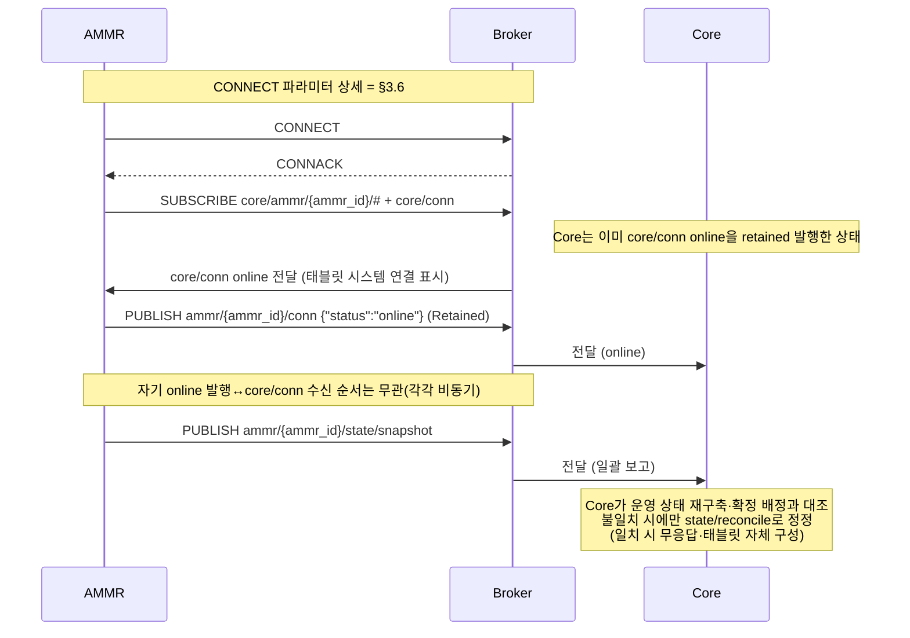
```mermaid
sequenceDiagram
    participant A as AMMR
    participant B as Broker
    participant C as Core

    Note over A,B: CONNECT 파라미터 상세 = §3.6
    A->>B: CONNECT
    B-->>A: CONNACK
    A->>B: SUBSCRIBE core/ammr/{ammr_id}/#35; + core/conn
    Note over C: Core는 이미 core/conn online을 retained 발행한 상태
    B->>A: core/conn online 전달 (태블릿 시스템 연결 표시)
    A->>B: PUBLISH ammr/{ammr_id}/conn {"status":"online"} (Retained)
    B->>C: 전달 (online)
    Note over A,B: 자기 online 발행↔core/conn 수신 순서는 무관(각각 비동기)
    A->>B: PUBLISH ammr/{ammr_id}/state/snapshot
    B->>C: 전달 (일괄 보고)
    Note over C: Core가 운영 상태 재구축·확정 배정과 대조<br/>불일치 시에만 state/reconcile로 정정<br/>(일치 시 무응답·태블릿 자체 구성)
```

일괄 보고(A-2) 처리 후 Core는 확정 배정과 대조해 불일치가 있을 때만 일괄보고 응답(C-3 `state/reconcile`)으로 정정한다. 평상시 태블릿 화면은 보유 상태와 자체 slot_state 판정으로 스스로 채운다.

### 6.2 Job Sequence

Core는 하나의 이송 요청을 Job Sequence(Move → Pickup → Move → Dropoff)로 전개하여 **한 번에 하나씩** 지시한다. 각 Job 지시 후 AMMR은 수신 확인(`job/received`)을 보고하고, Pickup·Dropoff 동작으로 AMMR Slot 상태가 바뀌면 그 시점에 Slot 상태 전이(`state/slot`)를 보고한 뒤, Job 종료 시점에 결과(`job/report`)를 보고한다. Core는 앞선 Slot 상태 전이를 상태로만 반영하고 배정·이송 판단은 결과로 한다. 태블릿은 Job 결과와 지시에 선탑재된 값으로 적재·배정 화면을 자체 갱신한다.

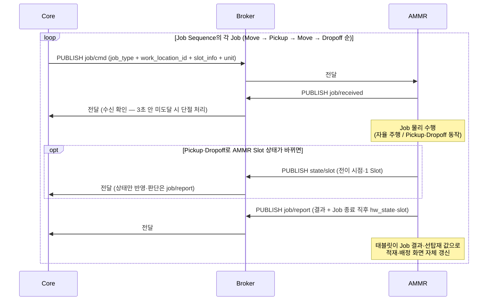
```mermaid
sequenceDiagram
    participant C as Core
    participant B as Broker
    participant A as AMMR

    loop Job Sequence의 각 Job (Move → Pickup → Move → Dropoff 순)
        C->>B: PUBLISH job/cmd (job_type + work_location_id + slot_info + unit)
        B->>A: 전달
        A->>B: PUBLISH job/received
        B->>C: 전달 (수신 확인 — 3초 안 미도달 시 단절 처리)
        Note over A: Job 물리 수행<br/>(자율 주행 / Pickup·Dropoff 동작)
        opt Pickup·Dropoff로 AMMR Slot 상태가 바뀌면
            A->>B: PUBLISH state/slot (전이 시점·1 Slot)
            B->>C: 전달 (상태만 반영·판단은 job/report)
        end
        A->>B: PUBLISH job/report (결과 + Job 종료 직후 hw_state·slot)
        B->>C: 전달
        Note over A: 태블릿이 Job 결과·선탑재 값으로<br/>적재·배정 화면 자체 갱신
    end
```

**주의**: AMMR은 Core의 다음 Job 지시 전에 다음 Job을 스스로 시작하지 않는다. 1 Job 종료 → 결과 보고 → Core 판정 → 다음 Job 지시의 순환이다. 이 순환을 어기고 수행 중에 지시가 겹쳐 오면 AMMR은 그 지시를 거부한다 (C-2).

**※ 이송 상황별 Job Sequence**

| 이송 상황                                                        | Job Sequence |
|------------------------------------------------------------------|---|
| 일반 이송                                                        | Move → Pickup → Move → Dropoff |
| 적재 중 Unit의 후속 운반 (재로드·복구로 적재 Unit이 확정된 경우) | Move → Dropoff (AMMR이 이미 Unit을 적재한 상태라 Pickup 없음) |
| 최근 명령 재요청 (담당자 요청)                                   | 마지막 실패 Job이 속한 짝의 Move부터 재발행 (§6.9) |
| 직전 검증에 걸려 자리가 바뀐 경우                                | 바뀐 자리로 Move(예정 Slot)부터 다시 → Pickup 또는 Dropoff (Pickup = 다음 이송의 출발지로 · Dropoff = 같은 이송의 새 목적지로 · 같은 설비 안 다른 Slot이어도 Move부터) |
| 충전                                                             | Charge 단일 Job (§6.3) |

AMMR은 어떤 순서 조합이든 단건 Job 계약(C-2)만으로 수행할 수 있어야 하며, Dropoff가 항상 Pickup 뒤에 온다고 가정하지 않는다.

Job 시작 시점의 상단 고정 영역(HW 상태·위치·Battery·최근 명령·설비 Slot·AMMR Slot)은 태블릿이 자기 보고값(hw_state·pose·BMS)과 Core 선탑재 Job 정보로 자체 구성한다 (상세 = "AMMR 태블릿 UI 정의 제안").

### 6.3 Charge Job Sequence

Charge는 Core가 자체 결정하여 **단일 Charge Job**으로 지시한다. `work_location_id`가 없으며, AMMR은 태블릿 설정값으로 보유한 충전 스테이션으로 자체 이동·도킹한다 (§8.6). 도킹·충전·이탈·자체 임계에 따른 충전 중단 결정은 AMMR HW 자율 영역이다.

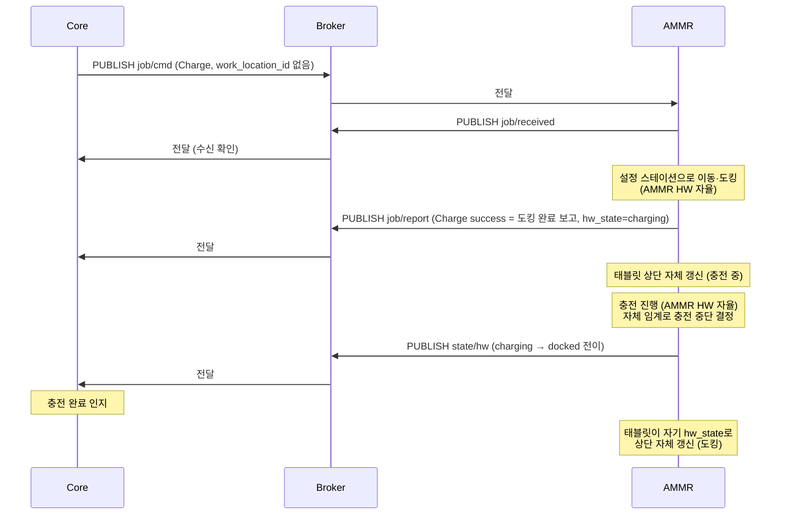
```mermaid
sequenceDiagram
    participant C as Core
    participant B as Broker
    participant A as AMMR

    C->>B: PUBLISH job/cmd (Charge, work_location_id 없음)
    B->>A: 전달
    A->>B: PUBLISH job/received
    B->>C: 전달 (수신 확인)
    Note over A: 설정 스테이션으로 이동·도킹<br/>(AMMR HW 자율)
    A->>B: PUBLISH job/report (Charge success = 도킹 완료 보고, hw_state=charging)
    B->>C: 전달
    Note over A: 태블릿 상단 자체 갱신 (충전 중)

    Note over A: 충전 진행 (AMMR HW 자율)<br/>자체 임계로 충전 중단 결정
    A->>B: PUBLISH state/hw (charging → docked 전이)
    B->>C: 전달
    Note over C: 충전 완료 인지
    Note over A: 태블릿이 자기 hw_state로<br/>상단 자체 갱신 (도킹)
```

충전 중에도 Core는 이 AMMR에 Job을 지시할 수 있다. 이 경우 AMMR은 충전을 중단하고 스테이션에서 이탈한 뒤 Job을 수행한다 (§8.5).

### 6.4 사람 개입에 따른 Slot 상태 외부 전이

사람이 AMMR Slot에서 Unit을 임의로 꺼내거나 올려놓는 경우 등 외부 원인 전이. Job이 다루는 Slot이라도 사람 손으로 생긴 전이는 이 절을 따르며, 그 Job의 결과는 A-8이 따로 알린다. Pickup이 Unit을 놓으려던 AMMR Slot이 이렇게 점유되면 AMMR은 그 Slot에 놓지 않고 Unit을 집어 온 자리에 되돌려 놓는다 (§8.10). 태블릿이 slot_state를 자체 판정해 해당 Slot 1개를 보고하고(A-4) 화면도 자체 반영한다. Core 지시 없이 일어난 변경이므로 해당 Slot의 Core 배정 정보(Unit·Job)는 무효가 되어 태블릿은 그 Slot의 Core 관련 정보를 비운다. 꺼내서 점유가 끊겼으면 `empty`로, 새로 올려놓거나 꺼냈다 다시 올려 점유가 되살아났는데 식별되지 않으면 `blocked`로 보고한다. 점유가 한 번도 끊기지 않은 교체는 태블릿이 감지하지 못한다. blocked로 남은 Slot은 태블릿에 값을 고쳐 넣어 회복을 시도한다. 고친 값은 일괄 보고에 실려 자동 전달되며, 즉시 보내려면 적재 정보 일괄 재로드(§6.5)를 쓴다. Core는 운영 상태만 갱신한다.

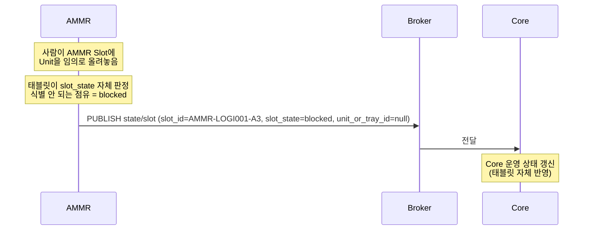
```mermaid
sequenceDiagram
    participant A as AMMR
    participant B as Broker
    participant C as Core

    Note over A: 사람이 AMMR Slot에<br/>Unit을 임의로 올려놓음
    Note over A: 태블릿이 slot_state 자체 판정<br/>식별 안 되는 점유 = blocked
    A->>B: PUBLISH state/slot (slot_id=AMMR-LOGI001-A3, slot_state=blocked, unit_or_tray_id=null)
    B->>C: 전달
    Note over C: Core 운영 상태 갱신<br/>(태블릿 자체 반영)
```

### 6.5 적재 정보 일괄 재로드

담당자가 태블릿에서 Slot 사용 보류(blocked)를 회복시키는 흐름이다. 대표 사례는 시스템 연결이 끊긴 동안 담당자가 Slot별 입력 박스에 Tray ID를 입력해 두고 재연결 후 [일괄 보고 재로드]를 실행하는 경우다 (태블릿 동작 세부는 "AMMR 태블릿 UI 정의 제안" 참조).

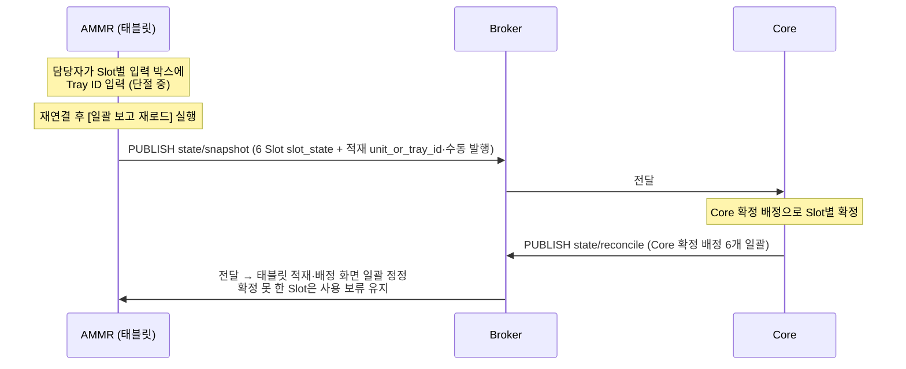
```mermaid
sequenceDiagram
    participant A as AMMR (태블릿)
    participant B as Broker
    participant C as Core

    Note over A: 담당자가 Slot별 입력 박스에<br/>Tray ID 입력 (단절 중)
    Note over A: 재연결 후 [일괄 보고 재로드] 실행
    A->>B: PUBLISH state/snapshot (6 Slot slot_state + 적재 unit_or_tray_id·수동 발행)
    B->>C: 전달
    Note over C: Core 확정 배정으로 Slot별 확정
    C->>B: PUBLISH state/reconcile (Core 확정 배정 6개 일괄)
    B->>A: 전달 → 태블릿 적재·배정 화면 일괄 정정<br/>확정 못 한 Slot은 사용 보류 유지
```

### 6.6 AMMR HW 장애 보고

AMMR HW가 물리적으로 실패한 경우. Job 수행 결과 통합 보고 payload(`hw_state=error` 또는 `ammr_hw_*` reason) 또는 상태 전이 Event(A-3)로 보고된다.

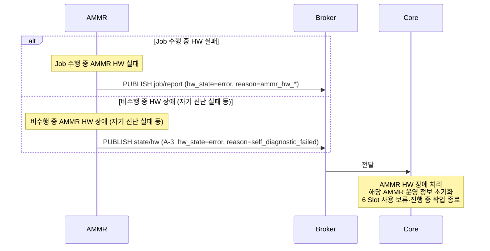
```mermaid
sequenceDiagram
    participant A as AMMR
    participant B as Broker
    participant C as Core

    alt Job 수행 중 HW 실패
        Note over A: Job 수행 중 AMMR HW 실패
        A->>B: PUBLISH job/report (hw_state=error, reason=ammr_hw_*)
    else 비수행 중 HW 장애 (자기 진단 실패 등)
        Note over A: 비수행 중 AMMR HW 장애 (자기 진단 실패 등)
        A->>B: PUBLISH state/hw (A-3: hw_state=error, reason=self_diagnostic_failed)
    end
    B->>C: 전달
    Note over C: AMMR HW 장애 처리<br/>해당 AMMR 운영 정보 초기화<br/>6 Slot 사용 보류·진행 중 작업 종료
```

`hw_state=error`가 보고되면 Core는 **payload 전체 신뢰 없음**으로 간주하여 Slot 정합 정보(slot_state) 부분은 무시하고 해당 AMMR의 운영 정보를 초기화한다.

AMMR이 `error` 상태인 동안 Job 지시(C-2)를 수신한 경우 — 수신 확인(A-7)은 발행하고, 그 Job은 수행하지 않은 채 즉시 Job 수행 결과 통합 보고(A-8)로 실패를 회신한다 (`job_result` = `failure` · `reason` = `ammr_hw_error_state` · `hw_state` = `error`). Pickup·Dropoff 지시의 `slot` 동반 여부와 값은 A-8의 수행에 진입하지 않은 거부 규칙을 따른다. `error` 진입 시점에 수신 확인을 보냈지만 아직 수행에 들어가지 않은 Job도 같은 방식으로 실패를 회신하고 폐기한다. 장애 복구(`error`에서 벗어나는 전이) 후에도 이 Job들을 소급 수행하지 않으며, 필요한 작업은 Core가 새 Job으로 다시 지시한다. Core는 이 보고를 §7.2 분기 1(AMMR HW 장애 처리)로 처리한다.

**장애 복구 시 발행**: 장애는 원인과 무관하게 담당자가 현장을 조치한 뒤 태블릿에서 [Reset]을 눌러 해제한다. [Reset] 해제는 Manipulator가 원점에 있을 때만 받으며, 원점에 있지 않으면 담당자 원점 복귀(§8.11)를 먼저 한다. 해제로 `error`에서 벗어나 그 시점의 실제 상태(`idle`·`charging`·`docked` · 장애 중 자율 충전 이동 중이었으면 `self_charge`·`low_battery`)로 전이하면 AMMR은 전이 보고(A-3 · `reason` = `manual_reset`)와 함께 일괄 보고(A-2)를 `trigger` = `error_cleared`로 발행한다. 장애 처리로 Core가 비운 운영 정보와 사용 보류로 둔 6 Slot이 이 보고로 회복된다. 단절과 달리 MQTT 연결이 끊기지 않아 재연결 경로를 타지 않으므로 이 계기가 그 자리를 대신한다. 장애 동안 올린 일괄 보고에는 Core가 일괄보고 응답(C-3)을 보내지 않으므로, 태블릿은 보관한 적재 식별값을 그대로 두었다가 이 보고에 싣는다. 장애 동안에는 담당자 재로드(`manual`)를 발행하지 않는다.

**장애 중 자율 충전 이동**: 설비 측 실패(`equip_*`)로 원점 복귀를 마친 뒤 들어간 `error`와 Move 수행 한도 초과(`ammr_hw_job_timeout` · `job_type` = `move`)로 들어간 `error`는, 자동 모드이면 `error`를 유지한 채 자율 충전을 이어간다. Job 대기 한도(§8.4)가 지나면 충전 스테이션으로 이동·도킹·충전하고 저전력 자율 충전(§8.3)도 돈다. 이 동안 `hw_state`는 계속 `error`로 싣고 `self_charge`·`low_battery`·`charging`·`docked` 전이는 A-3로 발행하지 않으며, 위치·BMS 스트리밍과 주기 일괄 보고는 그대로 발행한다. 수동 모드로 바뀌면 그 자리에서 멈추고 자동 모드로 돌아오면 이어간다(§8.9). 이동 중 안전 정지는 §8.8을 따른다. 이동 중에 [Reset]으로 해제하면 그 이동을 이어가며 Job 대기 한도로 가던 중이면 `self_charge`, 저전력 자율 충전으로 가던 중이면 `low_battery`로 전이한다. 그 밖의 `error`는 그 자리에 멈춘다. Core는 `error` 중 올라오는 위치·BMS를 표시에만 쓰고, 운영 정보 회복과 6 Slot 사용 보류 해제는 장애 복구 발행을 기다린다.

### 6.7 AMMR HW 단절 (Last Will)

MQTT 경로는 살아있으나 AMMR HW가 Broker와의 연결을 잃은 경우. Broker가 LWT를 자동 발행한다.

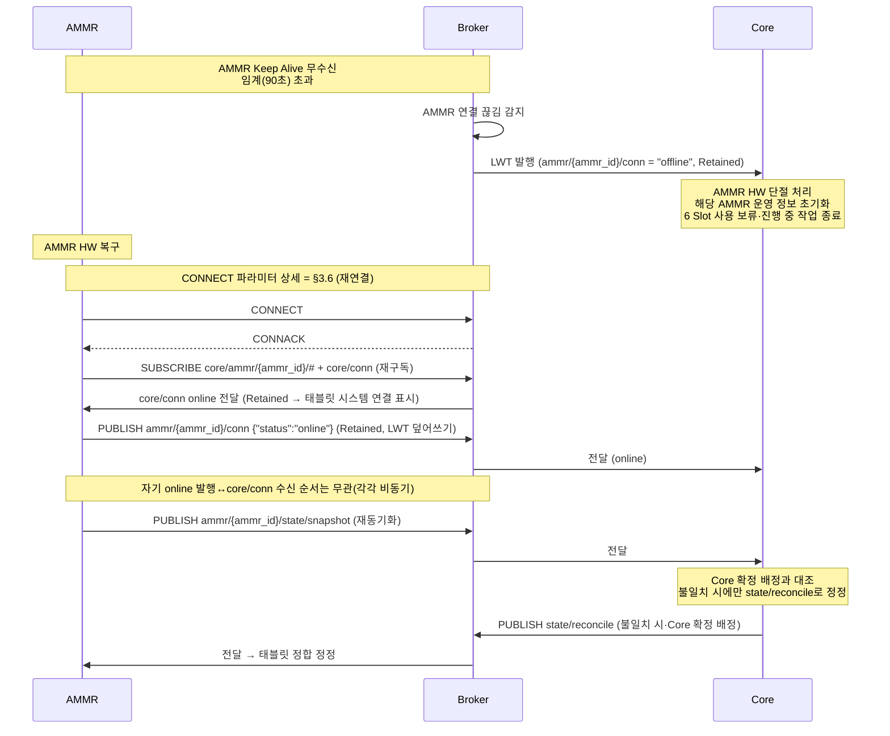
```mermaid
sequenceDiagram
    participant A as AMMR
    participant B as Broker
    participant C as Core

    Note over A,B: AMMR Keep Alive 무수신<br/>임계(90초) 초과
    B->>B: AMMR 연결 끊김 감지
    B->>C: LWT 발행 (ammr/{ammr_id}/conn = "offline", Retained)
    Note over C: AMMR HW 단절 처리<br/>해당 AMMR 운영 정보 초기화<br/>6 Slot 사용 보류·진행 중 작업 종료

    Note over A: AMMR HW 복구
    Note over A,B: CONNECT 파라미터 상세 = §3.6 (재연결)
    A->>B: CONNECT
    B-->>A: CONNACK
    A->>B: SUBSCRIBE core/ammr/{ammr_id}/#35; + core/conn (재구독)
    B->>A: core/conn online 전달 (Retained → 태블릿 시스템 연결 표시)
    A->>B: PUBLISH ammr/{ammr_id}/conn {"status":"online"} (Retained, LWT 덮어쓰기)
    B->>C: 전달 (online)
    Note over A,B: 자기 online 발행↔core/conn 수신 순서는 무관(각각 비동기)
    A->>B: PUBLISH ammr/{ammr_id}/state/snapshot (재동기화)
    B->>C: 전달
    Note over C: Core 확정 배정과 대조<br/>불일치 시에만 state/reconcile로 정정
    C->>B: PUBLISH state/reconcile (불일치 시·Core 확정 배정)
    B->>A: 전달 → 태블릿 정합 정정
```

재연결 시 태블릿은 보유 상태와 자체 slot_state 판정으로 화면을 스스로 회복하며, Core는 확정 배정과 어긋날 때만 일괄보고 응답(C-3)으로 정정한다. blocked로 남은 Slot은 태블릿에 값을 고쳐 넣어 회복을 시도한다. 고친 값은 일괄 보고에 실려 재연결·주기 발행으로 자동 전달되며, 즉시 보내려면 적재 정보 일괄 재로드(§6.5)를 쓴다.

### 6.8 Core 측 재연결·Core 재시작 시 재동기화

Core가 재시작되거나 Core 측 MQTT 연결만 재수립된 경우, AMMR 측 재연결이 없어 일괄 보고가 자연 도달하지 않는다. Core는 재접속 직후 연결 상태(`core/conn` `online`)를 retained로 발행하며, AMMR이 이를 감지해 일괄 보고(A-2)를 재발행함으로써 재수신을 개시한다. (주기 일괄 보고로도 재동기화되며, 특정 AMMR을 즉시 당겨야 하면 일괄 보고 재전송 요청(C-4)을 예비로 쓴다.)

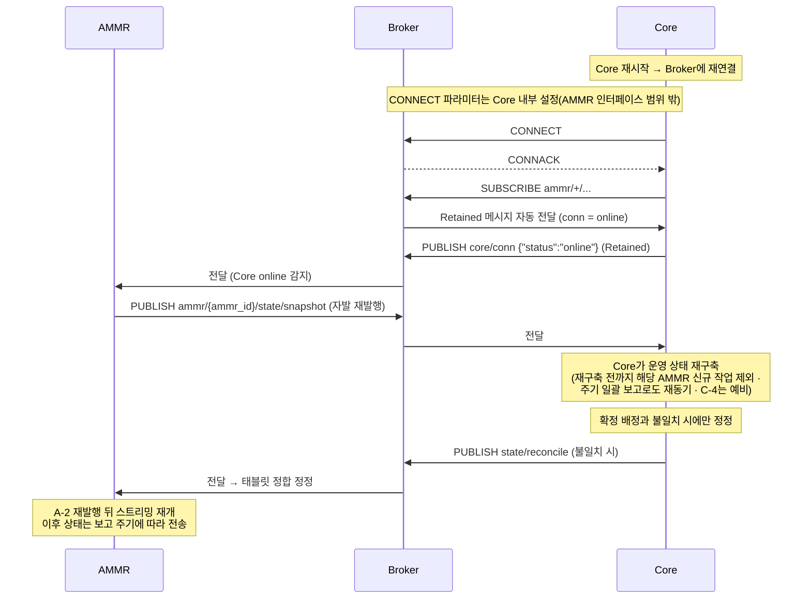
```mermaid
sequenceDiagram
    participant A as AMMR
    participant B as Broker
    participant C as Core

    Note over C: Core 재시작 → Broker에 재연결
    Note over C,B: CONNECT 파라미터는 Core 내부 설정(AMMR 인터페이스 범위 밖)
    C->>B: CONNECT
    B-->>C: CONNACK
    C->>B: SUBSCRIBE ammr/+/...
    B->>C: Retained 메시지 자동 전달 (conn = online)

    C->>B: PUBLISH core/conn {"status":"online"} (Retained)
    B->>A: 전달 (Core online 감지)
    A->>B: PUBLISH ammr/{ammr_id}/state/snapshot (자발 재발행)
    B->>C: 전달
    Note over C: Core가 운영 상태 재구축<br/>(재구축 전까지 해당 AMMR 신규 작업 제외 ·<br/>주기 일괄 보고로도 재동기 · C-4는 예비)
    Note over C: 확정 배정과 불일치 시에만 정정
    C->>B: PUBLISH state/reconcile (불일치 시)
    B->>A: 전달 → 태블릿 정합 정정

    Note over A: A-2 재발행 뒤 스트리밍 재개<br/>이후 상태는 보고 주기에 따라 전송
```

### 6.9 최근 명령 재요청

실패로 끝난 작업을 담당자 요청으로 다시 지시하는 흐름이다. Core는 그 AMMR에 마지막으로 발행한 Job을 찾아 payload를 그대로 쓰고 `job_id`만 새로 발급한다. 재발행 순서의 첫 Job에는 요청의 `job_id`를 `resume_job_id`에 그대로 실어, 태블릿이 그 사이 들어온 다른 Job 지시와 가릴 수 있게 한다. 목적지·Slot·`unit`은 그때 값 그대로이며 다시 판정하지 않는다. 태블릿은 요청 직전에 일괄 보고(`trigger` = `resume`)를 먼저 발행해 Core 측 운영 상태와 사용 보류를 회복시키고, 그 일괄보고 응답을 받은 뒤 요청을 보낸다.

담당자가 [최근 명령 재요청]을 누른 뒤 답이 올 때까지는 다른 Job이 끼어들지 않는다. Core는 `resume` 계기 일괄 보고를 받은 뒤 최근 명령 재요청을 처리할 때까지 이 AMMR에 새 Job을 내지 않고, 일괄보고 응답(C-3)을 보낸 뒤 재요청 대기 임계(§7.3) 안에 요청이 오지 않으면 다시 이어간다. 보류 전에 이미 나간 Job이 그동안 도착하면 AMMR이 수행 없이 거부한다 (`ammr_hw_resume_pending`·C-2).

조치하는 동안 AMMR 위치를 신뢰할 수 없으므로 그 Job이 속한 짝의 Move부터 낸다.

| 마지막 실패 Job | 재발행 순서 |
|-----------------|---|
| Pickup          | Move(출발 설비) → Pickup → Move → Dropoff |
| Dropoff         | Move(도착 설비) → Dropoff |
| Move            | 그 Move부터 뒤따르는 순서 그대로 (출발 설비로 가던 Move = → Pickup → Move → Dropoff · 도착 설비로 가던 Move = → Dropoff) |

Charge는 Core가 충전 판단으로 스스로 내리는 Job이라 재발행 대상이 아니다.

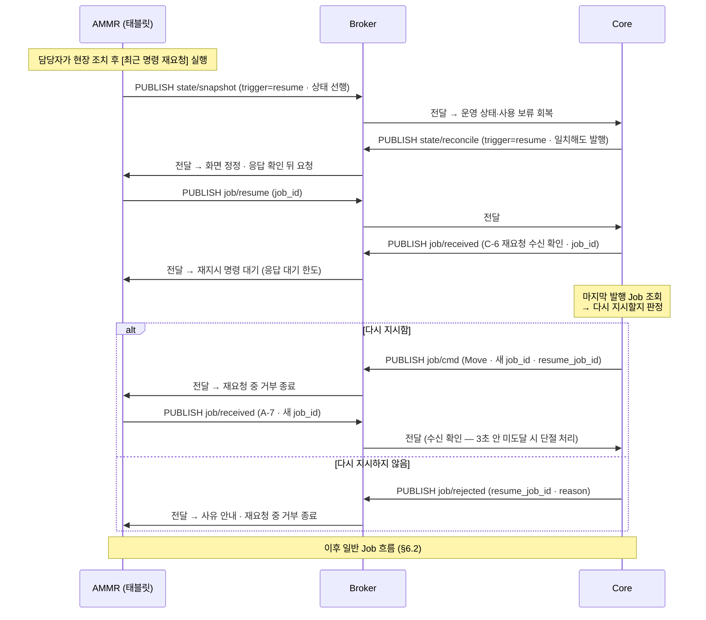
```mermaid
sequenceDiagram
    participant A as AMMR (태블릿)
    participant B as Broker
    participant C as Core

    Note over A: 담당자가 현장 조치 후 [최근 명령 재요청] 실행
    A->>B: PUBLISH state/snapshot (trigger=resume · 상태 선행)
    B->>C: 전달 → 운영 상태·사용 보류 회복
    C->>B: PUBLISH state/reconcile (trigger=resume · 일치해도 발행)
    B->>A: 전달 → 화면 정정 · 응답 확인 뒤 요청
    A->>B: PUBLISH job/resume (job_id)
    B->>C: 전달
    C->>B: PUBLISH job/received (C-6 재요청 수신 확인 · job_id)
    B->>A: 전달 → 재지시 명령 대기 (응답 대기 한도)
    Note over C: 마지막 발행 Job 조회<br/>→ 다시 지시할지 판정
    alt 다시 지시함
        C->>B: PUBLISH job/cmd (Move · 새 job_id · resume_job_id)
        B->>A: 전달 → 재요청 중 거부 종료
        A->>B: PUBLISH job/received (A-7 · 새 job_id)
        B->>C: 전달 (수신 확인 — 3초 안 미도달 시 단절 처리)
    else 다시 지시하지 않음
        C->>B: PUBLISH job/rejected (resume_job_id · reason)
        B->>A: 전달 → 사유 안내 · 재요청 중 거부 종료
    end
    Note over A,C: 이후 일반 Job 흐름 (§6.2)
```

대상은 마지막 Job이 실패로 끝난 경우로 한정하며, 장애·단절로 결과를 받지 못한 채 Core가 종료 처리한 Job도 실패로 끝난 것과 같게 본다. 발행 이력이 없거나 마지막 Job이 아직 끝나지 않았거나 성공으로 끝났거나 Charge이거나, 그 Job의 Unit을 이미 다른 AMMR이 맡아 옮기는 중이거나, 싣고 옮기던 Unit의 AMMR Slot이 선행 보고 뒤에도 식별값 없는 `blocked`로 남아 있으면 Core는 Job을 내지 않고, 재요청 거절(C-7)에 요청의 `job_id`(`resume_job_id`)와 사유(`reason`·§부록 A.14)를 실어 보낸다. 재지시 성공 여부는 AMMR이 다시 지시한 Job을 수행한 결과로 정해지며, 수행하지 못하면 그 사유가 Job 수행 결과(A-8)로 회신된다.

### 6.10 작업 취소

이동 중인 작업을 담당자가 끊는 흐름이다. 태블릿에서 취소하면 AMMR이 스스로 Job을 중단하고 실패로 회신한다. Core가 중단을 지시하는 경로는 없다.

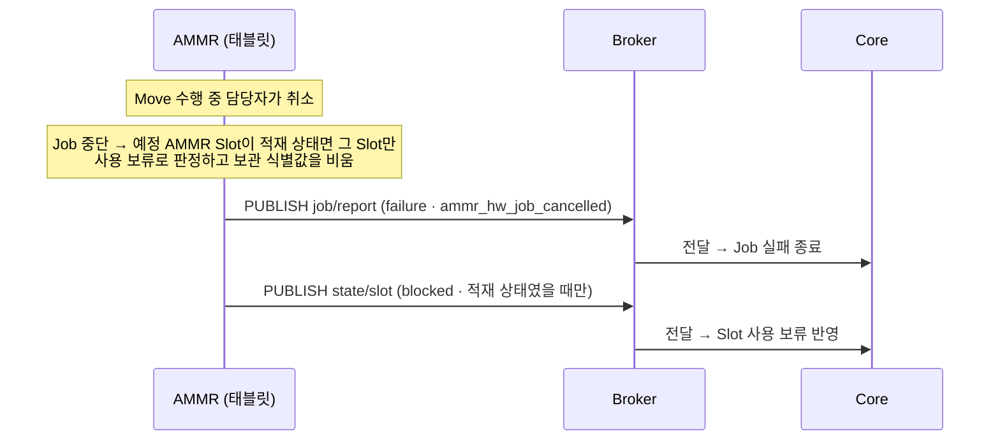
```mermaid
sequenceDiagram
    participant A as AMMR (태블릿)
    participant B as Broker
    participant C as Core

    Note over A: Move 수행 중 담당자가 취소
    Note over A: Job 중단 → 예정 AMMR Slot이 적재 상태면 그 Slot만<br/>사용 보류로 판정하고 보관 식별값을 비움
    A->>B: PUBLISH job/report (failure · ammr_hw_job_cancelled)
    B->>C: 전달 → Job 실패 종료
    A->>B: PUBLISH state/slot (blocked · 적재 상태였을 때만)
    B->>C: 전달 → Slot 사용 보류 반영
```

중단한 Move의 `slot_info`가 가리키는 AMMR Slot에 Unit이 실려 있으면 태블릿이 그 Slot 하나만 `blocked`로 올리고 보관 식별값을 비운다. 다른 Slot은 그대로 둔다. 식별값이 비어 있는 동안 Core는 그 Unit의 후속 운반을 세우지 않으므로 같은 작업이 곧바로 다시 오지 않는다. 되살리려면 담당자가 설정 화면에서 그 Slot에 Tray ID를 다시 넣고 적재 정보 일괄 재로드(§6.5)를 실행한다.

아직 싣지 않은 상태에서 취소하면 Slot에 올릴 변화가 없어 Job 실패 회신만 발행한다.

---

## 7. 오류 처리·재시도·Timeout

### 7.1 Reason 코드 분류

Job 실패 시 `reason` 필드에 사유를 기재한다. 코드 일람은 §부록 A.4에서 확정한다.

거부 사유가 둘 이상 성립하면 수행 조건 사유(`error`·`low_battery`·`self_charge` 상태 중 수신·수동 모드 중 수신·재요청 중 수신) → 시점 사유(앞선 Job 수행 중 수신) → 내용 사유(지시가 계약에 어긋남) 순으로 앞선 것을 싣는다. 앞선 사유로 거부할 때는 뒤 사유를 검사하지 않는다.

#### AMMR HW 측 카테고리 (`ammr_hw_*`)

이 카테고리 가운데 고장 계통 사유는 AMMR이 `error`로 전이해 `hw_state = error`와 함께 회신하며, Core는 그 상태 보고로 장애 처리에 들어가 해당 AMMR의 운영 정보를 초기화하고 6 Slot을 사용 보류 처리한다. 장애가 아닌 상태에서 오는 수행 조건 거부(`ammr_hw_low_battery_state`·`ammr_hw_self_charge_state`·`ammr_hw_manual_mode`·`ammr_hw_resume_pending`)는 해당 Job만 실패로 종료하며 운영 정보 초기화나 Slot 사용 보류를 하지 않는다. 담당자 취소(`ammr_hw_job_cancelled`)도 같다. Gripper 파지 확인 실패(`ammr_hw_gripper_empty`·`ammr_hw_gripper_holding`)는 Gripper 이상일 수 있어 AMMR이 `error`로 전이해 멈추고 `hw_state = error`로 실패를 회신하며, 담당자가 현장을 확인한 뒤 [Reset]으로 해제한다. 주행·구동·Manipulator·Vision 고장과 자체 점검 이상·그 외 사유(`ammr_hw_fms_fault`·`ammr_hw_mobility_fault`·`ammr_hw_manipulator_fault`·`ammr_hw_vision_fault`·`ammr_hw_self_diagnostic_failed`·`ammr_hw_other`), 수행 한도 초과(`ammr_hw_job_timeout`)도 AMMR이 `error`로 전이해 `hw_state = error`로 실패를 회신한다. 수행 한도 초과 가운데 Move는 장애 중 자율 충전 이동을 이어가고(§6.6), 나머지는 그 자리에 멈춘다.

#### Slot 측 카테고리 (`slot_*`)

이 카테고리 보고 시 Core는 해당 Slot의 클라이언트 정합 판정 결과를 반영해 운영을 결정한다 — Pickup 측 실패는 해당 이송을 종료한다. 다만 Unit을 놓을 AMMR Slot이 점유돼 집어 온 자리에 되돌려 놓은 실패(`slot_dest_occupied`)는 Unit이 되돌아온 자리의 정합이 회복되면 같은 운반이 다시 지시될 수 있다. Dropoff 측 실패는 목적지 Slot이 점유된 경우에만 대체 목적지를 재판단해 그 자리로 가는 Move부터 새로 지시할 수 있고, 그 밖의 사유는 이송을 실패로 종료하고 해당 Slot을 사용 보류로 두어 담당자 확인을 기다린다.

#### 지시 측 카테고리 (`job_*`)

이 카테고리 보고 시 Core는 payload를 신뢰하고 해당 Job만 실패로 종료한다. 운영 정보 초기화나 Slot 사용 보류를 하지 않고, 같은 지시를 자동으로 다시 보내지 않으며, 이 AMMR은 곧바로 다음 지시를 받을 수 있다. 단 `job_concurrent_request`는 앞선 Job이 아직 도는 중이라는 회신이라, 그 Job의 결과 보고를 받은 뒤에 다음 지시를 낸다.

#### 설비 측 카테고리 (`equip_*`)

이 카테고리 보고 시 Core는 해당 Job을 실패로 종료하고 같은 지시를 자동으로 다시 보내지 않는다. AMMR은 원점 복귀를 마친 뒤 `error`로 전이하고(§8.10) 장애 중 자율 충전 이동을 이어간다(§6.6). Core는 그 장애 보고로 운영 정보를 초기화하고 6 Slot을 사용 보류로 두며, 사용 보류는 담당자가 설비와 AMMR을 확인한 뒤 [Reset]으로 장애를 해제하면 풀린다.

### 7.2 Job 결과 실패 처리 (payload 분기)

Job 수행 결과 통합 보고의 payload는 아래 표대로 분기되어 Core가 처리한다. 분기 2~4의 상태 기준은 **장애 아님**(`error` 아닌 모든 값)이다. 수행에 진입하지 않은 거부는 회신 시점의 현재 상태가 실리므로 수행 중인 Job의 동작 값도 여기 든다. `low_battery` 동반 시에도 결과 처리는 동일하며, 신규 Job 배정만 차단된다 (§8.3). 수동 모드도 같아 결과 처리는 그대로이고 신규 Job 배정만 차단된다 (§8.9).

| #   | payload 조합 | Core 처리 |
|-----|---|---|
| 1   | `hw_state = error` (job_result·reason 무관) | AMMR HW 장애 처리 — 운영 정보 초기화 + 6 Slot 사용 보류 |
| 2   | `hw_state = 장애 아님(error 아닌 모든 값)` + `job_result = failure` + `reason = ammr_hw_*` (단 수행 조건 거부·담당자 취소 제외) | 보고 값 그대로 — 해당 Job만 실패로 종료 · 운영 정보·Slot 상태 유지 (이 코드들은 `hw_state = error`와 함께 싣는 것이 계약·§7.1) |
| 2-1 | `hw_state = 장애 아님(error 아닌 모든 값)` + `job_result = failure` + `reason = ammr_hw_low_battery_state`·`ammr_hw_self_charge_state`·`ammr_hw_manual_mode`·`ammr_hw_resume_pending` | 수행 조건 거부 — 로봇은 정상인데 수행 조건이 안 맞음 · payload 신뢰 · 해당 Job만 실패 종료 · 운영 정보·Slot 상태 유지 · 자율 충전·수동 조작 진행 또는 최근 명령 재요청 대기 |
| 2-2 | `hw_state = 장애 아님(error 아닌 모든 값)` + `job_result = failure` + `reason = ammr_hw_job_cancelled` | 담당자 취소 — payload 신뢰 · 해당 Job 실패 종료 · 적재 상태였으면 AMMR이 그 Slot을 사용 보류로 올려 이송이 그 AMMR에 묶인다 |
| 3   | `hw_state = 장애 아님(error 아닌 모든 값)` + `job_result = failure` + `reason = slot_*` | 해당 Slot 정합 판정 반영 → 운영 결정 (Pickup 실패 = 이송 종료·적재 AMMR Slot 점유로 집어 온 자리에 되돌려 놓았으면 그 자리 정합 회복 뒤 다시 지시될 수 있음 / Dropoff 실패 = 목적지 점유면 대체 목적지 재지시 가능·그 밖은 이송 종료 + 사용 보류) |
| 3-1 | `hw_state = 장애 아님(error 아닌 모든 값)` + `job_result = failure` + `reason = job_*` | 지시 측 거부 — payload 신뢰 · 해당 Job만 실패 종료 · 운영 정보·Slot 상태 유지 · 자동 재지시 없음 |
| 3-2 | `hw_state = 장애 아님(error 아닌 모든 값)` + `job_result = failure` + `reason = equip_*` | 설비 접점 실패 — 해당 Job 실패 종료 · 자동 재지시 없음 · 운영 정보·Slot 상태 유지 · 원점 복귀 뒤 `error` 전이가 이어 오고 그 보고로 장애 처리 · [Reset] 해제로 회복 |
| 4   | `hw_state = 장애 아님(error 아닌 모든 값)` + `job_result = success` | 정상 갱신 → 다음 Job 진행 |

### 7.3 Keep Alive / Timeout 임계값

| 항목                                              | 확정값       | 비고 |
|---------------------------------------------------|--------------|---|
| MQTT Keep Alive                                   | 60초         | AMMR이 PINGREQ를 보내는 주기 (Mosquitto 기본) |
| Broker 측 단절 감지 임계                          | 90초         | Keep Alive × 1.5 (MQTT 표준 권장) |
| LWT 발행 → Core 인지                              | 즉시         | Broker가 자동 발행, Core가 wildcard subscribe로 수신 |
| Broker 재연결 한도 (AMMR 측)                      | 초기값 300초 | 태블릿 설정값. 1초 간격 재시도·한도 경과 시 자동 시도 중단·이후 담당자 수동 연결 |
| Move Job 수행 한도 (AMMR 측)                      | 초기값 300초 | 태블릿 설정값. 한도 초과 시 수행 중단 + `error` 전이 + 실패 회신 (`reason` = `ammr_hw_job_timeout`) · 장애 중 자율 충전 이동 (§6.6) |
| Pickup·Dropoff Job 수행 한도 (AMMR 측)            | 초기값 300초 | 태블릿 설정값. 한도 초과 시 수행 중단 + `error` 전이 + 실패 회신 (`reason` = `ammr_hw_job_timeout`) · 그 자리 정지 |
| 설비 Interlock 확보 대기 한도 (AMMR 측)           | 초기값 180초 | 태블릿 설정값. 한도 초과 시 확보 실패로 판정 + 실패 회신 (`reason` = `equip_interlock_failed`) · 원점 복귀 뒤 `error` (§8.10) |
| Job 대기 한도 (AMMR 측)                           | 초기값 10초  | 태블릿 설정값. `idle` 지속이 한도를 넘으면 `self_charge` 진입 (§8.4) |
| Job 지시 수신 확인 임계 (Core 측)                 | 3초          | Core가 Job 지시 후 `job/received` 수신을 기다리는 timeout. 운영 결과 및 AMMR 통신 지연 특성에 따라 조정 가능. |
| 일괄 보고 재전송 응답 임계 (Core 측·예비)         | 3초          | (C-4 예비 사용 시) Core가 재전송 요청 후 일괄 보고(A-2) 도착을 기다리는 timeout — 미도달 시 다시 요청 가능. 위 항목과 같은 기준으로 조정 가능. |
| 설정값 조회 응답 임계 (Core 측·예비)              | 3초          | (C-5 예비 사용 시) Core가 조회 요청 후 설정값 보고(A-9) 도착을 기다리는 timeout — 미도달 시 다시 요청 가능. 위 항목과 같은 기준으로 조정 가능. |
| 재요청 대기 임계 (Core 측)                        | 3초          | Core가 재요청 선행 보고에 일괄보고 응답(C-3)을 보낸 뒤 최근 명령 재요청(A-10)을 기다리며 이 AMMR에 새 Job을 보류하는 timeout — 미도달 시 보류를 풀고 지시를 이어감. 위 항목과 같은 기준으로 조정 가능. |
| 재로드(수동 일괄 보고) 응답 대기 임계 (태블릿 측) | 초기값 3초   | 태블릿 설정값(응답 대기 한도·네 대기 공통). 태블릿이 일괄 보고를 수동 발행([일괄 보고 재로드]) 후 일괄보고 응답(C-3)을 기다리는 timeout. 미도달 시 실패 처리·담당자 재시도. |
| 재요청 선행 보고 응답 대기 임계 (태블릿 측)       | 초기값 3초   | 태블릿 설정값(응답 대기 한도·네 대기 공통). 태블릿이 [최근 명령 재요청]으로 일괄 보고(`resume`)를 발행한 뒤 일괄보고 응답(C-3)을 기다리는 timeout. 미도달 시 최근 명령 재요청을 보내지 않고 실패 처리·담당자 재시도. |
| 재요청 수신 확인 대기 임계 (태블릿 측)            | 초기값 3초   | 태블릿 설정값(응답 대기 한도·네 대기 공통). 태블릿이 [최근 명령 재요청] 발행 후 재요청 수신 확인(C-6) 도착을 기다리는 timeout. 미도달 시 실패 처리·담당자 재시도. |
| 재지시 명령 대기 임계 (태블릿 측)                 | 초기값 3초   | 태블릿 설정값(응답 대기 한도·네 대기 공통). 태블릿이 재요청 수신 확인(C-6)을 받은 뒤 요청에 답한 Job 지시(C-2·`resume_job_id`가 요청의 `job_id`)를 기다리는 timeout. 같은 `resume_job_id`의 재요청 거절(C-7)이 먼저 오면 대기를 끝내고 사유를 안내한다. 그 밖의 Job 지시는 재지시로 치지 않는다. 둘 다 미도달 시 재지시 없음으로 처리해 재요청 중 거부를 끝내고 안내. |

**※ 임계값 사이의 관계**

Broker는 마지막으로 받은 메시지 시각부터 단절 감지 임계를 센다. 위치·BMS 스트리밍이 이 시계를 계속 되돌리므로, 스트리밍이 도는 동안 단절 확정 시점은 마지막 보고에 단절 감지 임계와 Will Delay Interval을 더한 시각이다. Core가 `offline`이라 스트리밍이 멈춘 동안에는 Keep Alive PINGREQ가 이 시계를 되돌리므로 단절 확정이 그만큼 늦어진다.

보고 주기를 늘리면 끊긴 시점과 마지막 보고 사이 간격만큼 감지가 앞당겨진다. 위치 보고 주기가 T일 때 단절 확정은 (단절 감지 임계 - T + Will Delay Interval)에서 (단절 감지 임계 + Will Delay Interval) 사이에서 갈리며, T가 Keep Alive를 넘으면 PINGREQ가 시계를 대신 되돌려 변동 폭이 Keep Alive에서 멈춘다.

따라서 Keep Alive는 이 창의 상한과 변동 폭을, Will Delay Interval은 어떤 타이밍에 끊겨도 보장되는 하한을 정한다. 임계를 조정할 때는 두 값과 위치·BMS 보고 주기를 함께 본다.

### 7.4 재시도 정책

| 시나리오                                 | AMMR 측 동작 | Core 측 동작 |
|------------------------------------------|---|---|
| Broker 연결 끊김 (AMMR 측)               | 1초 간격 자동 재연결 시도. 재연결 한도(태블릿 설정값·초기값 300초) 경과 시 자동 시도 중단 — 이후 담당자가 태블릿에서 수동 연결. 재연결 = 새 세션 (Clean Start=true) — SUBSCRIBE 재수행 + conn online + 일괄 보고 재발행 | LWT 수신 → AMMR HW 단절 처리 |
| 단절 중 Job 지시                         | (수신 없음 — 재접속 시 Clean Start=true로 세션을 폐기해 단절 중 쌓인 옛 Job 지시가 배달되지 않음) | Job 지시 후 3초 안 수신 확인 미도달 → AMMR HW 단절 처리·해당 Job 종료. 재연결 후 뒤늦게 배달되는 옛 Job 지시는 없다 (stale Job 원천 차단) |
| Job 지시 수신 확인 미수신                | (해당 없음) | AMMR HW 단절과 동일 처리 |
| Job 지시 중복 수신                       | `job_id`로 멱등 처리 (1회만 수행) | (재발행 없음) |
| 최근 명령 재요청 중복 수신               | (해당 없음) | 같은 처리를 다시 수행 — 앞서 재발행한 Job이 아직 끝나지 않았으면 다시 지시하지 않고 재요청 거절(C-7·`resume_job_in_progress`)을 보낸다. 재지시를 이미 받은 태블릿은 기다리는 중이 아니라 이 거절에 영향받지 않는다 |
| 재지시 대기 중 다른 Job 지시 수신        | 수행 없이 거부 회신 (`ammr_hw_resume_pending`) | 해당 Job만 실패 종료·최근 명령 재요청을 처리할 때까지 이 AMMR에 새 Job을 내지 않아 같은 지시가 되풀이되지 않는다 |
| 종료 처리한 Job의 뒤늦은 보고            | (해당 없음) | 단절·장애로 종료한 `job_id`의 수신 확인·Job 수행 결과가 뒤늦게 도착해도 처리하지 않는다. Job을 되살리지 않고 payload도 반영하지 않으며, 실물은 이어지는 상태 전이 보고·일괄 보고로 다시 세운다 |
| Job 결과 미수신 (Core 측)                | (해당 없음 — AMMR은 1회만 보고) | 두절·장애 처리로 자연 처리 (별도로 다시 요청하지 않음) |
| 결과 메시지 중복 수신                    | (해당 없음) | `job_id`로 멱등 처리 |
| 일괄보고 응답·재로드 응답 미도착         | 표시 어긋남은 적재 정보 일괄 재로드(수동 일괄 보고)로 회복 (수동 발행 응답[C-3] 응답 대기 한도 내 미도착 시 태블릿 실패 처리·담당자 재시도) | (재발행 없음) |
| 재요청 선행 보고 응답 미도착             | 응답(C-3) 응답 대기 한도 내 미도착 시 최근 명령 재요청을 보내지 않고 재요청 중 거부를 끝내고 실패를 안내·담당자 재시도 | (재발행 없음) |
| 재요청 수신 확인 미도착                  | 확인(C-6) 응답 대기 한도 내 미도착 시 태블릿이 재요청 중 거부를 끝내고 실패를 안내·담당자 재시도 | (재발행 없음 — 미도달 판정은 태블릿 측이라 Core는 이 사건을 인지하지 않는다) |
| 재지시 명령 미도착                       | 확인(C-6) 뒤 응답 대기 한도 내 요청에 답한 Job 지시도 재요청 거절(C-7)도 미도착 시 재요청 중 거부를 끝내고 재지시 없음을 안내 (Core가 다시 지시하지 않기로 정한 경우는 C-7이 사유와 함께 오므로, 이 행은 둘 다 닿지 않은 경우) | (재발행 없음 — 태블릿 측 판정이라 Core는 인지하지 않는다) |
| 일괄 보고 재전송 요청 응답 미도착 (예비) | (해당 없음) | 다시 요청 가능 — 해당 AMMR은 일괄 보고 도착까지 신규 작업 대상 제외 |
| 설정값 조회 요청 응답 미도착 (예비)      | (해당 없음) | 다시 요청 가능 |

**핵심**: Core는 진행 중이던 Job의 결과 재보고를 요청하지 않는다. 두절 후 재연결 시 일괄 보고 재발행(AMMR 측 재연결) 또는 Core 연결 상태 발신(Core 측 재연결·§6.8, C-4는 예비)으로 자연 재동기화한다. 수신 확인 미수신은 AMMR HW 단절과 동일하게 처리한다.

**재동기 대기 중 작업 제외 (상시)**: Core가 상태를 재구축하지 못한 AMMR(초기 일괄 보고 미수신·재시작 후 재구축 전·재동기 대기 중·수동 모드에서 자동 모드로 돌아온 직후)은 재구축 완료까지 신규 작업 대상에서 제외하고, 일괄 보고(A-2) 도착으로 운영 상태가 재구축되면 자동 해제한다. 이는 재동기 경로(C-1 발신·주기 발행·C-4 예비·모드 전환 발행·장애 복구 발행)와 무관하게 적용되는 상시 규칙이다.

---

## 8. AMMR HW 자율 동작 영역

이 영역은 Core 간섭 없이 AMMR HW가 자체 처리하는 영역이다. AMMR 업체의 구현 책임이다.

### 8.1 자율 주행

- 위치 측위, 경로 결정, 장애물 회피, 물리적 이동의 모든 세부.
- Core는 목적지 설비 ID만 제공하고, 위치 해석·경로는 AMMR HW가 자체 맵으로 결정한다 (C-2).

### 8.2 도킹 / 충전 / 이탈

- 충전 스테이션 도킹의 물리 절차.
- 충전 동작 자체.
- 도킹 완료 시점에 **Charge Job 수행 결과(`job/report`)** 1회 보고 → "도킹 완료 보고"의 의미. 도킹 완료 시 Battery가 재충전 임계 이하면 `charging`, 아니면 `docked`를 싣는다.
- 이후 충전 진행·종료는 AMMR HW가 자율 처리하며, **충전 종료 임계치 도달 시점에 `state/hw`로 `charging → docked` 전이를 별도 보고**한다. 도킹한 채 머무는 동안 Battery가 재충전 임계치 이하로 내려가면 `docked → charging` 전이를 보고하고 충전을 재개한다.
- 자체 임계 도달에 따른 충전 중단 결정은 AMMR HW 자체 처리. 단, 충전 중 Core Job 지시 수신 시의 중단·이탈은 §8.5를 따른다.

### 8.3 저전력 자율 충전

- Battery가 태블릿 설정의 저전력 임계치(초기값 20%) 이하로 진입하면 AMMR HW가 자체적으로 다음 동작을 수행한다.
  - 현재 진행 중 단위 Job 종료 후 설정 스테이션으로 자율 이동·도킹·충전
  - 이 동작 진입 시 `state/hw`로 `low_battery` 보고 (진행 중 Job의 종료와 동시에 진입한 경우엔 Job 수행 결과 보고의 `hw_state = low_battery`로 보고)
  - 도킹 시점에 `state/hw`로 `charging` 전이 보고 (도킹 시 Battery가 재충전 임계 이하라 충전을 바로 시작한다)
  - 태블릿 설정의 충전 종료 임계치(초기값 80%) 도달 시점에 `state/hw`로 `docked` 전이 보고
- 이 자율 동작은 Core 다운 여부와 무관하게 작동한다.
- AMMR HW 상태가 `low_battery` 또는 `charging`인 동안 Core는 신규 Job 배정을 차단한다.
- `charging` 중에는 Core가 필요하다고 판단하면(대표 사례 = 충전으로 Battery 충분히 회복) 충전 종료 임계치 도달을 기다리지 않고 Job을 지시할 수 있다 (§8.5).
- `low_battery` 중에는 이 예외가 없다. Battery가 부족한 상태라 Core는 신규 Job을 지시하지 않고 저전력 자율 충전을 우선한다. `low_battery` 중 Job 지시가 수신되면 AMMR은 수행하지 않고 즉시 실패 회신한다 (수신 확인 A-7 + A-8 실패 회신·`reason` = `ammr_hw_low_battery_state`·§7.1).
- 수동 모드에서는 이 자율 동작이 돌지 않는다 (§8.9).
- 장애 중 자율 충전 이동(§6.6)의 `error`에서도 이 자율 동작이 돌며, 이때 `low_battery`·`charging`·`docked` 전이는 발행하지 않는다.

### 8.4 Job 대기 자체 충전 복귀

- AMMR HW 상태가 `idle`인 채로 Job 대기 한도(태블릿 설정값·초기값 10초)를 넘도록 새 Job 지시가 없으면 AMMR HW가 자체적으로 충전 스테이션으로 이동·도킹·충전한다.
- 이 동작 진입 시 `state/hw`로 `self_charge`를 보고한다 (`reason` = `idle_timeout`). Battery 잔량과 무관하며, Core 연결 여부와도 무관하다 (§8.7).
- 복귀 이동은 Core가 지시한 Job이 아니므로 Job 수행 결과(`job/report`)를 발행하지 않는다.
- 도킹 시점에 `state/hw`로 전이를 보고한다(`reason` = `autonomous_docking`) — Battery가 재충전 임계 이하면 `charging`, 아니면 `docked`다. 충전에 들어갔으면 충전 종료 임계치 도달 시점에 `docked` 전이를 보고한다(`reason` = `charge_completed`).
- 복귀 중에는 Core가 Job을 지시하지 않는다. `self_charge` 중 Job 지시가 수신되면 AMMR은 수행하지 않고 즉시 실패 회신한다 (수신 확인 A-7 + A-8 실패 회신·`reason` = `ammr_hw_self_charge_state`·§7.1). 도킹해 `charging`·`docked`로 전이한 뒤의 지시 수신은 §8.5를 따른다.
- 사용 스테이션은 태블릿 설정의 충전 스테이션 번호다 (§8.6).
- 수동 모드에서는 이 자율 복귀가 돌지 않는다 (§8.9).
- 장애 중 자율 충전 이동(§6.6)의 `error`도 `idle`과 같이 Job 대기 한도가 지나면 이 복귀를 수행하며, 이때 `self_charge`·`charging`·`docked` 전이는 발행하지 않는다.

### 8.5 충전 중 Job 지시 (충전 중단·이탈)

- Core는 충전 중(`charging`)이거나 도킹한 채 머무는(`docked`) AMMR에도 Job을 지시할 수 있다.
- 이 지시를 받으면 AMMR은 충전 중이면 충전을 중단하고 스테이션에서 이탈한 뒤 Job을 수행한다. 수신 확인·결과 보고는 일반 Job과 동일 (§6.2). 이탈에 따른 상태 전이(`charging → move`·`docked → move` 등 Job 시작 전이)는 A-3로 보고한다.
- Core가 어떤 기준으로 충전 중 AMMR에 Job을 지시하는지는 Core 내부 운영 판단 영역이다.

### 8.6 충전 스테이션 설정 (단일 출처)

- 충전 스테이션 위치는 **태블릿 설정 화면의 충전 스테이션 번호가 단일 출처**다. Core는 충전 스테이션 위치를 보유·지정하지 않는다.
- Core 지시 Charge Job(§6.3)·저전력 자율 충전(§8.3)·Job 대기 자체 충전 복귀(§8.4) 모두 이 설정 스테이션을 사용한다.

### 8.7 Core 다운 중 자율 동작

- Core가 다운된 동안 진행 중이던 Job은 완료까지 수행한다.
- 완료 후 AMMR은 대기 상태로 두고, Job 대기 한도가 지나면 충전 스테이션으로 복귀한다 (§8.4). 저전력 자율 충전(§8.3)도 그대로 작동한다.
- Core 복구 시 Core 연결 상태 발신(§6.8, C-4는 예비) 및 보고 재개로 자연 재동기화한다.

### 8.8 안전 정지 (Safety Field·범퍼·긴급정지)

AMMR HW가 자체 안전 장치로 멈추는 세 갈래다. 물리 정지는 AMMR HW가 자율로 수행하며 Core는 상태 전이 보고로 인지한다.

- **Safety Field 감지** — 안전 라이다의 보호 영역에 물체가 들어오면 일시 정지(`paused`)로 전이하고 `state/hw`로 보고한다 (`reason` = `safety_field_triggered`). 물체가 영역에서 벗어나면 스스로 재개하며 재개 전이를 보고한다 (`reason` = `safety_field_cleared`). 부저는 울리지 않는다.
- **범퍼 충돌** — 충돌이 감지되면 일시 정지(`paused`)로 전이하고 `state/hw`로 보고한다 (`reason` = `bumper_impact`). AMMR 자체 부저가 울리며 담당자가 태블릿에서 [Reset]을 눌러야 해제된다. 해제 시 재개 전이를 보고한다 (`reason` = `manual_reset`).
- **긴급정지 버튼** — 장애(`error`)로 전이한다. AMMR 자체 부저가 울리며 담당자가 태블릿에서 [Reset]을 눌러야 해제된다. 해제 시 그 시점의 실제 상태(`idle`·`charging`·`docked`)로의 전이를 보고한다 (`reason` = `manual_reset` · §6.6).

**Job 처리**: 일시 정지 두 갈래는 수행 중이던 Job이 살아 있어 해제 후 이어서 수행하며, 그동안 Job 수행 결과(`job/report`)를 발행하지 않는다. 긴급정지는 수행 중이던 Job을 실패로 회신한다 (`job_result` = `failure` · `reason` = `ammr_hw_emergency_stop` · `hw_state` = `error`). Core는 이 보고를 §7.2 분기 1로 처리하며, 복구 후 Slot 사용 보류는 태블릿이 올리는 일괄 보고로 자연 해제된다 (§6.6).

**한도 시계**: 일시 정지 동안 Job 수행 한도(Move·Pickup·Dropoff)와 설비 Interlock 확보 대기 한도의 시계는 멈추고 재개 시점부터 다시 센다. 사람이 잠시 지나간 것으로 Job이 한도 초과 실패가 되지 않게 한다.

**일시 정지 중 지시 수신**: 수행 중이던 Job이 살아 있으므로 앞선 Job 수행 중 수신으로 거부한다 (`reason` = `job_concurrent_request`·§7.1).

**장애 중 자율 충전 이동의 안전 정지**: `error`를 유지한 채 이동만 멈추고 `paused` 전이는 발행하지 않는다. Safety Field는 물체가 벗어나면 이동을 이어가고, 범퍼 충돌은 [Reset]으로 풀리며 그때 장애도 함께 해제된다. 긴급정지 버튼이면 이동을 멈추고 [Reset]까지 그 자리에 머문다.

### 8.9 운전 모드

AMMR은 자동·수동 두 운전 모드를 가진다. 담당자가 태블릿에서 바꾸며, AMMR이 그 값을 보유해 재접속 후에도 유지한다. 재시작하면 수동으로 시작한다. 모든 발신 메시지의 `header.mode`에 그 시점 값이 실린다 (§3.5·§부록 A.13).

- **자동** — Core 지시를 받아 수행하는 모드다.
- **수동** — 담당자가 태블릿으로 직접 조작하는 모드다. 티칭·테스트 조작은 이 모드에서만 한다.

**모드 전환 시 발행**: 모드가 바뀌면 AMMR은 일괄 보고(A-2)를 `trigger` = `mode_changed`로 발행한다 (§부록 A.10). 전환 사실이 Core에 즉시 닿고, 그 시점 운영 상태가 함께 실려 놓친 보고를 메운다.

**전환 시 진행 중 Job**: 자동에서 수동으로 바꾼 시점에 Move·Charge를 수행 중이면 AMMR은 그 Job을 멈추고 실패로 회신한 뒤(`job_result` = `failure` · `reason` = `ammr_hw_manual_mode`) 수동 모드로 들어간다. Pickup·Dropoff를 수행하는 동안(도중 `paused`와 접근 중 중단 뒤 원점 복귀 포함·§8.10)에는 전환을 받지 않는다. Unit이 Gripper에 물린 채 멈추지 않게 하려는 것이다.

**수동 모드 중 지시 수신**: 수행하지 않고 즉시 실패를 회신한다 (수신 확인 A-7 + A-8 실패 회신 · `reason` = `ammr_hw_manual_mode` · §7.1).

**보고는 그대로**: 모드는 보고에 영향을 주지 않는다. 수동 모드에서도 상태 전이·Slot 전이·스트리밍·일괄 보고를 그대로 발행한다.

**자율 동작 정지**: 수동 모드에서는 저전력 자율 충전(§8.3)과 Job 대기 자체 충전 복귀(§8.4)가 돌지 않는다. 사람이 조작하는 중에 AMMR이 스스로 움직이지 않게 한다. 이미 충전 스테이션으로 이동 중이면 그 자리에서 멈춘다. `self_charge`는 `idle`로 전이하고(`reason` = `manual_operation`·A-3), `low_battery`는 상태를 유지하며 자동으로 돌아오면 자율 충전을 다시 이어간다. 장애 중 자율 충전 이동(§6.6)도 그 자리에서 멈추고 `error`를 유지하며, 자동으로 돌아오면 이어간다.

**HW 상태와 직교**: 운전 모드는 AMMR HW 상태(§부록 A.1)와 별개 축이다. `paused`·`error` 중에도 전환은 그대로 되고(Pickup·Dropoff 도중 `paused`는 위 예외), 그 시점 상태가 일괄 보고에 함께 실린다.

### 8.10 접근 중 중단 시 원점 복귀

Pickup·Dropoff 수행 중 다음 네 갈래로 중단되면 AMMR은 멈춘 사유로 실패를 먼저 회신한 뒤 Manipulator를 원점으로 되돌린다.

- Vision 충돌 감지 (`slot_source_obstructed`·`slot_dest_obstructed`)
- 설비 Interlock 확보 실패 (`equip_interlock_failed`)
- 위치 기준 Marker 인식 실패 (`equip_marker_unreadable`)
- Pickup 적재 AMMR Slot 점유 (`slot_dest_occupied`) — Unit을 집어 올렸는데 사람이 놓을 AMMR Slot을 먼저 채워 Unit을 놓을 수 없음. 그 점유는 전이 시점에 A-4로 보고된다 (§6.4)

실패 회신(A-8)의 `hw_state`는 `manipulator_homing`이다. Unit을 물고 있으면 집어 온 자리에 되돌려 놓은 뒤 팔을 되돌리고, 물고 있지 않으면 팔만 되돌린다. 마치면 `idle`로 전이한다(`reason` = `manipulator_homing_completed`). 설비 측 실패(`equip_*`)였으면 마친 뒤 `error`로 전이하고(`reason` = 실패 회신과 같은 `equip_interlock_failed`·`equip_marker_unreadable`) 장애 중 자율 충전 이동을 이어간다(§6.6). 되돌려 놓기나 팔 되돌리기에 실패하면 `error`로 전이한다(`reason` = `manipulator_homing_failed`). 이 전이들은 A-3로 보고한다. Core는 이 복귀가 끝나 `idle`로 전이할 때까지 이 AMMR에 다음 Job을 지시하지 않는다. 팔이 뻗은 채로는 이동도 다음 동작도 못 하므로 원점 복귀는 다음 Job을 이어 받기 위한 전제다.

그 밖의 실패(집기·놓기 실패, 수행 한도 초과, AMMR HW 고장)는 이 복귀 대상이 아니다. 담당자가 현장을 확인한다.

### 8.11 담당자 원점 복귀

담당자가 태블릿에서 Manipulator를 원점으로 되돌리는 조작이다. 두 가지를 제공한다.

- **역방향 원점 복귀** — 팔이 원점을 떠나 움직여 온 경로를 거꾸로 따라 원점으로 돌아간다. 거꾸로 따라가며 Gripper를 닫았던 지점에 오면 열고, 열려 있으면 그대로 두고 다시 닫지 않는다. Unit을 물고 있었으면 집어 온 자리에 되돌려 놓는다.
- **안전 원점 복귀** — 담당자가 팔을 손으로 옮겨 지나온 경로를 따를 수 없을 때, 미리 정한 안전 위치를 거쳐 원점으로 돌아간다. 원점에 도착한 뒤 Gripper가 닫혀 있으면 연다. Unit을 물고 있었으면 담당자가 원점에서 바로 꺼낼 수 있다. 안전 위치는 AMMR 업체가 설비 배치에 맞춰, Unit을 물고 있어도 걸리지 않게 정한다.

두 조작은 수동 모드(§8.9)이거나 장애(`error`) 상태이고 Manipulator가 원점에 있지 않을 때만 받는다. 어느 쪽이든 Core가 이 AMMR에 Job을 지시하지 않는 동안이라 지시와 겹치지 않고, 장애 중 자율 충전 이동(§6.6)은 Manipulator가 원점에 있을 때만 일어나 이 조작과도 겹치지 않는다.

**상태 보고**: 복귀를 시작하면 `manipulator_homing`으로 전이하고(`reason` = `manipulator_homing_started`), 마치면 시작 전 상태(수동 모드면 그때의 상태, 장애에서 시작했으면 `error`)로 돌아간다(`reason` = `manipulator_homing_completed`). 장애에서 시작한 복귀는 마쳐도 `error`로 돌아가므로 [Reset]으로 해제해야 한다 (§6.6). 복귀에 실패하면 `error`로 전이한다(`reason` = `manipulator_homing_failed`). 전이는 모두 A-3로 보고하며 Job 수행 결과(`job/report`)는 발행하지 않는다.

**복귀 중 지시 수신**: `manipulator_homing` 중에 Job 지시를 받으면 시작 전 상태를 기준으로 거부한다. 수동 모드면 `ammr_hw_manual_mode`, 장애에서 시작했으면 `ammr_hw_error_state`, 접근 중 중단 뒤 복귀(§8.10)면 앞선 Job의 마무리 동작 중이라 `job_concurrent_request`다.

접근 중 중단 뒤 복귀(§8.10)도 `manipulator_homing`을 쓴다. 다만 복귀 시작 전이는 실패 회신(A-8)의 `hw_state`에 실려 A-3로 따로 발행하지 않는다.

---

## 9. 인증·보안

### 9.1 MQTT 인증

- **사용자명/비밀번호 인증**을 적용한다. MQTT CONNECT의 username/password. TLS는 적용하지 않는다 (사내 내부망 한정 운영 전제·§9.3).
- 자격증명(MQTT 접속 ID·비밀번호)은 설치 시 Core 측이 AMMR별로 발급·제공하며, 담당자가 태블릿 설정 화면에 입력한다 (§3.6 Broker 접속).
- **자격증명 규칙·발급 값**: MQTT username은 해당 AMMR의 `ammr_id`를 소문자로 바꾼 값(Topic 경로에 넣는 값과 같다·§3.3), password는 그 값 뒤에 `@core`를 붙인 형식으로 발급한다. 자격증명은 소문자만 쓴다. 현재 운영 2대의 값은 아래와 같으며, 담당자가 설치 시 태블릿 설정 화면에 입력한다.

| AMMR         | MQTT username  | MQTT password       |
|--------------|----------------|---------------------|
| 물류 AMMR #1 | `ammr-logi001` | `ammr-logi001@core` |
| 물류 AMMR #2 | `ammr-logi002` | `ammr-logi002@core` |

AMMR 증설 시 같은 규칙(소문자 `ammr_id` / 그 값 뒤에 `@core`)으로 확장한다. 이 자격증명은 사내 내부망 한정·평문 MQTT 전제의 운영값이다 (§9.3).

이 값을 문서에 싣는 것은 AMMR 업체가 자체 환경에서 통신 모듈을 붙여 스스로 검증할 수 있도록 하기 위한 테스트 목적이다. 정식 운영 시점에는 자격증명을 변경할 수 있으며, 변경 시 Core 측이 AMMR별로 다시 발급·제공한다.

### 9.2 Topic 권한 (Broker ACL)

Broker(Mosquitto) 측에 다음 ACL을 적용한다.

| 클라이언트       | 허용 권한                                                                      |
|------------------|--------------------------------------------------------------------------------|
| AMMR `{ammr_id}` | Publish: `ammr/{ammr_id}/#` / Subscribe: `core/ammr/{ammr_id}/#` · `core/conn` |
| Core             | Publish: `core/ammr/+/#` · `core/conn` / Subscribe: `ammr/+/#`                 |

각 AMMR은 자기 `ammr_id` 외 다른 AMMR의 Topic에 publish할 수 없다.

### 9.3 사내 내부망 전제

- 이 시스템은 사내 내부망 한정 운영. 외부 인터넷 노출 없음.
- 방화벽·NAT 설정은 업체 구현 범위 밖(사내 인프라 영역).

### 9.4 Broker 구성 요건

Broker(Mosquitto)는 접속한 클라이언트의 Client ID를 MQTT 접속 ID로 배정하도록 구성한다(`use_username_as_clientid`). AMMR은 Client ID를 지정하지 않으며(§3.6), 이 구성이 접속 ID를 세션 이름으로 세운다.

이 구성이 빠지면 Broker가 접속마다 임의값을 배정해 세션 이름이 매번 달라진다. 그러면 순단 유예(Will Delay 10초)가 같은 세션으로의 재접속을 알아보지 못해 짧은 끊김마다 offline이 발행되고, 접속 ID가 겹친 AMMR이 동시에 접속해 같은 Job을 중복 수행한다. Broker를 재구축·이관할 때 이 항목을 함께 옮긴다.

---

## 10. 부록

### A. 데이터 타입·enum 정의

각 타입의 값과 의미는 이 부록이 단일 권위다. 부록 밖에서는 타입을 가리키고 값 일람을 다시 나열하지 않는다 (맥락상 개별 값을 지목하는 것은 허용).

- 수록 대상 = 메시지가 쓰는 모든 enum (한 메시지 전용도 수록) · 단위는 계약으로 못박은 것만 (좌표·방향각·BMS)
- 절 이름 = 쓰이는 범위를 포함한 타입명 (예: `Job 실패 Reason 코드`·`연결 종료 Reason 코드`)
  · 필드명이 같아도 값 집합이 다르면 별개 절로 둔다

#### A.1 AMMR HW 상태 (`hw_state`)

12종 — 동작 중에는 수행 중인 동작을, 동작이 없을 때는 운영 상태를 보고한다.

| 값                   | 분류      | 의미 |
|----------------------|-----------|---|
| `move`               | 동작      | Move 수행 중 |
| `pickup`             | 동작      | Pickup 수행 중 |
| `dropoff`            | 동작      | Dropoff 수행 중 |
| `charge`             | 동작      | Charge 수행 중 (충전 스테이션 이동·도킹). 도킹 완료 시 Battery가 재충전 임계치 이하면 `charging`, 아니면 `docked` 전이 (§8.2) |
| `manipulator_homing` | 동작      | 원점 복귀 중 — 담당자 조작(§8.11)이나 접근 중 중단 뒤 복귀(§8.10)로 Manipulator를 원점으로 되돌리는 중. 담당자 조작은 마치면 시작 전 상태로, 접근 중 중단 뒤 복귀는 `idle`로(설비 측 실패였으면 `error`로) 돌아간다 |
| `idle`               | 운영 상태 | 대기 — 충전 스테이션 밖에서 대기 중. Job 대기 한도 경과 시 자체 충전 복귀 (§8.4) |
| `charging`           | 운영 상태 | 충전 중 — 충전 스테이션 도킹 후 충전 중 |
| `docked`             | 운영 상태 | 도킹 — 충전 스테이션에 도킹한 채 충전하지 않음. 재충전 임계치(태블릿 설정·초기값 70%) 이하로 내려가면 `charging` 전이 (§8.2) |
| `low_battery`        | 운영 상태 | 저전력 — 자체 임계(태블릿 설정·초기값 20%) 이하 진입. 자율 충전 진입 (§8.3) |
| `self_charge`        | 운영 상태 | 자체 충전 — Job 대기 한도(태블릿 설정·초기값 10초) 경과로 자율 복귀·충전. 복귀 중 배정 차단 (§8.4) |
| `paused`             | 운영 상태 | 일시 정지 — Safety Field 감지 또는 범퍼 충돌로 멈춤. 수행 중이던 Job은 살아 있고 해제되면 이어서 수행 (§8.8) |
| `error`              | 운영 상태 | 장애 — 고장이나 원인을 가릴 수 없는 실패로 담당자 확인을 기다림. [Reset]으로만 벗어나며 그동안 담당자 원점 복귀(§8.11) 사이에만 `manipulator_homing`으로 보고한 뒤 `error`로 돌아옴 (설비 측 실패·Move 수행 한도 초과로 든 `error`는 자동 모드에서 자율 충전 이동·§6.6) |

Job 동작 4종(`move`·`pickup`·`dropoff`·`charge`)과 `idle`은 AMMR의 현재 동작을 그대로 싣는다. Core 지시 Job으로 수행하든 담당자의 티칭·테스트 조작으로 수행하든 같은 값을 보고한다. 티칭·테스트 조작은 수동 모드에서만 한다 (§8.9). `manipulator_homing`은 담당자 원점 복귀(§8.11)와 접근 중 중단 뒤 복귀(§8.10) 동안 싣는다.

AMMR HW가 위 12종으로 포괄되지 않는 새로운 물리 상태를 가지면, AMMR은 이를 임의로 12종 중 하나에 끼워 맞추거나 무단으로 새 값을 발행하지 않고 Core에 알린다. enum 확장 여부는 Core가 정한다.

#### A.2 Job 종류 (`job_type`)

| 값        | 의미                                                  |
|-----------|-------------------------------------------------------|
| `move`    | 지정 설비 ID로 자율 주행                              |
| `pickup`  | 외부 Slot에서 AMMR Slot으로 Unit 적재                 |
| `dropoff` | AMMR Slot에서 외부 Slot으로 Unit 하역                 |
| `charge`  | 설정 스테이션에서 도킹·충전 (`work_location_id` 없음) |

거부 회신(A-8)의 `job_type`은 예외로 이 일람 밖 값이 실릴 수 있다. 계약 밖 값을 받아 거부한 경우 받은 값을 그대로 실어 회신하기 때문이다.

#### A.3 Job 결과 (`job_result`)

| 값        | 의미                                             |
|-----------|--------------------------------------------------|
| `success` | Job 정상 완료 (Charge는 도킹 완료 시점)          |
| `failure` | Job 실패 — `reason` 필드에 사유 기재 (§부록 A.4) |

#### A.4 Job 실패 Reason 코드 (`reason`)

§7.1의 분류 체계를 따르는 확정 코드 일람이다.

| 코드                             | 카테고리   | 의미 |
|----------------------------------|------------|---|
| `ammr_hw_fms_fault`              | AMMR HW 측 | FMS 주행 계통 실패 (위치 측위 불능·경로 결정 실패 등). 구동부 물리 고장은 `ammr_hw_mobility_fault`. AMMR은 `error`로 전이한다 |
| `ammr_hw_mobility_fault`         | AMMR HW 측 | 이동 계통 고장 (주행 모터·바퀴 등 물리 구동부). 주행 제어 실패는 `ammr_hw_fms_fault`. AMMR은 `error`로 전이한다 |
| `ammr_hw_manipulator_fault`      | AMMR HW 측 | Manipulator 동작 실패. AMMR은 `error`로 전이한다 |
| `ammr_hw_vision_fault`           | AMMR HW 측 | Manipulator Vision Sensor 실패. AMMR은 `error`로 전이한다 |
| `ammr_hw_gripper_empty`          | AMMR HW 측 | 집어 올린 직후 Gripper Sensor에 Unit이 잡히지 않음 — 집기 실패. Unit은 집으려던 자리에 그대로 남는다. AMMR은 `error`로 전이한다. 어느 Job이었는지는 같은 payload의 `job_type`이 가른다 |
| `ammr_hw_gripper_holding`        | AMMR HW 측 | 내려놓은 직후 Gripper Sensor에 Unit이 남아 있음 — 놓기 실패. Unit이 Gripper에 물린 채라 어느 Slot에도 없다. AMMR은 `error`로 전이한다 |
| `ammr_hw_self_diagnostic_failed` | AMMR HW 측 | Job 수행 중 자체 점검이 이상을 잡아 중단 — 위 계통 코드로 가를 수 없는 이상. AMMR은 `error`로 전이한다 |
| `ammr_hw_job_timeout`            | AMMR HW 측 | Job 수행 한도 초과 — Move·Pickup·Dropoff 동작이 태블릿 설정 한도(초기값 각 300초) 안에 끝나지 않음. 어느 Job이었는지는 같은 payload의 `job_type`이 가른다. AMMR은 `error`로 전이하며, Move면 장애 중 자율 충전 이동을 이어가고 Pickup·Dropoff면 그 자리에 멈춘다 (§6.6) |
| `ammr_hw_error_state`            | AMMR HW 측 | 장애(`error`) 상태 중 지시 수신 — 수행 불가 거부 |
| `ammr_hw_low_battery_state`      | AMMR HW 측 | 저전력 상태 중 지시 수신 — 수행 불가 거부 |
| `ammr_hw_self_charge_state`      | AMMR HW 측 | 자체 충전 상태 중 지시 수신 — 수행 불가 거부 |
| `ammr_hw_emergency_stop`         | AMMR HW 측 | 긴급정지 버튼 조작으로 Job 중단 — 장애 진입 |
| `ammr_hw_manual_mode`            | AMMR HW 측 | 수동 모드 중 지시 수신 — 수행 불가 거부. 수행 중이던 Move·Charge가 모드 전환으로 중단된 경우도 이 코드로 회신 (Pickup·Dropoff 중에는 전환을 받지 않음·§8.9) |
| `ammr_hw_resume_pending`         | AMMR HW 측 | 재요청 중 지시 수신 — 담당자가 최근 명령 재요청을 누른 뒤 재지시나 거절이 도착하거나 대기에 실패할 때까지 그 요청에 답하지 않은 지시(`resume_job_id` 없음·다른 값) 수신 — 수행 불가 거부 |
| `ammr_hw_job_cancelled`          | AMMR HW 측 | 담당자가 태블릿에서 수행 중이던 Move를 취소 — Move Job에서만 온다 |
| `ammr_hw_other`                  | AMMR HW 측 | 그 외 AMMR HW 측 사유. AMMR은 `error`로 전이한다 |
| `slot_source_empty`              | Slot 측    | 출발 Slot이 비어 있음 (Pickup = 외부 출발 Slot·Dropoff = AMMR 적재 Slot·도착 시 slot_state empty) |
| `slot_source_obstructed`         | Slot 측    | Pickup 시 물리 충돌 감지 (Manipulator Vision Sensor) |
| `slot_dest_occupied`             | Slot 측    | 도착 Slot이 점유됨 — Dropoff = 외부 목적지 Slot(도착 시 slot_state occupied)·Pickup = Unit을 놓을 AMMR Slot(집어 올린 뒤 사람이 먼저 채움·§8.10). 어느 Job이었는지는 같은 payload의 `job_type`이 가른다 |
| `slot_dest_obstructed`           | Slot 측    | Dropoff 시 물리 충돌 감지 (Manipulator Vision Sensor) |
| `slot_other`                     | Slot 측    | 그 외 Slot 측 사유 |
| `job_invalid_request`            | 지시 측    | 지시 자체가 계약에 어긋나 수행 불가 (필수 필드 누락·다른 AMMR의 Slot 지정·맵에 없는 목적지 설비 ID·작업 대상 설비와 다른 설비의 Slot 지정 등). 단 수행 조건·시점 사유가 앞선다 (§7.1) |
| `job_concurrent_request`         | 지시 측    | 앞선 Job 수행 중(접근 중 중단 뒤 원점 복귀 포함) 지시 수신 — 수행 불가 거부. 앞선 Job은 계속 수행하며 이 지시는 쌓아 두지 않는다. 단 수행 조건 사유가 앞선다 (§7.1) |
| `equip_marker_unreadable`        | 설비 측    | 위치 기준 Marker 인식 실패 — 목적지 Slot이 속한 열 또는 CNC 작업대의 Marker를 읽지 못해 위치를 맞출 수 없음. Manipulator Vision Sensor 자체 고장은 `ammr_hw_vision_fault`로 구분한다. AMMR은 원점 복귀 뒤 `error`로 전이한다 (§8.10) |
| `equip_interlock_failed`         | 설비 측    | 설비 Interlock 확보 실패 — CNC WIP 내부 로봇과 동작이 겹치지 않게 하는 신호를 확보하지 못해 수행 불가. 확보 대기 한도(태블릿 설정값·초기값 180초)를 넘기면 확보 실패로 판정한다. AMMR은 원점 복귀 뒤 `error`로 전이한다 (§8.10) |

#### A.5 BMS 필드 단위

| 필드          | 단위 | 범위                                       |
|---------------|------|--------------------------------------------|
| `soc`         | %    | 0.0~100.0                                  |
| `voltage`     | V    | (Battery 사양)                             |
| `current`     | A    | 충전 시 양수 / 방전 시 음수 (Battery 사양) |
| `temperature` | °C   | (Battery 사양)                             |

#### A.6 좌표·방향각 단위

위치 스트리밍(A-5)·일괄 보고(A-2)·Job 수행 결과 보고(A-8) 공통 단위다. Job 지시의 목적지는 좌표가 아니라 설비 ID다 (C-2).

| 필드 | 단위       |
|------|------------|
| `x`  | m          |
| `y`  | m          |
| `a`  | 도 (0~360) |

#### A.7 Slot 정합 상태 (`slot_state`)

Slot 보고(A-2·A-4·A-8)의 `slot_state` 값 일람. 클라이언트가 보유 Unit 정보와 Sensor로 판정한다. `prev_slot_state`(전이 전 Slot 상태)도 이 값을 쓴다.

| 값           | 의미                                            |
|--------------|-------------------------------------------------|
| `occupied`   | 정상 점유 (Unit 식별됨)                         |
| `empty`      | 미점유 (빈 Slot)                                |
| `blocked`    | 사용 보류 (식별 안 되는 점유·사람 임의 개입 등) |
| `job_failed` | 작업 실패 (Job 실패로 인한 이상 상태)           |

> `job_failed`는 태블릿이 다음 `slot_state` 보고에 `job_failed` 아닌 값을 실으면 Core가 자동으로 해제한다. 점유가 끊겼으면 `empty`, 점유가 남았고 담당자 입력으로 식별됐으면 `occupied`, 점유가 남았는데 식별 안 되면 `blocked`로 보고한다.

> 표시 텍스트는 Core가 내려준 값(`job_type`·출발/도착 설비 ID 등)을 그대로 표시한다. 한글 매핑·조립 없음 (사람 읽기용 라벨 `투입코드_유닛번호`만 예외 = 태블릿이 `input_code`와 `unit_num`을 붙여 만듦·§1.3). 태블릿이 자체 판정하는 `slot_state`의 표시 방식은 "AMMR 태블릿 UI 정의 제안"이 정한다.

#### A.8 연결 상태 (`status`)

연결 상태 보고(A-1·C-1)의 `status` 값 일람.

| 값        | 의미                                                         |
|-----------|--------------------------------------------------------------|
| `online`  | 연결됨 — CONNECT 직후 발신 주체가 직접 발행                  |
| `offline` | 연결 끊김 — Broker LWT 자동 발행 또는 정상 종료 시 직접 발행 |

#### A.9 연결 종료 Reason 코드 (`reason`)

연결 상태 보고(A-1·C-1)가 `offline`일 때 싣는 종료 사유 일람.

| 값                  | 쓰는 곳 | 의미 |
|---------------------|---------|---|
| `broker_disconnect` | A-1·C-1 | Broker 연결 끊김 — Broker가 LWT 자동 발행 (주체는 `header.ammr_id`가 가름 · A-1 = AMMR 식별자 · C-1 = null) |
| `clean_shutdown`    | A-1·C-1 | 정상 종료 (A-1은 담당자 명시 해제 포함) — DISCONNECT 전 직접 발행 |

#### A.10 일괄 보고 발행 계기 (`trigger`)

일괄 보고(A-2)의 `trigger` 값 일람. Core가 발행 계기를 이 값으로 구분한다. 일괄보고 응답(C-3)은 받은 값을 그대로 싣는다.

| 값              | 의미 |
|-----------------|---|
| `core_online`   | Core 연결 상태 online 인지 시 1회 (AMMR 초기 연결·재연결·Core 재접속·재시작 복구) |
| `requested`     | Core의 일괄 보고 재전송 요청(C-4) 수신 시 1회 (예비) |
| `periodic`      | 주기 자동 발행 (초기값 60초·태블릿 설정값으로 조정) |
| `manual`        | 담당자가 태블릿에서 [일괄 보고 재로드]를 실행한 시점 1회 (수동 발행) |
| `resume`        | 담당자가 태블릿에서 [최근 명령 재요청]을 실행한 시점 1회 — 최근 명령 재요청(A-10) 직전 상태 선행 발행 |
| `mode_changed`  | 담당자가 태블릿에서 운전 모드를 바꾼 시점 1회 (전환 후 모드가 `header.mode`에 실린다) |
| `error_cleared` | 장애(`error`)에서 정상 복귀한 시점 1회 (전이 보고 A-3와 함께 발행) |

#### A.11 HW 전이 Reason 코드 (`reason`)

AMMR HW 상태 전이 보고(A-3)가 싣는 전이 사유 일람.

| 값                             | 의미 |
|--------------------------------|---|
| `job_started`                  | Job 지시 수행 시작 (대기·충전 중·도킹 → Job 동작) |
| `charge_completed`             | 충전 종료 임계 도달로 충전 종료 |
| `low_battery_entered`          | 자체 저전력 임계 통과 |
| `idle_timeout`                 | Job 대기 한도 경과로 자체 충전 진입 |
| `autonomous_docking`           | 자율 충전 도킹 (저전력·자체 충전 공통) |
| `self_diagnostic_failed`       | 자기 진단(기동 시 HW 점검·운영 중 자체 점검)에서 이상을 잡아 장애 진입 |
| `hardware_fault`               | HW 고장으로 장애 진입 |
| `manual_operation`             | 담당자 조작에 따른 전이 (수동 모드의 티칭·테스트 조작·수동 전환으로 멈춘 자체 충전 복귀·§8.9) |
| `recharge_started`             | 재충전 임계 통과로 충전 재개 |
| `safety_field_triggered`       | Safety Field 감지로 일시 정지 |
| `bumper_impact`                | 범퍼 충돌로 일시 정지 |
| `emergency_stop`               | 긴급정지 버튼 조작으로 장애 진입 |
| `safety_field_cleared`         | Safety Field 해제로 자동 재개 |
| `manual_reset`                 | 담당자 [Reset] 조작으로 해제 (범퍼 일시 정지·장애 공통 · 장애는 해제 시점의 실제 상태로) |
| `manipulator_homing_started`   | 담당자 원점 복귀 시작 (§8.11) |
| `manipulator_homing_completed` | 원점 복귀 완료 (담당자 조작은 시작 전 상태로 · 접근 중 중단 뒤 복귀는 대기로 · 설비 측 실패 뒤 복귀는 실패 회신과 같은 설비 측 코드로 장애 진입) |
| `manipulator_homing_failed`    | 원점 복귀 실패로 장애 진입 |
| `equip_interlock_failed`       | 설비 Interlock 확보 실패로 원점 복귀를 마친 뒤 장애 진입 (Job 실패 사유와 같은 코드 · 자동 모드면 자율 충전 이동 계속·§6.6) |
| `equip_marker_unreadable`      | 위치 기준 Marker 인식 실패로 원점 복귀를 마친 뒤 장애 진입 (Job 실패 사유와 같은 코드 · 자동 모드면 자율 충전 이동 계속·§6.6) |

AMMR HW가 위 19종으로 포괄되지 않는 새로운 전이 사유를 가지면, AMMR은 임의로 새 값을 발행하지 않고 Core에 알린다. enum 확장 여부는 Core가 정한다.

#### A.12 Tray 종류 (`tray_type`)

Job 지시(C-2)와 일괄보고 응답(C-3)의 `unit`이 싣는 Tray 종류. 화면 표시 방식은 "AMMR 태블릿 UI 정의 제안"이 정한다.

| 값        | 의미                                 |
|-----------|--------------------------------------|
| `process` | 공정 Tray — QR 스티커 부착·되담기 전 |
| `dipping` | 적층 Tray — QR 각인만·되담기 후      |

#### A.13 운전 모드 (`mode`)

모든 메시지 `header`의 `mode` 값 일람 (§3.5). AMMR이 보유하는 값이며 담당자가 태블릿에서 바꾼다 (§8.9).

| 값       | 의미                                                        |
|----------|-------------------------------------------------------------|
| `auto`   | 자동 — Core 지시를 받아 수행하는 모드                       |
| `manual` | 수동 — 담당자가 태블릿으로 직접 조작하는 모드 (티칭·테스트) |

Core 발신 메시지와 broker 자동 발행 LWT는 발행 주체에 운전 모드가 없어 `null`이다 (§3.5 예외).

#### A.14 재요청 거절 Reason 코드 (`reason`)

재요청 거절(C-7)이 싣는 사유 일람. 재지시 대상 판정은 §6.9를 따른다.

| 값                           | 의미 |
|------------------------------|---|
| `resume_no_history`          | 이 AMMR에 발행한 Job이 없음 |
| `resume_job_in_progress`     | 마지막 Job이 아직 끝나지 않음 — Job 수행 결과(A-8)를 받기 전 (장애·단절로 Core가 종료 처리한 Job은 해당 없음) |
| `resume_last_succeeded`      | 마지막 Job이 성공으로 끝남 |
| `resume_charge_excluded`     | 마지막 Job이 Charge — Core가 충전 판단으로 다시 내리므로 최근 명령 재요청 대상 아님 |
| `resume_taken_by_other_ammr` | 그 Job의 Unit을 다른 AMMR이 이어받아 옮기는 중 |
| `resume_load_info_missing`   | 싣고 옮기던 Unit의 AMMR Slot이 선행 보고 뒤에도 식별값 없는 `blocked`로 남음 |

### B. 확정 사항 일람

업체 협의 없이 전량 Core가 확정한다. HW 의존 값도 보고 형식·어휘는 Core가 정하고 AMMR이 맞춘다. 단, 충전 스테이션 번호·Battery 임계치·스트리밍 주기 등 현장마다 달라지는 설치값은 예외로 태블릿 설정에 위임하고, hw_state가 12종 밖 새 물리 상태를, A-3 전이 사유가 19종 밖 새 사유를 만나면 AMMR이 Core에 알려 Core가 enum 확장 여부를 정한다(§부록 A.1·A.11). 이 표는 이 문서 곳곳에 정의된 확정값의 한눈 일람이다.

| #  | 분류              | 확정 내용 | 관련 절                                               |
|----|-------------------|---|-------------------------------------------------------|
| 1  | 프로토콜          | MQTT v5.0 | §3.1                                                  |
| 2  | Topic             | `ammr/{ammr_id}/…` · `core/ammr/{ammr_id}/…` · `core/conn` 체계 (일괄보고 응답·재전송 요청 포함) | §3.3                                                  |
| 3  | Topic             | `ammr_id` = 문자열 `AMMR-LOGI001` 형식 · 설치 시 Core 측 할당 · Topic 경로·접속 사용자명·Client ID는 이 값의 소문자형 | §3.3, §9.1                                            |
| 4  | QoS               | Job 지시·상태·회신·conn = 1 / 스트리밍(pose·bms) = 0 | §3.4                                                  |
| 5  | Retained          | `ammr/…/conn`·`core/conn` Topic만 true (online: 각자 직접 발행 / offline: Broker LWT 또는 정상 종료 시 직접 발행) · 그 외 false | §3.4                                                  |
| 6  | 인코딩            | JSON (UTF-8) | §3.5                                                  |
| 7  | 공통 필드         | Payload=`header`+`body` · 공통 `msg_id` 필수 (UUID·broker LWT는 null) | §3.5                                                  |
| 8  | 수명 주기         | Keep Alive 60초(Mosquitto 기본) / Broker 단절 감지 90초 (1.5×·MQTT 표준 권장) | §3.6, §7.3                                            |
| 9  | 수명 주기         | Clean Start = true · Session Expiry = 10초 · Will Delay = 10초 (재접속 Clean Start=true가 stale Job 차단 · Will Delay가 순단 offline 억제) | §3.6                                                  |
| 10 | Slot 상태         | Slot은 클라이언트 판정 `slot_state` 4종. 일괄 보고(A-2)에 `unit_or_tray_id` 동반, Unit 상세·확정 배정은 Core가 Job 지시 선탑재·정합 정정으로 제공 | §5.1, §부록 A.7                                       |
| 11 | 목적지            | `work_location_id` = 설비 ID 문자열 (좌표 미전송·AMMR 자체 맵 해석) · Move는 `slot_info` 예정 Slot 지점 우선·없거나 못 찾으면 설비 기본 지점 | §5.2 C-2                                              |
| 12 | 좌표 단위         | m·도 — 위치 스트리밍(A-5)·일괄 보고(A-2)·Job 수행 결과 보고(A-8) 공통 | §부록 A.6                                             |
| 13 | BMS               | `current` 부호 = 충전 양수 / 방전 음수 | §5.1 A-6                                              |
| 14 | Reason 코드       | `ammr_hw_*` 16종 (Gripper 파지 확인 2종·담당자 취소·재요청 중 거부 포함) + `slot_*` 5종 (Pickup 충돌 `slot_source_obstructed` 포함) + `job_*` 2종 + `equip_*` 2종 | §7.1, §부록 A.4                                       |
| 15 | enum              | `hw_state` = 영문 12종 | §부록 A.1                                             |
| 16 | Job 필드          | `priority` 필드 없음 (Job은 한 번에 하나 지시) | §5.2 C-2                                              |
| 17 | 재동기화          | Core 측 재연결·재시작 시 Core 연결 상태 발신(C-1 online) → AMMR A-2 재발행 → 불일치 시 일괄보고 응답(C-3) · C-4는 예비 | §5.2 C-1·C-3·C-4, §6.8                                |
| 18 | 인증              | 사용자명/비밀번호 (소문자 username=`ammr_id` / pw=`{ammr_id}@core`·TLS 없음·사내망 전제) | §9.1                                                  |
| 19 | Topic             | 경로의 `{ammr_id}`는 소문자 (`ammr/ammr-logi001/…`·접속 사용자명과 같은 값) · Broker ACL 적용 | §3.3, §9.2                                            |
| 20 | Charge            | 단일 Charge Job · `work_location_id` 없음 · 충전 스테이션 = 태블릿 설정 단일 출처 | §6.3, §8.6                                            |
| 21 | Broker 접속       | 기본 포트 1883 (평문 MQTT·Mosquitto 기본) · 실제 접속 정보(IP·포트·자격증명)는 설치 시 Core 측 제공·태블릿 설정 입력 | §3.6, §9.1                                            |
| 22 | 표시              | 태블릿 표시 = Job 지시(C-2) 선탑재 + 태블릿 자체 slot_state 판정으로 구성 · 정합 정정만 일괄보고 응답(C-3·조건부) | §4.2, §5.2                                            |
| 23 | 적재 정보         | 일괄 보고(A-2)가 6 Slot slot_state + Slot별 `unit_or_tray_id`(태블릿 보관) 동반 · 적재 정보 재로드 = 담당자가 일괄 보고를 수동 발행(별도 재로드 Topic 없음·`trigger`=`manual`로 구분·응답 = 일괄보고 응답 C-3·일치해도 응답) | §5.1 A-2, §6.5                                        |
| 24 | Core 연결         | `core/conn`(retained·LWT·broadcast) — Core online/offline 발신 → AMMR이 online 시 A-2 재발행·offline 시 태블릿 표시 · 재동기 기본 경로(C-4는 예비) | §3.4, §5.2 C-1, §6.8                                  |
| 25 | Slot 정합         | 정합 판정 주체 = 클라이언트. Core는 결과 수신·unit 확정 배정 보유 · 정합 어긋날 때만 일괄보고 응답(C-3·재로드와 재요청 선행 보고는 예외로 일치해도 응답) | §2.2, §5.1                                            |
| 26 | Job 지시          | `job_id` 정수(고유) · 표시·취급 정보 선탑재(`work_location_id` + `slot_info{from_slot_id,to_slot_id}` + `unit`·job_type별 필요분) · Move의 `slot_info` = 참고용 예정 Slot(짝 검증 없음·뒤따르는 지시가 권위) · 최근 명령 재요청으로 다시 낸 순서의 첫 Job = `resume_job_id`(조건부·요청 `job_id` 그대로) | §5.2 C-2                                              |
| 27 | Unit 정보         | `unit_id`·`input_code`·`unit_num`·`model_name`·`version`·`purpose`·`tray_type`·`tray_count`·`product_count`·`from_location_id`·`to_location_id`(설비 ID 층위·Slot은 지시 시점 `slot_info`가 결정) · 라벨은 태블릿이 input_code+unit_num 조립 | §1.3, §5.2 C-2, §부록 A.12                            |
| 28 | 연결 상태 body    | offline conn(broker LWT·정상 종료) body에 `connected_at`(세션 접속 시각·KST) 동반 — LWT는 null인 `header.timestamp` 보완, 공통으로 세션 앵커 역할 · online엔 없음 | §3.4, §5.1 A-1, §5.2 C-1                              |
| 29 | 일괄 보고 계기    | A-2 body `trigger`로 발행 계기 7종 구분 · `manual`(담당자 재로드)·`resume`(재요청 선행 보고)이면 확정 배정과 일치해도 일괄보고 응답(C-3) 발행·응답에 받은 계기 값을 그대로 실음 · `core_online` 발행 시점부터 주기 재산정(다른 계기는 주기 무영향) · `error_cleared` = 장애 복구 시 자동 발행 | §5.1 A-2, §5.2 C-3, §6.6, §부록 A.10                  |
| 30 | 위치 Node         | pose에 `node_id`(AMMR 맵 Node ID) 동반 — 좌표(x·y·a)와 함께 현재 Node 보고 · 어느 Node에도 있지 않으면 null | §5.1 A-2·A-5·A-8                                      |
| 31 | Job 지시          | Job 지시 수신 확인 임계(Core 측) = 3초 — `job/received` 미도달 시 AMMR HW 단절 처리 · 종료 후 뒤늦게 오는 수신 확인·결과 보고는 처리하지 않음 | §5.2 C-2, §7.3, §7.4                                  |
| 32 | 설정 조회         | 설정값 단일 출처 = 태블릿 · Core는 보유하지 않고 설정값 조회 요청(C-5·예비)으로만 확인 · 응답 = 설정값 보고(A-9·17종·정의 표 순서·접속 정보 포함) | §5.1 A-9, §5.2 C-5, §8.6                              |
| 33 | 세션              | Client ID 미지정 — Broker가 MQTT 접속 ID로 배정 (CONNACK Assigned Client Identifier 회신) · 접속 ID 중복 시 세션 인계로 동시 접속 차단 | §3.6, §9.4                                            |
| 34 | 장애 중 지시      | `error` 상태 중 수신 Job = 수신 확인(A-7) 발행 + A-8 즉시 실패 회신 (`reason`=`ammr_hw_error_state`·`slot`=대상 Slot 특정 시 현재 판정 상태·복구 후 소급 수행 없음) | §6.6, §부록 A.4                                       |
| 35 | 저전력 중 지시    | `low_battery` 상태(저전력 임계 이하) 수신 Job = 수신 확인(A-7) + A-8 즉시 실패 회신 (`reason`=`ammr_hw_low_battery_state`·`slot`=대상 Slot 특정 시 현재 판정 상태) · 충전 중 예외 배정만 별개(§8.5) | §8.3, §부록 A.4                                       |
| 36 | 값 없음 수용      | 값 없음 필드(`…\|null`·header 포함) = null·빈 문자열·빈 객체 동등, 받는 쪽이 '없음' 정규화 | §3.5                                                  |
| 37 | HW 전이 사유      | A-3 `reason` = 19종 확정 enum·필수 · 새 사유는 AMMR이 Core에 알려 Core가 확장 여부를 결정 | §5.1 A-3, §부록 A.11                                  |
| 38 | 주기 발행         | 위치·BMS 스트리밍·주기 일괄 보고 = Core `online` 동안만 발행 · `offline`이면 중단 · `online` 재감지 시 A-2 재발행 후 재개 | §5.1 A-2·A-5·A-6, §5.2 C-1, §6.8                      |
| 39 | 계약 위반 지시    | 계약에 어긋난 Job 지시(필수 필드 누락·다른 AMMR Slot 지정·작업 설비와 Slot 불일치 등) = 수신 확인(A-7) + A-8 즉시 실패 회신 (`reason`=`job_invalid_request`·`slot`은 대상 Slot 특정 불가 시 생략·`job_type`·`job_id`는 받은 값 그대로·없었으면 값 없음) · 거부 사유 우선순위 = §7.1 | §5.1 A-8, §5.2 C-2, §부록 A.2·A.4                     |
| 40 | 응답 임계         | 7종 — 태블릿 측 4종 = 응답 대기 한도(태블릿 설정값·초기값 3초·A-9 `response_timeout_sec`) 공통 · Core 측 3종 = 3초(재요청 대기 1종·예비 2종) — 재로드(수동 일괄 보고) 응답 대기(태블릿 측·미도달 시 실패 처리·담당자 재시도) · 재요청 선행 보고 응답 대기(태블릿 측·미도달 시 요청 안 보냄) · 재요청 수신 확인 대기(태블릿 측·미도달 시 실패 처리·담당자 재시도) · 재지시 명령 대기(태블릿 측·거절(C-7) 도착 시 사유 안내·둘 다 미도달 시 재지시 없음 처리) · 일괄 보고 재전송 응답(Core 측·예비) · 설정값 조회 응답(Core 측·예비) · 재요청 대기(Core 측·미도달 시 새 Job 보류를 풀고 지시를 이어감) | §5.1 A-9, §5.2 C-3·C-4·C-5·C-6·C-7, §7.3              |
| 41 | Job 수행 한도     | Move·Pickup·Dropoff 수행 한도(태블릿 설정·초기값 각 300초) 초과 = 수행 중단 + `error` 전이 + 실패 회신 (`reason`=`ammr_hw_job_timeout`·Job 종류는 `job_type`이 가름) · Move는 장애 중 자율 충전 이동·Pickup·Dropoff는 정지 | §7.3, §부록 A.4                                       |
| 42 | 자체 충전         | `idle` 지속이 Job 대기 한도(태블릿 설정·초기값 10초) 초과 = `self_charge` 진입·충전 스테이션 자율 복귀 · 복귀 중 신규 배정 차단 · 도킹 후 지시 수신 시 이탈 수행 | §7.3, §8.4, §부록 A.1                                 |
| 43 | 재연결            | Broker 재연결 = 1초 간격·한도(태블릿 설정·초기값 300초) 경과 시 자동 시도 중단·이후 담당자 수동 연결 | §7.3, §7.4                                            |
| 44 | 수행 중 지시      | 앞선 Job 수행 중(접근 중 중단 뒤 원점 복귀 포함) 수신한 Job = 수신 확인(A-7) + A-8 즉시 실패 회신 (`reason`=`job_concurrent_request`·앞선 Job 계속 수행·대기 적재·교체 없음·`slot`은 대상 Slot 특정 시 현재 판정 상태) | §5.2 C-2, §7.1, §8.10, §부록 A.4                      |
| 45 | 자체 충전 중 지시 | `self_charge` 상태(Job 대기 한도 경과 자율 복귀) 수신 Job = 수신 확인(A-7) + A-8 즉시 실패 회신 (`reason`=`ammr_hw_self_charge_state`·`slot`=대상 Slot 특정 시 현재 판정 상태) | §8.4, §부록 A.4                                       |
| 46 | 재충전 임계       | 충전 종료 임계치(태블릿 설정·초기값 80%) 도달 시 충전을 끊고 `docked` 유지 · 재충전 임계치(태블릿 설정·초기값 70%) 이하로 내려가면 `charging` 재개 · 도킹 완료 시점도 이 임계로 `charging`·`docked` 가름 | §5.1 A-9, §8.2, §부록 A.1                             |
| 47 | 안전 정지         | Safety Field 감지·범퍼 충돌 = 일시 정지(`paused`)·Job 유지·해제 후 이어서 수행 (Safety Field 자동 해제 / 범퍼는 부저 + 태블릿 [Reset]) · 긴급정지 버튼 = 장애(`error`)·부저 + [Reset]·Job은 `ammr_hw_emergency_stop`로 실패 회신 · 일시 정지 동안 수행 한도 시계 정지 | §8.8, §부록 A.1·A.4·A.11                              |
| 48 | 운전 모드         | 모든 메시지 `header.mode`(`auto`·`manual` · Core 발신·broker LWT는 null) · AMMR 보유값이라 재접속 후 유지·재시작은 수동으로 시작 · 전환 시 일괄 보고(`trigger`=`mode_changed`) 발행 · 수동 모드 중 지시 = `ammr_hw_manual_mode` 거부(전환 시 수행 중이던 Move·Charge도 같은 코드로 실패 회신·Pickup·Dropoff 중에는 전환 불가) · 수동 중 저전력 자율 충전·자체 충전 복귀 정지(이동 중이면 그 자리에서 멈춤) · 티칭·테스트는 수동 한정 | §3.5, §8.9, §부록 A.4·A.10·A.13                       |
| 49 | 최근 명령 재요청  | 담당자 [최근 명령 재요청] = A-10(body = `job_id`·최근 명령 없으면 요청 안 보냄·`job_id` 없는 요청은 Core 무시) → 재요청 수신 확인(C-6·body = `job_id`) → 재발행 Job 지시(C-2) 또는 재요청 거절(C-7·body = `resume_job_id`·`reason`·§부록 A.14) · 태블릿이 요청 직전 일괄 보고(`trigger` = `resume`)를 먼저 올려 상태·사용 보류를 회복시키고 그 응답(C-3)을 받은 뒤 요청하며, Core가 마지막으로 발행한 Job을 찾아 payload 그대로 재발행 (`job_id`만 새로·목적지·Slot·`unit` 재판정 없음) · 그 Job이 속한 짝의 Move부터 · 재발행 첫 Job의 `resume_job_id`에 요청 `job_id`를 실음 (태블릿 재지시 판별) · 대상 = 마지막 Job이 실패로 끝났고 Charge가 아니며 그 Unit을 다른 AMMR이 맡지 않았으며 실어 가던 AMMR Slot이 식별값 없는 `blocked`로 남지 않은 경우 한정 · 재지시 성공 여부는 수행 결과로 정해지고 실패 사유는 A-8로 회신 · 재지시 대기 중 다른 Job 지시 = `ammr_hw_resume_pending` 거부 · Core는 선행 보고 뒤 요청 처리까지 새 Job 보류(일괄보고 응답 뒤 3초) · 응답·확인·재지시 명령 대기 = 응답 대기 한도(초기값 3초) | §5.1 A-10, §5.2 C-6·C-7, §6.9, §7.3, §7.4, §부록 A.14 |
| 50 | 원점 복귀         | Vision 충돌·설비 Interlock 확보 실패·위치 기준 Marker 인식 실패·Pickup 적재 AMMR Slot 점유 = 멈춘 사유로 실패 먼저 회신(`hw_state`=`manipulator_homing`) 뒤 Manipulator 원점 복귀 (Unit 물고 있으면 집어 온 자리에 되돌려 놓음) · 마치면 `idle`(`manipulator_homing_completed`)·설비 측 실패였으면 `error`(실패 회신과 같은 `equip_*`)·실패 시 `error`(`manipulator_homing_failed`) · 복귀 끝까지 Core 다음 지시 보류 · 그 밖의 실패는 담당자 현장 확인 | §8.10, §부록 A.1·A.4·A.11                             |
| 51 | 작업 취소         | 담당자가 태블릿에서 Move 수행 중 취소 (Move Job에서만) = AMMR이 Job 중단 + 실패 회신(`ammr_hw_job_cancelled`) · 적재 상태면 그 Slot을 `blocked`로 올리고 보관 식별값을 비움 · 미적재면 실패 회신만 · Core 중단 지시 경로 없음 | §6.10, §부록 A.4                                      |
| 52 | 담당자 원점 복귀  | [역방향 원점 복귀](팔 경로 역순·Gripper는 닫았던 지점에서 열고 열려 있으면 유지)·[안전 원점 복귀](안전 위치 경유·원점 도착 뒤 닫혀 있으면 열기·안전 위치는 업체가 Unit을 물고 있어도 걸리지 않게 정함) · 수동 모드이거나 `error`일 때만 · 복귀 중 `hw_state` = `manipulator_homing`·마치면 시작 전 상태로(장애에서 시작했으면 [Reset] 필요) · 실패 시 `error`(`manipulator_homing_failed`) · `job/report` 없음 | §8.11, §부록 A.1·A.11                                 |
| 53 | 장애 중 자율 충전 | 설비 측 실패 뒤 `error`·Move 수행 한도 초과 `error` = 자동 모드에서 `error` 유지한 채 자체 충전·저전력 자율 충전 수행 · `self_charge`·`low_battery`·`charging`·`docked` 전이 미발행·스트리밍·주기 일괄 보고 유지 · 수동 모드면 정지 · [Reset] 시 실제 상태로 · 그 밖의 `error`는 정지 | §6.6, §8.3, §8.4, §8.8, §부록 A.11                    |
